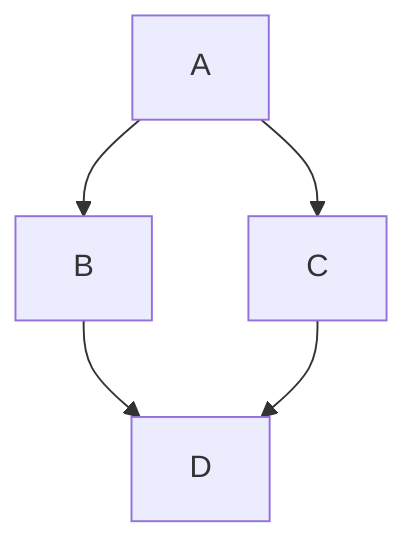
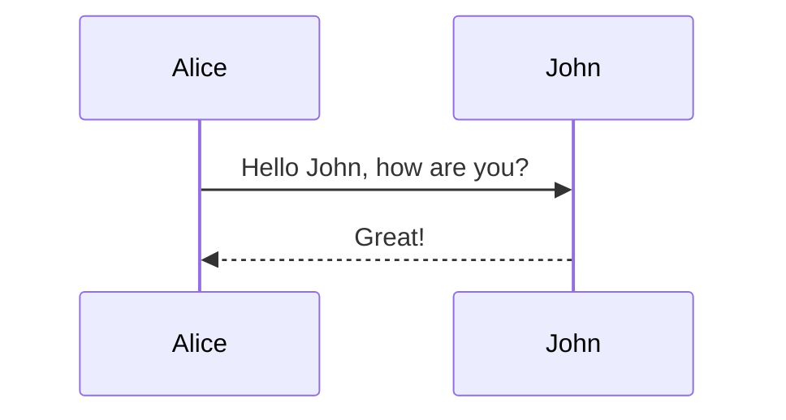

# TBD Component Design Document

`[DELETE] This document is intended to describe the requirements, public API, and design details so that consumers of the component is able to understand and interact with the component.`

## Table of Contents

[[_TOC_]]

## Introduction

### Description

`[REPLACE] Describe the component and what the component is used for`

### Terms

`[DELETE] In this section, you should define acronyms and any terminology used within the document. Example table below`

| Term   | Description                     |
| ------ | ------------------------------- |
| HCP    | House Keeping Control Processor |
| PCP    | Power Control Processor         |
| VR/VRD | Voltage Regulator               |

### Reference Documents

`[DELETE] Include in this section links to reference documentation used in the component design.  This can include governing requirements & architecture documents. Example table below`
| Document                                  | Link                                |
| ----------------------------------------- | ----------------------------------- |
| Athena Silicon Architecture Specification | [Link](https://microsoft.sharepoint.com/)    |

## Requirements

`[REPLACE] List design requirements for the component.  Use the word 'shall' to describe the requirement in a way that it could be tested by a third party.  Try to have only one requirement per line. Example requirements below:`

- The CLI API shall support a method for developers to add commands during run-time
- The CLI API shall support a method for it to be excluded from the binary

## Dependencies

`[REPLACE] List all of the component dependencies.  The idea is to communicate to the reviewer how self contained the component is and any additional work that is needed to support the features of the component. Always link to the documentation of the dependency.Example:"`

- [OS Mutexes](.\osmutex.md)
- trace(.\trace.md)
- serial port driver(.\serial.md)

## Design

`[REPLACE] Describe in a little more detail what this component does and the intended purpose.  Include sequence diagrams and activity charts to describe how & when the API will be used.`

Mermaid example #1

Mermaid example #2

## API

`[DELETE]List the public APIs available for this component and a brief description of what the API does. Example API Table:`
| API           | Description                                           |
| -----------   | ----------------------------------------------------- |
| CliInint()    | Initialize the CLI component                          |
| CliRegister() | Register a CLI function with the component            |
| CliPrint()    | Utility for sending text to the user                  |
| CliRead()     | Get user input                                        |

## Variants

`[DELETE]Variants, library name and description`

| Variant           | Description                                           |
| -----------       | ----------------------------------------------------- |
| CliUart           | Cli based on a uart connection.                       |
| CliPCIe           | Cli based on a PCIe connection.                       |
