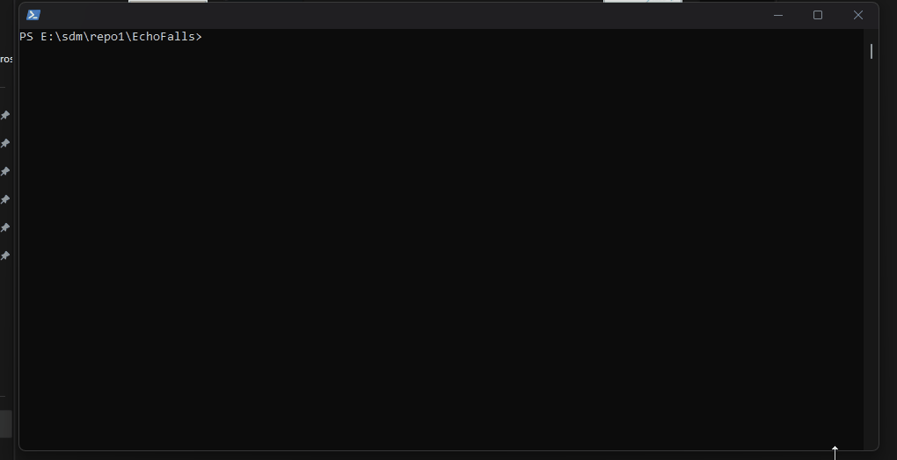

# Getting Started

## Pre-requisites

1. Windows 10+.
1. [GIT](<https://git-scm.com/downloads>). There are some basic steps to be taken while installing git. Please ensure:
    1. Your ADO username and password are entered. As an alternative, you can link a personalized access token (PAT) to your git installation. Follow [these steps](<https://learn.microsoft.com/en-us/azure/devops/repos/git/set-up-credential-managers?view=azure-devops#using-the-git-credential-manager>).
    1. If you plan to clone via ssh, you will need to generate a public key and add it to your ADO account. For more details, follow [these steps](<https://learn.microsoft.com/en-us/azure/devops/repos/git/use-ssh-keys-to-authenticate?view=azure-devops>).
1. (Optional) Visual Studio Code (<https://code.visualstudio.com/download>).
    1. After installation, launch VS Code, go to the Extensions tab on the left (Ctrl+Shift+X) and install all the recommended plugins.
    1. Exit VS Code.
1. Enable Windows Long Paths from an Administrator PowerShell:

    ```pwsh
    New-ItemProperty -Path "HKLM:\SYSTEM\CurrentControlSet\Control\FileSystem" -Name "LongPathsEnabled" -Value 1 -PropertyType DWORD -Force
    ```
1. [AZ](<https://learn.microsoft.com/en-us/cli/azure/install-azure-cli-windows?view=azure-cli-latest&pivots=msi-powershell>). If "az" command is not available in Powershell terminal, install the Azure CLI following the instructions.
    ```pwsh
    Invoke-WebRequest -Uri https://aka.ms/installazurecliwindowsx64 -OutFile .\AzureCLI.msi
    Start-Process msiexec.exe -ArgumentList '/I', 'AzureCLI.msi'
    ```
1. If running build on ARM64 host, additional steps might be required:

    1. Install the artifacts credential provider component.

       ```pwsh
       & { $(irm https://aka.ms/install-artifacts-credprovider.ps1) } -AddNetfx
       ```

    1. Install the MSVC Build Tools for ARM64/ARM64EC. This can be installed using [Visual Studio & VS Code Downloads for Windows, Mac, Linux](<https://visualstudio.microsoft.com/downloads/>).
       Please check "Desktop development with C++" box under "Workloads" tab in the installation window, and then ensure the "MSVC Build Tools for ARM64/ARM64EC" box is checked in the "Installation details" panel. Follow the instructions to finish the installation or updates.

**NOTE:** Remaining pre-requisites will be automatically setup and installed by the repo through packaging tools.

## Suggested reads

## Reference Material

| Document | Link |
| - | - |
| Kingsgate Implementing Sharepoint | [Link](https://microsoft.sharepoint.com/teams/Kingsgate/Shared%20Documents/Forms/AllItems.aspx) |
| Kingsgate Non-Implementing Sharepoint | [Link](https://microsoft.sharepoint.com/teams/EchoFalls/Shared%20Documents/Forms/AllItems.aspx) |
| Kingsgate Mason Documentation | [Link](https://kingsgatedocs.azurewebsites.net/static/latest/domains/index.html) |
| ARM - Cortex M7 | [Link](https://microsoft.sharepoint.com/:f:/r/teams/Kingsgate/Shared%20Documents/Third%20Party%20IP/ARM/Core/M7%20(AT610)/r1p2-00rel2?csf=1&web=1&e=s0hZZv) |
| ARM - Voyager | [Link](https://microsoft.sharepoint.com/:f:/r/teams/Kingsgate/Shared%20Documents/Third%20Party%20IP/ARM/Voyager?csf=1&web=1&e=jQW8uu) |
| ARM - Poseidon | [Link](https://microsoft.sharepoint.com/:f:/r/teams/Kingsgate/Shared%20Documents/Third%20Party%20IP/ARM/Core/Poseidon%20r0p1?csf=1&web=1&e=n2CERO) |
| ARM - General | [Link](https://microsoft.sharepoint.com/:f:/r/teams/Kingsgate/Shared%20Documents/Third%20Party%20IP/ARM?csf=1&web=1&e=bNt1vc) |

## Repo Structure

This repo follows a pretty straightforward folder structure.
| Name | Description |
| - | - |
| docs | Any documentation markdown files. |
| src\apps | Any unit of software built into an executable (elf, exe, etc..). |
| src\drivers | Any unit of software built to manage specific hardware or using Driver Framwork. |
| src\externs | Any unit of software built from external sources. |
| src\libs | Any unit of software built as a standalone library. |
| src\services | Any unit of software built to provide a persistent functionality. |
| tests | Any test content. |
| tools | Any tool content. |

## Setup the build environment

1. Make sure you have the proper permissions. If you are reading this, you probably do.

1. Clone the repository.

    ```pwsh
    git clone https://AzureCSI@dev.azure.com/AzureCSI/Woodinville/_git/Kingsgate.MSCP <optional_enlistment_directory>
    ```

1. Use powershell and not CMD. Ensure that your powershell instance has the `Execution Policy` set to allow you to run scripts. If you don't, run the following command in powershell:

    ```pwsh
    Set-ExecutionPolicy -ExecutionPolicy Bypass -Force -Scope CurrentUser
    ```

1. If you haven't already (or see an error such as 'ERROR: Failed to update Universal Packages tooling.  The requested resource requires user authentication: https://azurecsi.visualstudio.com/_apis'), log into the az cli using a PAT with Packaging (read) in the AzureCSI org

    ```pwsh
        echo "{Your PAT here}" | az devops login  --organization https://azurecsi.visualstudio.com/
    ```

1. Run the `./start.ps1` script in a powershell window. This will setup the build environment (to the default toolchain), download and install any dependencies needed, load scripts used for build, and display a help menu. This should take approximately 20 to 25 minutes, depending on if this is your first time or not.

    The optional parameters for Toolchains are located under `/tools/cmakes/toolchain`. The default is **arm-eabi-aarch**. The default script sets up the environment and can launch VS Code for Dev, Test and Debug. To launch VSCode, automatically, add the `-launchVSCode Yes` parameter to `./start.ps1`.

    > **_NOTE:_**
    > 1. If you change a branch, please close any open instance of VS Code and run `./start.ps1` again.
    > 2. For first-time build environment setup (to execute/run the `./start.ps1`):
    >    1. Before executing/running the `./start.ps1`, confirm that you are able to access the links mentioned in the `git` section of `packages.xml` file located in the `tools` directory.
    >    2. While executing/running the `./start.ps1`, you might need to enter your Microsoft login credentials in a pop-up dialog box from "**Git Credential Manager**" multiple times.

1. You can run these steps from a VS Code Terminal instance (running powershell) or from a normal powershell instance.

## Building Firmware

1. You can build using two options:

    1. Run the `build` function from powershell.
    ```pwsh
    build <target> <mode> <loglevel> <buildsystem>
    ```

    1. Via VS Code's Task Feature, under the `Terminal` menu, click on `Run Build Task` option. Then select build in the dropdown that appears.

    

    > **_NOTE:_**
    > 1. Do this every time you add new code changes and want them included in whatever setup you're using.

## Cleaning the Build

1. You can clean the build using two options:

    1. Run the `cleanbuild` function from powershell.
    ```pwsh
    cleanbuild
    ```

    1. Via VS Code's Task Feature, under the `Terminal` menu, click on `cleanbuild` option. Then select build in the dropdown that appears.

    > **_NOTE:_**
    > 1. The command is `cleanbuild` AND NOT `clean` due to Powershell 7.3 adding `clean` as a [keyword](https://learn.microsoft.com/en-us/powershell/module/microsoft.powershell.core/about/about_functions_advanced_methods?view=powershell-7.3#clean).

## Running the Firmware - Emulation

The firmware can be loaded into the Emulation Environment for this project. See the SVP Documentation [here](./debug_user_guides/svp/UsingSVP.md).

## Unit Tests

See the [Unit Test Documentation](./development/UnitTesting.md).

## Difficulties you may face in setup and build

See the below list for issues found and how to overcome them. Please add to this list for anything we don't have!

1. Running builds if you have switched branches.
    If you have switched branches, run start.ps1 again to update the environment. Dependencies or environment variables may have changed for the new branch. This will stabilize as the environment matures, but consider this procedure for now.

1. Permissions to run powershell script: PowerShell says "execution of scripts is disabled on this system."
    By default, the running of certain scripts are restricted on Windows. You are especially prone to this issue if you have a new laptop. Set the execution policy to Unrestricted in Powershell using:

    ```pwsh
    Set-ExecutionPolicy -ExecutionPolicy Bypass -Force -Scope CurrentUser
    ```

1. dotnet dependencies for test
    Running unit tests requires dotnet installed. Follow these URLs and install the necessary dependencies if you face any dotnet issues.
    (<https://aka.ms/dotnet-core-applaunch?framework=Microsoft.NETCore.App&framework_version=5.0.0&arch=x64&rid=win10-x64>)
    (<https://aka.ms/dotnet-core-applaunch?missing_runtime=true&arch=x64&rid=win10-x64&apphost_version=5.0.14>)
