# SVP User Guide

## Table of Contents

[[_TOC_]]

## Introduction

### Description

The Silicon Virtual Platform (SVP) is a tool provided by Synopsys to assist in creating and validating hardware platforms virtually. In the use case of Production Firmware, it will be the primary Software Development Vehicle (SDV) until FPGAs and real hardware is available.

### Terms

| Term | Description |
| - | - |
| SVP | Silicon Virtual Platform |
| SDV | Software Development Vehicle |

### References

| Reference | Link |
| - | - |
| SVP Team Home | [Link](https://microsoft.sharepoint.com/teams/SiArchFirmwareandSoftware-Redmond9/SitePages/SVP-Welcome-Page.aspx) |
| SVP Readiness (available via the Team Home as well) | [Link](https://microsoft.sharepoint.com/:x:/t/SiArchFirmwareandSoftware-Redmond9/EVPk86E9fl9GhQ4qIKeNJgsBQ1PS2Sfa94bBFES4jahP-w?e=eWwxm3) |
| SVP TEAM FAQ Teams Channel | [Link](https://teams.microsoft.com/l/channel/19%3A6c61fc1fdd1b497e92d0beecbfb3e6e0%40thread.tacv2/SVP%20FAQ?groupId=5fe5cb5d-9b1f-4c53-99c5-10e4393900f0&tenantId=72f988bf-86f1-41af-91ab-2d7cd011db47) |

## Pre-requisites

SVP is CPU and RAM intensive application/tool. Because of this, it is not advised to run SVP on local laptop, rather, it is advised to use the Microsoft Virtual DevBox which comes with 64 CPU cores, and 64 GB RAM.

To get your own personal SCHIE DevBox Workstation, visit this [Request DevBox Link](https://sihelp.corp.microsoft.com/portal/service?btn=73&itil_requesttype_id=3&root_category=30&autolog=true&id=45). At the time of writing this section, requesting of this DevBox was free for use till 2025.

Details needed to get your DevBox are as below and may vary based on your team:

- Project Name
- System Use Case
- Is this a new requirement or to replace existing hardware?
- Manager Name
- Business Administrator

Below table points to the team based links to get the above details needed to request the DevBox:

| Team | Link |
| - | - |
| SDM\CDED Team Page | [DevBox Request Details](https://woodinvillewiki.com/display/1PSOCFW/Developer+Onboarding#DeveloperOnboarding-VirtualDevBox/DevBox(neededforSVP)) |


Once you get the approval email for your DevBox, you can access your setup from Web Browser at this [Microsoft DevBox Link](https://devbox.microsoft.com/).

> **NOTE:** SVP tool needs the Microsoft VPN ON / ENABLED to get the shared license. So, keep the Virtual DevBox connected to the Microsoft VPN.

### Remote Desktop Applications

You can also access the DevBox by installing Remote Desktop Application on your laptop which is preferred workflow by most of the developers. Below are some of the Remote Desktop Applications available:

1. [Azure Virtual Desktop Preview](https://www.microsoft.com/store/productId/9NZSG2H7MS6B) (Recommended)
2. [Microsoft Remote Desktop](https://apps.microsoft.com/detail/9WZDNCRFJ3PS?hl=en-us&gl=US)
3. [Windows App](https://apps.microsoft.com/detail/9N1F85V9T8BN?hl=en-us&gl=US)

### DevBox FAQs

1. [Cloud Development Environments for C+AI (sharepoint.com)](https://microsoft.sharepoint.com/teams/ESOurWOWCC/SitePages/Cloud-Development-Environment-for-C+AI.aspx)
2. [Dev Box FAQs | 1ES On EngHub](https://eng.ms/docs/cloud-ai-platform/devdiv/one-engineering-system-1es/1es-docs/dev-box/faq)
3. [Trouble Shooting DevBox Remote Desktop Connection Problem | Azure DevCenter Docs (eng.ms)](https://eng.ms/docs/cloud-ai-platform/devdiv/vs-services-dougam/dtl-ndepinet/devcenter/azure-fidalgo-docs/docs/remote-desktop-connect)

## SVP Versions

The version of SVP used for simulations is determined by these entries in packages.arm-eabi-aarch.xml

```C
    <package org="https://azurecsi.visualstudio.com/" project="Woodinville" scope="project" feed="echofalls.fw.deps" name="microsoft.internal.windows.virtualizerruntime" version="2023.3.2"/>
    <package org="https://azurecsi.visualstudio.com/" project="Woodinville" scope="project" feed="echofalls.fw.deps" name="microsoft.internal.virtualized.kingsgate.svp" version="12.0.5645"/>
```

## SVP Simulation Parameters

Each version released by the SVP team may or may not have different parameters. They do follow semantic versioning and we can use that to identify the breaking changes. We also can generate and save the list of parameters each simulation version takes. See [here](./parameters/).

## SVP Modes

SVP may be launched in a headless mode for regression testing which does not launch the GUI.  It is run via the command

```C
runsvp -SimConfig xzy
```

For developers, the Synopsys Virtualizer Gui can be launched for interactive manual checkout and debugging.

```C
runsvpgui -SimConfig xzy
```

### Simulation Configurations

The Kingsgate SVP model has numerous parameters that can be set to tailor the simulation for specific needs.
The actual file passed to the simulation is an xyz.vpcfg file.  The .vpcfg files are generated by the powershell scripts
from text files that specify the parameters for each configuration.
The parameter configurations are located in:   ../../../tools/vpcfg

Single die config:
[svpcfg-chie_bins_single_die_dat.txt](../../../tools/vpcfg/svpcfg-chie_bins_single_die_dat.txt)

Note: The simulation configurations are used for both headless and gui modes.

## How to use it

The following powershell module provides wrapped startup and shutdown functions for headless SVP: [SVP-Utils.psm1](../../../tools/pwsh/modules/SVP-Utils.psm1).

Gui Mode SVP functions are located in: [SVP-GUI-Utils.psm1](../../../tools/pwsh/modules/SVP-GUI-Utils.psm1).

1. Ensure your shell environment is up to date for your repo enlistment: > `.\start.ps1`.

1. Ensure your toolchain and configuration has build artifacts:

    - Set your toolchain and configuration: `> setenv -Toolchain arm-eabi-aarch`

    - Generate the build artifacts: `> build`

### Launching SVP

#### Headless

```powershell
runsvp -SimConfig chie_bins_dual_die_dat
```

#### With the GUI

```powershell
runsvpgui -SimConfig chie_bins_single_die_dat
```

### Using the Synopsys GUI

1. Start SVP with the GUI as shown above. This will launch the Virtualizer Runtime VDK. This will also create a base project, with an example configuration and launch the simulation.

1. Let the simulation run once to check your setup. You can confirm that the setup is working by checking that UART shells are created for each of the cores and there is text output on them. Then, stop the simulation.

1. You can use the GUI to modify the simulation parameters, debug the running simulation, etc. A full list of what you can do and how to do it for the GUI is not available at the moment. Please read through whatever material the SVP team has on their team page (linked above).

1. Re-launch the simulation using the green play icon after you've updated the config as necessary.

### Creating and Using Configurations

1. To create a configuration, refer to [svpcfg-chie_bins_single_die_dat.txt](../../../tools/vpcfg/svpcfg-chie_bins_single_die_dat.txt) for an example. It is a list of parameter overrides on the default config in the format `<parameter>=<value>`. The SVP launch script decodes these to apply to the project.

1. Use the [parameters](./Parameters/) files to check which parameters you'd like to override and create a new configuration. Name it `svpcfg-<configuration-name>.txt`.

1. Next, go to SVP-Utils.psm1, in `Invoke-Virtualizer` and edit ValidateSet() for the parameter `$Simconfig` and add your `<configuration-name>`.

1. Next, go to SVP-GUI-Utils.psm1, in `Start-SimGui` and edit ValidateSet() for the parameter `$Simconfig` and add your `<configuration-name>`.

1. Now you can call your configuration with the call `> runsvp -SimConfig <configuration-name>` or  `> runsvpgui -SimConfig <configuration-name>`

## Stopping SVP GUI Simulation

1. The most reliable way is to run this from the powershell window that launched SVP, `> stopsvpgui`

## Restart SVP GUI Simulation

There might be situation, where you want to **make changes to the FW binary and re-test**. In those times, there is a **quicker way to test the changes**.

Instead of `Stopping the SVP Simulation` and `Starting the SVP Simulation`, you can simply `Restart SVP Simulation` as shown in the below snapshot:

[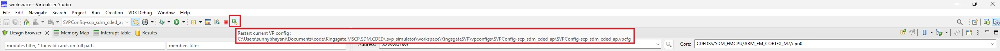](./../../.img/svp-vs_code-gdb-10.jpg)

## Debugging Firmware running on SVP

### Using gdb on Visual Studio (VS) Code

> **NOTE 1:** The default environment setup configures everything correctly to use gdb.

> **NOTE 2:** SVP can either be run with a GUI(Virtualizer Studio) or without (headless).  Virtualizer Studio increases
> the simulator startup time and requires more user steps. The advantages are that it provides access to the total
> simulation environment and allows debugging from a core's reset vector.  In the headless mode, the simulation will
> start automatically.  Therefore gdb will be attaching to a running target. That may be fine if debugging functionality
> triggered by a cli command for instance. If a simulation is a standalone core or there isn't a multi-core startup
> dependency, then a loop may be temporarily added as below. Attach, modify the loop variable and continue.  If those
> conditions are not available, then the GUI mode will be required.

[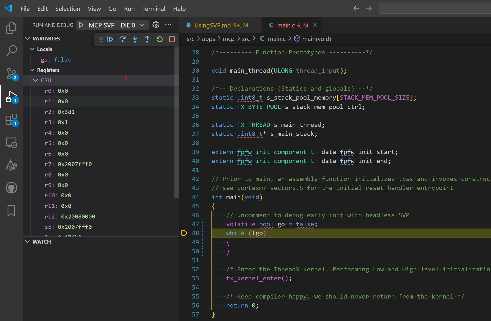](./../../.img/svp-vs_code-gdb-0pt5.jpg)

For either SVP mode, the default configuration will debug the local binaries in your repo.  Build those first.

Open powershell at the top-level project directory and run these:

```C
./start.ps1
code .
build
```

#### Debugging with GDB in headless mode

1. From powershell, launch SVP in [headless mode](#headless)

1. In VS Code to configure the `gdb`, click the icon (`Run and Debug`) which is highlighted in the below snapshot:

    **NOTE 1:** It takes some time after the simulation starts before SVP opens the gdb ports for the debugger to connect to.  If gdb doesn't connect, try a short time later.

    [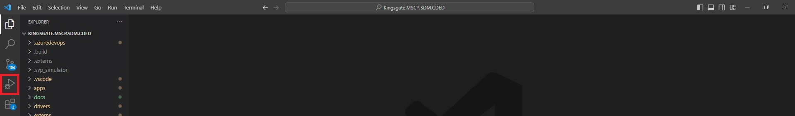](./../../.img/svp-vs_code-gdb-1.jpg)

1. Select the `gdb` profile from the drop-down menu for the core that we want to debug. For our example, we want to debug `SCP` core, so we select the `SCP SVP - DIE 0` profile as shown below.

1. Click on the green-colored play icon as shown below or (`Start Debugging (F5)`).

    [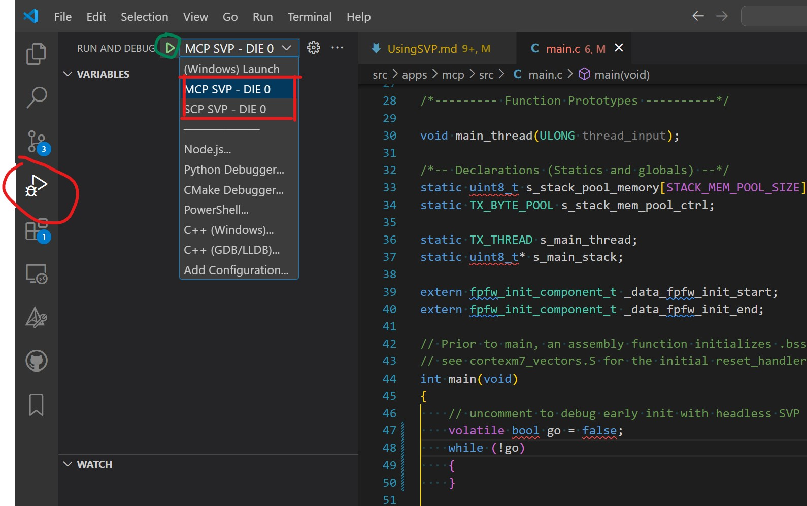](./../../.img/svp-vs_code-gdb-2.jpg)

1. Either select pause on the debugger control bar or wait for a previously set breakpoint to be hit.

#### Debugging with GDB in GUI mode

1. From powershell, launch SVP in [GUI mode](#with-the-gui)

1. GDB cannot be connected until ports are opened. While waiting, Open up the VP config as show below. Note: the menu
    item is not available at first.

    [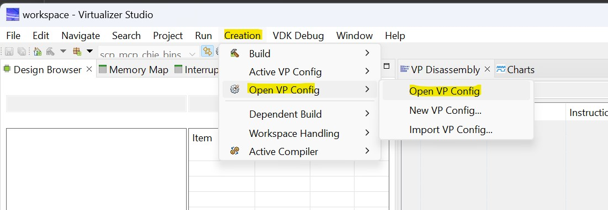](./../../.img/svp-vs_code-gdb-3pt5.jpg)

    Then de-select Auto-continue at initial crunch.  (This allows debugging from the reset vector)

    [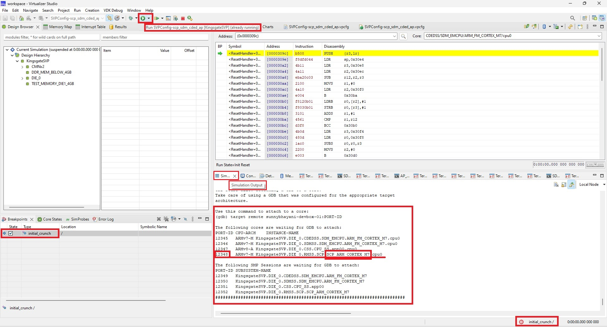](./../../.img/svp-vs_code-gdb-4.jpg)

1. After the initial crunch breakpoint is hit, you can launch gdb from VS Code for your core. Click on the green-colored play icon as shown below or (`Start Debugging (F5)`).

    [](./../../.img/svp-vs_code-gdb-2.jpg)

    - This will open the `cortexm7_vectors.S` file, which is where the first code will be executed on `line 73` -> `b _start`.
    - You will also find the gdb debugging control in the top-center of the screen for step-debugging.

    [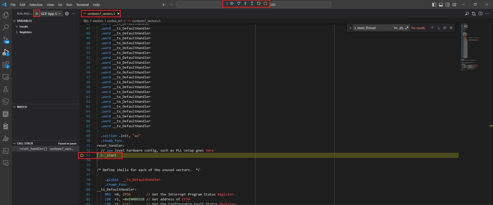](./../../.img/svp-vs_code-gdb-5.jpg)

1. Add the gdb breakpoints and verify them as shown below.

    - We have added breakpoint in the `apps -> SCP -> src -> main.c` file, at `line 106` by clicking on the left-side of the line number which adds a `red dot` as shown.
    - You can also see the breakpoints in the `BREAKPOINTS` pane at the bottom-left corner of VS Code as shown.

    [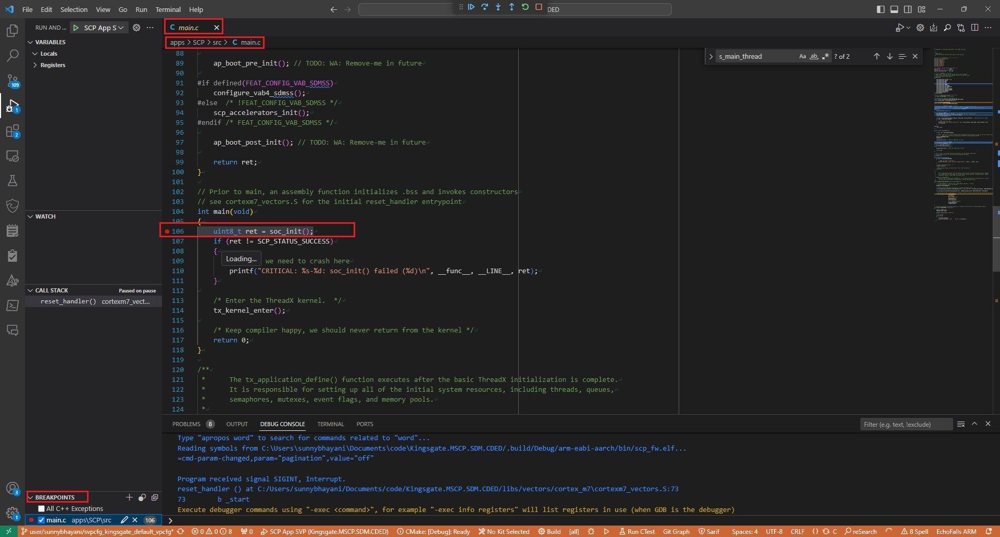](./../../.img/svp-vs_code-gdb-6.jpg)

1. Go to the SVP Simulator and click the `Resume suspended simulation` icon as shown.

    > **NOTE**: DO NOT CLICK THE other green-color icon which is to `Start Simulation` else the Simulation will RESTART.

    [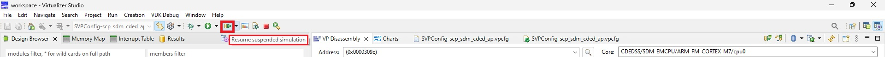](./../../.img/svp-vs_code-gdb-7.jpg)

1. Still the simulation will not start unless we give a `gdb continue` from the VS Code as shown below by clicking on the `Continue` icon:

    [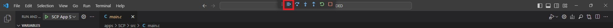](./../../.img/svp-vs_code-gdb-8.jpg)

1. Happy gdb debugging !

### Memory inspection / Memory Dump on SVP

SVP allows you to:

- Inspect memory
- Take a memory dump
- Modify memory location (if it is having the `Write` permission)

For this memory inspection / memory dump on SVP, as shown in the below snapshot:

- Go to the `Core States` pane located in the bottom-left.
- Right-click on the desired CPU core. In our case, we have selected the `SDM_EMCPU`.
- Select the `View Memory (software)` option, which will open a `Memory` window pane marked in the snapshot.
- In this `Memory` pane, you can confirm the CPU core that you selected in the `Monitors` pane. In our case, we have selected the `SDM_EMCPU`.
- You can also go to the desired memory address which is marked as `Goto Address`.

[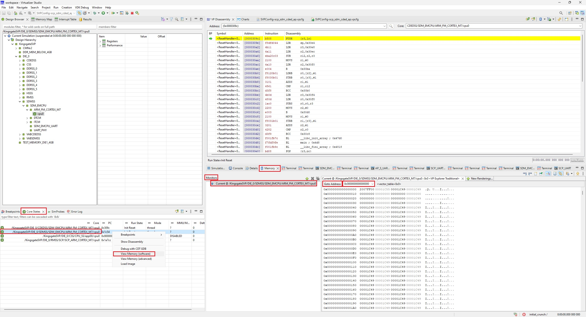](./../../.img/svp-memory_view-1.jpg)

## Full SVP Configuration Editing

> **Note:** This is not needed in typical workflows but may be used for custom configuration.

1. To load custom FW binary to SVP, go to the `VDK Creation` view by clicking the `VDK Creation icon` located on the top-right corner of SVP as shown in the below figure:

    [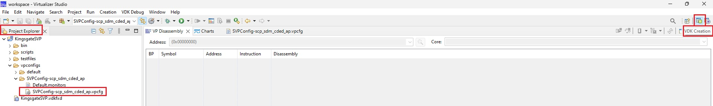](./../../.img/svp-vdk_creation-vpcfg_editing-1.jpg)

1. Edit the current config file referred to as `vpcfg`.

    - In the `Project Explorer` tab in the left hand side pane, go to the `KingsgateSVP -> vpconfigs -> SVPConfig-scp_mcp_chie_bins.vpcfg` where `SVPConfig-scp_mcp_chie_bins.vpcfg` is the default vpcfg file.
    - Right-click on this `SVPConfig-scp_mcp_chie_bins.vpcfg` file and select the `Configuration Editor` as shown below:

    [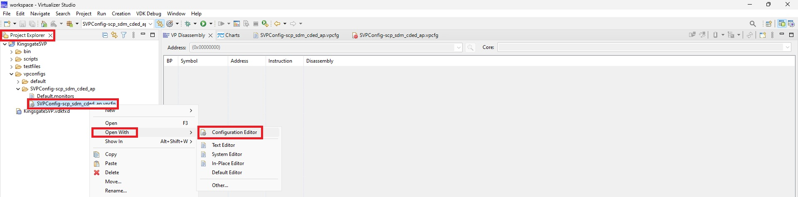](./../../.img/svp-vdk_creation-vpcfg_editing-2.jpg)

1. Un-check/disable the option to Auto-continue the simulation.

    - This allows us with the option to attach the `gdb` to the SVP e.g. for step-debugging at the beginning of the code.
    - To do this, go to the `Overview` tab and un-check/disable the `Auto-continue at initial crunch` option as shown below:

    [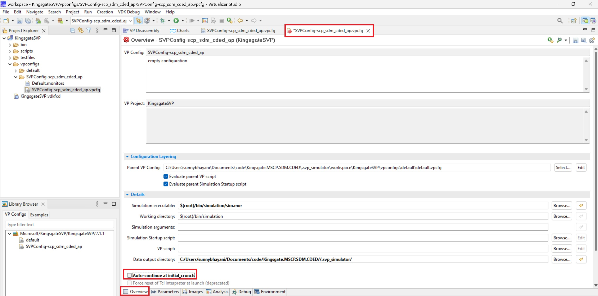](./../../.img/svp-vdk_creation-vpcfg_editing-3.jpg)

1. Go to the `Images` tab and navigate to the desired sub-system whose FW binary needs to be changed. In this example, we would be modifying the `vpcfg` to use our custom FW binary for SCP.

    - As shown in the below figure, for easy navigation, we would be clicking on the `Collapse All` icon located in the top-right corner to navigate to the SCP configuration easily.
    - Navigate to the `KingsgateSVP -> DIE 0 -> RMSS -> SCP -> SCP_ARM_CORTEX_M7 -> ImageInfo -> cpu0 -> initial_image`.
    - In this `initial_image` box, click the `...` icon to go to the custom SCP firmware image path.
    - Save this vpcfg file using `Ctrl + s`.

    [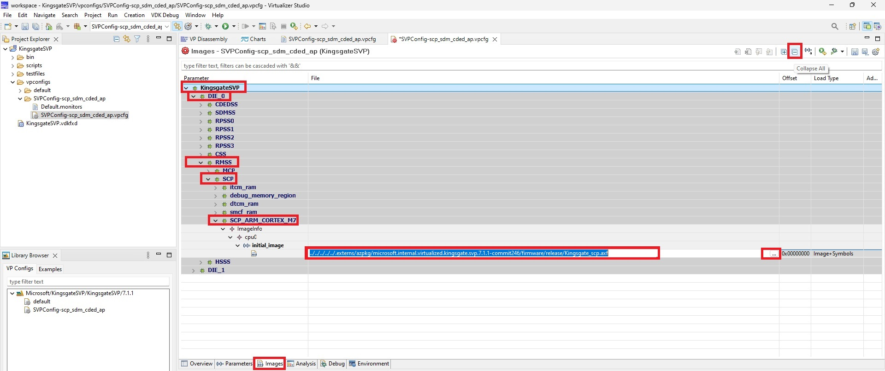](./../../.img/svp-vdk_creation-vpcfg_editing-4.jpg)

1. As shown in the below snapshot, re-confirm that the vpcfg is reflecting your changes by going to the vpcfg file from the `Project Explorer` pane, right-click on the `vpcfg` file, and select the `Open With -> Text Editor` option:

    [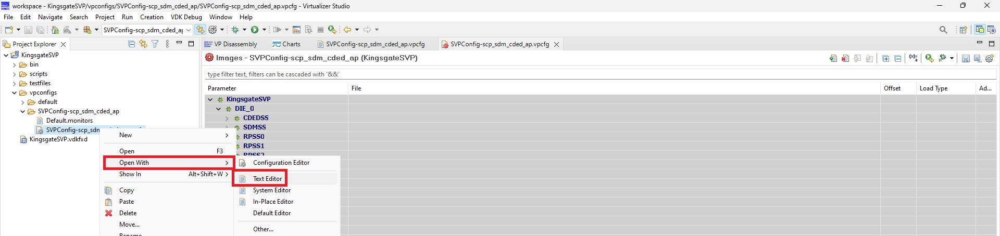](./../../.img/svp-vdk_creation-vpcfg_editing-5.jpg)

1. To confirm the changes in the `Text Editor` pane, find (using `Ctrl + f`) the keyword `SCP_ARM_CORTEX_M7` to confirm that the FW Binary path is showing the correct path as shown below.

    > **NOTE:**
    This step is needed because sometimes, SVP has sync issues in saving the `vpcfg` changes. Because of this, you might need to make changes manually to the `vpcfg` file using the `Text Editor` if the GUI changes from `Step 3` does not reflect here.
    ---

    [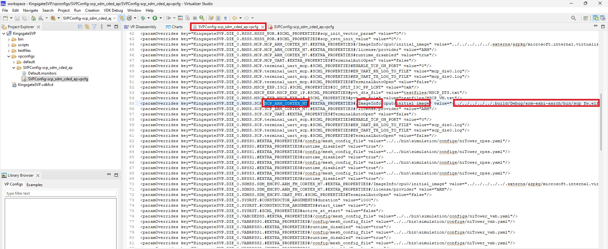](./../../.img/svp-vdk_creation-vpcfg_editing-6.jpg)

## Things to Note

1. Our scripts launch the executable(s) needed for SVP as [PowerShell Background Jobs](https://learn.microsoft.com/en-us/powershell/module/microsoft.powershell.core/about/about_jobs?view=powershell-7.4). The output from the actual executable can be useful when debugging what is wrong with a configuration. To get output from a Job use `Receive-Job -Id <ID>`. Use `Get-Job` to see a list of jobs and their states.

1. The SVP Team provides a `run_fixed_vdk.py` python script that works with the Synopsis APIs to help setup the simulation. It handles the parameters in the `--pyargs` section of running SVP.

## SVP FAQs

1. Getting `Problem Occurred` Dialog box with `Start Simulation has encountered a problem` error as shown below.

    - You need to connect to the **Microsoft VPN** because the SVP License is a shared License accessible on over VPN.

    [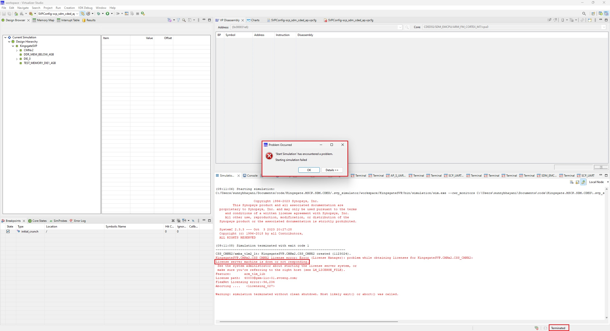](./../../.img/svp-faq-1.jpg)

1. GDB connection issues (SVP GUI connection required)

    - In the `launch.json` file, go to the section for your core, `SCP SVP - DIE 0` in this example, and inspect both
      values shown below.

    [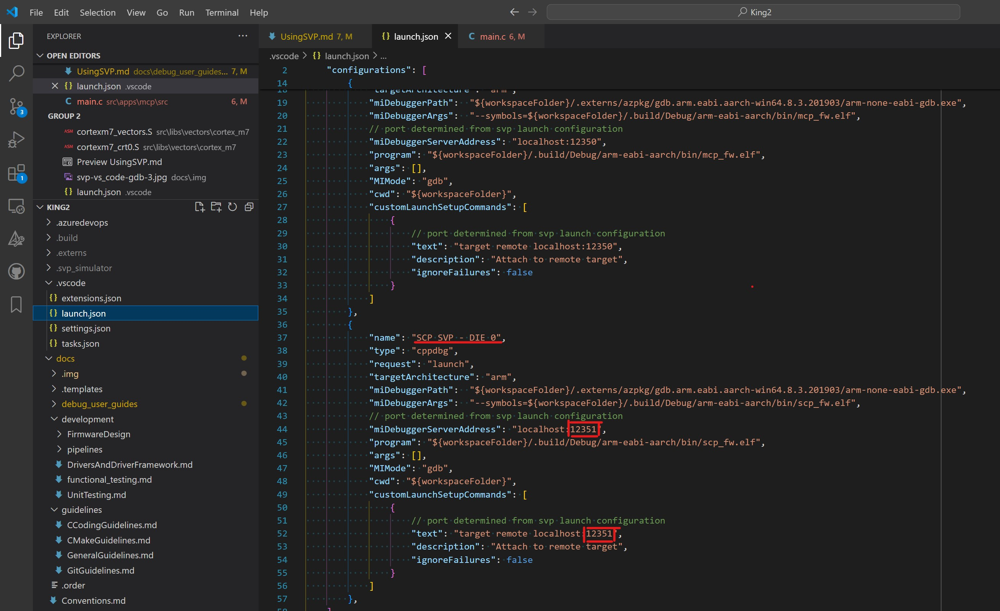](./../../.img/svp-vs_code-gdb-3.jpg)

    - Launch SVP with the GUI. Start the simulation and inspect the Simulation Output tab as show below. There will
    be a block of text describing the gdb ports.

    [](./../../.img/svp-vs_code-gdb-4.jpg)

    - Verify that the gdb port displayed in SVP matches the port in `launch.json`
