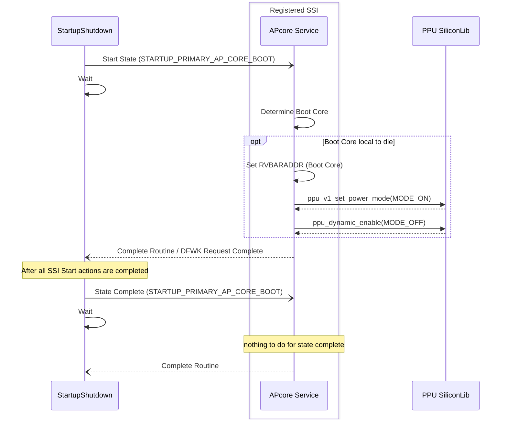
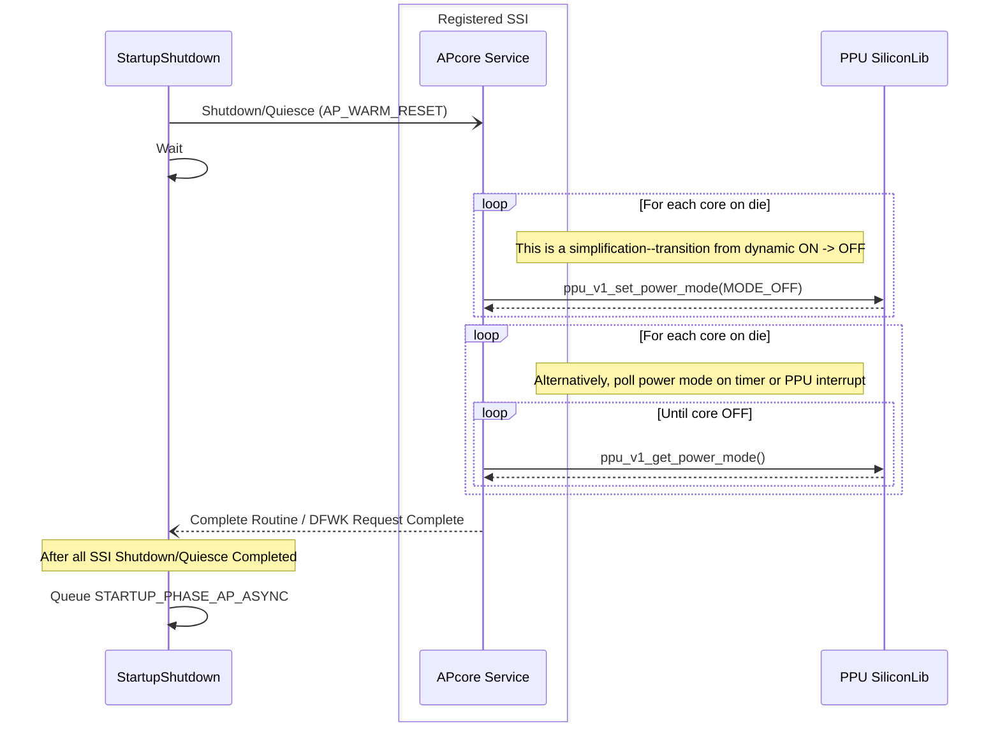
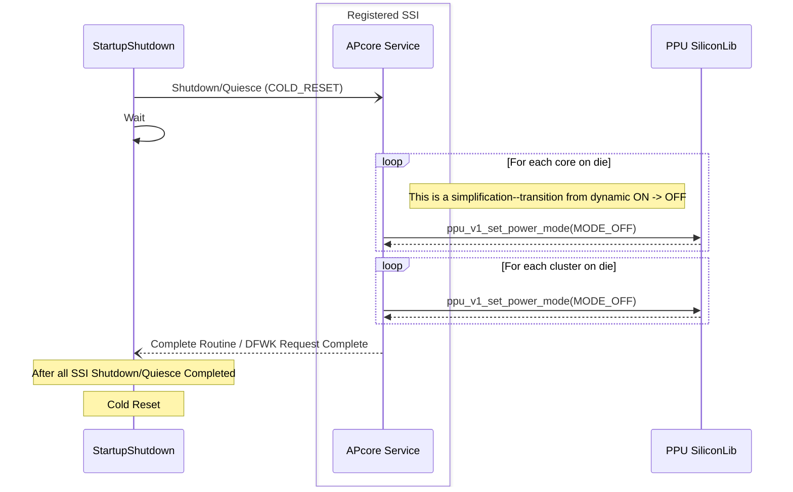
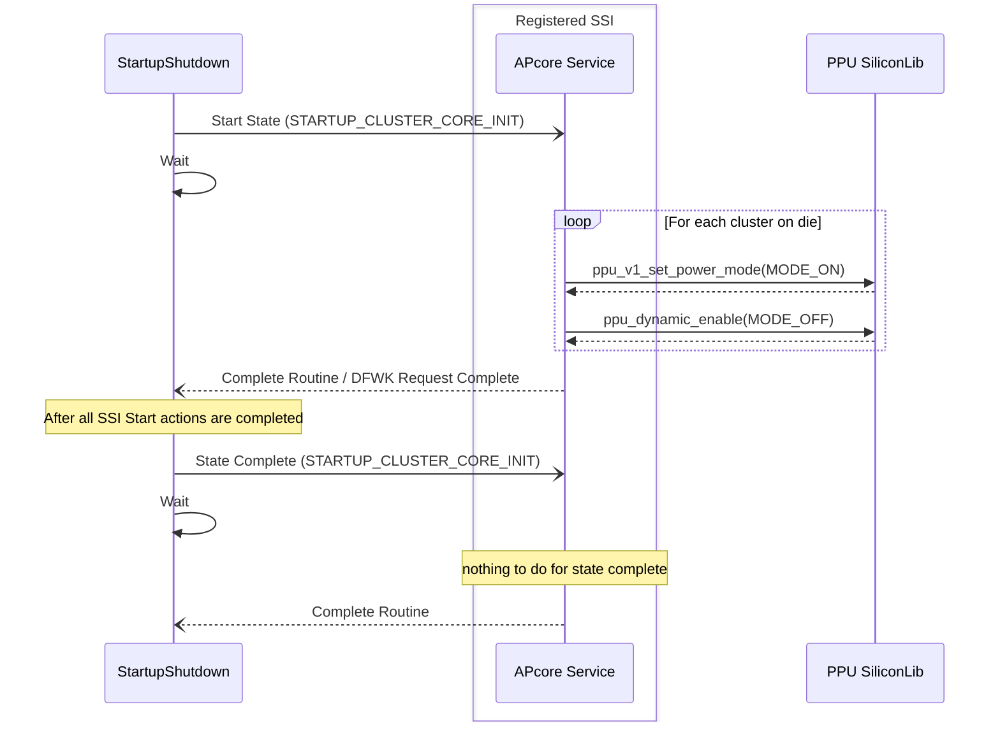
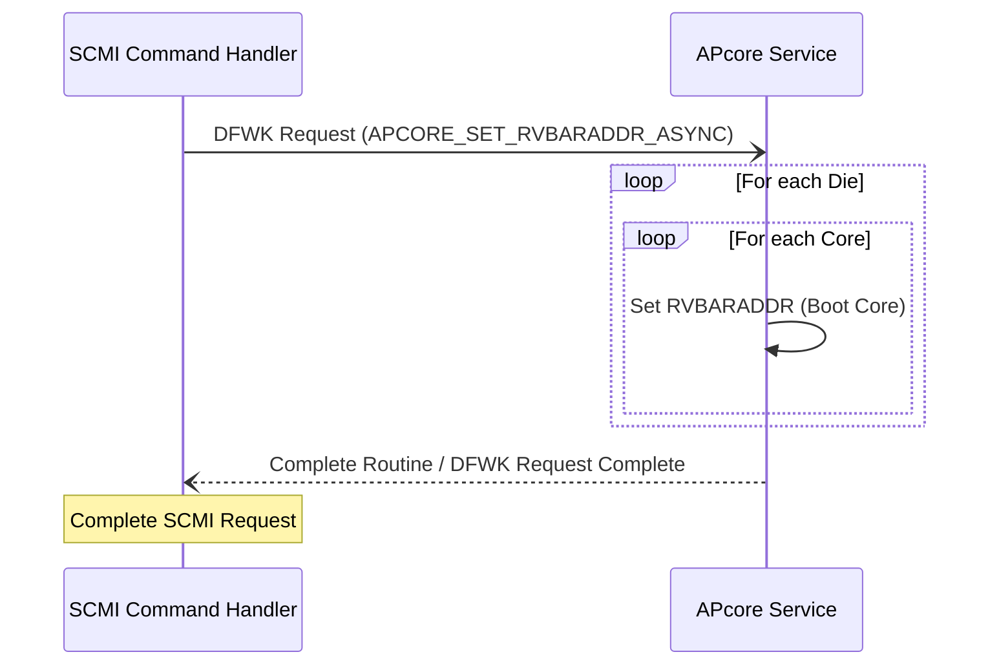
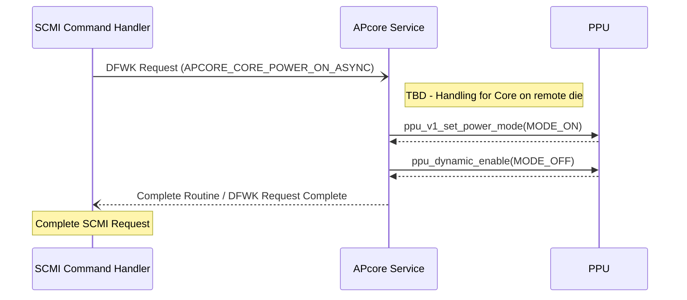

# APcore Service Design Document

## Table of Contents

[[_TOC_]]

## Introduction
This document outlines the design for the APcore service, which is a critical component of the MSCP AP core boot process. The APcore service is responsible for managing local and remote AP core and cluster power transitions related to boot, secondary core power on, shutdown/reset, and AP system "warm" reset (RESET2).

### Terms

| Term                  | Description                                                            |
| ------                | -------------------------------                                        |
| PPU                   | Power Policy Unit     |
| AP                    | Application Processor, aka PE |
| SCMI                  | System Control and Management Interface |

### Reference Documents

| Document                                  | Link                                |
| ----------------------------------------- | ----------------------------------- |
| SCMI Spec | [Link](https://microsoft.sharepoint.com/teams/PioneerSoCNon-implementing/Shared%20Documents/Forms/AllItems.aspx?id=%2Fteams%2FPioneerSoCNon%2Dimplementing%2FShared%20Documents%2FGeneral%2FArchitecture%2FPower%2FARM%20PM%20Docs%2FDEN0056B%5FSystem%5FControl%5Fand%5FManagement%5FInterface%5Fv2%5F0%2Epdf&parent=%2Fteams%2FPioneerSoCNon%2Dimplementing%2FShared%20Documents%2FGeneral%2FArchitecture%2FPower%2FARM%20PM%20Docs)    |

## Requirements
- Support boot of primary core (set PE_RVBARADDR, power on ppu to dynamic)
- Support setting all core PE_RVBARADDR (both dies)
- Support powering on all clusters (local die)
- Support powering on/off any core (any die) 
- Support powering off all cores (local die)
- Support powering off all cores+clusters (local die)

## Dependencies

The APcore service will have dependencies on the following via OS, pisoc libs, and other firmware drivers/services.

- Driver framework (DFWK)
- Startup/Shutdown Service
- PPU (pisoc lib)
- SCMI command handler (TBD)
- ICC
- Fuse service

## Design

The APcore service will be implemented using the driver framework.  To support the specified requirements, the service will implement a unique, service-specific interface as well as the startup/shutdown interface (SSI), and complete registration with the startup/shutdown service.  

To achieve core and cluster power transitions, the service will send appropriate requests to the local and remote (TBD) PPUs using the silicon libs PPU library.  

Remote handling is [TBD](https://azurecsi.visualstudio.com/Dev/_workitems/edit/1869647), but it is likely necessary to send requests to the remote APcore service, as some aspects of PPU (interrupts, specifically) are tied to the die of the specific AP core.  If interrupts are deemed to not be required, then it is also possible to write to the remote die's address space.   Note that interactions based on SSI will be for local die cores, only, as the startup/shutdown service will already provide necessary die<->die synchronization.

### Primary Core Boot

The service will be responsible for determining the boot core.  The method for KNG is TBD, but was previously done using a hard-coded list of preferred core boot order in conjunction with the cores determined to be enabled in the SOC (fuse disables).  Initially, the service will boot the first non-disabled core.

The service will boot the determined primary core (ensure appropriate RVBARADDR and transition core to ON) in response to an SSI_STARTUP_STAGE_START_ASYNC request for boot stage STARTUP_PRIMARY_AP_CORE_BOOT.

### Power Off All Cores (RESET2)

To support AP warm reset (RESET2), the service will handle the SSI_SHUTDOWN_QUIESCE_ASYNC request for a shutdown of type AP_WARM_RESET.  The service will initiate ON->OFF transition on core PPUs and will not complete the request until confirmation of core transition to OFF has occurred (requires PPU library support).

>NOTE: Only local die AP cores, as remote core transitions handled by remote APcore service as a result of synchronization in startup/shutdown service. 

### Power Off All Cores + Clusters (shutdown, cold reset)

To support system reset or shutdown, the service will handle the SSI_SHUTDOWN_QUIESCE_ASYNC request for shutdown types SHUTDOWN and COLD_RESET.  The service will initiate ON->OFF transition on core PPUs, followed by ON->OFF transition on cluster PPUs.  There will be no confirmation of core transition prior to complete of the request.

>NOTE: Only local die AP cores and clusters, as remote core transitions handled by remote APcore service as a result of synchronization in startup/shutdown service. 

### Power On All Clusters

The service will support handling the SSI_STARTUP_STAGE_START_ASYNC request for boot stage STARTUP_CLUSTER_CORE_INIT.  All local die clusters will be transitioned to ON state.

>NOTE: Special consideration for subsystem warm reset; for startup types other than COLD_BOOT, the transition should be skipped as would have already been done.

### Set Reset Vector Address (RVBARADDR)

The service will iterate over all cores, setting the RVBARADDR for each core to the value provided.  This is necessary to be able to handle the SCMI apcore_reset_address_set request.  Remote to other die if necessary; depends largely on ATU mapping.

### Core Power On/Off

The service will transition the specific core on/off using the PPU library.  This is necessary to handle the SCMI pd_power_state_set SCMI.  Remote to other die if necessary; PPU transitions using PPU irqs must be local to core's die.

## API

The service-specific DFWK requests are defined with available helper functions in the header [here](../../../src/services/ap_core/inc/ap_core.h).

| APcore Service DFWK Request ID | Description                                           |
| -----------        | ----------------------------------------------------- |
| APCORE_SET_RVBARADDR_ASYNC  | Used to set local and remote die reset vector address  |
| APCORE_CORE_POWER_ON_ASYNC  | Used to power on a specific AP core (local or remote die) |
| APCORE_CORE_POWER_OFF_ASYNC  | Used to power off a specific AP core (local or remote die) |

Additionally, the service implements handlers for [Startup/Shutdown Interface (SSI)](../../../src/services/startup_shutdown/inc/startup_shutdown_ssi.h) requests.

| APcore Service SSI Request ID | Phase/Type | Description                                           |
| -----------        | -- | ----------------------------------------------------- |
| SSI_STARTUP_STAGE_START_ASYNC  | STARTUP_PRIMARY_AP_CORE_BOOT | The service will boot the determined primary core |
| SSI_STARTUP_STAGE_START_ASYNC  | STARTUP_CLUSTER_CORE_INIT / COLD_BOOT | The service will transition clusters off->on  |
| SSI_SHUTDOWN_QUIESCE_ASYNC     | SHUTDOWN, COLD_RESET | The service will power off all local die cores and clusters |
| SSI_SHUTDOWN_QUIESCE_ASYNC     | AP_WARM_RESET | The service will power off all cores in preparation for AP warm reset |

## Warm Reset Considerations

At this time, it is believed that the only warm reset (MSCP subsystem) requirement is to skip PPU initialization.  As long as SCMI responses are delayed until after the writes to PPU registers to accomplish core power transitions, then there will be no need to track expected core state as was done on the previous project.  This is somewhat TBD based on multi-die and SCMI command handler implementation.  (created https://azurecsi.visualstudio.com/Dev/_workitems/edit/1865613 to confirm this in M1.2)

## Unit Testing

Unit tests will be written against each module's public APIs.

## Functional Testing

Functional tests will ensure system boots and AP cores come up successfully on SVP, FPGA, and silicon systems.   An AP warm reset test should also confirm the successful boot back to UEFI after a warm reset issued from UEFI.