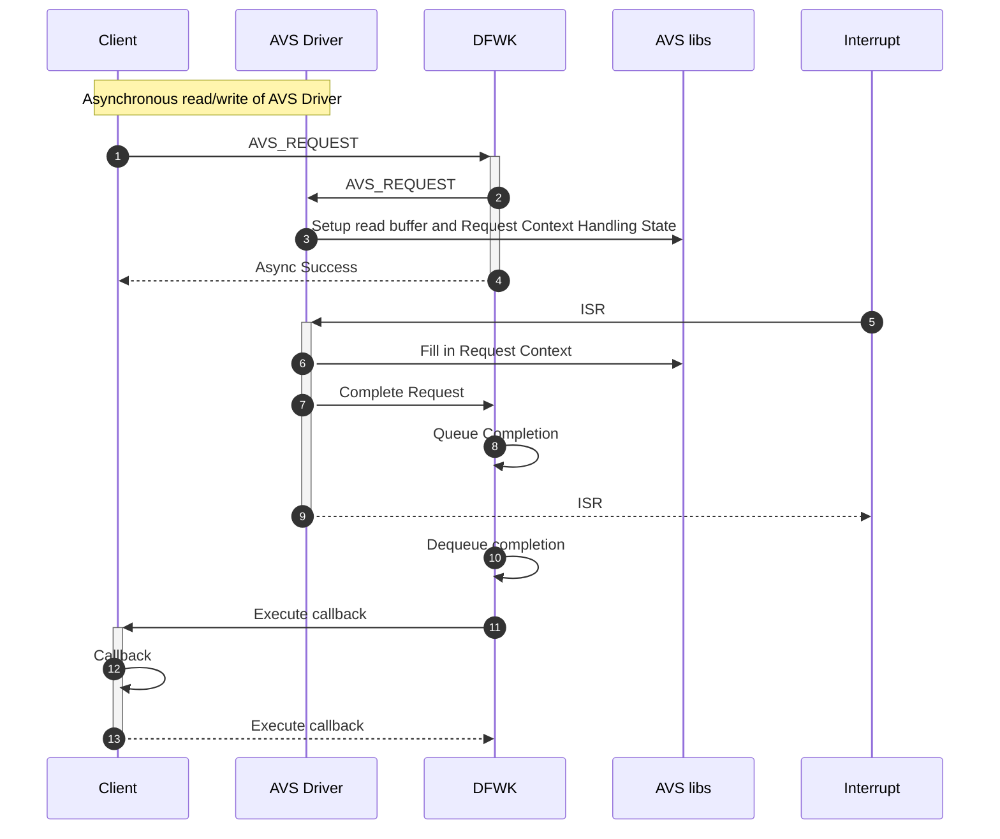

# AVSBus Module Design Document

## Table of Contents

[[_TOC_]]

## Introduction

### Description

This document is intended to describe the design details for the AVSBus.  This also includes interface details between the AVS Client, AVS driver, and AVS Libs.  
AVSBus is an interface designed to facilitate and expedite point-to-point communication for the purpose of adaptive voltage scaling.  
All AVS transactions happen via a 64 bit frame (32 bits from the master to the target and 32 from the target to the master).  
There are a total of 10 Voltage Regulators which can be controlled by the SCP, across 5 AVSBuses. AVS0 - AVS3 are on Die0, AVS4 is on Die1.  
Each Voltage Regulator has an index associated with it.  One regulator part is used for AP cores and a different one for miscellaneous/other.

### Terms

| Term   | Description                     |
| ------ | ------------------------------- |
| VR/VRD | Voltage Regulator               |
| AVS    | Adaptive Voltage Scaling        |
| AVSBus | Adaptive Voltage Scaling Bus    |
### Reference Documents

| Document                                  | Link                                |
| ----------------------------------------- | ----------------------------------- |
| PMBus™ Power System Management Protocol Specification Part III – AVSBus | [Link](https://microsoft.sharepoint.com/:b:/r/teams/PioneerSoCNon-implementing/Shared%20Documents/CHIE%20Firmware/PMBusSpecs/PMBus_Specification_Part_III_Rev_1-3.pdf?csf=1&web=1&e=u5Uad0) |
|C4145 Platform Power Block Diagram (see SOC Power tab)| [Link](https://microsoft.sharepoint.com/:u:/r/teams/EchoFalls/_layouts/15/Doc.aspx?sourcedoc=%7BA15E931B-7F1D-4637-B8C7-2B40B20EE415%7D&file=C4143_Platform_Power_Block_Diagram_generic_vendors.vsdx&action=default&mobileredirect=true)
|Drivers And Driver Framework | [Link](https://azurecsi.visualstudio.com/DuvallFw/_wiki/wikis/1PFw%20Firmware%20Libs/32086/DriversAndDriverFramework)


## Requirements
- The AVS API shall support set voltage of a specified rail.  
- The AVS API shall support read voltage, current, and temperature of a specified rail. 
- Multiple commands shall be supported simultaneously.

- The CLI API shall support a method for developers to execute AVS commands during run-time for test/verification.


## Dependencies


- AVS lib (silicon libs) | [Link](https://dev.azure.com/ms-tsd/Kingsgate/_git/silibs?path=/libraries/avs&version=GBmaster) |

## Hardware Layout

```c

                                                   +---------------------------------------+
                                                    |                                       |
           +-----------------AVS0-------------------+                                       |
           |                                        |          MSFT ARM CORE CPU            |
           |                                        |                                       |
           |               +---------------+        |                                       |
           |               |90A Power Stage+------->+ VCPU0_S                               |
           v               |               |        |                                       |
+----------+------+   +--->+               |        |                                       |
|                 |   |    +---------------+        |                                       |
| VR Controller   +---+                             |                                       |
|                 |                                 |                                       |
|                 +---+    +---------------+        |                                       |
|                 |   |    |50A Power Stage|        |                                       |
+-----------------+   +--->+               +------->+ VPCIE0P75                             |
                           |               |        |                                       |
                           +---------------+        |                                       |
                                                    |                                       |
           +-----------------AVS4-------------------+                                       |
           |                                        |                                       |
           |                                        |                                       |
           |               +---------------+        |                                       |
           |               |90A Power Stage+------->+ VCPU1_N                               |
           v               |               |        |                                       |
+----------+------+   +--->+               |        |                                       |
|                 |   |    +---------------+        |                                       |
| VR Controller   +---+                             |                                       |
|                 |                                 |                                       |
|                 +---+    +---------------+        |                                       |
|                 |   |    |50A Power Stage|        |                                       |
+-----------------+   +--->+               +------->+ VD2D0P875                             |
                           |               |        |                                       |
                           +---------------+        |                                       |
                                                    |                                       |
           +-----------------AVS1-------------------+                                       |
           |                                        |                                       |
           |                                        |                                       |
           |               +---------------+        |                                       |
           |               |90A Power Stage+------->+ VSYS                                  |
           v               |               |        |                                       |
+----------+------+   +--->+               |        |                                       |
|                 |   |    +---------------+        |                                       |
| VR Controller   +---+                             |                                       |
|                 |                                 |                                       |
|                 +---+    +---------------+        |                                       |
|                 |   |    |50A Power Stage|        |                                       |
+-----------------+   +--->+               +------->+ VDDQ1P1                               |
                           |               |        |                                       |
                           +---------------+        |                                       |
                                                    |                                       |
           +-----------------AVS2-------------------+                                       |
           |                                        |                                       |
           |                                        |                                       |
           |               +---------------+        |                                       |
           |               |90A Power Stage+------->+ VSOC                                  |
           v               |               |        |                                       |
+----------+------+   +--->+               |        |                                       |
|                 |   |    +---------------+        |                                       |
| VR Controller   +---+                             |                                       |
|                 |                                 |                                       |
|                 +---+    +---------------+        |                                       |
|                 |   |    |50A Power Stage|        |                                       |
+-----------------+   +--->+               +------->+ VD2D0PSS                              |
                           |               |        |                                       |
                           +---------------+        |                                       |
           +-----------------AVS3-------------------+                                       |
           |                                        |                                       |
           |                                        |                                       |
           |               +---------------+        |                                       |
           |               |50A Power Stage+------->+ VPLL1P2                               |
           v               |               |        |                                       |
+----------+------+   +--->+               |        |                                       |
|                 |   |    +---------------+        |                                       |
| VR Controller   +---+                             |                                       |
|                 |                                 |                                       |
|                 +---+    +---------------+        |                                       |
|                 |   |    |50A Power Stage|        |                                       |
+-----------------+   +--->+               +------->+ VGPIO1P2                              |
                           |               |        |                                       |
                           +---------------+        |                                       |
                                                    |                                       |
                                                    |                                       |
                                                    +---------------------------------------+
```
### Silicon Library   
A shared library exists which was written for HW verification.  We will also use this to interface to HW from our firmware module.  
For example, the following APIs will be called

```C
/**
 * @brief  AVS controller initialization.
 *
 * \b Description:
 * Function to initialize the AVS controller.
 *
 * @param avs_base_or_id  AVS controller base address or ID instance.
 * @param avs_cfg         AVS controller configuration structure pointer.
 *                        If it is NULL, the default AVS configuration will be used.
 *
 * @retval SILIBS_SUCCESS The initialization is done successfully.
 * @retval SILIBS_E_PARAM The avs base or id is invalid.
 * @return One of the standard framework error codes.
 */
int avs_init(uintptr_t avs_base_or_id, const avs_master_cfg_t *avs_cfg);

/**
 * @brief  AVS send a command frame stream.
 *
 * \b Description:
 * Function to send a command frame stream. The caller is expected to use
 * avs_poll_interrupt_status() to verify the actual command frame transferring completion.
 *
 * @param avs_base_or_id  AVS controller base address or ID instance.
 * @param cmd_num         Entry number in the command frame array.
 * @param cmd_mem         Pointer to the AVS command frame array.
 *
 * @retval SILIBS_SUCCESS The operation succeeded.
 * @retval SILIBS_E_PARAM The cmd_mem parameter is NULL or cmd_num is 0.
 * @return One of the standard framework error codes.
 */
int avs_send_cmd_frame(uintptr_t avs_base_or_id, uint32_t cmd_num, avs_master_command_t *cmd_mem);

/**
 * @brief  AVS get command response data.
 *
 * \b Description:
 * Function to retrieve command frame response data.
 *
 * @param avs_base_or_id  AVS controller base address or ID instance.
 * @param resp_idx        DWORD index to read from the command response buffer.
 * @param resp_num        Number of DWORD to read from the command response buffer.
 * @param resp_buf        Pointer to retrieve the command response data. The buffer needs to
 *                        have resp_num of DWORD space.
 *
 * @retval SILIBS_SUCCESS The command frame was written successfully.
 * @retval SILIBS_E_PARAM The avs base or id is invalid.
 * @retval SILIBS_E_PARAM The resp_buf parameter is NULL.
 * @retval SILIBS_E_PARAM The resp_idx or resp_num is out side of supported range.
 * @return One of the standard framework error codes.
 */
int avs_get_cmd_resp_data(uintptr_t avs_base_or_id, uint32_t resp_idx, uint32_t resp_num, uint32_t *resp_buf);

/**
 * @brief  AVS get command status response data.
 *
 * \b Description:
 * Function to retrieve command frame status response data.
 *
 * @param avs_base_or_id  AVS controller base address or ID instance.
 * @param resp_idx        DWORD index to read from the command status response buffer.
 * @param resp_num        Number of DWORD to read from the command status response buffer.
 * @param resp_buf        Pointer to retrieve the command status response data. The buffer needs to
 *                        have resp_num of DWORD space.
 *
 * @retval SILIBS_SUCCESS The command frame was written successfully.
 * @retval SILIBS_E_PARAM The avs base or id is invalid.
 * @retval SILIBS_E_PARAM The resp_buf parameter is NULL.
 * @retval SILIBS_E_PARAM The resp_idx or resp_num is out side of supported range.
 * @return One of the standard framework error codes.
 */
int avs_get_cmd_resp_status(uintptr_t avs_base_or_id, uint32_t resp_idx, uint32_t resp_num, uint32_t *resp_buf);

```
## Firmware Module Design
### Module communication   
The AVS driver will provide an API to clients.  Clients will have the capability of sending multiple requests simultaneously, 
and will receive a callback when each request is complete. Each AVS bus will have an interface and queue. 
The DFWK interface only supports one async queue.  Therefore a new request will not be issued to the hardware until the 
previous open request completes. 

A client's call to an AVS driver API will issue an async Driver Framework request that will be enqueued into a serialized dispatch queue. Once the driver framework processes the request, the write or read will be issued to the hardware. 
The AVS ISR will fire once the hardware has done the request, and the request will be completed in the ISR. 
DFWK will dequeue the completion and call the client's callback.



A client calls *read/write* AVS driver API which directly calls the AVS library API/driver.

The driver cannot do the operation immediately.

When the client issues an asynchronous request the memory associated with it must
persist until the completion callback has been executed.

Callback execution will be handled by the Driver completing the associated request via
the DFWK and the DFWK executing the callback, outside of the Driver's context, ensuring passive
completion of callbacks (outside of ISRs).

Finally, the client receives and processes the *AVS request*
response sent by the AVS driver.

## API

The AVS driver APIs shall be available to the client to do the following:
- Set voltage
- Read voltage
- Read current
- Read temperature

 The goal is to be able to send multiple commands at once, without waiting for the return.  This should be feasible via the avs_send_cmd_frame API (AVS lib).

| API                          | Description                                           |
| -----------                  | ----------------------------------------------------- |
| scp_avs_client_write         | Write data to the voltage rail |
| scp_avs_client_read          | Read data from the voltage rail|
| scp_avs_client_read_all      | Read voltage, current, temperature from the voltage rails|
| scp_avs_client_write_multi   | Writes data to multiple client specified voltage rails |
| scp_avs_client_read_multi    | Reads data from multiple client specified rails |
| scp_avs_status_error         | Checks the data read for errors |

Command data types used with scp_avs API's (avs_lib.h)
```C
typedef enum
{
    AVS_CMD_WRITE_COMMIT = 0,
    AVS_CMD_WRITE_HOLD = 1,
    AVS_CMD_READ = 3
} AVS_CMD;

typedef enum
{
    AVS_VOLTAGE_RW = 0,
    AVS_VOUT_TRANSITION_RATE_RW = 1,
    AVS_CURRENT_READ = 2,
    AVS_TEMPERATURE_READ = 3,
    AVS_VOLTAGE_RESET = 4,
    AVS_POWER_MODE_RW = 5,
    AVS_BUS_STATUS_RW = 14,
    AVS_BUS_VERSION_READ = 15
} AVS_CMD_DATA_TYPE;

typedef union {
    struct
    {
        uint32_t command_data : 16;
        uint32_t command_type : 4;
        AVS_CMD_DATA_TYPE command_data_type : 4;
        uint32_t command_group : 1;
        AVS_CMD command_control : 2;
        uint32_t rsvd0 : 5;
    };
    volatile uint32_t as_uint32;
} avs_master_command_t;

typedef struct
{
    bool periodic_rsync_en;
    uint8_t periodic_rsync_len;
    uint32_t periodic_rsync_gap;
    uint16_t clk_prescaler;
} avs_master_cfg_t;
```
scp_avs and scp_avs_cli modules
```C

/*!
 * \brief Enumeration of the AVS VR Controllers.
 */
enum avs_bus_id
{
    AVS_BUS0,   // D0
    AVS_BUS1,   // D0
    AVS_BUS2,   // D0
    AVS_BUS3,   // D0
    AVS_BUS4,   // D1
    AVS_BUS_MAX
};

enum avs_sync_request_type
{
    AVS_GET_ERROR_COUNTS
};

enum avs_internal_request_type_idx
{
    AVS_REQUEST_READ_DATA,  // non _RESP events are triggered by the client
    AVS_REQUEST_WRITE_DATA,
    AVS_REQUEST_READ_ALL_VCT,
    AVS_REQUEST_READ_MULTI,
    AVS_REQUEST_WRITE_MULTI,
    AVS_REQUEST_WRITE_DATA_RESP,  // the _RESP events are triggered when the avs_libs interrupt occurs, TBD if these are needed
    AVS_REQUEST_READ_DATA_RESP,
    AVS_REQUEST_READ_ALL_VCT_RESP,
    AVS_REQUEST_READ_MULTI_RESP,
    AVS_REQUEST_WRITE_MULTI_RESP,
    AVS_REQUEST_COUNT
};

// Defines used with scp_avs_status_error(uint32_t resp_data)
typedef struct _avs_error_t
{
    union {
        struct {
            uint8_t crc_error : 1;          // Interrupt CRC error
            uint8_t no_action_busy : 1;     // TargetAck = 0x01 Good CRC, no action taken, resource busy
            uint8_t bad_crc_no_action : 1;  // TargetAck = 0x10 Bad CRC, no action taken
            uint8_t invalid_no_action : 1;  // TargetAck = 0x11 Good CRC, invalid selector, data type or incorrect data. No action taken
            uint8_t v_done : 1;             // VDone - bit
            uint8_t status_alert : 1;       // StatusAlert bit 19 in response
            uint8_t no_control : 1;         // AVS StatusResponse bit (1 when controlling AVS output, 0 when not) set this bit when no control
       };
       uint8_t as_uint8;
    };
} avs_error_t, *pavs_error;

/*-------------- Typedefs ----------------*/
typedef struct _scp_avs_error_count_t {
    uint16_t crc_error_count;
    uint16_t ack_no_action_busy_error_count;
    uint16_t ack_bad_crc_no_action_error_count;
    uint16_t ack_invalid_no_action_error_count;
    uint16_t status_alert_error_count;
} scp_avs_error_count_t, *pscp_avs_error_count;

typedef struct _avs_device_t {
  uint8_t dev_id;
} avs_device_t;

/*!
 * \brief AVS Event Delayed Response params (16bytes max framework limitation)
 */
#define AVS_CMD_BUFF_SIZE 16

typedef struct _command_info_t {
    uint8_t rail_id;             // specific rail or rail number to start reading (in avs_master_command_mem_start_t this is 'command_type')
    uint8_t cmd_type : 4;        // commands (AVS_VOLTAGE_RW, AVS_CURRENT_READ, etc.), are 4 bits - extra bits can indicate special cases like v+c+t
    uint8_t rsvd : 3;            // unused
    uint8_t unused : 1;
} command_info_t;

typedef struct _scp_avs_command_params_t {
    union {
        void *data_ptr;
        uint32_t avs_data;
    };
    union {
        command_info_t avs_cmd_info;
        command_info_t avs_cmd_array[AVS_CMD_BUFF_SIZE];        
    };
     uint8_t error; 
     uint8_t cmd_count;          // how many commands in the command array to read data.
} scp_avs_command_params_t;

typedef struct _scp_avs_vr_vct_t {
    uint16_t voltage_mV;      // 1LSB=1mV
    uint16_t current_cA;      // 1LSB=10mA
    uint16_t temperature_dC;  // 1LSB=0.1 Celsius
    uint8_t error_voltage;
    uint8_t error_current;
    uint8_t error_temperature;
} _scp_avs_vr_vct_t;

/*!
 * \brief Module AVS
 */
typedef struct _scp_avs_config_t {
    /*! Interrupt number of the AVSBus */
    const unsigned int avs_irq;
    /*! Address of avs */
    uintptr_t reg_base_addr;
    /*! Number of rails on the specified avs*/
    uint8_t rail_count;
    /*! AFM CLOCK, drive strength range = 0 - 7 */
    uintptr_t afm_csr_avs_clk_addr;
    /*! MData, drive strength range = 0 - 7 */
    uintptr_t afm_csr_mdata_addr;
} scp_avs_config_t;

struct avs_element {
    /*! Element name */
    const char *name;
    /*!
     * \brief Pointer to element-specific configuration data for each AVS (mod_avs_config)
     */
    const void *data;
} ;

typedef struct _scp_avs_response_data_t {
    uint16_t data;
    uint8_t error;
} scp_avs_response_data_t;

typedef struct _scp_avs_response_multi_t {
    scp_avs_response_data_t avs_response_multi[AVS_CMD_BUFF_SIZE];
} scp_avs_response_multi_t;

typedef struct _scp_avs_request_t {
    DFWK_ASYNC_REQUEST_HEADER Header;
    union {
        scp_avs_vr_vct_t avs_response_vct;  // Response structure (scp_avs_vr_vct_t) used when reading AVS VCT. Have the client provide a pointer to this.
        int16_t avs_response_single_resp;   // Single read of voltage (1LSB=1mV), current (1LSB=10mA), or temperature(1LSB=0.1C).
        scp_avs_response_multi_t avs_resp_multi;
    };
    int avs_response_status;
    scp_avs_command_params_t avs_params; 
} scp_avs_request_t, *pscp_avs_request;

typedef struct _scp_avs_device_t {
    DFWK_DEVICE_HEADER Header;
    const scp_avs_config_t config;
    DFWK_QUEUE avs_queue;
    DFWK_QUEUE avs_isr_resp_queue;
    pscp_avs_request outstanding_request;
    scp_avs_isr_request_t isr_request;
    uint8_t avs_bus_num;
    pscp_avs_error_count avs_response_errors;
} scp_avs_device_t, *pscp_avs_device;

typedef struct _scp_avs_interface_t {
    DFWK_INTERFACE_HEADER Header;
    pscp_avs_device Device;
} scp_avs_interface_t, *pscp_avs_interface_t;

typedef struct {
    DFWK_SYNC_REQUEST_HEADER Header;
    pscp_avs_error_count avs_request_errors;
} scp_avs_get_request_t, *pscp_avs_get_request;

typedef struct _avs_client_context_t
{
    PDFWK_INTERFACE_HEADER avs_interface;
    scp_avs_request_t Request;
    avs_client_init_completion_routine avs_init_completion;
    void* InitCompletionContext;
} avs_client_context_t, *pavs_client_context;

/*!
 * \brief AVS interface
 */

/*-- Declarations (Statics and globals) --*/

/*--------- Function Prototypes ----------*/
/**
 *
 *    Initializes the AVS device.  
 *
 *    @param[in]  Device
 *        The device object
 * 
 *    @brief Open the AVS device.  Initialize the AVS interrupts. 
 *           The AVS bus will be configured based on static 
 *           configuration information.  Called once for each AVS bus.
 *
 */
void scp_avs_driver_initialize(pscp_avs_device Device);

/**
 *
 *    Initializes the AVS module interface (synchronous and asynchronous).  
 *
 *    @param[in]  Device
 *    @param[in]  Interface
 * 
 *    @brief Called (num of AVS) X number of clients.
 *           If the client makes a synchronous request, then scp_avs_dispatch_sync is called.
 *           If the client makes an asynchronous request, then the request is placed on the Device queue.
 *
 */
void scp_avs_interface_initialize(pscp_avs_device Device, pscp_avs_interface_t Interface);

/**
 *
 *    Initializes the AVS CLI interface  
 *
 *    @param[in]  Interface
 * 
 *    @brief Called for each AVS.
 *
 */
void scp_avs_cli_initialize(pscp_avs_interface_t avs_array[]);

/**
 *
 * Write AVS voltage. This will call avs_send_cmd_frame (silibs) via an asynchronous request.
 *
 *   @param[in] Interface 
 *   @param[in] Request
 *   @param[in] CompletionRoutine
 *   @param[in] CompletionContext
 *
 */
static inline void scp_avs_client_write(PDFWK_INTERFACE_HEADER Interface, PDFWK_ASYNC_REQUEST_HEADER Request, DFWK_ASYNC_REQUEST_COMPLETION_ROUTINE CompletionRoutine, void *CompletionContext)

/**
 *
 * Read data/command from rail. This will call avs_send_cmd_frame (silibs) via an asynchronous request.
 *
 *   @param[in] Interface 
 *   @param[in] Request
 *   @param[in] CompletionRoutine
 *   @param[in] CompletionContext
 *
 */
static inline void scp_avs_client_read(PDFWK_INTERFACE_HEADER Interface, PDFWK_ASYNC_REQUEST_HEADER Request, DFWK_ASYNC_REQUEST_COMPLETION_ROUTINE CompletionRoutine, void *CompletionContext)

/**
 *
 * Read all data/command from rail (voltage, current, temperature). This will call avs_send_cmd_frame (silibs) via an asynchronous request.
 *
 *   @param[in] Interface 
 *   @param[in] Request
 *   @param[in] CompletionRoutine
 *   @param[in] CompletionContext
 *
 */
static inline void scp_avs_client_read_all(PDFWK_INTERFACE_HEADER Interface, PDFWK_ASYNC_REQUEST_HEADER Request, DFWK_ASYNC_REQUEST_COMPLETION_ROUTINE CompletionRoutine, void *CompletionContext)

/**
 *
 * Read multiple data/command from rail. This will call avs_send_cmd_frame (silibs) via an asynchronous request.
 *
 *   @param[in] Interface 
 *   @param[in] request
 *   @param[in] CompletionRoutine
 *   @param[in] CompletionContext
 *   @param[in] count - count of provided array entries
 *
 */
static inline void scp_avs_client_read_multi(PDFWK_INTERFACE_HEADER Interface, PDFWK_ASYNC_REQUEST_HEADER Request, DFWK_ASYNC_REQUEST_COMPLETION_ROUTINE CompletionRoutine, void *CompletionContext, uint8_t count)

/**
 *
 * Write voltage to client specified rails. This will call avs_send_cmd_frame (silibs) via an asynchronous request.
 *
 *   @param[in] Interface 
 *   @param[in] Request
 *   @param[in] CompletionRoutine
 *   @param[in] CompletionContext
 *
 */
static inline void scp_avs_client_write_multi(PDFWK_INTERFACE_HEADER Interface, PDFWK_ASYNC_REQUEST_HEADER Request, DFWK_ASYNC_REQUEST_COMPLETION_ROUTINE CompletionRoutine, void *CompletionContext)

/**
 * 
 * Retrieves the error counts (scp_avs_error_count_t)
 *
 *   @param[in] Interface
 * 
 */
static inline void scp_avs_get_error_counts(PDFWK_INTERFACE_HEADER Interface)

```

## Unit Testing
The AVS driver unit tests will mock the AVS silicon library APIs listed above. 

| Unit test information  | [Link](https://azurecsi.visualstudio.com/Woodinville/_git/Kingsgate.MSCP?path=/docs/development/UnitTesting.md) |


## Functional Testing
Functional tests will cover the requirements.  
Functional tests will verify the APIs listed above via the big FPGA.

