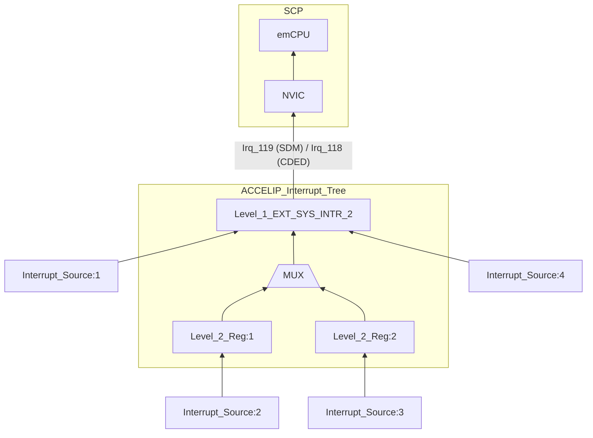
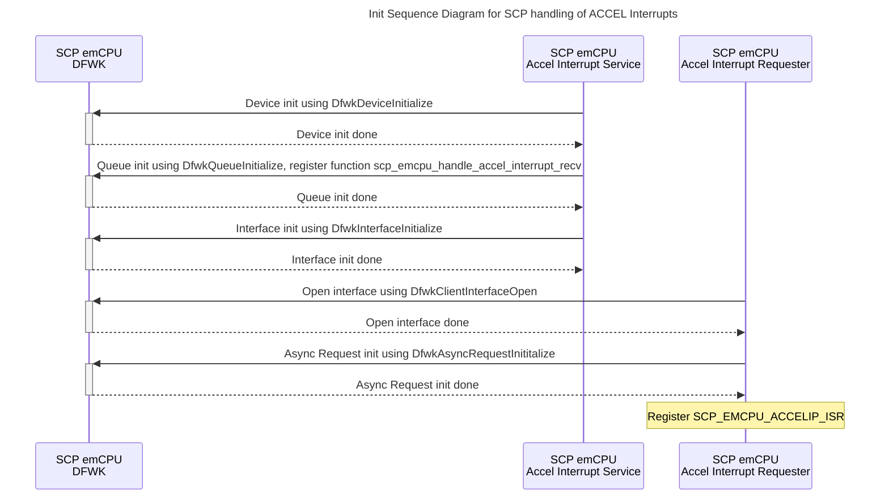
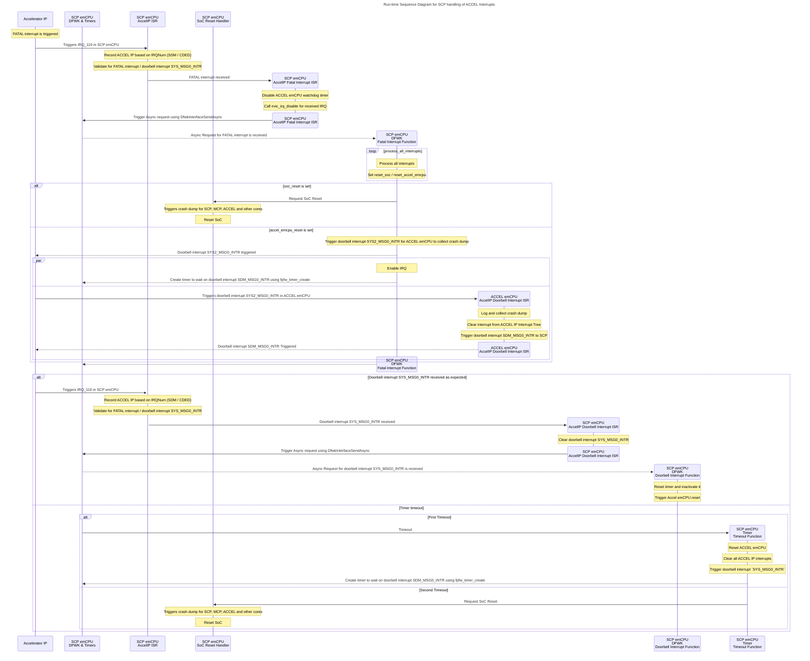

# ACCEL Interrupt Handler Design Document

Table of Contents

[[_TOC_]]

## 1 Introduction

### 1.1 Description

This document has design description of how Accelerator IP FATAL interrupts are handled in SCP context. This applies to both Generic and CDED Accelerator IPs. This is a work in progress and is being updated towards M1.0 capability requirements and design.

### 1.2 Terms

| Term      | Description                            |
| --------- | -------------------------------------- |
| NVIC      | Nested Vectored Interrupt Controller   |
| ISR       | Interrupt Service Routine              |
| emCPU     | embedded CPU                           |
| ACCELIP   | Accelerator IP                         |
| FPFW      | First Party Firmware Lib               |


### 1.3 Reference Documents

| Document                                      | Link                                                                                                                                              |
| --------------------------------------------- | ------------------------------------------------------------------------------------------------------------------------------------------------- |
| ThreadX Documentation                         | [Link](<https://learn.microsoft.com/en-us/azure/rtos/threadx>)                                                                                    |
| SDM Interrupt Flowcharts                      | [Link](https://microsoft.sharepoint.com/:u:/r/teams/EchoFalls/_layouts/15/Doc.aspx?sourcedoc=%7B3C464424-A9E1-481B-A370-80E36BFAC822%7D)          |
| SDM Interrupt Map                             | [Link](https://microsoft.sharepoint.com/:x:/r/teams/ses-ipteamsdm/_layouts/15/Doc.aspx?sourcedoc=%7BAB635B2C-7FE2-4563-BDCB-A5D477111F0F%7D)      |

## 2 Requirements

### 2.1 Background

Interrupts from Accelerator IP are routed to Accelerator emCPU and to SCP, MCP and HSP. By design, plan is to handle all FATAL interrupts from Accelerator IP in SCP.

These are the Accelerator IP FATAL interrupts that SCP handles. Please refer to **[SDM Interrupt Map - EXT_SYS Interrupt Line](https://microsoft.sharepoint.com/:x:/r/teams/ses-ipteamsdm/Shared%20Documents/Design/ACCEL_interrupt_map.xlsx?d=wab635b2c7fe24563bdcba5d477111f0f&csf=1&web=1&e=NBOS9z&nav=MTVfezc5MDJEMjQwLTY1NEYtNDQzNi1CMTYwLTY1MzZBMUE4MzY3Mn0)**

| Interrupt Name         | Details |
|------------------------| ------- |
| EMCPU_WDT_ERR          | EMCPU Watchdog fatal timer expired |
| CP_FATAL_ER`           | Co-Processor Fatal Error Reported |
| UE_ECC_ERR             | Uncorrectable ECC or Parity error was encountered |
| CSR_PARITY_ERR         | CSR Parity error was encountered |
| SDM_WDT_ERR            | SDM Watchdog timers expired |
| FAB_WDT_ERR            | SDM Fabric Watchdog timers expired |
| AXI_BURST_ERR          | EMCPU burst type request sent Interrupt Status |
| AXI_UNSUPP_INTR_STATUS | External AXI unsupported request Interrupt Status |
| STYRESE_REQ_ERR        | EMCPU SYSRESETREQ was raised |

\
SCP will also handle interrupt `SDM_MSG0_INTR` which will be used for handshaking between SCP and SDM. This will be a doorbell interrupt from ACCEL emCPU to SCP. 

On SCP side, single IRQ pin is used for all the Accelerator IP interrupts. Please refer to **[Kingsgate SOC Interrupt Map r1p5 - SCP Interrupts](https://microsoft.sharepoint.com/:x:/r/teams/EchoFalls/Shared%20Documents/Kingsgate%20SOC/Architecture/SOC%20Top/Kingsgate%20SOC%20Interrupt%20Map%20r1p5.xlsx?d=w8cfb84a91ebb4ec5bea8ddb8fead52db&csf=1&web=1&e=DQwWuS&)nav=MTVfezFCMDA1Mjg3LTMyQTYtNDg4MS05NjU2LTNFMUVCNEMzQ0YzRX0)**

1. CDEDSS IRQ Number is 118
1. SDMSS IRQ Number is 119

To further differentiate between various interrupts, following register hierarchy is used.

1. Accelerator IP interrupt tree : Level 1
1. Accelerator IP interrupt tree : Level 2

Use of ACCELIP levels will differ for every interrupt. For an interrupt that uses both hierarchies, Level 2 is triggered first which can cause Level 1 trigger which then can cause NVIC IRQ trigger. Level 1 and 2 will be enabled / disabled based on the corresponding mask bits in their MASK registers. List of all interrupts and their level registers is covered in : **[SDM Interrupt Map - EXT_SYS Interrupt Line](https://microsoft.sharepoint.com/:x:/r/teams/ses-ipteamsdm/Shared%20Documents/Design/ACCEL_interrupt_map.xlsx?d=wab635b2c7fe24563bdcba5d477111f0f&csf=1&web=1&e=NBOS9z&nav=MTVfezc5MDJEMjQwLTY1NEYtNDQzNi1CMTYwLTY1MzZBMUE4MzY3Mn0)**


### 2.2 Responsibility (ACCEL emCPU)

Accelerator emCPU will be responsible for following actions. Details of this are covered in [SDM Interrupt Handling](https://azurecsi.visualstudio.com/Woodinville/_git/Kingsgate.SDM.CDED?path=/docs/development/FirmwareDesign/ACCEL_interrupt_handler.md)

1. LOG the interrupt using Event Trace and Telemetry
1. Collect Crash Dump when doorbell interrupt `SYS_MSG0_INTR` is triggered by SCP.

### 2.3 Responsibility (SCP emCPU)

SCP emCPU will be responsible for following actions

1. LOG the interrupt using Event Trace and Telemetry
1. Trigger Crash Dump collection in ACCEL emCPU using doorbell interrupt `SYS_MSG0_INTR`
1. Trigger SoC / ACCEL emCPU reset based on the interrupt received.

## 3 Dependencies

* [NVIC Driver](https://azurecsi.visualstudio.com/Woodinville/_git/Kingsgate.CortexM7?path=/src/libs/nvic)
* [Event Trace](https://azurecsi.visualstudio.com/Woodinville/_git/Kingsgate.MSCP?path=/docs/development/FirmwareDesign/event_tracing.md)
* [SDM Interrupt Handling](https://azurecsi.visualstudio.com/Woodinville/_git/Kingsgate.SDM.CDED?path=/docs/development/FirmwareDesign/ACCEL_interrupt_handler.md)
* [Driver Framework](https://azurecsi.visualstudio.com/DuvallFw/_git/1pfw.fwlibs?path=/doc/Modules/DriversAndDriverFramework.md&_a=preview)
* [FPFW Timer](https://azurecsi.visualstudio.com/DuvallFw/_git/1pfw.fwlibs?path=/src/libs/Interfaces/Platform/timer)

## 4 Design

### 4.1 Overview

Interrupt handler will use top-half and bottom-half model for all ACCEL IP interrupts handled in SCP.
We will use DriverFramework and FPFW timer for implementation and communication between top and bottom half.

### 4.1.1 Initialization

* Bottom-half related initialization sequence
    * Initialize interrupt handler device using `DfwkDeviceInitialize`
    * Initialize queue using `DfwkQueueInitialize` which will be used by ISR to send a message to bottom-half
    * Initialize interface used for communication between top and bottom half using `DfwkInterfaceInitialize`.

* Top-half related initialization sequence
    * Open Interface for triggering Bottom-Half execution using `DfwkClientInterfaceOpen`
        * Same interface can be used for both FATAL and SYS_MSG communication.
    * Initialize Async Request using `DfwkAsyncRequestInititalize` : This will be used by ISR to kick off bottom-half execution.



#### 4.1.2 Top-half (ISR): ISR will act as Top-Half and will be responsible for doing only the most critical tasks.

* ISR will record the Accelerator IP from which interrupt has been triggered (SDM / CDED).
* ISR will also check if at least one valid FATAl interrupt exists / doorbell interrupt `SYS_MSG0_INTR` is raised.
    * This will be done by checking both level 1 and level 2 registers of interrupts that are set until a valid FATAL or doorbell `SYS_MSG0_INTR` interrupt is found
    * If no such interrupt is found, the ISR returns after clearing the interrupt at level 1.
* Based on the interrupt that is received, one of following actions will be taken
    * **FATAL Interrupts**
        * Disable ACCEL emCPU watchdog timer.
        * Disable the interrupt that has been raised using `nvic_irq_disable`.
        * Create async request for FATAL interrupt and trigger the request for Bottom-half to handle using `DfwkInterfaceSendAsync`.
    * **Doorbell Interrupt SYS_MSG0_INTR**: This indicates that ACCEL emCPU has successfully collected crash dump.
        * Clear doorbell interrupt `SYS_MSG0_INTR` from ACCEL IP Interrupt Tree
        * Create async request for SYS_MSG and trigger the request for Bottom-half to handle using `DfwkInterfaceSendAsync`.

#### 4.1.3 Bottom-half: Bottom-half will be function calls that are called by Driver Framework when a ISR triggers the Async Request.

```c
// **** function registered with queue to handle async request ****
scp_emcpu_handle_accel_interrupt_recv()
{
    if (sys_msg_received())
    {
        scp_emcpu_handle_doorbel_from_accel_ip_recv();
    }
    else
    {
        scp_emcpu_handle_fatal_interrupt_recv();
    }
}

// **** scp_emcpu_handle_fatal_interrupt_recv ****
scp_emcpu_handle_fatal_interrupt_recv(...)
{
    /**
     * 1. Loop through all FATAL interrupts to note and log triggered interrupts. 
     *    Also set flags soc_reset / accel_emcpu_reset accordingly. 
     */
    process_all_interrupts();

    if (soc_reset)
    {
        /**
         * Request SoC reset in SCP. This should also trigger crash dump collection for ACCEL emCPU and other cores. 
         */
        request_soc_reset();
    }
    else if (accel_emcpu_reset)
    {
        /**
         * 1. Send request to ACCEL emCPU to collect crash dump. This is done by raising doorbell interrupt SYS2_MSG0_INTR
         * 2. Enable IRQ from ACCEL IP
         * 3. Create timer to wait on doorbell interrupt SDM_MSG0_INTR using fpfw_timer_create
         */
        request_crash_dump_collection();
    }
}

// **** scp_emcpu_handle_doorbel_from_accel_ip_recv ****
scp_emcpu_handle_doorbel_from_accel_ip_recv(...)
{
    /**
     * 1. Reset the timer and inactivate it by calling fpfw_timer_reset
     * 2. Trigger ACCEL emCPU reset
     */
    trigger_accel_emcpu_reset();
}

// **** scp_emcpu_handle_doorbel_from_accel_ip_recv_timeout ****
scp_emcpu_handle_doorbel_from_accel_ip_recv_timeout(...)
{
    if (first_timeout)
    {
        /**
         * 1. Reset ACCEL emCPU
         * 2. Clear all interrupts routed from ACCEL IP
         * 3. Trigger doorbell interrupt `SYS2_MSG0_INTR` again to collect ACCEL Subsystem Dump
         * 4. Create timer to wait on doorbell interrupt SDM_MSG0_INTR using fpfw_timer_create
         */
        trigger_accel_emcpu_reset();
        clear_interrupts();
        request_crash_dump_collection();
    }
    else
    {
        /** 
         * 1. Set flag for soc_reset : Second timeout indicates that ACCEL emCPU is not able 
         *     to collect crash dump even after one emCPU reset. So to recover, SoC reset will be needed.
         * 2. Request SoC reset in SCP.
         */
        request_soc_reset();
    }
}
```
\
Note: This diagram doesn't show handling of FATAL interrupts in ACCEL emCPU. That is covered in **[SDM Interrupt Handling](https://azurecsi.visualstudio.com/Woodinville/_git/Kingsgate.SDM.CDED?path=/docs/development/FirmwareDesign/ACCEL_interrupt_handler.md)**


## 5 Unit Testing

`TBD`

## 6 Functional Testing

`TBD`
