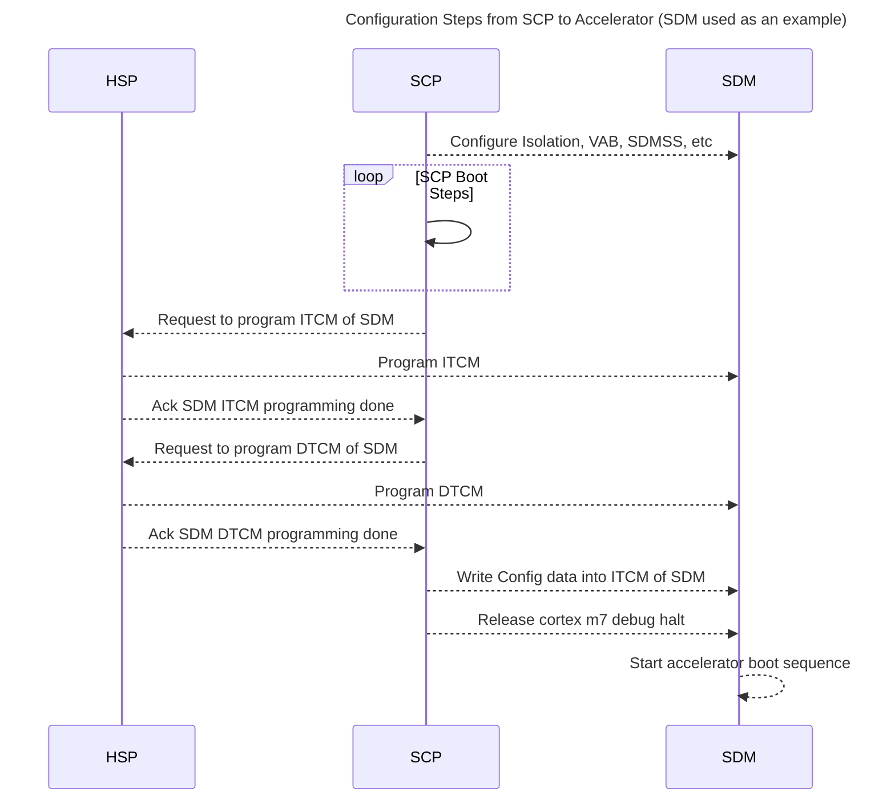
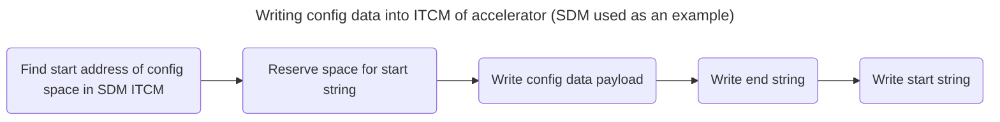
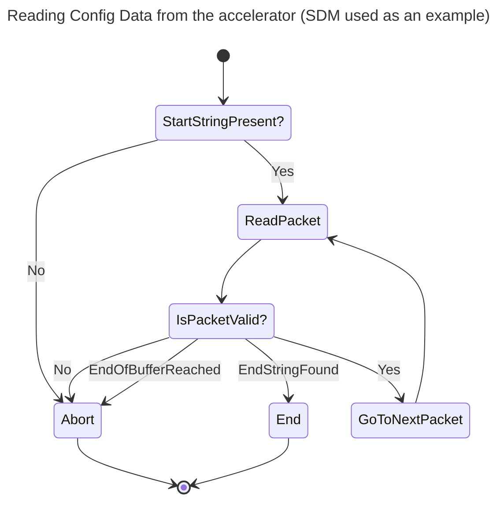
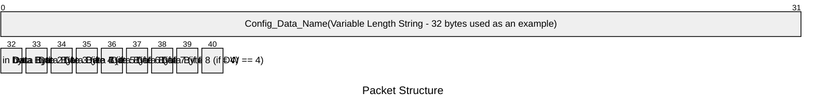

# Accelerator Knobs Transfer Component Design Document

## Table of Contents

[[_TOC_]]

## Introduction

### Description

This document describes the firmware module used to transfer knobs and other runtime configuration data from SCP to the accelerators (SDM/CDED-SDM).

### Terms

| Term                  | Description                                                            |
| ------                | -------------------------------                                        |
| SCP                   | System Control Processor                                               |
| SDM                   | Smart Data Mover                                                       |
| CDED                  | Compression Decompression Encryption Decryption                        |
| DTCM                  | Data tightly coupled memory                                            |
| ITCM                  | Instruction tightly coupled memory                                     |

### Reference Documents

| Document                                  | Link                                |
| ----------------------------------------- | ----------------------------------- |
| SDM CDED FAS | [Link](https://microsoft.sharepoint.com/:w:/r/teams/Kingsgate/Shared%20Documents/Firmware/Production%20Firmware/IDC/SDM%20%26%20CDED/Firmware%20Architecture%20Spec/SDM_CDED_FAS_WIP.docx?d=wa454e38edb314c53b87c3419e84dc61c&csf=1&web=1&e=rYee3j)    |

## Requirements

- The firmware shall allow transfer of SoC runtime information (SoC ID, Die ID, System ID, Platform ID, etc) to the accelerators.
- The firmware shall also allow the transfer of knobs and fuses required for the emCPU during boot and runtime from the SCP to the accelerators.
- For now, all the configuration data (runtime information, knobs, and fuses) shall be available to the accelerators at/before boot.
- (optional) There should be a mechanism to update any of the accelerator configuration parameters/knobs during runtime if needed.

## Dependencies

- Config Manager

## Design

For the first part of the design, we are concerned with the transfer of the information required by the accelerators at boot time. 

This includes, but is not limited to:

- System ID
- SoC ID
- Die ID
- Platform ID
- Boot Reason (Cold Boot/Recovery, etc)
- Event Trace and Log Levels
- Checkpointing log levels

Since these are required at the earliest, preferably before boot, there are limited options available: 

- TCMs ara available
- There are no other scratch RAMs
- Mailboxes are not yet initialized from the accelerator end to transmit messages

Hence, we will set aside a section of the ITCM for config data, and write this section from the SCP before releasing the accelerator from reset. The following flow diagram illustrates the sequence for one accelerator in one die. The same sequence is applicable for the other accelerator/other die.

ITCM is chosen over the DTCM since this data is all read only from the accelerators, and ITCM is protected against corruption from the accelerator emCPU by design.

### Diagrams explaining the flow/design

