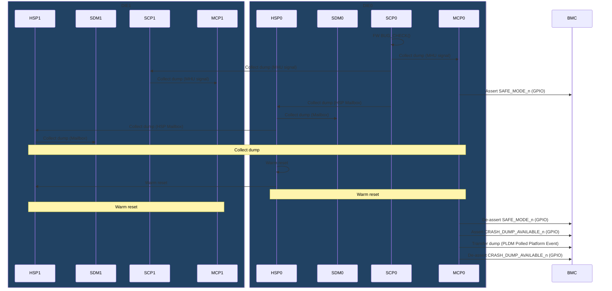
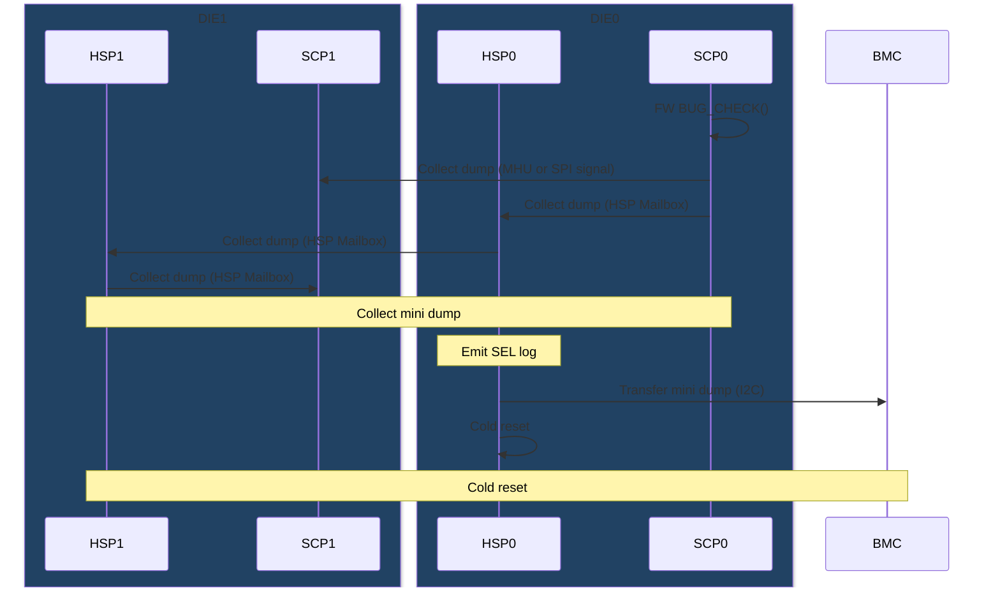
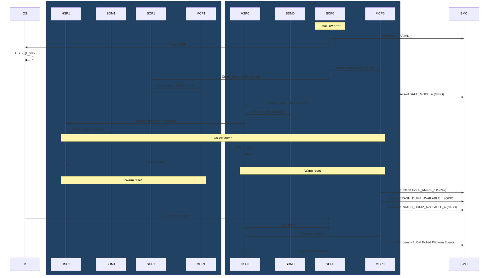
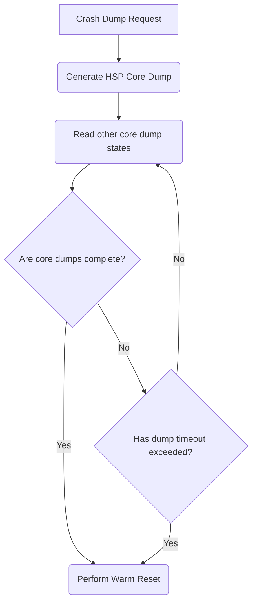
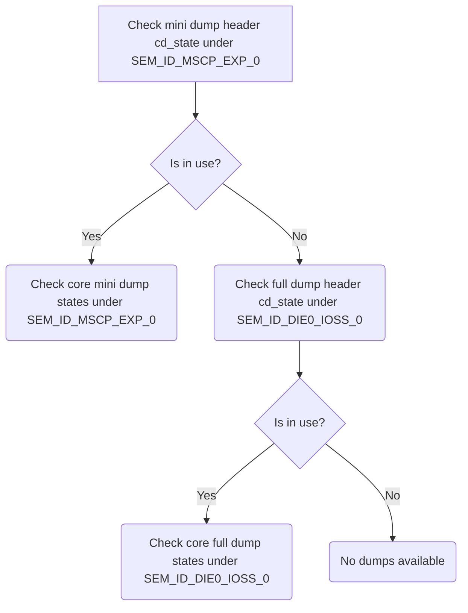

# Crash Dump Design

## Table of Contents

[[_TOC_]]

## Introduction

### Description

This document is intended to describe the design of a Crash Dump firmware module, responsible for collecting, formatting, storing, and transmitting data to BMC in the event of a crash (either in firmware or from a fatal hardware error).

### Terms

| Term                  | Description                                                            |
| ------                | -------------------------------                                        |
| SCP                   | System Control Processor                                               |
| MCP                   | Management Control Processor                                           |
| MHU                   | Message Handling Unit                                                  |
| HSP                   | Hardware Security Processor                                            |
| CPER                  | Common Platform Error Record                                           |
| SDM                   | Smart Data Mover                                                       |
| BMC                   | Baseboard Management Controller                                        |

### Reference Documents

| Document                                  | Link                                |
| ----------------------------------------- | ----------------------------------- |
| Firmware Architecture Document | [Link](https://microsoft.sharepoint.com/:w:/r/teams/EchoFalls/Shared%20Documents/Kingsgate%20SOC/Firmware/working/KG%20FW%20Architecture.docx?d=w88e40080cd1c465cbc34218785e31421&csf=1&web=1&e=k23znC)    |
| 1PFW PLDM Shared Library Documentation | [Link](https://azurecsi.visualstudio.com/DuvallFw/_git/1pfw.fwlibs?path=/doc/Modules/libs/CrashDump.md) |
| Kingsgate Debug Handbook | TBD |
| Bug Check / Assert | [Link](https://woodinvillewiki.com/pages/viewpage.action?pageId=21398290) |

## Requirements 

- Shall allow consumers to register arbitrary memory ranges and register data
- Shall provide hooks at crash time to allow consumers to take necessary pre-crash actions
- Shall provide a mechanism of correlating dumps with the producing FW image
- Shall notify consumers once dump is transferred to BMC
- Shall support pre- and post-boot crash scenarios
- Shall support pre- and post-mesh init crash scenarios
- Shall provide an API to instigate a crash dump
- Shall provide a mechanism for a crashing core to instigate crash dump on remote cores
- Shall allow a debugger to intercept crash handling
- Shall provide crash information: crash time, crashing core ID, file path, line number, generic parameters

## Dependencies

Crash Dump will have dependencies on the following:

- Gtimer/UTC (for crash time)
- Configuration service  (for knobs)
- Warm start  (to determine warm vs cold boot)
- Startup/shutdown (to participate in shutdown sequencing)
- GPIO  
- CLI 
- PLDM (to transfer dump)
- HSP mailbox (for crash signaling)
- MHU (for crash signaling)

## Design

### Crash Dump Framework

The Crash Dump module will utilize the 1PFW Crash Dump framework: [CrashDump](https://azurecsi.visualstudio.com/DuvallFw/_git/1pfw.fwlibs?path=/doc/Modules/libs/CrashDump.md)

This will ensure dumps are produced in the format 1PFW tooling expects.

While the library supports multi-core state management, on Kingsgate this is not needed, and single-core dumps will be produced instead.
Thus cross-core orchestration will be simplified (no need to designate a primary, orchestrator core).

This will allow dumps to proceed even if a "primary" core is unavailable to perform orchestration.

BUG_CHECK will populate FpFwCrashDumpInfo and call into the framework's entrypoint.

### Default data capture
The library registers built-in Cortex M7 registers, core stacks, ThreadX thread infos (Thread control blocks, internal ThreadX state), exception status registers, and registers outlined in this document:
TBD

#### Standard Information

| Field               | Description                                        |
| ------------------- | -------------------------------------------------- |
| GUID                | Unique GUID {da166264-6f19-4647-bf3d-4f9b523f5d08} |
| Id                  | Build metadata Id                                  |
| Major               | Major version                                      |
| Minor               | Minor version                                      |
| Revision            | Revision                                           |
| Build               | Build number                                       |
| Version Info String | T.B.D                                              |
| Elf_Build_Id        | GNU ELF Build ID                                   |

#### M7 Core Registers

| Registers |  Description |
| ------ | --------- |
| R0 | General Purpose Register |
| R1 | General Purpose Register |
| R2 | General Purpose Register |
| R3 | General Purpose Register |
| R4 | General Purpose Register |
| R5 | General Purpose Register |
| R6 | General Purpose Register |
| R7 | General Purpose Register |
| R8 | General Purpose Register |
| R9 | General Purpose Register |
| R10 | General Purpose Register |
| R11 | General Purpose Register |
| R12 | General Purpose Register |
| SP | Stack Pointer |
| LR | Link Register |
| PC | Program Counter |


#### Exception Status Registers

| Registers |  Description |
| ------ | --------- |
| MMFAR | Memory Management Fault Address Register |
| BFAR | Bus Fault Address Register |
| HFSR | Hard Fault Status Register |
| CFSR | Configurable Fault Status Register |

#### ThreadX context

| Variable                    | Description                    |
| --------------------------- | ------------------------------ |
| _tx_thread_system_stack_ptr | System stack pointer           |
| _tx_thread_current_ptr      | Currently executing thread     |
| _tx_thread_execute_ptr      | The next thread to be executed |
| _tx_thread_created_ptr      | The list of created threads    |
| _tx_thread_created_count    | The count of created threads   |
| _tx_thread_system_state     | The current state of thread    |

For each created thread
| Variable     | Description              |
| ------------ | ------------------------ |
| TX_THREAD    | ThreadX thread structure |
| thread_stack | Stack of this thread     |
| thread_name  | Name of this thread      |

#### SCP Specific Registers
T.B.D

#### MCP Specific Registers
T.B.D

#### Watchdog Registers

| Registers | Description                               |
| --------- | ----------------------------------------- |
| WDOGRIS   | Watchdog Raw Interrupt Status Register    |
| WDOGMIS   | Watchdog Masked Interrupt Status Register |


### Exceptions

The library handles the following Cortex M7 built-in exceptions:

* NMI (fires on WDT)
* Hard Fault
* Memory Management Fault
* Bus Fault
* Usage Fault
* Debug Monitor (used for BUG_CHECKs)

#### Common Fault Exception Handler
All error handlers use a common handler, which does the following:

1. Initially store the processor state at crash time (r0-r15)
1. Populate crash info as needed and begin the crash dump procedure

Since the Cortex M7 stacks certain register at exception time, these are recovered from the stack and the rest of the registers are recovered from the raw register value.

**Exception Stack Frame**
```c
// Registers pushed to the stack on exception entry
// https://developer.arm.com/documentation/ddi0403/d/System-Level-Architecture/System-Level-Programmers--Model/ARMv7-M-exception-model/Exception-entry-behavior?lang=en
typedef struct __attribute__((pack)) {
    uint32_t R0;
    uint32_t R1;
    uint32_t R2;
    uint32_t R3;
    uint32_t R12;
    uint32_t LR;
    uint32_t PC;
    uint32_t PSR;
} exception_stack_frame_t;
```

**Main Exception Entry**
```c
{
    exception_stack_frame_t *stack_frame;
    __asm__ volatile("CPSID   i     \n"  // Disable interrupts
                     "tst lr, #4    \n"  // Check LR[2] (LR holds EXC_RETURN)
                     "ite eq        \n"
                     "mrseq %0, msp \n"   // Move msp into output register if EXC_RETURN[2] == 0
                     "mrsne %0, psp \n"   // Move psp into output register if EXC_RETURN[2] == 1
                     :                    // Outputs
                     "=r"(stack_frame));  // Point stack_frame to the location of the exception stack frame

    // Capture stack frame and non-stacked registers, and jump into main handler
}
```

**Main Handler**
Upon entry, the main handler will disable the watchdog to prevent a watchdog timeout during dump collection.
It will distinguish the crash reason (Bug Check vs built-in exception). The active exception can be retrieved by reading the VECTACTIVE field of ICSR.
It will then fill out the Crash Dump Info struct as appropriate and then call the crash dump entrypoint API from the Crash Dump framework.

### Bug Check
This library provides BUG_CHECK/BUG_ASSERT functionality, allowing consumers to programmatically invoke crash dump.

See [Bug Check / Assert](https://woodinvillewiki.com/pages/viewpage.action?pageId=21398290) for details and guidelines.

The BUG_CHECK API implementation executes a breakpoint instruction.
This allows a debugger to catch the breakpoint, so that the state of the system can be inspected when the fault occurs.
Without a debugger attached, the DebugMonitor exception occurs after executing a breakpoint instruction.
As a result, BUG_CHECK parameters are copied to r0-r4 prior to executing bkpt, so that they can be picked up by the exception handler.

An example snippet of invoking the Debug Monitor exception is shown:
```c
// Assuming code, p1, p2, p3, p4 are arguments
// This will store them in r0-r4 respectively
__asm__ volatile("mov r0, %[code]\n"
                     "mov r1, %[p1]\n"
                     "mov r2, %[p2]\n"
                     "mov r3, %[p3]\n"
                     "mov r4, %[p4]\n"
                     :  // No output
                     :  // Inputs
                     [code] "r"(errorCode),
                     [p1] "r"(p1),
                     [p2] "r"(p2),
                     [p3] "r"(p3),
                     [p4] "r"(p4)
                     :  // Clobbers
                     "r0", "r1", "r2", "r3", "r4");
 
__asm__ volatile("bkpt\n");
```

### Remote Signaling
When a core crashes, it will signal remote cores to begin dump collection. In this way, the state of the system can be captured when a fault occurs.


#### MHU
In order to trigger crash dump collection on remote ARM cores (SCP, MCP), a dedicated MHU channel in each MHU instance will be reserved.
Crashing cores will trigger the MHU interrupt on all remote cores for which MHU signaling exists (including cross-die).

Single Die:
   1. SCP to MCP and vice versa

Dual Die:
   1. SCP primary to SCP remote and vice versa
   1. MCP primary to MCP remote and vice versa

#### HSP Mailbox
To trigger crash dump collection on HSP, HSP mailbox will be used - the crashing core will notify HSP using the Crash Dump mailbox message.
HSP will notify SDM to begin crash dump collection via HSP-style mailbox.

One die's HSP will send the Crash Dump mailbox message to the remote die's HSP.
As a matter of course, each die's HSP will notify all local cores via Crash Dump mailbox message (to handle cases eg: where the MHU sender core for any given receiver is unavailable).
In order to avoid race conditions coming from separate MHU/HSP signaling, interrupts should be disabled on crash dump entry.
Similarly, the incoming HSP mailbox should be flushed.


#### Pre-mesh crashes
Before the mesh is initialized, only the D2D SPI link can be used for cross-die communication.
Thus for any pre-mesh crashes, the HSP mailbox will be used, and the local die's HSP will forward the request to the remote die's HSP.
The mailbox message should indicate a pre-mesh crash to allow HSP to distinguish the boot phase when it receives the crash request, since it will be responsible for transferring the dump to BMC.

### Full vs Mini Dump
Certain crash scenarios may occur prior to DDR being initialized, as a consequence it will be necessary to store a size-constrained dump in SRAM in pre-DDR crash cases and DDR failed cases.
Thus cores will store a mini-dump in MSCP_EXP scratch RAM[TBD].
SCP will store mini dump as well as full dump to cover the case of crash after DDR initialization but failed in runtime.

### Memory Layout

8KB header and 12MB payload are reserved for total crash dump storage in DDR for the full dump
16byte header and 20KB payload are reserved for total crash dump storage in MSCP_EXP scratch RAM[TBD] for the mini dump

The memory is laid out as follows, in either DDR and scratch RAM:
```
/*
Reserved memory in DIE0 SRAM for crash mini dump
+---------+---------------+---------------+--
|         |               |               |
|         |               |               |
| Core    | SCP0 Dump     | SCP1 Dump     |
| States  |               | (Copy buffer) |
|         |               |               |
|         |               |               |
|         |               |               |
+---------+---------------+---------------+
|                                         |
Crash Dump Base           Base + Reservation size

Reserved memory in DIE1 SRAM for crash mini dump
+---------+---------------+---------------+--
|         |               |               |
|         |               |               |
| Core    | SCP1 Dump     | Reserved      |
| States  |               |               |
|         |               |               |
|         |               |               |
|         |               |               |
+---------+---------------+---------------+
|                                         |
Crash Dump Base           Base + Reservation size
*/


/*
 * Reserved memory in DDR RAM for crash full dump
+---------+-------+-------+-------+-------+-------+-------+-------+-------+-------+-------+-------+-------+--
|         |       |       |       |       |       |       |       |       |       |       |       |       |
|         |       |       |       |       |       |       |       |       |       |       |       |       |
| Core    | MCP0  | SCP0  | HSP0  | CDED0 | SDM0  | KMP0  | MCP1  | SCP1  | HSP1  | CDED1 | SDM1  | KMP1  |
| States  | Dump  | Dump  | Dump  | Dump  | Dump  | Dump  | Dump  | Dump  | Dump  | Dump  | Dump  | Dump  |
|         |       |       |       |       |       |       |       |       |       |       |       |       |
|         |       |       |       |       |       |       |       |       |       |       |       |       |
+---------+-------+-------+-------+-------+-------+-------+-------+-------+-------+-------+-------+-------+--
|                                                                                                         |
Crash Dump Base                                                                       Base + Reservation size
*/
```

Where each core equally divides the (reserved size - sizeof(core state)) for core-specific crash dump.

#### Crash dump header access
Core states (16 byte header) located in first part of crash dump regions to indicate dump progress.
Mini dump header is located in MSCP EXP RAM for each die.
Full dump header is located in DDR.

To access mini dump header, HW semaphore SEM_ID_MSCP_EXP_0 should be acquired.
To access full dump header, HW semaphore SEM_ID_DIE0_IOSS_0 should be acquired.

Semaphore key is defined as combination of die id, core id. But because key value 0 is reserved for released state, it will be defined as "((die_id << 16) | (core_id & 0xFFFF)) + 1".

```c
typedef enum
{
    CRASH_DUMP_CORE_MCP = 0,
    CRASH_DUMP_CORE_SCP = 1,
    CRASH_DUMP_CORE_HSP = 2,
    CRASH_DUMP_CORE_CDED = 3,
    CRASH_DUMP_CORE_SDM = 4,
    CRASH_DUMP_CORE_KDM = 5,
    CRASH_DUMP_CORE_NUM
} crash_dump_core_t;
```

SEM_ID_MSCP_EXP_0 and SEM_ID_DIE0_IOSS_0 should be initialized by HSP before other cores are booted.

```c
enum
{
    CRASH_DUMP_STATE_NOT_AVAILABLE = 0,
    CRASH_DUMP_STATE_READY = 1,
    CRASH_DUMP_STATE_IN_PROGRESS = 2,
    CRASH_DUMP_STATE_COMPLETED = 3
};

/**
 * @brief Crash dump status header
 * 
 * lock: Spinlock to protect the status
 * cd_status: Crash dump status (Lower 8 bits: DIE0, Upper 8 bits: DIE1 - 0: In progress, 1: Completed for each core)
 * 
 */
typedef struct {
    uint16_t cd_status; // 0: Not in use, 1: In Use
    volatile uint8_t cores[CRASH_DUMP_CORE_NUM * 2];
} crash_dump_header_t;
```

### Dump Flows
#### Post-boot crash
In the case of a post-boot crash (post-MCP boot), the crashing core (if not HSP) sends a Crash Dump mailbox message to HSP, which in turns sends Crash Dump mailbox messages to each of its local cores.
HSP also sends a mailbox message to the remote die's HSP, which in turns notifies its local cores via mailbox.

Each core marks when dump collection is complete in the designated core state memory.
Once the dump collection is complete, or if this process timed out, HSP performs a warm reset.

Upon warm reset, the primary MCP transfers the dump to BMC upon being booted.



#### Pre-mesh/pre-boot crash
Before the mesh is initialized, only the D2D SPI link can be used for cross-die communication.
Thus for any pre-mesh crashes, the HSP mailbox will be used, and the local die's HSP will forward the request to the remote die's HSP.
Upon dump collection, HSP will transfer to BMC via I2C [TBD]
Once complete, HSP will perform a cold reset

In pre-boot cases (where MCP0 has not booted), the same flow will be taken



#### Fatal HW error / Unrecoverable error
Upon a Fatal HW Error, the OS is notified via a CPER (see Health Monitor design [TBD]).

It will perform an OS BugCheck and then request a cold reset.

It is necessary to sequence this cold reset request with the dump transfer, ensuring the dump has been transferred before performing the cold reset.



#### HSP warm reset logic


#### HSP Read other core dump states


## Public APIs

```c
/**
 * Initiates a bug check which will create a crash dump.
 *
 * @param errorCode
 *  User defined error code stored with the crash dump bug check details
 *
 * @param p1, p2, p3, p4
 *  User defined parameter data stored with the crash dump bug check details
 */
NORETURN void crash_dump_bug_check(uint32_t errorCode, uint32_t p1, uint32_t p2, uint32_t p3, uint32_t p4);
 
/**
 *
 * Registers a callback to be run at crash time, prior to beginning crash dump
 *
 * @param cb
 *  User defined callback function
 *
 * @param ctx
 *  User defined callback function context (supplied to callback when called)
 *
 * @return
 *  None
 */
void crash_dump_register_pre_dump_callback(void cb(void *), void *ctx);
 
/**
 *
 * Registers a set of MMIO registers to be recorded in the crash dump
 *
 * @param mmio_reg
 *  MMIO register address
 *
 * @param reg_count
 *  Number of registers to capture
 *
 * @param priority
 *  One of FPFW_CD_DUMP_PRIORITY_CRITICAL, FPFW_CD_DUMP_PRIORITY_NORMAL, FPFW_CD_DUMP_PRIORITY_OPPORTUNISTIC
 *  Data is stored in the dump in the above priority order until the dump memory is exhausted
 *
 * @return
 *  None
 */
void crash_dump_register_mmio_register(volatile void *mmio_reg, uint32_t reg_count, FPFwCdDumpPriority priority);
 
/**
 *
 * Registers a region of memory to be recorded in the crash dump
 *
 * @param address
 *  Pointer to memory
 *
 * @param size
 *  Size of memory
 *
 * @param priority
 *  One of FPFW_CD_DUMP_PRIORITY_CRITICAL, FPFW_CD_DUMP_PRIORITY_NORMAL, FPFW_CD_DUMP_PRIORITY_OPPORTUNISTIC
 *  Data is stored in the dump in the above priority order until the dump memory is exhausted
 *
 * @return
 *  None
 */
void crash_dump_register_address32(void *address, uint32_t size, FPFwCdDumpPriority priority);
 
/**
 *
 * Registers a region of memory to be recorded in the crash dump
 *
 * @param address
 *  Address of memory
 *
 * @param size
 *  Size of memory
 *
 * @param priority
 *  One of FPFW_CD_DUMP_PRIORITY_CRITICAL, FPFW_CD_DUMP_PRIORITY_NORMAL, FPFW_CD_DUMP_PRIORITY_OPPORTUNISTIC
 *  Data is stored in the dump in the above priority order until the dump memory is exhausted
 *
 * @return
 *  None
 */
void crash_dump_register_address64(uint64_t address, uint32_t size, FPFwCdDumpPriority priority);
```

## CLI
The Crash Dump CLI will expose a few commands to allow test interaction:
| CLI Command                                           | Description                                              |
| -----------                                           | -------------------------------------------------------- |
| cd_register_mmio_register                             | Registers MMIO register range                            |
| cd_register_address32                                 | Registers range of 32-bit addresses                      |
| cd_register_address64                                 | Registers range of 64-bit addresses                      |
| cd_bug_check                                          | Triggers a BUG_CHECK                                     |
| cd_stack_overflow                                     | Triggers stack overflow                                  |

## Unit Testing

Unit tests will be written against each module's public APIs and for each of the crash scenarios (post-boot, pre-mesh, pre-DDR).
NORETURN will be defined such that in tests the functions are allowed to return, and return control to the test.

Similarly, a BUG_CHECK mock will be provided that will utilize setjmp in order to allow control to return to the test, when other libraries need to test BUG_CHECK cases.

## Functional Testing
Functional tests will utilize the CLI and BMC entrypoints for invoking Crash Dump behaviour.
They will validate each crash scenario against the requirements (eg: toggling required GPIOs, transferring crash dump to BMC, etc.)
They will be run using SVP and Big FPGA, and when available, silicon.

## SVP crashdump
SVP crash dump probe will dump into file under %REPO_APP_ROOT%.svp_simulator/crashdump folder if there is a crash.
