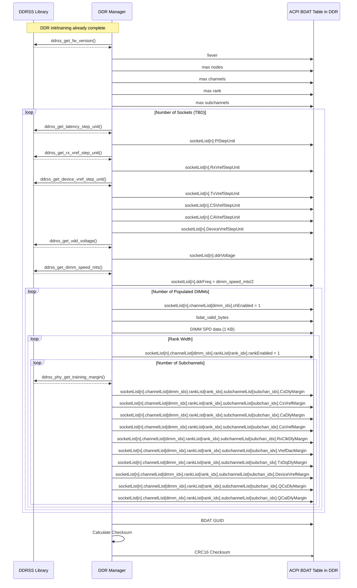
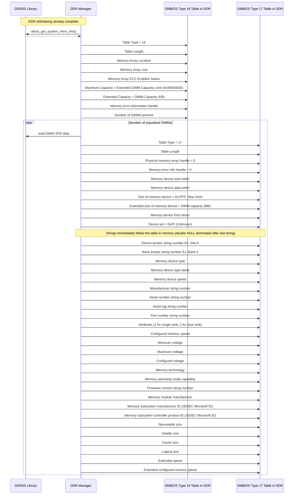

# DDR Manager Module Design Document

## Table of Contents

[[_TOC_]]

## Introduction

### Description

This document is intended to describe the design details for the DDR Manager Module.  This also includes a summary of initialization done by the ddrss library (silicon libs), thermal throttling (bandwidth limiting), error injection, error logging, Handoff of system configuration to UEFI, and insertion of reserved addresses ranges to system memory map.  

### Terms

| Term   | Description                     |
| ------ | ------------------------------- |
| BDAT   | BIOS Data ACPI Table |
| BWL    | Bandwidth Limiter - A built-in feature in the DDR controller to limit reads/writes to lower DIMM temperatures |
| DDR    | Double Data Rate |
| DIMM   | Dual In-line Memory Module |
| MCP    | Management Control Processor |
| PHY    | Physical Layer |
| RDIMM  | Registered DIMM |
| RMSS   | Resource Management and System Security - The subsystem that contains SCP and MCP |
| SPD    | Serial Presence Detect - Essentially an on-DIMM PROM/secondary local bus isolated from the host's I3C bus. Contains an integrated temperature sensor |

### Reference Documents

| Document                                  | Link                                |
| ----------------------------------------- | ----------------------------------- |
| DDRSS HAS v1.0.3 | [Link](https://microsoft.sharepoint.com/:w:/t/EchoFalls/EeXgxb6Tg6RHhxNT4ZdYUwgBwt9dxEuFQkVZfPo0e4qYIg) |
| Drivers And Driver Framework | [Link](https://azurecsi.visualstudio.com/DuvallFw/_wiki/wikis/1PFw%20Firmware%20Libs/32086/DriversAndDriverFramework)|
| System Management BIOS (SMBIOS) Reference Specification | [Link](https://www.dmtf.org/sites/default/files/standards/documents/DSP0134_3.2.0.pdf)|
| Memory Throttling | [Link](https://microsoft.sharepoint.com/:w:/r/teams/PioneerSoCNon-implementing/Shared%20Documents/General/Architecture/Power/Power%20Management/Memory%20Throttling/Memory%20Throttling%20New.docx?d=wb3439a52d1b344f0918746e924e7d48d&csf=1&web=1&e=G8ca07)|

## Requirements

- Memory maps reformatted and reserved ranges inserted
- The CLI shall support a method for developers to trigger error injection at runtime
- The CLI shall support a method for changing temperature thresholds for where the system will begin/end DDR throttling (BWL)
- The CLI shall support a method for forcing throttling (BWL) to be always on
- DDR Manager shall provide DIMM power and temperature telemetry
- Support memory specific RAS features

## Dependencies

- D2D communication
- DDRSS silibs  | [Link](https://dev.azure.com/ms-tsd/Kingsgate/_git/silibs?path=/libraries/ddrss&version=GBmaster) |
- DDR specific I3C APIs
- Telemetry service
- Timer module/ThreadX service

## Hardware Layout

Echo Falls has two RMSS chiplets, each with six DDR subsystems - one per DIMM, for a total of 12 in a Kingsgate system.
Each DDR subsystem contains two memory controllers - one for each channel of a DDR5 DIMM.

## Firmware Module Design

### D2D (Die to Die) Considerations

The primary SCP's DDR Manager will be responsible for most of the work that is done at boot and runtime.  When necessary, a D2D request will be sent to the secondary SCP's DDR Manager.

### Temperature Polling, Bandwidth Limiting (BWL), and PMIC Power

A periodic timer will be set up to poll each DIMM's temperature sensors and PMIC power register at least once a second.
A DDR5 DIMM contains two I3C temperature sensors - one per channel.
Each SCP will address 6 DDR subsystems for a total of 12 temperature sensors and 6 PMIC power measurements.
The data is passed to the respective telemetry driver for each chiplet, who has the responsibility of making a coherent telemetry list of all 12 DIMMs.

The memory controller allows bandwidth throttling percentage to be configured by firmware, which may be implemented as a config knob.  This parameter will need to be determined by tuning. This value is intended to be a static percentage and not vary based on temperature or power capping.

#### BWL (I3C polling)

Each SCP may throttle all of its 6 DIMMs as a group independently of the other SCP.
Throttling temperature thresholds shall be configurable via config knobs.
A throttling decision is made based on the highest temperature of all 12 temperature sensors (2 on each DIMM).
When BWL/throttling is active, SCP shall assert the SOC_MEM_HOT_N GPIO that the BMC will see and create a resulting SEL entry.
To deactivate throttling, all 12 temperature sensors must be below the low temperature threshold, enacting a hysteresis control loop in effect.  SOC_MEM_HOT_N GPIO is deasserted at this time.

#### BWL (Memory Controller Interrupt to SCP)

The memory controller is already reading the MRR4 register for self-refresh control.  If the MRR temperature value exceeds a programmable threshold, the memory controller will generate an interrupt to SCP on the local chiplet. The MRR temperature threshold may be different from the SPD polling threshold and is independently configurable. Only a single threshold may be programmed to the memory controller.

### Memory Training Data Reporting to UEFI

#### <li> **BDAT**

The DDR Manager module has the responsibility of producing a "BDAT" ACPI table which contains DDR training and margining data to be made available via the OS.




#### <li> SMBIOS Physical Memory Array Table (Type 16)

This structure describes a collection of memory devices that operate together to form a memory address space.
It is created by SCP DDR Manager and copied to a predefined shared address region in AP memory space, _smbios_handoff_base_.

#### <li> SMBIOS Memory Device Table (Type 17)

This structure describes a single memory device that is part of a larger Physical Memory Array (Type 16) structure.
It is created by SCP DDR Manager and copied to a predefined shared address region in AP memory space, _smbios_handoff_base_.



### MEMORY MAP

DDR Manager is responsible to request the current memory map from Silicon Libs, reformat the map to fit UEFI's expectations, and insert reserved memory ranges.  Cedar Crest passed the memory map to UEFI via a HSP variable, but it would be more inline with the rest of the module's design to designate a shared memory region for this purpose. TBD.

```C
/*
 * Memory map format as given by silicon libs
 * ---------------------------------------------------------------------------------------------------
 *   |----> ddrss_sys_mem_region_t
 *          |----> ddrss_memory_region_t[]
 *                 |------> ddrss_memory_address_64bits_t start_address
 *                          |--------> uint32_t memory_address_low32
 *                          |--------> uint32_t memory_address_high32
 *                 |------> ddrss_memory_address_64bits_t end_address
 *                          |--------> uint32_t memory_address_low32
 *                          |--------> uint32_t memory_address_high32
 *                 |------> memory_region_flag_t  flag
 *                          |--------> uint32_t available_sysmem: 1
 *                          |--------> uint32_t is_security_region: 1
 *                                     (union) as_uint32
 *          |----> uint32_t num_regions
 *----------------------------------------------------------------------------------------------------
 */
typedef struct {
   uint32_t memory_address_low32; // The low 32-bit of a 64-bit memory address; 
   uint32_t memory_address_high32; // The high 32-bit of a 64-bit memory address; 
} ddrss_memory_address_64bits_t;

typedef union {
   struct {
      uint32_t available_sysmem : 1;         // Is this memory region reserved for OS? 1 - Yes; 0 - No.
      uint32_t is_security_region : 1;       // Is this memory region a security memory region? 1 - Yes; 0 - No.
      uint32_t rsvd : 30;                    // Reserved.
   };
   uint32_t as_uint32;
} memory_region_flag_t;

typedef struct {
   ddrss_memory_address_64bits_t start_address; // The start address of this memory region;
   ddrss_memory_address_64bits_t end_address;   // The end address of this memory region; 
   memory_region_flag_t flag;                   // A list of flags of this memory region. 
} ddrss_memory_region_t;

typedef struct {
   ddrss_memory_region_t mem_regions[MAX_MEM_REGIONS];  // Information of each memory region
   uint32_t num_regions;                                // Number of valid memory regions
} ddrss_sys_mem_region_t;

/*
 * Memory map format expected by UEFI
 * ---------------------------------------------------------------------------------------------------
 */
struct FWK_PACKED memory_range_descriptor {
    uint64_t start_address;
    uint64_t end_address;
    memory_region_flag_t flags;
};

struct memory_range_descriptor all_mem_regions_with_reservations[MAX_MEMORY_REGIONS];
```

### CLI

The DDR Manager module shall provide an interface on the PRIMARY SCP ONLY.  It will be able to do the following:

- Inject errors via ddrss libs APIs
- Read current DIMM(s) temperature
- Read current DIMM(s) PMIC power
- Force BWL on/off via ddrss libs API
- Temporarily change BWL temperature thresholds
- Perform DIMM hard/soft PPR (Partial Package Repair)

### Silicon Library

A shared library exists which was written for HW verification (Bifrost).  This library will be used extensively for early init and during runtime.
This list of APIs will be updated as development progresses:

```C
/**
 * @brief  Runtime API to config DDRSS MC bandwidth limiter.
 *
 * \b Description:
 * This API provides the ability to configure the bandwidth limiter.
 * It is normally used to reduce the DDR bandwidth dynamically when DRAM media temperature exceeds a safe
 * upper limit.
 *
 * @param  mc               DDRSS MC index (0~23).
 * @param  enable           Enable or disable bandwidth limiter.
 * @param  max_acc_cost     Accumulated cost value above which the FECQ shall stop issuing reads or writes.
 * @param  rd_wr_cost       Cost of issuing a read or write to the media.
 * @retval SILIBS_SUCCESS   The operation succeeded.
 * @retval SILIBS_E_PARAM   The parameter is invalid for mc, max_acc_cost or rd_wr_cost.
 * @retval SILIBS_E_INIT    The API is called before the DDRSS initialization is done.
 * @return One of the standard framework error codes.
 */
int ddrss_bandwidth_limiter_config(uint32_t mc, bool enable, uint32_t max_acc_cost, uint32_t rd_wr_cost);

/*
 * @brief API to clear the interrupt status of DDR INTU.
 *
 * \b Description:
 * Clear the status of the specified interrupt id
 *
 * @param  mc               DDRSS MC index (0~23).
 * @retval SILIBS_SUCCESS   The operation succeeded.
 * @return One of the standard framework error codes.
 */
int ddrss_ddr_intu_clear_interrupt(uint32_t mc, DDRSS_INTU_IN intr_id);

/*
 * @brief API to clear the interrupt status of MC INTU.
 *
 * \b Description:
 * Clear the status of the specified interrupt id
 *
 * @param  mc               DDRSS MC index (0~23).
 * @param intr_id           Interrupt id is a 32 bit value and each bit controls the
 *                          interrupt mask for the corresponding INTU input pin.It can be
 *                          passed as a whole 32 bit value / individual interrupt id using the
 *                          macro INTU_GET_INTR_PIN_MASK.
 * @retval SILIBS_SUCCESS   The operation succeeded.
 * @return One of the standard framework error codes.
 */
int ddrss_mc_intu_clear_interrupt(uint32_t mc, DDRSS_INTU_IN intr_id);

/*
 * @brief API to clear the destination interrupt status of DDR INTU.
 *
 * \b Description:
 * Clear the status of the specified destination pin
 *
 * @param  mc               DDRSS MC index (0~23).
 * @param dest_pin          Destination pin of the DDR INTU

 * @retval SILIBS_SUCCESS   The operation succeeded.
 * @return One of the standard framework error codes.
 */
int ddrss_ddr_intu_clear_destination_interrupt(uint32_t mc, DDRSS_INTU_OUT dest_pin);

/*
 * @brief API to clear the destination interrupt status of MC INTU.
 *
 * \b Description:
 * Clear the status of the specified destination pin
 *
 * @param  mc               DDRSS MC index (0~23).
 * @param dest_pin          Destination pin of the MC INTU

 * @retval SILIBS_SUCCESS   The operation succeeded.
 * @return One of the standard framework error codes.
 */
int ddrss_mc_intu_clear_destination_interrupt(uint32_t mc, DDRSS_INTU_IN dest_pin);

/*
 * @brief API to program the RAS registers.
 *
 * \b Description:
 * Programs the RAS registers to enable FHI/ERI error injections
 *
 * @param  mc               DDRSS MC index (0~23).

 * @retval SILIBS_SUCCESS   The operation succeeded.
 * @return One of the standard framework error codes.
 */
int ddrss_mc_rasupdate(uint32_t mc);

/*
 * @brief API to program the RAS registers.
 *
 * \b Description:
 * Programs the RAS registers to enable FHI/ERI error injections
 *
 * @param  mc               DDRSS MC index (0~23).

 * @retval SILIBS_SUCCESS   The operation succeeded.
 * @return One of the standard framework error codes.
 */
int ddrss_csr_error_injection(uint32_t mc);
```

### Error Injection

DDR Manager will likely follow a similar approach to what was done with Cedar Crest.  Each module will register its error domain(s) with a health manager module, which produces a list for the OS via ACPI tables.
For Kingsgate's two-die (chiplet) approach, we will leverage the primary SCP's DDR Manager instance to register all domains with the OS.

If an error injection request for a DDR subsystem on the other SCP comes in, the primary SCP's DDR Manager will send a D2D message to the secondary DDR Manager to handle the requested error injection.

## Unit Testing

TBD
| Unit test information  | [Link](https://azurecsi.visualstudio.com/Woodinville/_git/Kingsgate.MSCP?path=/docs/development/UnitTesting.md) |

## Functional Testing

Functional tests will cover the requirements.  
Functional tests will verify the APIs listed above via the big FPGA.

