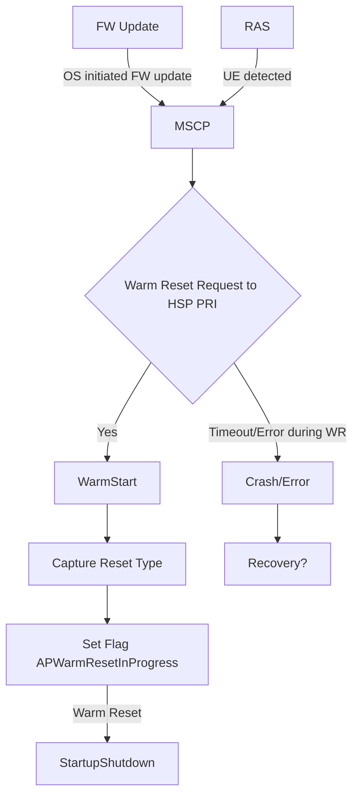
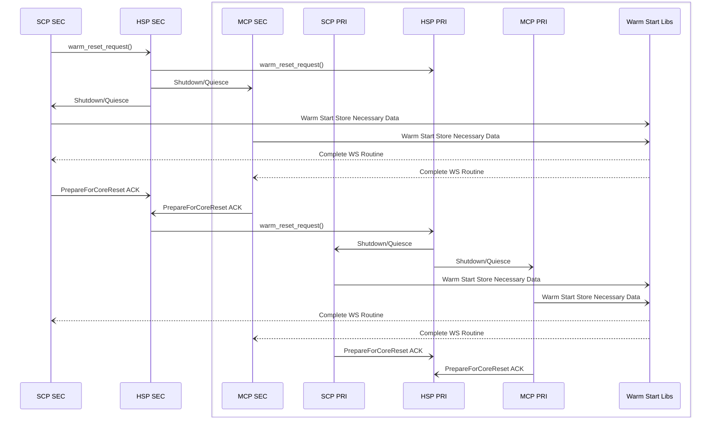

# Dual Die Warm Reset Design Document

## Table of Contents

[[_TOC_]]

## Introduction

### Description

This document is intended to describe the design details for the Dual Die Warm Reset and is intended to be a continuation of the single die Warm reset design document. 

A warm start is designed to be non-disruptive to the AP cores or the operating system running on AP cores. Two high level use cases for the multi die warm reset request from MSCP are:
    
    1. FW Update
        - Occurs when a seamless FW update is requested
        - Follows a coordinated sequence where the HSP is expected to initite a quiesce sequence including safely resetting HSP as well 
        - Control cores are reset in 3 groups - HMSCP Reset Group, CDED Reset Group and SDM Reset Group 
    2. RAS warm recovery 
        - Initiated when a crash dump occurs
        - Crash dump is communicated across the cores within MSCP through MHU

### Revision History

| Revised by    | Date      | Changes           |
| ------------- | --------- | ------------------|
| Priyanka Iyer |           | Initial design    |

### Terms

| Term   | Description                     |
| ------ | ------------------------------- |
| WS     | Warm Start                      |
| SCP    |  System Control Processor       |
| MCP    | Management Control Processor    |
| AP     | Application Core                |
| CLI    | Command Line Interface          |
| SSI	 | Startup/shutdown interface      |
| DFWK   | Driver framework                |
| HSP PRI| HSP Primary                     |
| HSP SEC| HSP Secondary                   |

### Reference Documents

| Document                                              | Link                                |
| ----------------------------------------------------- | ----------------------------------- |
| Kingsgate SoC Bootreset HardwareProgramming Guide WIP | [Link](https://microsoft.sharepoint.com/:w:/r/teams/EchoFalls/_layouts/15/Doc.aspx?sourcedoc=%7BD4EF9AFA-FC37-4A5D-9393-997746F3ED25%7D&file=Kingsgate%20SoC%20Boot%20Reset%20Hardware%20Programming%20Guide%20WIP.docx&action=default&mobileredirect=true)    |
 |SSI Design Doc| [Link](https://azurecsi.visualstudio.com/Woodinville/_git/Kingsgate.MSCP?path=%2Fdocs%2Fdevelopment%2FFirmwareDesign%2FSystem%20Startup%20Shutdown.md&version=GBmain&_a=contents) |
 |Single Die Warm Reset Design Doc| [Link](https://azurecsi.visualstudio.com/Woodinville/_git/Kingsgate.MSCP?path=%2Fdocs%2Fdevelopment%2FFirmwareDesign%2FWarmReset.md&_a=preview) | 

## Requirements
 
- This will be an extention of the single die APIs for saving necessary warm reset data with an addition of using D2D mailbox APIs for coordination between HSP PRI and HSP SEC

## Dependencies

- Time
- Initialization module
- Crash Dump
- DFWK 
- Power Domain & Startup Shutdown Service 
- Warm Start Module
- D2D Mailbox
- MHU

## Design

Warm Reset Sequence in the Seamless FW update scenario:

## API

| WR DFWK API       | S/A | Description                                           |
| -----------   | ------|----------------------------------------------- |
| wr_get_reset_type()  | Sync  | Get the reset reason like Cold, Warm or Subsys |
| ws_data_get() | Sync| Function used to get the location & size of the warm start data entry |
| ws_data_put() | Sync | Function used to set/wr warm start data he reserved memory section |