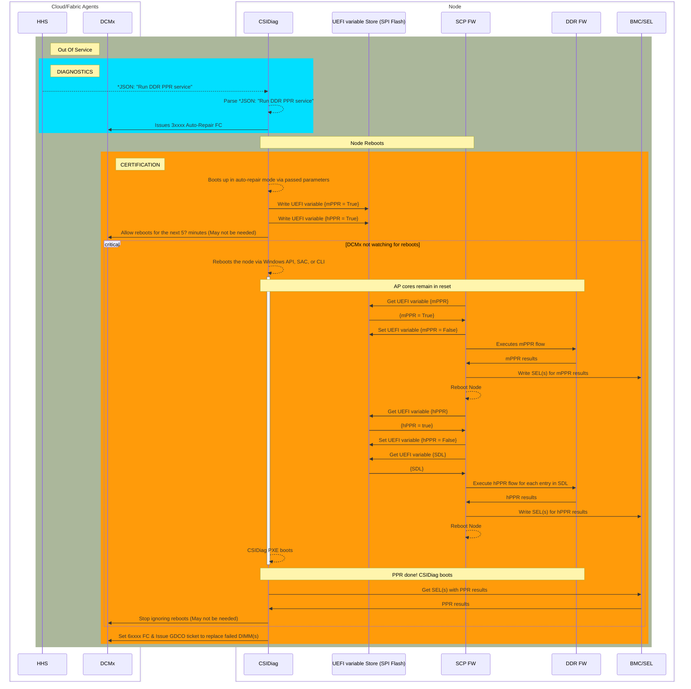

# E2E DDR PPR Flow

## FLOWCHART

```mermaid
flowchart TB
    subgraph PRODUCTION
        A[HHS creates *JSON to be passed to CSIDiag, node is sent to OUT OF SERVICE state]
    end
    subgraph DIAGNOSTICS
        B[CSIDiag boots and reads *JSON that says do PPR auto-repair]
        C[CSIDiag issues 3xxxx Auto-Repair FC and sends the node to CERTIFICATION state]
    end
    subgraph CERTIFICATION
        D[CSIDiag boots up in auto-repair mode via passed parameters]
        E[CSIDiag writes UEFI variable to do hPPR and/or mPPR]
        F(CSIDiag reboots the node)
        SCP_G[SCP FW finds UEFI PPR variable]
        SCP_H{mPPR flag set?}
        SCP_I[SCP FW clears the mPPR flag in UEFI variable]
        SCP_J[SCP FW executes mPPR flow]
        SCP_L[SCP FW reports status with BMC SEL]
        SCP_X{mPPR successful?}
        SCP_X_SDL[SCP FW Clears SDL]
        SCP_XX[Clear hPPR flag if set]
        SCP_XXX(SCP FW reboots the node)
        SCP_XXXX(SCP FW reboots the node)
        SCP_M{hPPR flag set?}
        SCP_N[SCP FW clears the hPPR flag in UEFI variable]
        SCP_O[SCP FW executes hPPR flow for each entry in SDL]
        SCP_PP[SCP FW reports status with BMC SEL]
        SCP_PP_SDL[SCP FW Clears SDL]
        SCP_Q(SCP FW reboots the node)
        SCP_R[PPR done!]
        SCP_RR(Reboot node or continue booting -TBD)
        S[**Establish state after PXE boot**\nCSIDiag reads BMC SEL for PPR results]
        T{Successful?}
        U[CSIDiag runs remainder of certification diagnostics or return control to DCMx]
        V[CSIDiag issues 6xxxx FC/GDCO ticket for replacing the bad DIMM]
    end
    %% STYLES
    style SCP_G fill:blue,stroke:#f66,stroke-width:2px,color:#fff,stroke-dasharray: 5 5
    style SCP_H fill:blue,stroke:#f66,stroke-width:2px,color:#fff,stroke-dasharray: 5 5
    style SCP_I fill:blue,stroke:#f66,stroke-width:2px,color:#fff,stroke-dasharray: 5 5
    style SCP_J fill:blue,stroke:#f66,stroke-width:2px,color:#fff,stroke-dasharray: 5 5
    style SCP_L fill:blue,stroke:#f66,stroke-width:2px,color:#fff,stroke-dasharray: 5 5
    style SCP_X fill:blue,stroke:#f66,stroke-width:2px,color:#fff,stroke-dasharray: 5 5
    style SCP_X_SDL fill:blue,stroke:#f66,stroke-width:2px,color:#fff,stroke-dasharray: 5 5
    style SCP_XX fill:blue,stroke:#f66,stroke-width:2px,color:#fff,stroke-dasharray: 5 5
    style SCP_XXX fill:blue,stroke:#f66,stroke-width:2px,color:#fff,stroke-dasharray: 5 5
    style SCP_XXXX fill:blue,stroke:#f66,stroke-width:2px,color:#fff,stroke-dasharray: 5 5
    style SCP_M fill:blue,stroke:gray,stroke-width:3px,color:#fff,stroke-dasharray: 7 5
    style SCP_N fill:blue,stroke:#gray,stroke-width:3px,color:#fff,stroke-dasharray: 7 5
    style SCP_O fill:blue,stroke:#gray,stroke-width:3px,color:#fff,stroke-dasharray: 7 5
    style SCP_PP fill:blue,stroke:#gray,stroke-width:3px,color:#fff,stroke-dasharray: 7 5
    style SCP_PP_SDL fill:blue,stroke:#gray,stroke-width:3px,color:#fff,stroke-dasharray: 7 5
    style SCP_Q fill:blue,stroke:#gray,stroke-width:3px,color:#fff,stroke-dasharray: 7 5
    style SCP_R fill:blue,color:#fff
    style SCP_RR fill:blue,color:#fff
    PRODUCTION -..-> DIAGNOSTICS
    B --> C
    C -..-> D
    D --> E
    E --> F
    F --> SCP_G
    SCP_G --> SCP_H
    SCP_H -- Yes --> SCP_I
    SCP_I --> SCP_J
    SCP_J --> SCP_L
    SCP_L --> SCP_X
    SCP_X -- Yes --> SCP_X_SDL
    SCP_X_SDL --> SCP_XX
    SCP_XX --> SCP_XXXX
    SCP_X -- No --> SCP_XXX
    SCP_XXX --> SCP_M
    SCP_XXXX --> SCP_R
    SCP_H -- No --> SCP_M
    SCP_M -- Yes --> SCP_N
    SCP_N --> SCP_O
    SCP_O --> SCP_PP
    SCP_PP --> SCP_PP_SDL
    SCP_PP_SDL --> SCP_Q
    SCP_Q --> SCP_R
    SCP_M -- No --> SCP_R
    SCP_R -- YES --> SCP_RR
    SCP_RR --> S
    S --> T
    T -- Yes --> U
    T -- No --> V
```

## SEQUENCE DIAGRAM

```mermaid
sequenceDiagram
    box Cloud/Fabric Agents
        participant H as HHS
        participant D as DCMx
    end
    box Node 
        participant C as CSIDiag
        participant U as UEFI variable Store (SPI Flash)
        participant S as SCP FW
        participant SL as DDR FW
        participant B as BMC/SEL
    end
    rect rgb(171, 183, 155)
        note right of H: Out Of Service
        rect rgb(1, 223, 255)
        note right of H: DIAGNOSTICS
            H-->>C: *JSON: "Run DDR PPR service"
            C-->>C: Parse *JSON: "Run DDR PPR service"
            C->>D: Issues 3xxxx Auto-Repair FC
        end
        note over C, S: Node Reboots
        rect rgb(255,155,10)
            note right of D: CERTIFICATION
                C-->>C: Boots up in auto-repair mode via passed parameters
                C->>U: Write UEFI variable {mPPR = True}
                C->>U: Write UEFI variable {hPPR = True}
                C->>D: Allow reboots for the next 5? minutes (May not be needed)
                critical DCMx not watching for reboots
                    C-->>+C: Reboots the node via Windows API, SAC, or CLI
                    note over C,SL: AP cores remain in reset

                    # mPPR
                    S->>U: Get UEFI variable {mPPR}
                    U->>S: {mPPR = True}
                    S->>U: Set UEFI variable {mPPR = False}
                    S->>SL: Executes mPPR flow
                    SL->>S: mPPR results
                    S->>B: Write SEL(s) for mPPR results
                    S-->>S: Reboot Node

                    # hPPR
                    S->>U: Get UEFI variable {hPPR}
                    U->>S: {hPPR = true}
                    S->>U: Set UEFI variable {hPPR = False}
                    S->>U: Get UEFI variable {SDL}
                    U->>S: {SDL}
                    S->>SL: Execute hPPR flow for each entry in SDL
                    SL->>S: hPPR results
                    S->>B: Write SEL(s) for hPPR results
                    S-->>S: Reboot Node
                    C-->>-C: CSIDiag PXE boots

                    note over C,SL: PPR done! CSIDiag boots
                    C->>B: Get SEL(s) with PPR results
                    B->>C: PPR results
                    C->>D: Stop ignoring reboots (May not be needed)
                end
            C->>D: Set 6xxxx FC & Issue GDCO ticket to replace failed DIMM(s)
        end
    end
```
