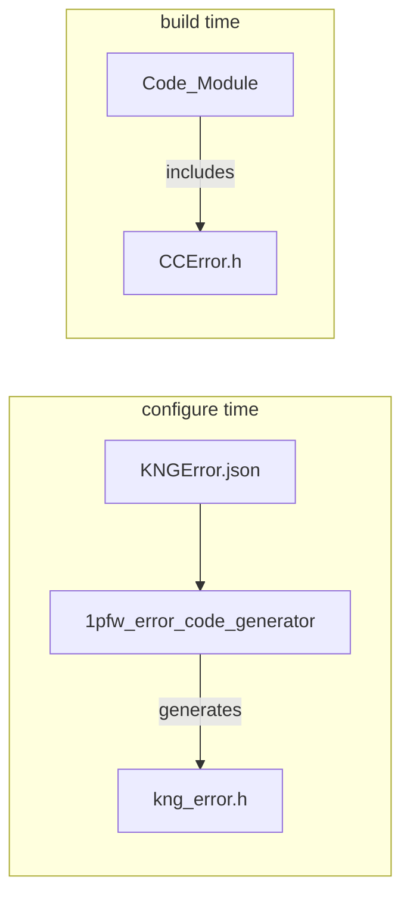

# Error Code Design Document

## Table of Contents

[[_TOC_]]

## Introduction

### Description
This document is intended to describe the design for Kingsgate controller core error codes. Error codes are intended for Fatal/Crash Dump error codes.  
Error codes contain information such as originating subsystem/module and are associated to particular errors, thus allowing a consumer to gain additional insights into an error.

### Terms
| Term                  | Description                                   |
| ----------------------| ----------------------------------------------|
| CLI                   | Command Line Interface                        |
| MCP                   | Management Control Processor                  |
| SCP                   | System Control Processor                      |
| Facility              | Module/Service/API/Subsystem                  |
  
### References
| Reference                                 | Link                                                                                 |
| ----------------------------------------- | ------------------------------------------------------------------------------------ |
| 1PFW Error Code Generator                 | [Link](https://azurecsi.visualstudio.com/DuvallFw/_git/1pfw.error_code_generator)    |

## Requirements

- Error codes shall conform to 1PFW error code standard (32-bit number compatible with HRESULT-style error codes)
- Shall provide a mechanism of specifying severity (Success/Fail)
- Shall provide a mechanism of specifying a facility (eg: module, core, subsystem, etc.) describing where the error originated
- Shall provide a mechanism of specifying a code unique to an error

## Dependencies
* 1pfw.error_code_generator - [Link](https://azurecsi.visualstudio.com/DuvallFw/_git/1pfw.error_code_generator)

## Design

### Automated Header Generation

1pfw.error_code_generator will be used to parse a repo-hosted JSON file defining error codes.
At configure time, this file will be parsed and a header file will be created that the code can include.



### Error Code Structure
Recommended naming convention would be: KNG_(FACILITY_NAME)_(ERROR_NAME)


KNG_STATUS is 32 bit value layed out as below:  
Compatible with Windows's HRESULT.

```
 3 3 2 2 2 2 2 2 2 2 2 2 1 1 1 1 1 1 1 1 1 1
 1 0 9 8 7 6 5 4 3 2 1 0 9 8 7 6 5 4 3 2 1 0 9 8 7 6 5 4 3 2 1 0
+-+-+-+-+-+---------------------+-------------------------------+
|S|R|C|N|r|    Facility         |               Code            |
+-+-+-+-+-+---------------------+-------------------------------+
```

where

    S - Severity - indicates success/fail

        0 - Success
        1 - Fail

    R - reserved portion of the facility code, corresponds to NT's
        second severity bit. (UNUSED)

    C - reserved portion of the facility code, corresponds to NT's
        C field. (UNUSED)

    N - reserved portion of the facility code. Used to indicate a
        mapped NT status value. (UNUSED)

    r - reserved portion of the facility code. Reserved for internal
        use. Used to indicate HRESULT values that are not status
        values, but are instead message ids for display strings.
        (UNUSED)

    Facility - is the facility code

        Facility Rules:
        
        1. Any components must use facility code higher than 50L. 0-49L are reserved for Windows ones.

        2. Service Facilities must be in the range 51 - 99. Core Facilities must be in the range 100 - 150

    Code - is the facility's status code

        Status Code Rules:

        1. For a given facility, Error codes must be a decimal value with no specifier at the end.
        For example, 0x2012 or 2012U or 2019L etc are NOT allowed and no expressions either.
        Error code is a 16 bit number


### JSON Error Code Format

Users should adhere to the following format for the JSON file in order to use this tool.

Users can use "Error_Code_Comments" section to describe about Facility and Error code restrictions specific to the project/system

Users should use "Error_Codes" section to define the the actual facilities and errors


```json
{
  "Error_Code_Comments": 
  {
    "Tool_Comments": "For details about the tool and how error codes are generated, please visit https://azurecsi.visualstudio.com/DuvallFw/_git/1pfw.error_code_generator ",
    "Facility_Value_Comments": "Module Facilities must be in the range 51 - 99. Core Facilities must be in the range 100 - 150",
    "Error_Value_Comments": "For a given facility, Error codes must be a decimal value with no specifier at the end. For example, 0x2012 or 2012U or 2019L etc are NOT allowed and no expressions either. Error code is a 16 bit number"
  },

 "Error_Codes": [
    {
      "Facility_Name": "FACILITY_GENERIC",
      "Facility_Value": 0,
      "Facility_Description": "This is for Generic error codes",
      "Errors": [
        {
          "Name": "KNG_E_NOTIMPL",
          "Value": 1,
          "Description": "Not implemented"
        },
        {
          "Name": "KNG_E_OUTOFMEMORY",
          "Value": 2,
          "Description": "Ran out of memory"
        },
        {
          "Name": "KNG_E_INVALIDARG",
          "Value": 3,
          "Description": "One or more arguments are invalid"
        },
        {
          "Name": "KNG_E_NOINTERFACE",
          "Value": 4,
          "Description": "No such interface supported"
        },
        {
          "Name": "KNG_E_POINTER",
          "Value": 5,
          "Description": "Invalid pointer"
        },
        {
          "Name": "KNG_E_HANDLE",
          "Value": 6,
          "Description": "Invalid handle"
        },
        {
          "Name": "KNG_E_ABORT",
          "Value": 7,
          "Description": "Operation aborted"
        },
        {
          "Name": "KNG_E_FAIL",
          "Value": 8,
          "Description": "Unspecified error"
        },
        {
          "Name": "KNG_E_ACCESSDENIED",
          "Value": 9,
          "Description": "General access denied error"
        },
        {
          "Name": "KNG_E_PENDING",
          "Value": 10,
          "Description": "The data necessary to complete this operation is not yet available."
        },
        {
          "Name": "KNG_E_ALREADY_INITIALIZED",
          "Value": 11,
          "Description": "Already initialized"
        },
        {
          "Name": "KNG_E_NOT_FOUND",
          "Value": 12,
          "Description": "Not Found"
        },
        {
          "Name": "KNG_E_BUSY",
          "Value": 13,
          "Description": "Busy"
        },
        {
          "Name": "KNG_E_TIMEOUT",
          "Value": 14,
          "Description": "Timeout"
        },
        {
          "Name": "KNG_E_NOT_READY",
          "Value": 15,
          "Description": "Device or module is not ready"
        }
      ]
    }
  ]
}
```


This will result in the following header content:

```c
#define KNG_STATUS int32_t

//
// Facility code list
//

/* Service Facilities must be in the range 51 - 99. Core Facilities must be in the range 100 - 150 */

#define FACILITY_GENERIC (0) // This is for Generic error codes

//
// Severity values
//

#define SEVERITY_SUCCESS 0
#define SEVERITY_ERROR   1

//
// Helpful macros
//

#define KNG_STATUS_CODE(sc)     ((sc)&0xFFFF)
#define KNG_STATUS_FACILITY(sc) (((sc) >> 16) & 0x1fff)
#define KNG_STATUS_SEVERITY(sc) (((sc) >> 31) & 0x1)

#define KNG_FAILED(sc)    (((KNG_STATUS)(sc)) < 0)
#define KNG_SUCCEEDED(sc) (((KNG_STATUS)(sc)) >= 0)

#define IS_ERROR(sc) (((unsigned long)(sc)) >> 31 == SEVERITY_ERROR)

#define MAKE_KNG_STATUS(sev, facility, sc) ((KNG_STATUS)(((unsigned long)(sev) << 31) | ((unsigned long)(facility) << 16) | ((unsigned long)(sc))))

#define KNG_SUCCESS ((KNG_STATUS)0L) 

////////////////////////////////////////
//                                    //
//           Error Codes              //
//                                    //
////////////////////////////////////////

/* For a given facility, Error codes must be a decimal value with no specifier at the end. For example, 0x2012 or 2012U or 2019L etc are NOT allowed and no expressions either. Error code is a 16 bit number */

/**
 *  FACILITY_GENERIC Error Codes
 */ 

#define KNG_E_NOTIMPL ((KNG_STATUS)0x80000001) // Not implemented

#define KNG_E_OUTOFMEMORY ((KNG_STATUS)0x80000002) // Ran out of memory

#define KNG_E_INVALIDARG ((KNG_STATUS)0x80000003) // One or more arguments are invalid

#define KNG_E_NOINTERFACE ((KNG_STATUS)0x80000004) // No such interface supported

#define KNG_E_POINTER ((KNG_STATUS)0x80000005) // Invalid pointer

#define KNG_E_HANDLE ((KNG_STATUS)0x80000006) // Invalid handle

#define KNG_E_ABORT ((KNG_STATUS)0x80000007) // Operation aborted

#define KNG_E_FAIL ((KNG_STATUS)0x80000008) // Unspecified error

#define KNG_E_ACCESSDENIED ((KNG_STATUS)0x80000009) // General access denied error

#define KNG_E_PENDING ((KNG_STATUS)0x8000000a) // The data necessary to complete this operation is not yet available.

#define KNG_E_ALREADY_INITIALIZED ((KNG_STATUS)0x8000000b) // Already initialized

#define KNG_E_NOT_FOUND ((KNG_STATUS)0x8000000c) // Not Found

#define KNG_E_BUSY ((KNG_STATUS)0x8000000d) // Busy

#define KNG_E_TIMEOUT ((KNG_STATUS)0x8000000e) // Timeout

#define KNG_E_NOT_READY ((KNG_STATUS)0x8000000f) // Device or module is not ready
```