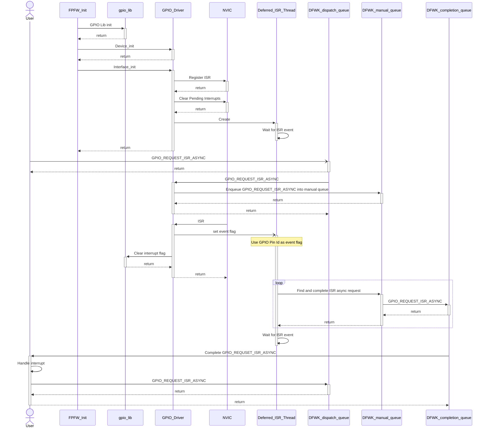
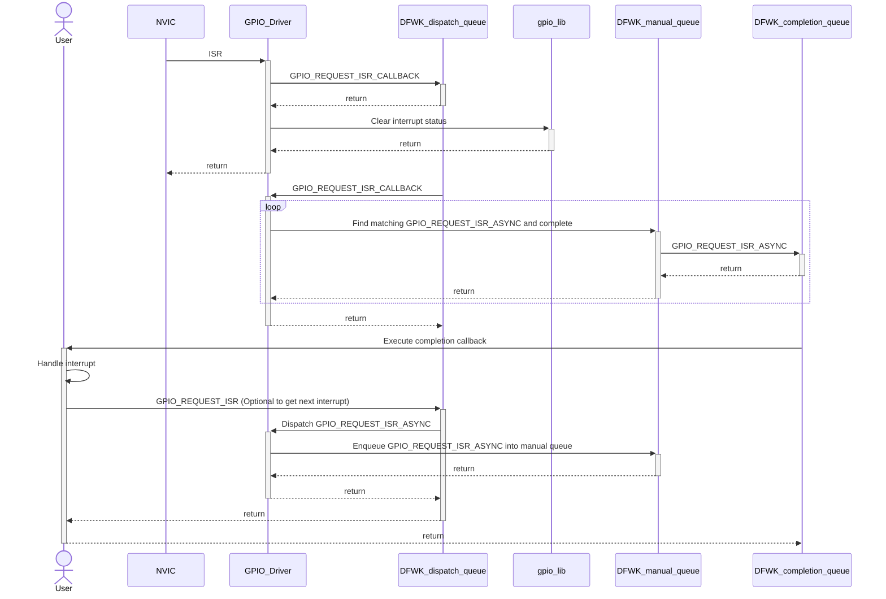
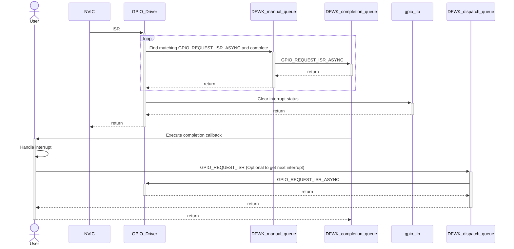

# GPIO Driver Design Document

This document is intended to describe the requirements, public API, and design details of MSCP GPIO driver so that consumers of the component is able to understand and interact with the component.
This design document does not cover the each GPIO and register configuration, which is covered by [SiLib GPIO](https://dev.azure.com/ms-tsd/Kingsgate/_git/silibs?path=/libraries/gpio/doc/gpio.md&_a=preview).
This document does not cover the details of interrupt vector configuration APIs, which is covered by [NVIC](https://azurecsi.visualstudio.com/Woodinville/_git/Kingsgate.CortexM7?path=/src/libs/nvic).

## Table of Contents

[[_TOC_]]

## Introduction

### Description

GPIO Driver mainly provide a way to get GPIO interrupt callback in a deferred way. 
This design document describes the SCP and MCP GPIO pin initialization and MSCP GPIO driver which provide functionality to get callback of configured GPIO interrupt.

### Terms

| Term   | Description                        |
| ------ | ---------------------------------- |
| DFWK   | Driver Framework                   |
| GPIO   | Generic Purpose I/O                |
| NVIC   | Nested Vector Interrupt Controller |

### Reference Documents

| Document                                      | Link                                                                                                                                           |
| --------------------------------------------- | ---------------------------------------------------------------------------------------------------------------------------------------------- |
| Kingsgate Firmware Architecture Specification | [Link](https://microsoft.sharepoint.com/teams/EchoFalls/Shared%20Documents/Kingsgate%20SOC/Firmware/working/KG%20FW%20Architecture.docx?web=1) |
| SiLib GPIO library                            | [Link](https://dev.azure.com/ms-tsd/Kingsgate/_git/silibs?path=/libraries/gpio/doc/gpio.md&_a=preview)                        |
| ThreadX thread and events                     | [Link](https://github.com/eclipse-threadx/rtos-docs/blob/main/rtos-docs/threadx/chapter3.md)                                |

## Requirements

- GPIO driver should be designed as a Driver Framework driver
- GPIO driver should expose APIs to setup GPIO controllers
- GPIO driver should expose APIs to receive interrupts on GPIO pins
- GPIO driver should expose APIs to control GPIO pin output

## Dependencies

- [DFWK](https://azurecsi.visualstudio.com/DuvallFw/_wiki/wikis/1PFw%20Firmware%20Libs/32086/DriversAndDriverFramework)
- [SiLib GPIO lib](https://dev.azure.com/ms-tsd/Kingsgate/_git/silibs?path=%2Flibraries%2Fgpio%2Fdoc%2Fgpio.md&_a=preview)
- [NVIC](https://azurecsi.visualstudio.com/Woodinville/_git/Kingsgate.CortexM7?path=/src/libs/nvic)
- [ThreadX public API](https://expresslogic.visualstudio.com/X-Ware/_git/threadx?path=/common/inc/tx_api.h)

## Design
### GPIO initialization
GPIO initialization after DFWK and before Crash dump and power.

MSCP GPIO driver will be interested in GPIO 4 and 6 controller only. [(Refer SiLib GPIO configuration table)](https://dev.azure.com/ms-tsd/Kingsgate/_git/silibs?path=/libraries/gpio/src/config_gpio.c&version=GBmaster&line=150&lineEnd=150&lineStartColumn=27&lineEndColumn=52&lineStyle=plain&_a=contents)

| Controller ID   | Pin ID | Level | Dir | Mode Sel | Int Enable | Int Sense    |
| --------------- | ------ | ----- | --- | -------- | ---------- | ------------ |
| MSCP_EXP_GPIO_4 | 0      | 0     | IN  | 0        | 0          | RISING EDGE  |
| MSCP_EXP_GPIO_4 | 1      | 0     | IN  | 0        | 0          | RISING EDGE  |
| MSCP_EXP_GPIO_4 | 2      | 1     | IN  | 0        | 0          | RISING EDGE  |
| MSCP_EXP_GPIO_4 | 3      | 1     | IN  | 0        | 0          | RISING EDGE  |
| MSCP_EXP_GPIO_4 | 4      | 1     | OUT | 0        | 0          | RISING EDGE  |
| MSCP_EXP_GPIO_4 | 5      | 0     | IN  | 0        | 1          | LOW LEVEL    |
| MSCP_EXP_GPIO_4 | 6      | 0     | IN  | 0        | 0          | RISING EDGE  |
| MSCP_EXP_GPIO_4 | 7      | 0     | IN  | 0        | 0          | RISING EDGE  |
| MSCP_EXP_GPIO_6 | 0      | 1     | OUT | 0        | 0          | RISING EDGE  |
| MSCP_EXP_GPIO_6 | 1      | 1     | IN  | 0        | 0          | RISING EDGE  |
| MSCP_EXP_GPIO_6 | 2      | 1     | OUT | 0        | 0          | RISING EDGE  |
| MSCP_EXP_GPIO_6 | 3      | 1     | OUT | 0        | 0          | RISING EDGE  |
| MSCP_EXP_GPIO_6 | 4      | 0     | IN  | 0        | 1          | FALLING EDGE |
| MSCP_EXP_GPIO_6 | 5      | 0     | IN  | 0        | 0          | RISING EDGE  |
| MSCP_EXP_GPIO_6 | 6      | 0     | IN  | 0        | 0          | RISING EDGE  |
| MSCP_EXP_GPIO_6 | 7      | 0     | IN  | 0        | 0          | RISING EDGE  |

Once GPIO registers are initialized, Crash dump and other GPIO user module can be initialized.
GPIO driver is initialized after GPIO registers and GPIO interface is initialized after GPIO driver.
GPIO driver instance and GPIO interface instance can be accessed by fpfw_init_get_handle("gpio_drv") and fpfw_init_get_handle("gpio_int").

### GPIO device and interface

```code
typedef struct {
    DFWK_DEVICE_HEADER Header;
    DFWK_QUEUE Queue;                           // User request dispatch queue
    DFWK_QUEUE Isr_req_queue;                   // manual queue for waiting for ISR
    TX_EVENT_FLAGS_GROUP gpio_isr_EventFlags;   // ISR event to deferred thread
} gpio_device_t, *pgpio_device_t;

typedef struct {
    DFWK_INTERFACE_HEADER Header;
    pgpio_device_t Device;
} gpio_interface_t, *pgpio_interface_t;

typedef struct
{
    DFWK_ASYNC_REQUEST_HEADER Header;
    uint32_t gpio_pin_id;   // GPIO pin ID/Mask to get interrupt for GPIO_REQUEST_ISR_ASYNC.
} gpio_request_t, *pgpio_request_t;
```

### GPIO interrupt service routine callback
GPIO driver provides an async request API to register deferred GPIO interrupt callback. GPIO_REQUEST_ISR_ASYNC request with GPIO pin id or mask will register request as a deferred callback and will be completed when configured GPIO has interrupts.

There are several ways to implement deferred callback with following considerations.
- GPIO interrupt can be set at any time from different pins non-deterministically.
- Root (direct) ISR must be simple and do not wait any condition.
- DFWK async request object must be persistent until completion.
- DFWK can schedule to run at any time, early or later.

GPIO driver has a thread waiting for event from ISR to complete GPIO_REQUEST_ISR_ASYNC with stack size of TBD.
GPIO_REQUEST_ISR_ASYNC request will be re-queued into manual queue (Isr_req_queue) and deferred thread is waiting for event from ISR.
ISR will collect interrupt pin mask and set event with pin mask flag.
Deferred thread decode flag into GPIO pin mask and complete GPIO_REQUEST_ISR_ASYNC if request pin mask matched.



### Deferred callback Design Alternate 1:

At the first glance, by using DFWK, ISR can make internal GPIO_REQUEST_ISR_CALLBACK async request to the GPIO driver to iterate all the GPIO_REQUEST_ISR_ASYNC and complete matching requests.
But this approach is hard to implement with fixed request count because GPIO interrupt is non-deterministic event.




### Deferred callback Design Alternate 2:

As an alternate way of deferring interrupt, GPIO driver can iterate all the GPIO_REQUEST_ISR_ASYNC request in the manual queue and put matched requests into the completion queue.
Benefit of this approach is that there is minimum chance of missing GPIO status changes, but ISR dequeue (from manual queue) and enqueue (to completion queue) requests between queues, which may delay the execution of ISR in worst case if ISR can't acquire lock in time.
The other consideration is the cost of iterating all items in the manual queue.




## API

To set and get GPIO, [SiLib GPIO lib](https://dev.azure.com/ms-tsd/Kingsgate/_git/silibs?path=/libraries/gpio/include/gpio_lib.h) will be used.
To set async request completion callback, use DWFK API [DfwkAsyncRequestSetCompletionRoutine](https://azurecsi.visualstudio.com/DuvallFw/_git/1pfw.fwlibs?path=/src/DriverFramework/inc/DfwkCommon.h&version=GBmain&line=85&lineEnd=85&lineStartColumn=6&lineEndColumn=42&lineStyle=plain&_a=contents)

| API                               | Description                                           |
| --------------------------------- | ----------------------------------------------------- |
| gpio_device_init()                | Initialize the GPIO device                            |
| gpio_interface_init()             | Initialize the GPIO interface                         |
| gpio_send_request_async()         | Send async request to the GPIO driver                 |

| Request                | Description                                                     |
| ---------------------- | --------------------------------------------------------------- |
| GPIO_REQUEST_ISR_ASYNC | Request deferred ISR callback through async completion callback |
