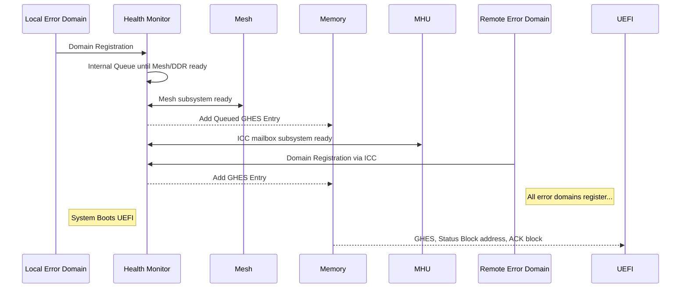
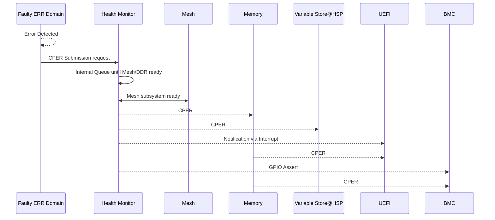
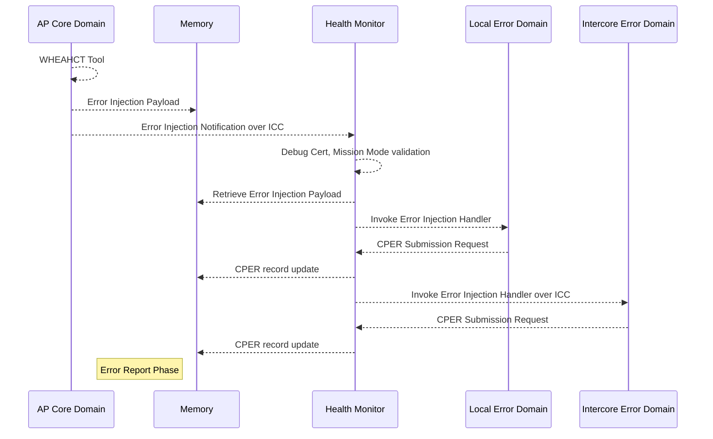
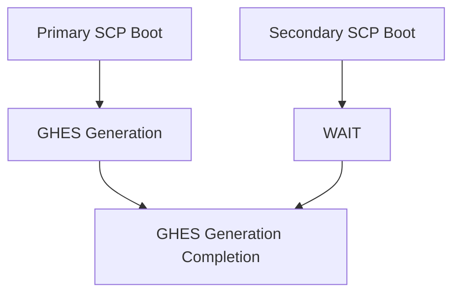
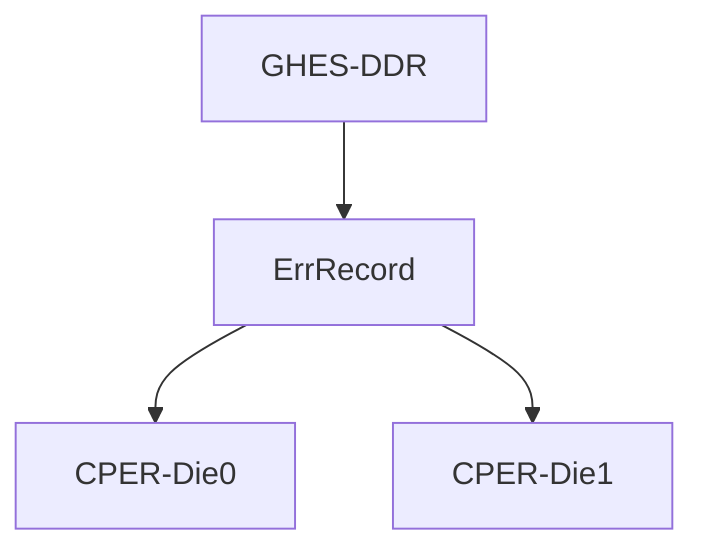

# Health Monitor Module Design Document

## Table of Contents

[[_TOC_]]

## Introduction

### Description

The Health Monitor module is designed to discover and support RAS related ACPI reporting to the host. It also contributes to the telemetry elements of the system. Each module within the system has its own domain knowledge related to errors, and the Health Monitor module enables the reporting and error injection methods for those errors. Additionally, this module acts as a service for health-related monitoring for items that do not have a specific module domain. 


### Revision History

| Revised by   | Date      | Changes           |
| ------------ | --------- | ------------------|
| Junghwan Moon| 1/16/2025 | Initial details   |
|   |  |  |

### Terms

| Terms                 | Description                                                                   |
| ------                | -------------------------------                                               |
| RAS                   | Reliability, Availability, and Serviceability                                 |
| ACPI                  | Advanced Configuration and Power Interface                                    |
| CPER                  | Comon Platform Error Report                                                   |
| EINJ                  | ACPI defined Error Injection                                                  |
| SCP	                |System Control Processor                                                       |
| MCP	                |Management Control Processor                                                   |
| MHU	                |Message Handling Unit                                                          |
| CLI                   | Command Line Interface                                                        |
| HEST                  | Hardware Error Source Table                                                   |
| GHES                  | Generic Hardware Error Source                                                 |
| FRU                   | Field Replaceable Unit                                                        |

### Reference Documents

| Document                                  | Link                                |
| ----------------------------------------- | ----------------------------------- |
| KingsGate Firmware Architecture             |[Link](https://microsoft.sharepoint.com/teams/EchoFalls/Shared%20Documents/Kingsgate%20SOC/Firmware/working/KG%20FW%20Architecture.docx?web=1)|
| ACPI Specification                        | [Link](https://uefi.org/sites/default/files/resources/ACPI_6_3_final_Jan30.pdf) |

## Requirements

- The system shall provide a method to support injecting errors into local and intercore error domains 
- The system shall provide a method for generating CPERs from local and intercore error domains 
- The system shall support configuring and monitoring the AP watchdog functionality 
- The system shall support a method for reporting errors inband 
- The system shall support a method for reporting errors out of band
- The system shall support a method for the AP core to discover error domains 
- All uncorrected error records shall be recorded in the variable store 


## Dependencies
- ATU (Address Translation Unit)
- MHU/Inter-Processor Communication 
- HSP mailbox 
- D2D mailbox 
- Gtimer/UTC 
- Variable Service
- GPIO  
- CLI 
- Crash dump

## Design
### Health Monitor Module Introduction
The Health Monitoring module is designed to monitor, report, and handle errors within the system. Given the diverse sources of errors, this module cannot possess comprehensive knowledge of all potential errors. To address this, general purpose APIs will be available, allowing other domains to integrate with the error reporting and error injection methods presented to the system. A main use case for this module is to interface with the RAS methodology present in higher-level OS systems, such as data center blades. These higher-level systems use ACPI to describe error domains, provide error reports, and inject errors. Traditionally, this functionality is handled within UEFI. However, there is a growing trend to move some of this functionality to other cores. This shift allows the cores most knowledgeable about the error domains to handle the errors directly, reducing the need for complex coordination between cores.

### HEST and GHES role and responsibility
HEST and the GHES are critical components in the ACPI Platform Error Interfaces.

- HEST: The HEST table provides a way for the platform firmware to describe a system’s hardware error sources to the Operating System. It acts as a contract on error sources and the methodology for reporting errors. The HEST table includes entries for each error domain, which are enumerated by the OS.

- GHES: The GHES is a specific entry within the HEST table that describes a generic hardware error source. It includes information about the error status block, notification mechanisms, and other relevant details. The GHES is used to handle generic hardware errors and is provided by the Primary SCP.

The following diagram describes the HEST and GHES associated error handling for each error domains. UEFI will continue to be the entity to present the HEST table to the OS. This design assumes that the Inband and Out Of Band path for supporting RAS will use this standard for retrieving the RAS information. To support multi-die system, one GHES will contains multiple error record. 


```txt
+       etc/acpi/tables                                 etc/hardware_errors
+    ====================                      ==========================================
++ +--------------------------+            +------------------------+
| | HEST                     |            |    address              |            +--------------+
| +--------------------------+            |    registers            |            | Error Status |
| | GHES1                    |            | +-----------------------+            | Data Block 1 |
| +--------------------------+ +--------->| |error_block_address1,2 |--------+-->| +------------+
| | .................        | |          | +-----------------------+        |   | |  CPER      |
| | error_status_address-----+-+ +------->| |error_block_address3,4 |------+ |   | |  CPER      |
| | .................        |   |        | +-----------------------+      | |   | |  ....      |
| | read_ack_register--------+-+ |        | |    ..............     |      | |   | |  CPER      |
| | read_ack_preserve        | | |        +-------------------------+      | |   | +------------+
| | read_ack_write           | | | +----->| |error_block_addressN   |      | |   | Error Status |
| +--------------------------+ | | |      | +-----------------------+      | |   | Data Block 2 |
| | GHES2                    | +-+-+----->| |read_ack_register1     |      | +-->| +------------+
| +--------------------------+   | |      | +-----------------------+      |     | |  CPER      |
| | .................        |   | | +--->| |read_ack_register2     |      |     | |  CPER      |
| | error_status_address-----+---+ | |    | +-----------------------+      |     | |  ....      |
| | .................        |     | |    | |  ...............      |      |     | |  CPER      |
| | read_ack_register--------+-----+-+    | +-----------------------+      |     | +------------+
| | read_ack_preserve        |     |   +->| |read_ack_registerN     |      |     | 
| | read_ack_write           |     |   |  | +-----------------------+      |     | +------------+
| +--------------------------|     |   |                                   |     | Error Status |
| | ...............          |     |   |                                   |     | Data Block 3 |
| +--------------------------+     |   |                                   +---->| +------------+
| | GHESN                    |     |   |                                   |     | |  CPER      |
| +--------------------------+     |   |                                   |     | |  CPER      |
| | .................        |     |   |                                   |     | |  ....      |
| | error_status_address-----+-----+   |                                   |     | |  CPER      |
| | .................        |         |                                   |     +-+------------+
| | read_ack_register--------+---------+                                   |     | Error Status |
| | read_ack_preserve        |                                             |     | Data Block 4 |
| | read_ack_write           |                                             +---->| +------------+
| +--------------------------+                                                   | |  CPER      |
| | ...............          |                                                   | |  CPER      |
| +--------------------------+                                                   | |  ....      |
| | GHESN                    |                                                   | |  CPER      |
| +--------------------------+                                                   +-+------------+
| | .................        |                                                   | Error Status |
| | error_status_address-----+                                                   | Data Block n |
| | .................        |                                                   | +------------+
| | read_ack_register--------+                                                   | |  CPER      |
| | read_ack_preserve        |                                                   | |  CPER      |
| | read_ack_write           |                                                   | |  ....      |
| +--------------------------+                                                   | |  CPER      |
| | ...............          |                                                   +-+------------+
```

### Error Domain Registration
During system startup, UEFI initializes and constructs the HEST based on the available error domains. The HEST acts as a contract on error sources and the methodology for reporting errors. SCP provides GHES entries and error trigger actions for each of the error domains they own. These entries are crucial for identifying and managing different error sources. At the start of the AP cores, UEFI appends these artifacts to the HEST provided to the OS. This ensures that the error sources are accurately represented and managed within the table. The following describes an example of how the different error domains will result in generating the GHES list.



### Error Report
Each of the error domains are responsible for monitoring and handling of their perspective domain errors.  Upon detecting an error, those domain will log the error through the Health Monitor which will manage the notification of the errors to AP Core and any other service that monitors errors.  This includes Out Of Band paths to the BMC and HSP variable store for further investigation. The following is a an example error detection / flow for the sample error domains.



### Error Injections

Error injection is a deliberate process used to introduce faults or errors into a system to observe how it behaves under these conditions. This technique is employed to understand the system's resilience, identify potential vulnerabilities, and ensure robust error handling mechanisms.

The ACPI specification defines error types that may not align with the system's error domains. For example, a DDR error domain relates to memory, but it doesn't necessarily connect to the MESH error domain, which accesses the memory. Injecting a "memory" type error requires additional information, provided through the OEM Defined structure in the Vendor Error Type Extension Structure of ACPI. This structure includes:

- Error Severity: Correctable, uncorrectable fatal, or uncorrectable non-fatal.
- Domain ID: Specific error domain as identified in the GHES "Source Id" field.
- Context ID: Specific context related to the error domain as defined in the "Related Source Id" field.
- Data: Specific to the error domain, such as an address or error type, defined outside the ACPI specification.

When an error domain registers with the Health Monitor module, it provides a callback for injecting errors with these parameters. When a Trigger Error action occurs, the callback is invoked with the associated parameters, and the Health Monitor library caches the status for later use if requested by an external entity. This implies all error domains are vendor-specific. The method for triggering an error is communicated through the Trigger Action Table in the ACPI specification. For this design, the table defines a single method for triggering the error and includes the information provided to the callback. The following describes an example of error get injected via Health Monitor module. 



### Multi-Die Consideration

When using the Health Monitor in a multi-die system, several considerations must be taken into account to ensure accurate error reporting and management.

- The construction of the GHES is a critical step. Only the Primary SCP will be responsible for constructing the GHES. The Secondary SCP will wait until the primary die completes the GHES construction. This ensures that there is a single, coherent GHES structure that accurately represents the error sources across the system.



- Support multi die error report.
    
    - One GHES structure, One error record but contains multiple CPER record. Most memory saving option. 
<table>
<tr>
<td> ONE GHES, One Error Record, Multiple CPER </td> 
</tr>
<tr>

<td>


</td>
</tr>
<tr>
<td> 

```c
typedef struct _acpi_ghes_error_entry_t{
    ....
    // Extend Generic Error Data Entries
    acpi_cper_section_t section[1];
}acpi_ghes_error_entry_t;
```
</td> 
</tr>
</table> 

- Expansion of the CPER section is required to accommodate DIE information. This means that we cannot use any standard CPER section type, as they do not have a field to indicate die location. If this is not desired way, HM will prefix die info on FRU string. 

```c
typedef union _acpi_cper_section_t{
    acpi_err_sec_generic_processor_t sec_gen_proc;
    acpi_err_sec_arm_processor_t sec_arm_proc;
    acpi_err_sec_memory_t sec_mem;
    acpi_err_sec_mem_vendor_t sec_ddr_mem_vendor;
    acpi_err_sec_pcie_t sec_pcie;
    acpi_err_sec_pcie_vendor_t sec_pcie_vendor;
    acpi_err_sec_pcie_bus_t sec_pcie_bus;
    acpi_err_sec_firmware_t sec_fw;
    acpi_err_sec_generic_t sec_mesh;
    acpi_err_sec_ap_t sec_ap;
}acpi_cper_section_t;
```

- The error injection path must be carefully designed. The error injection payload should contain meta-information that specifies the die information. This meta-information is crucial for accurately targeting the error injection to the correct die. If the meta-information is not present, the AP core should invoke the corresponding SCP to ensure that the error injection is directed to the appropriate die. [TBD]()

Additionally, synchronization between the dies is essential to manage errors accurately. Each die's errors must be recorded without duplication, and sufficient memory must be allocated to handle errors from each die. The error injection path should be clearly defined to accurately inject errors for each die, using tools like WHEA (wheahct.exe) to format the error injection data structure properly. 


## Health Monitor Public APIs
###  Error Domain Registration - Local Error Domain 
Health Monitor module exposes a set of APIs intented to allow for a scalable system with multiple platform specific error domains. The APIs are design to abstract out most of the complexities of the ACPI spec from the error domains. To use the APIs, the error domains have to provide the following information:

- Domain ID: A unique identifier for the error domain.
- Error Injection Context: Any context value that error domain provided. context value is delivered when an error injection is invoked.
- Injection Handler: A callback routine that is executed when an error is injected for the error domain.

| API           | Description                                               |
| --            | --                                                        |
|[hm_register_error_domain](#)| API for registering an error domain         |

```C
/**
 *
 *  @param error_domain_idx
 *      Source ID of the error domain. This id is based on a global namespace value available across platforms and
 *      can be used as a handle for services and error injection. acpi_error_domain_t enum will hold all available source ID.
 * 
 *  @param error_domain_guid
 *      Optional Unique ID for the error domain field replaceable unit of the platform.  This is a global identifier that can also be used 
 *      as a handle for services. This information is provided as part of the HEST table.  Use NULL if not used
 * 
 *  @param error_domain_name
 *      Optional string used to describe the error domain field replacement unit. String will be truncated to 20 bytes. 
 *      This string will be displayed as part of the error parsing tool on the host.  Use NULL if a string is not provided.
 * 
 *  @param err_inject_cb
 *      Callback routine invoked when an error is injected into the system for specified error domain.
 * 
 *  @param err_inject_ctx
 *      Optional context information used by the error domain when the error injection callback is called.
 * 
 *  @return
 *      None
 */
void hm_register_error_domain(uint16_t error_domain_idx,
                              const guid_t* error_domain_guid,
                              const char* error_domain_name,
                              hm_error_injection_cb_t err_inject_cb,
                              void* err_inject_ctx);
```
###  Error Domain Registration - Intercore Error Domain  
The SCP is considered to be the primary health monitoring services so clients running on cores other than the SCP are required to communicate through the ICC methods for registration. As of now, below command will be used for registration.
- ICC_HM_ERROR_REGISTRATION_SDM
- ICC_HM_ERROR_REGISTRATION_CDED
- ICC_HM_ERROR_REGISTRATION_MSCP
- HSP_MAILBOX_CMD_HM_ERROR_REGISTRATION_HSP
- HSP_MAILBOX_CMD_HM_ERROR_REGISTRATION_KMP


This command allows the all intercore to register an error domain with the SCP.  This command will internally invoke [hm_register_error_domain()]() function defined above.  The information structure for the command payload is the following;
```
typedef struct {
    uint16_t error_domain_idx;
    uint16_t valid_fru_id : 1;
    uint16_t valid_fru_text : 1;
    uint16_t valid_reserve : 14;
    void* err_inject_ctx;
    guid_t fru_id;
    char fru_text[ACPI_FRU_TEXT_LENGTH];
} hm_error_domain_register_payload_t; 
```


Once the above information is registered, the error domains can submit error records.  
###  Error Report - Local Error Domain  
In the event of an error occurring within a specific error domain, the health monitor will provide the following API to send a CPER. This API is designed to facilitate the recording of errors and, if necessary, trigger appropriate actions for fatal errors. Internally, the system may be queuing based on the current initialization state of MESH. This means that depending on the initialization status, the error records might be temporarily stored in a queue before being processed. Additionally, if the reported error record is deemed UNCORRECTABLE, the system will take further steps to ensure that this critical condition is communicated effectively. Specifically, the system will notify the HSP and higher-level systems of the uncorrectable condition through GPIO and variable store mechanisms. This notification process is crucial for maintaining the overall stability and reliability of the system, as it allows for timely intervention and corrective measures.


| API           | Description                                                   |
| --            | --                                                           |
|[hm_submit_error_record](#)| API for submitting error record               |

```C
/**
 *
 *  @param error_domain_idx
 *      Source ID of the error domain. This id is based on a global namespace value available across platforms and
 *      can be used as a handle for services and error injection. acpi_error_domain_t enum will hold all available source ID.
 * 
 *  @param err_severity
 *      Severity of the error record.  Used to trigger actions if fatal
 * 
 *  @param error_record
 *      Error record section based on the UEFI specification, Appendix N2.2 
 *      https://uefi.org/sites/default/files/resources/UEFI_Spec_2_8_C_Jan_2021.pdf
 *      The sections are also defined as part of this library. 
 *      internally hm_error_domain_error_record_t will defined (tbd)
 * 
 *  @param size
 *      Size of the error record
 * 
 *  @return
 *      None
 */

void hm_submit_error_record(uint16_t error_domain_idx,, 
                    hm_severity_t err_severity, 
                    void* error_record, 
                    size_t size);
```
###  Error Report - Intercore Error Domain  
The SCP serves as the primary health monitoring service. Therefore, clients running on cores other than the SCP are required to communicate through ICC methods for error record submission. Currently, the following commands are used to send error records. These records are essentially CPER records that are sent to the AP core and encapsulated into ETW events to be sent to Kusto.

- ICC_HM_ERROR_SUMMIT_SDM
- ICC_HM_ERROR_SUMMIT_CDED
- ICC_HM_ERROR_SUMMIT_MSCP
- HSP_MAILBOX_CMD_HM_ERROR_SUMMIT_HSP
- HSP_MAILBOX_CMD_HM_ERROR_SUMMIT_KMP

These commands enable all inter-core clients to submit error records to the SCP. Internally, these commands invoke the [hm_submit_error_record()]() function defined above. The structure for the command payload is as follows:
```
typedef struct {
    uint16_t error_domain_idx;
    hm_severity_t err_severity;
    uint32_t record_flags;
    acpi_cper_section_t section;
    uint32_t size;
} hm_error_record_payload_t;
```
### Error Injection - Local Error Domain
When an error is injected via the CLI or from the AP core, Health Monitor first performs a policy check to determine if error injection is allowed. If the policy permits error injection, the system proceeds to utilize the following function, which was used during the registration of the error domain, to handle the contents of the error injection:
```
void hm_register_error_domain(uint16_t error_domain_idx,
                              const guid_t* error_domain_guid,
                              const char* error_domain_name,
                              hm_error_injection_cb_t err_inject_cb,
                              void* err_inject_ctx);
```
Once the error domain is determined, the err_inject_ctx which was provided by the error domain is invoked through the err_inject_cb function along with error injection payload.  The information structure for the error injection payload is the following; 


<table>
<tr>
<td> CedarCrest </td> <td> EchoFalls Proposed </td>
</tr>
<tr>
<td> 

```c
typedef struct _ras_einj_info_t
{
    uint32_t error_type             :31;
    uint32_t vendor_defined         :1;
    uint32_t vendor_defined_struct;
    uint32_t param_flags_processor  :1;
    uint32_t param_flags_mem        :1;
    uint32_t param_flags_pcie       :1;
    uint32_t param_flags_reserved1  :29;
    uint32_t processor_param;
    msft_einj_params_t einj_param;
    pcie_sbdf_t pcie_sbdf;
}ras_einj_info_t;

typedef union _msft_einj_params_t
{
    vendor_einj_header_t vendor_header;
    std_mem_t std_mem;
    vendor_pcie_einj_t pcie;
    vendor_mesh_einj_t mesh;
    vendor_gic_einj_t gic;
    vendor_ap_einj_t ap;
    vendor_scp_proc_einj_t scp_proc;
    vendor_mcp_proc_einj_t mcp_proc;
    vendor_mem_einj_t mem;
    vendor_hsp_proc_einj_t hsp_proc;
    uint64_t as_uint64[2];
}msft_einj_params_t;

```

 </td>
<td>

```c


typedef struct _ras_einj_info_t
{ 
    uint32_t version; 
    uint16_t component_group; 
    uint16_t component_type; 
    uint16_t component_instance; 
    uint16_t instruction; 
    uint32_t error_type; 
    uint64_t error_parameters[4]; 
    uint64_t error_values[2]; 
}ras_einj_info_t; 


```

</td>
</tr>
</table>

### Error Injection - Intercore Error Domain 
The SCP serves as the primary health monitoring service. Therefore, clients running on cores other than the SCP are required to communicate through ICC methods to get notified of error injection events. Currently, the following commands are dispatched once an error injection request arrives from upper stack or CLI. 

- ICC_HM_ERROR_INJECTION_SDM
- ICC_HM_ERROR_INJECTION_CDED
- ICC_HM_ERROR_INJECTION_MSCP
- HSP_MAILBOX_CMD_HM_ERROR__HSP
- HSP_MAILBOX_CMD_HM_ERROR_INJECTION_KMP

The structure for the error injection payload is as follows:
```c
typedef struct 
{ 
    void* err_inject_ctx;
    ras_einj_info_t ras_einj_info; 
} hm_error_injection_payload_t; 
```

