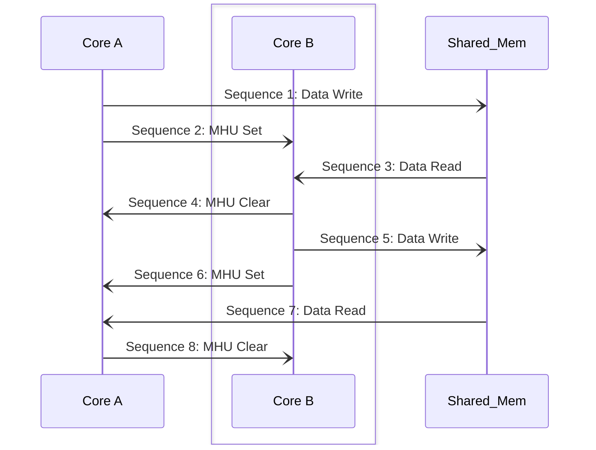

# ICC MHU Tranport

## Table of Contents

[[_TOC_]]

## Introduction

### Description

This document is intended to describe the design and API of the components used to implement the ICC MHU transport as part of the entire ICC stack.

ICC refers to the method used for allowing two different cores to communicate, MHU refers to the actualy hardware used for signaling between two different cores.

### Terms

| Term               | Description                                                                   |
| ------             | -------------------------------                                               |
| DFWK               | Driver Framework |
| ICC                | InterCore Communication    |
| MHU                | Message Handling Unit|
| SMT                | Shared Memory Transport |
| SCMI               | System Control Management Interface |

### Reference Documents

| Document                                  | Link                                |
| ----------------------------------------- | ----------------------------------- |
| RMSS HAS                 |[Link](https://microsoft.sharepoint.com/:w:/r/teams/EchoFalls/Shared%20Documents/Kingsgate%20SOC/Architecture/HAS%201.0/RMSS/KingsGateRMSS%20HAS%20v0p1.4.docx?d=w16370ee610d64064b14bb49a93125509&csf=1&web=1&e=Dc1EiZ) |
| Power Management HAS |[Link](https://microsoft.sharepoint.com/:w:/r/teams/EchoFalls/Shared%20Documents/Kingsgate%20SOC/Architecture/HAS%201.0/Power%20Management,%20Power%20Telemetry%20and%20Sensors/Kingsgate%20Power%20Management%20HAS%20v1.0.docx?d=w8b3ba55b57c440cfaa02d3eda974ce60&csf=1&web=1&e=nLFWeX) |
| MSCP EXP MAS                 |[Link](https://microsoft.sharepoint.com/:w:/r/teams/Kingsgate/Shared%20Documents/MicroArchitecture%20Specs/MAS/Kingsgate%20MSCP_EXP%20MAS_1.0.docx?d=w05de620c51a74eb7a4895f373ea50048&csf=1&web=1&e=RUMQ5z)  |


## Requirements

- Shall provide a method for initializing the ICC MHU Driver framework.
- Shall provide a method for dfwk request to send synchronous commands.
- Shall provide a method for reading whether a command was sent from another host.
- Shall provide a method to check receive command availability.
- Shall provide a method to check maximimum payload allowed on an interface.

### Constraints

- MHU is dependent on mesh being up, so it is expected that the ICC MHU transport will only work when mesh is configured and up.

## Dependencies

- Driver Framework
- ICC MHU Silicon libs
- ICC Tranport Interface

## Design

### Design Overview
The ICC MHU represents a method to send and receive message between two cores, refered to as a means of transporting information, and thereby called as transports. It is an exisiting transport utilizing signaling hw and shared memory accessble to both cores of interest.

#### Primary Design Goals

The goal for this design is to:
1. Simplify the approach when sending data.
2. Have a semi-asynchronous method to send a data from the transport layer
   Semi-meaning the transpot will not be held because it is waiting for a response from the receiving end, but it is held when MHU signaling doesnt confirm that the sent data was received and queued for the next layer processing.
3. Have a separate channel for sending response data, which can be a simple as sending a  message the other way around.


## Interaction Flow

```mermaid
Diagram for Sending a message:
    Seq 1: Core A writes message data to --> Shared Memory
    Seq 2: Core A signals (set status) Core B
    Seq 3: Shared Memory data is read -----> by Core B
    Seq 4: Core B signals (clear Status) Core A

Diagram for Sending a response:
    Seq 5: Core B writes response data to --> Shared Memory
    Seq 6: Core B signals (set status) Core A
    Seq 7: Shared Memory data is read -----> by Core A
    Seq 8: Core A signals (clear Status) Core B
```


### Configuration
TBD


## API

### Public API

#### Device Init
```c
/**
 * @brief icc mhu device initialized in `icc_mhu_trans_dfwk_init`

 */
typedef struct {
    DFWK_DEVICE_HEADER header;
    size_t ref_count;
    DFWK_QUEUE default_queue; //! default dispatch queue that gets all requests initially
} icc_mhu_transport_device_t;


/**
 * @brief Routine for initializing the icc mhu device.
 *
 * @note: Not reentrant
 *
 * @param icc_mhu_dev The mailbox device instance to initialize
 * @param config - The required config to initialize the icc_mhu driver.
 *
 * @return int32_t status is DFWK_SUCCESS or 0 if success, or one of the error codes for ICC transport of type fpfw_status_t
 */
int32_t icc_mhu_transport_dfwk_device_init(icc_mhu_transport_device_t* icc_mhu_dev, icc_mhu_transport_config_t* config);

```

#### Interface Init
```c

/**
 * @brief icc mhu device initialized in `icc_mhu_trans_dfwk_init`

 */
typedef struct {
    DFWK_DEVICE_HEADER header;
    size_t ref_count;
    DFWK_QUEUE default_queue; //! default dispatch queue that gets all requests initially
} icc_mhu_transport_device_t;


/**
 * @brief Routine for initializing the icc mhu transport interface.
 *
 * @note: Not reentrant
 * @note: DfwkInterfaceOpen needs to be done independently from this
 *
 * @param icc_mhu_dev The icc mhu device instance to associate the interface against
 * @param interface The icc mhu transport interface to initialize
 *
 * @return status is DFWK_SUCCESS or 0 if success, or one of the error codes for ICC transport of type fpfw_status_t
 */
int32_t icc_mhu_trans_dfwk_interface_init(icc_mhu_transport_device_t* icc_mhu_dev, icc_mhu_transport_intrf_t* interface);
```


#### Sending and Receiving requests

Utilize the following transport interface requests:
```c
/**
 * @brief Request IDs supported by ICC Transport Interface
 *
 */
enum FPFW_ICC_TRANSPORT_REQUEST_ID
{
    ICC_TRANSPORT_GET_MAX_MESG_SIZE_SYNC_REQUEST_ID,
    ICC_TRANSPORT_TRY_RECV_SYNC_REQUEST_ID,
    ICC_TRANSPORT_TRY_SEND_SYNC_REQUEST_ID,
    ICC_TRANSPORT_RECV_ASYNC_REQUEST_ID,
    ICC_TRANSPORT_SEND_ASYNC_REQUEST_ID,
};
```

and the following ICC MHU Request data structures:
```c
typedef struct {
    DFWK_SYNC_REQUEST_HEADER Header;
    int32_t status;
    uint8_t  id_type;
    uint16_t host_core_2_client_core_id;
    uint32_t command;
    uint16_t size;
    uint8_t*  payload;
} icc_mhu_request_t, icc_mhu_send_request_t, icc_mhu_read_request_t;
```

by invoking Driver Framework Send Sync API:
```c
/**
 *
 *    Sends an interface specific synchronous request to the interface.
 *
 *    @param[in]  Interface
 *        The header of the interface to open
 *
 *    @param[in]  Request
 *        The header of the initialized synchronous request object
 *
 *
 *    @retval DFWK_SUCCESS          If the operation succeeded
 *    @retval Interface Defined     An interface specific error code
 */
int32_t DfwkInterfaceSendSync(PDFWK_INTERFACE_HEADER Interface, PDFWK_SYNC_REQUEST_HEADER Request);
```

Here is an example:
```c
static DFWK_INTERFACE_HEADER* p_icc_interface;

....
....
....

    icc_mhu_send_request_t icc_request;
    icc_request.Header.RequestType = ICC_TRANSPORT_TRY_SEND_SYNC_REQUEST_ID;
    icc_request.id_type = ID_TYPE_INDEX;
    icc_request.host_core_2_client_core_id = 0;
    icc_request.command = 0x00010002;
    icc_request.size = sizeof(data);
    icc_request.payload = (uint8_t*)&data;
    PDFWK_SYNC_REQUEST_HEADER Request = (PDFWK_SYNC_REQUEST_HEADER)&icc_request;
    DfwkInterfaceSendSync((PDFWK_INTERFACE_HEADER)p_icc_interface, Request);
```


## Design Notes / Alternate Considerations

## Unit Testing

Unit tests will be written against each module's public APIs and private APIs.

## Functional Testing

Functional tests will ensure system boots cores come up successfully on SVP, FPGA, and silicon systems. It should cover the path of multicore communications throught MHU

