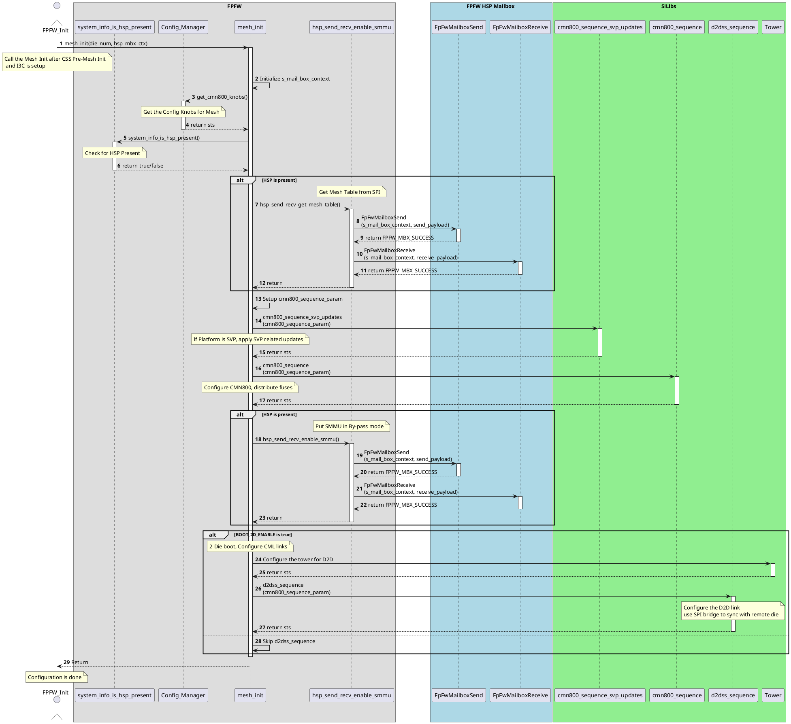

# Mesh Manager Design Document

## Table of Contents

[[_TOC_]]

## Introduction

### Description

This document is intended to describe the design details for the Mesh Manager Module.

### Terms

| Term   | Description                     |
| ------ | ------------------------------- |
| RNF    | Requesting Node Full (a.k.a. an AP)                  |
| RND    | Requesting Node with DVM support                     |
| RNI    | Requesting Node for I/O                              |
| HNS    | Home Node Super (a.k.a. an L3 cache slice)           |
| HND    | DVM Home Node (i.e. default node)                    |
| SNF    | Target Node (a.k.a. a memory controller sub-channel) |
| SBSX   | A CHI to AXI bridge (a.k.a. connects to S/NS RAMs)   |
| XP     | Mesh Crosspoint                                      |
| NUMA   | Non Uniform Memory Access                            |
| OCM    | On Chip Memory                                       |
| RNSAM  | Fully Coherent Request Node System Address Map       |
| HNSAM  | Fully Coherent Home Node System Address Map          |


### Reference Documents

| Document                                  | Link                                |
| ----------------------------------------- | ----------------------------------- |
| Kingsgate SoC HAS | [Link](https://microsoft.sharepoint.com/:w:/r/teams/EchoFalls/Shared%20Documents/Kingsgate%20SOC/Architecture/HAS%201.0/SoC%20Top/Kingsgate%20SOC%20HAS%20v1.0.docx?d=w6eb3051348dd406da70d47e7ef8c9645&csf=1&web=1&e=AEJqgF) |
| Arm CMN800 TRM | [Link](https://microsoft.sharepoint.com/:b:/r/teams/EchoFalls/Shared%20Documents/Kingsgate%20SOC/3P%20IP/Arm/Interconnect/CMN-800/arm_neoverse_cmn_cyprus_trm_107858_0000_01_en.pdf?csf=1&web=1&e=FRd823)    |
| Kingsgate Boot Flow Overview | [Link](https://microsoft.sharepoint.com/:w:/r/teams/EchoFalls/Shared%20Documents/Kingsgate%20SOC/Firmware/working/KG%20FW%20Architecture.docx?d=wf8844b94ffcc4b4680437d75085aec0b&csf=1&web=1&e=jfg6ty)|
| Genesis CMN800 Configs | [Link](https://microsoft.sharepoint.com/teams/EchoFalls/Shared%20Documents/Forms/AllItems.aspx?id=%2Fteams%2FEchoFalls%2FShared%20Documents%2FKingsgate%20SOC%2FArchitecture%2FSOC%20Top%2FKingsgate%20SOC%20Mesh%20Configurations%2Epdf&viewid=6d4f4d8c%2De0a4%2D443f%2Da0fa%2Da8e89d61e636&parent=%2Fteams%2FEchoFalls%2FShared%20Documents%2FKingsgate%20SOC%2FArchitecture%2FSOC%20Top) |
| CMN800 Mesh Diagram | [Link](https://microsoft.sharepoint.com/:b:/r/teams/EchoFalls/Shared%20Documents/Kingsgate%20SOC/Architecture/SOC%20Top/Kingsgate%20SOC%20Mesh%20Diagram%20r1p0.pdf?csf=1&web=1&e=qaoZJ4) |

## Requirements


## Dependencies


## Firmware Module Design

- Create a Mesh Init (aka Mesh Manager) which is registered with the FPFW infrastructure.
- The mesh init will call into the silicon libraries, specifically the CMN800_Sequence library to initialize the mesh
- There will be dependencies between other modules and the Mesh manager which will be added.
- DDR-I3C library, Config Manager, SPI Bridge setup(done by HSP) etc


### Mesh Manager init




### CLI

The Mesh Manager module shall provide an interface on the PRIMARY SCP ONLY.  It will be able to do the following in mission mode:

- Write to the error injection registers via Mesh silibs APIs
- Write to the error spoofing registers via Mesh silibs APIs
- Mock the RAS event processing data path

### Silicon Library

A shared library exists which was written for HW verification (Bifrost).  This library will be used extensively for early init and during runtime.
This list of APIs will be updated as development progresses:

```C
/*!
 * @brief API to program the CMN800 Mesh Sequence
 *   Following sequence is programmed in CMN800:
 *       - Tower Map the CMN Base Address
 *       - Call HNF Unisolate
 *       - PPU Set Power Mode On, PPU Check and PPU Set Power Mode
 *       - Call Fuse Distribution
 *       - Call CMN800 Config
 *       - Call CML Init
 *       - Tower Unmap the CMN Base Address
 *
 * @param[in] cmn800_sequence_param: CMN800 sequence parameters
 *
 * @retval ::SUCCESS The operation succeeded.
 * @retval ::FAILURE  the operation did not succeed
 * @return One of the standard error codes defined in silibs_status.h
 */
int cmn800_sequence(const cmn800_sequence_params_t cmn800_sequence_param);

/*!
 * @brief API to program the D2D Subsystem Sequence
 *   Following sequence is programmed in CMN800:
 *       - Tower Map the CMN Base Address
 *       - Call the D2DSS Init
 *       - Wait for the D2DSS link to be ready (Wait for the other Die)
 *       - Call the HNS RN Cluster Init
 *       - Program the CML Protocol Link Registers
 *       - Call the CCG Runtime Registers
 *       - OPTIONAL: CXL config
 *       - Tower Unmap the CMN Base Address
 *       - Call SPI Bridge Sync and wait for the D2D Sync
 *
 * @param[in] cmn800_sequence_param: CMN800 sequence parameters
 *
 * @retval ::SUCCESS The operation succeeded.
 * @retval ::FAILURE  the operation did not succeed
 * @return One of the standard error codes defined in silibs_status.h
 */
int d2dss_sequence(const cmn800_sequence_params_t cmn800_sequence_param);

/*!
 * @brief API to apply SVP WAs to the CMN800 Config
 *   This API will aggregate all the SVP WAs and apply them to the CMN800 Config
 *
 * @param[in] cmn800_sequence_param: CMN800 sequence parameters
 *
 * @retval ::SUCCESS The operation succeeded.
 * @retval ::FAILURE  the operation did not succeed
 * @return One of the standard error codes defined in silibs_status.h
 */
int cmn800_sequence_svp_updates(const cmn800_sequence_params_t cmn800_sequence_param);
```

### Error Injection

Mesh Manager will likely follow a similar approach to what was done with Cedar Crest.
Each module will register its error domain(s) with a health manager module, which produces a list for the OS via ACPI tables.
For Kingsgate's two-die (chiplet) approach, we will leverage the primary SCP's Mesh Manager instance to register all domains with the OS.

If an error injection request for a Mesh node on the other SCP comes in, the primary SCP's Mesh Manager will send a D2D message to the secondary Mesh Manager to handle the requested error injection.

## Unit Testing

TBD
| Unit test information  | [Link](https://azurecsi.visualstudio.com/Woodinville/_git/Kingsgate.MSCP?path=/docs/development/UnitTesting.md) |

## Functional Testing

Functional tests will cover the requirements.  
Functional tests will verify the APIs listed above via the big FPGA.

