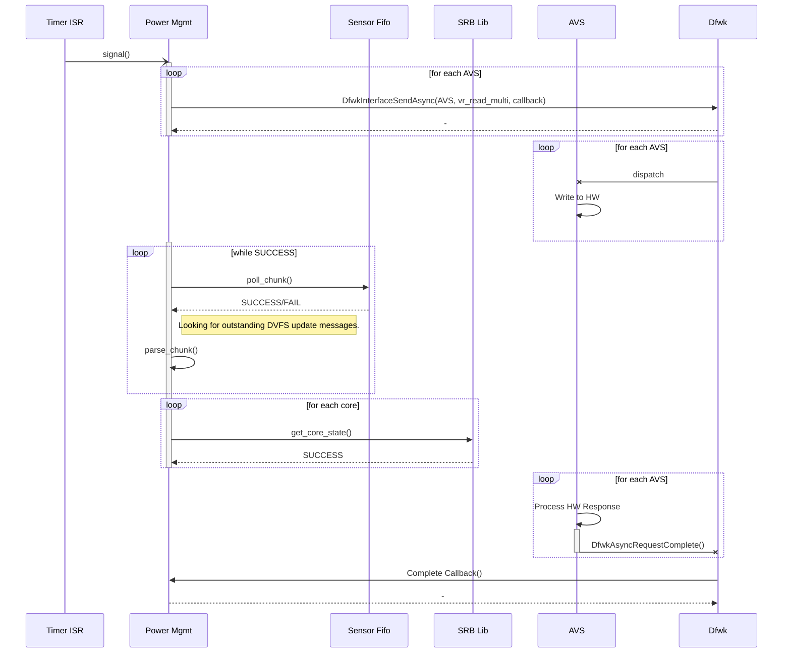
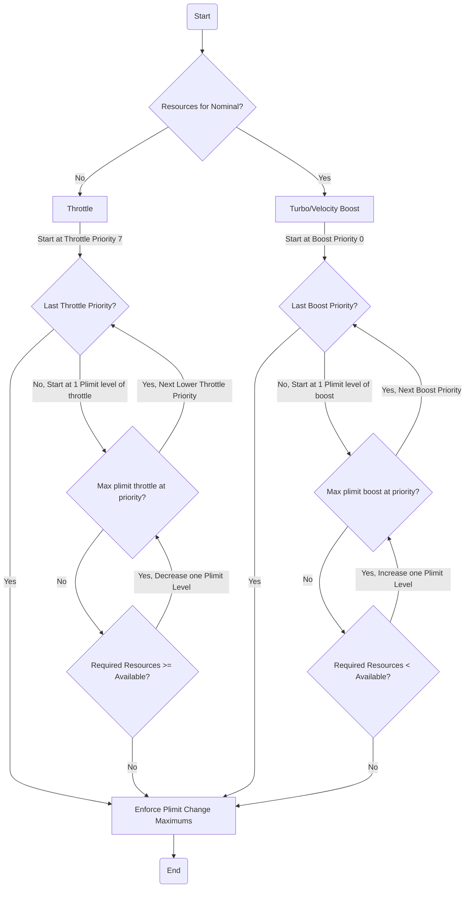
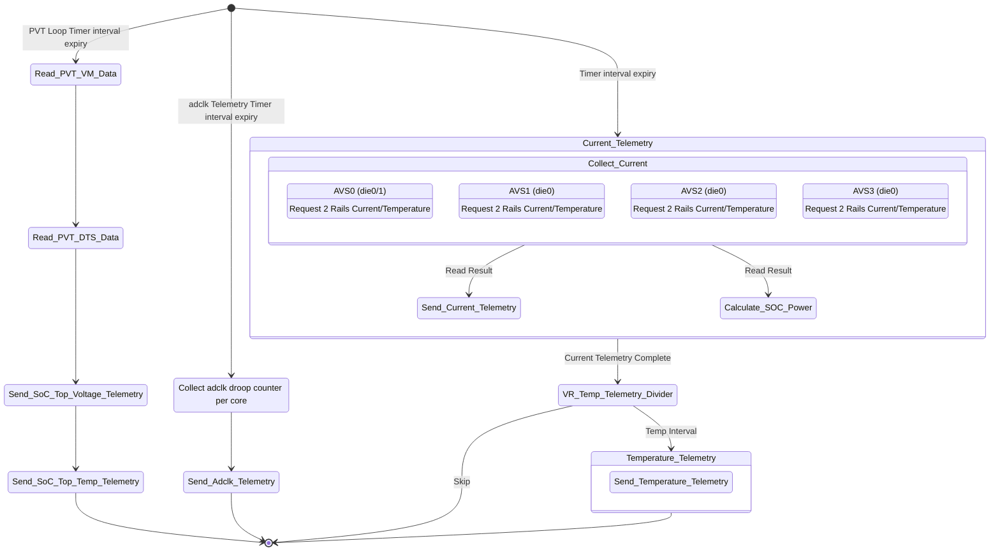
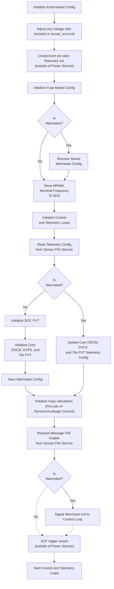
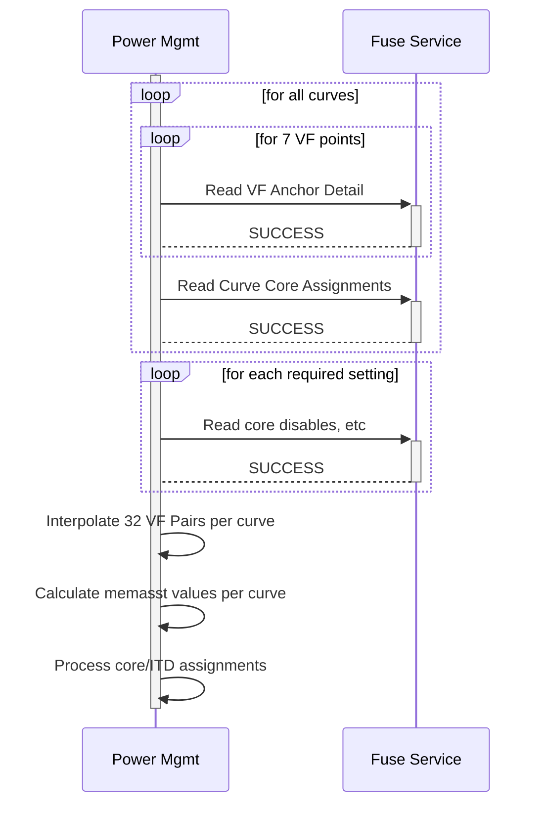

# Power Management Design

## Table of Contents

[[_TOC_]]

## Introduction

### Description

This document is intended to describe the design detail for the module implementing SOC power and thermal management initialization, control loops, and telemetry/reporting from the SCP.  This also includes related initialization and telemetry for adaptive clocking, max power mitigation.

### Terms

| Term                  | Description                                                            |
| ------                | -------------------------------                                        |
| SCP                   | System Control Processor                                               |
| MCP                   | Management Control Processor                                           |
| MHU                   | Message Handling Unit                                                  |
| PVT                   | Process, Voltage, Temperature                                          |
| DVFS                  | Dynamic Voltage and Frequency Scaling                                  |
| VFT                   | Voltage Frequency Table                                                |
| VMAT                  | Voltage/Memory Assist Table                                            |
| ODCM                  | On-Die Current Meter                                                   |
| ODCM MMA              | ODCM Min Max Averaging                                                 |
| MPMM                  | Max Power Mitigation                                                   |
| VR                    | Voltage Rail                                                           |
| AVS                   | Adaptive voltage scaling - dedicated BUS for processor voltage control |
| AF                    | Activity factor - used in dynamic current calculation                  |
| Cdyn                  | Dynamic capacitance - used in dynamic current calculation              |

### Reference Documents

| Document                                  | Link                                |
| ----------------------------------------- | ----------------------------------- |
| Firmware Architecture Document | [Link](https://microsoft.sharepoint.com/:w:/r/teams/EchoFalls/Shared%20Documents/Kingsgate%20SOC/Firmware/working/KG%20FW%20Architecture.docx?d=w88e40080cd1c465cbc34218785e31421&csf=1&web=1&e=k23znC)    |
| Kingsgate Power Management HAS | [Link](https://microsoft.sharepoint.com/:w:/r/teams/EchoFalls/Shared%20Documents/Kingsgate%20SOC/Architecture/HAS%201.0/Power%20Management,%20Power%20Telemetry%20and%20Sensors/Kingsgate%20Power%20Management%20HAS%20v1.01.docx?d=wea1045bfb63e43b2a484dcb25d4b7954&csf=1&web=1&e=RokP8t) |
| Kingsgate DVFS MAS | [Link](https://microsoft.sharepoint.com/:w:/r/teams/Kingsgate/Shared%20Documents/MicroArchitecture%20Specs/MAS/Pwr%20Mgmt%20%26%20Sensors%20MASes/PEX%20MASes/DVFS/Kingsgate%20DVFS%20MAS.docx?d=wbcfcea80f5424c21b307d08a20387a86&csf=1&web=1&e=nztncV) |
| ECR for CPPCv4 | [Link](https://microsoft-my.sharepoint.com/:w:/r/personal/cesarblum_microsoft_com/Documents/Microsoft%20Teams%20Chat%20Files/CPPC-ACPI-Spec-10-13%201.docx?d=w53176aa75409477193a7666f4a7d9944&csf=1&web=1&e=fb4rUu) |
| Kingsgate Sensors MAS | [Link](https://microsoft.sharepoint.com/:w:/r/teams/Kingsgate/Shared%20Documents/MicroArchitecture%20Specs/MAS/Pwr%20Mgmt%20%26%20Sensors%20MASes/Kingsgate%20Sensors%20MAS.docx?d=wfc54fea30c604d31aa28f4a8922b1218&csf=1&web=1&e=ArxyC2) |
| Kingsgate RMSS HAS | [Link](https://microsoft.sharepoint.com/:w:/r/teams/EchoFalls/Shared%20Documents/Kingsgate%20SOC/Architecture/HAS%201.0/RMSS/KingsGateRMSS%20HAS%20v0p1.4.docx?d=w16370ee610d64064b14bb49a93125509&csf=1&web=1&e=yIEbOL)
| Kingsgate ODCM MMA MAS | [Link](https://microsoft.sharepoint.com/:w:/r/teams/Kingsgate/Shared%20Documents/MicroArchitecture%20Specs/MAS/Pwr%20Mgmt%20%26%20Sensors%20MASes/PEX%20MASes/ODCM/Kingsgate%20ODCM_MMA_MAS.docx?d=wc843cd542aeb4824bcff53e2bf22d72d&csf=1&web=1&e=NWyFvn)
| Kingsgate FGPLL Wrapper MAS | [Link](https://microsoft.sharepoint.com/:w:/r/teams/EchoFalls/Shared%20Documents/Kingsgate%20SOC/Clock/MAS/MAS%20working/Kingsgate_fgpll_wrapper_MAS.docx?d=w7fc72527b83b4429b73f2fc8d1e090bb&csf=1&web=1&e=1IwvFO)
| Power Capping Whitepaper | [Link](https://microsoft.sharepoint.com/:w:/r/teams/PioneerSoCNon-implementing/Shared%20Documents/General/Architecture/Power/Power%20Management/VM%20Power%20Capping/Power%20Capping.docx?d=w40b5ef88099c40dc8d90ac7421323c19&csf=1&web=1&e=JhzcWe)
| BMC Power Capping Specification (CedarCrest Platform) | [Link](https://microsoft.sharepoint.com/:w:/t/CSIFWReview/EQcZCoL71LFHjSnAqmv0sqABaM9Uw1MGpgEoVJspKjwqng?e=oyqBlY)
| 1PFW PLDM Shared Library Documentation | [Link](https://azurecsi.visualstudio.com/DuvallFw/_git/1pfw.fwlibs?path=/doc/Modules/PLDM.md)
| ARM Neoverse N2 Supplemental Perf/Power Document (MPMM info)| [Link](https://microsoft.sharepoint.com/:b:/r/teams/PioneerSoCNon-implementing/Shared%20Documents/General/Third-party%20IP/Arm/Cores/Neoverse%20N2%20-%20Perseus%20(MP128)/r0p0%20-%20In%20PNR%20A0/Arm_Neoverse_N2_Supplemental_Performance_Power_Document.pdf?csf=1&web=1&e=XJfU76)
| KG Power Delivery Tracker | [Link](https://microsoft.sharepoint.com/teams/EchoFalls/Shared%20Documents/Forms/AllItems.aspx?id=%2Fteams%2FEchoFalls%2FShared%20Documents%2FKingsgate%20SOC%2FSIPI%2FPI%2FPowerDeliveryTracker&p=true&ga=1&ovuser=72f988bf%2D86f1%2D41af%2D91ab%2D2d7cd011db47%2Ctimphi%40microsoft%2Ecom&OR=Teams%2DHL&CT=1716318033088&clickparams=eyJBcHBOYW1lIjoiVGVhbXMtRGVza3RvcCIsIkFwcFZlcnNpb24iOiI0OS8yNDA1MDMwNzYxMCIsIkhhc0ZlZGVyYXRlZFVzZXIiOmZhbHNlfQ%3D%3D) |
## Requirements 

- Shall limit SOC power to the minimum of the provided power cap or the configured maximums (thermal/electrical limit)
  - Shall limit to provided power cap
  - Shall limit to configured max power budget when provided cap not present
  - Shall make use of OSPM provided throttling priorities and OSPMNominalPerformance when configured for per-VM power capping; otherwise if configured for all-core power capping, cores will be throttled uniformly
  - Within constraints of power limit; shall opportunistically seek to raise frequencies above OSPMNominalPerformance taking into account OSPM provided boost priorities (aka turbo/boost)
- Shall configure HW control loops for adaptive clocking, thermal, and current limiting
- Shall generate SCF telemetry packets (writes to sensor RAM) for SOC TOP (PVT) sensors and SOC VRs
- Shall collect adaptive clocking droop counts and provide to telemetry service
- Shall collect core aging monitor output on configured cadence (daily) and provide to telemetry service
 - Shall provide calculation of SOC power to BMC 
 - Shall provide (through PLDM) interface to BMC for power capping

## Dependencies

Power management will have dependencies on the following via OS, pisoc libs, and other firmware drivers/services.

- Driver Framework (Dfwk)
- timer (OS provided - trigger for control and telemetry loops)
- AVS
- DVFS - including ODCM, PLL, LDO (pisoc libs)
- PVT (pisoc lib)
- Sensor Fifo Driver/Service
- Sensor Ram Bridge (pisoc lib)
- ICC 
- Fuse service 
- Configuration service 
- Warm start 
- Startup/shutdown
- GPIO 
- CLI 
- PLDM 
- SDS 

## Design

### **General FW Architecture**

The power management service will present a driver framework interface for startup and shutdown sequencing, as well as for CLI requests.  The CLI will exist separately from the power management service.  The service will create one thread on which it will run the state machines for the power control and telemetry loops.

### **Configuration**

The configuration of the power service comes from a mix of fuses and config knobs. 

#### Fuses

Items below may change slightly as the project proceeds; initial fuse understanding based on previous project.

| Item(s) | Description | 
| ---------------- | ------------------------------------------------------------------ |
| LDODAC_TO_VOLT | Slope and offset fuses for the LDO DAC to voltage conversion |
| VCPU_LEAKAGE | A table of LDO DAC codes to leakage in mA for a reference temperature |
| VCPU_LDO_DYN | A table of LDO DAC codes to dynamic current in mA for a reference workload (dhrystone) |
| CORE_CDYN | A table of LDO DAC codes to core Cdyn (pF) @ drystone (includes an activity factor)|
| PMM_REV | Power-related fuses revision |
| DTS coefficients | Y/K values for PVT temperature sensor calibration |
| VF curve(s) anchor points and assignments | Set of 4-7 anchor points per up to *#* VF curves and detail about CPU/temp (ITD) curve assignments |
| DVFS_CORE_MEM_ASST | Table for determining necessary memasst values for pstate voltages | 
| CORE_DISABLE | Detail on which of the 68/die CPU cores should be powered on for use |
| V_LDO_headroom | LDO headroom voltage used to calculate required LDO input | 
| V_guardband | Additional guardband voltage added when calculating CPU VR setpoint | 
| TDP Config | Core count, nominal frequency, and TDP (W) | 

#### Config Service

These knobs are available for debug and test purposes.  Once the project reaches production phase, the values will be locked down when the system is in mission mode.

| Knob(s) | Description | Default Value |
| ---------------- | ------------------------------------------------------------------ | --- |
|power_control_loop_interval|Control loop interval in milliseconds. |1|
|power_pvt_loop_interval|PVT telemetry loop interval in milliseconds. |100|
|power_temp_telemetry_divider|Number of control loop intervals per 1 VR temperature telemetry.|10|
|power_remote_poll_interval|Remote (MCP) polling interval in milliseconds for power state.|250|
|power_pid|Power PID configuration (type: power_pid_config_t). Defaults based on Python model.||
|power_soc_maximum_thermal_watts_limit|SOC maximum power limit specific to thermal (W). Defaults to fused value if set to 0.|350|
|*power_soc_maximum_electrical_current_limit_vcpu0*|Vcpu0 current maximum value (A) used to determine the maximum electrical power limit. |500|
|*power_soc_maximum_electrical_current_limit_vcpu1*|Vcpu1 current maximum value (A) used to determine the maximum electrical power limit. |500|
|*power_r_loadline_vcpu0*|Loadline resistance (uOhm - used in Vcpu calculation). Default: 500. |500|
|*power_r_loadline_vcpu1*|Loadline resistance (uOhm - used in Vcpu calculation). Default: 500. |500|
|power_vsys_r_loadline|Loadline resistance (uOhm - used in Vsys power calculation)|600|
|power_activity_factor_mpmm_enabled|Activity factor adjustment against dhrystone when MPMM enabled (percentage, used in Vcpu/dynamic current calculation).|200|
|power_activity_factor_mpmm_disabled|Activity factor adjustment against dhrystone when MPMM disabled (percentage, used in Vcpu/dynamic current calculation). update: need to add 3 current threshold knobs|250|
|power_capping_mode|Power capping mode (type: power_capping_mode_t). Default: PER_VM.|PER_VM|
|power_enable_velocity_boost|Enable for velocity boost (priority-based turbo).  Disabling leaves turbo enabled, without priority.  |TRUE|
|*power_c4_cores_limit_to_nominal*|True to limit cores in C4 c-state to nominal performance.|TRUE|
|power_c3_cores_limit_to_nominal|True to limit cores in C3 c-state to nominal performance.|TRUE|
|power_c2_cores_limit_to_nominal|True to limit cores in C2 c-state to nominal performance.|TRUE|
|power_allow_plimit_below_nominal|Outside of power capping, drop plimit to OS desired performance even if below nominal (POR=false).|FALSE|
|power_intervals_to_lower_plimit|Control loop intervals over which to sample last PSTATE (with no throttling) before lowering plimit below SCP calculated plimit.|0|
|power_allowed_plimit_minimum|Limits control loop plimit selection (range: 0-31).|0|
|power_allowed_plimit_maximum|Limits control loop plimit selection|31|
|power_max_plimit_step_size_up|Limits control loop plimit selection. Max number of steps up. Range: 0-31.|31|
|power_max_plimit_step_size_down|Limits control loop plimit selection. Max number of steps down. Range: 0-31.|31|
|*power_force_pstate*|Limits plimit to forced pstate and rewrites pll/vma tables for lower performance states to prevent HW throttle.| Disabled|
|power_mpmm|Enable Configuration for power mpmm enable/gear.|FALSE|
|power_current_throt|Configuration for core current throttling.||
|*power_current_throttling_cfg*|Current threshold percentages per P-state||
|power_tile_temp_throt|Configuration for tile temperature throttling.||
|power_tile_vms|Configuration for tile voltage monitor thresholds ||
|*power_adclk_throt_vcpu0*|FGPLL and DVFS config for adaptive clocking||
|*power_adclk_throt_vcpu1*|FGPLL and DVFS config for adaptive clocking||
|*power_adclk_vcpu0_offset_cfg*|Override for per-core value added/subtracted to/from the ldoDacIn[8:0] value driven by DVFS|Disabled|
|*power_adclk_vcpu1_offset_cfg*|Override for per-core value added/subtracted to/from the ldoDacIn[8:0] value driven by DVFS|Disabled|
|power_soc_temp|Configuration for SOC temperature thresholds.||
|power_soc_vms|Configuration for SOC voltage monitor thresholds.||
|*power_vcpu0_offset*|Offset in mV to add to final Vcpu calculation. Default: 0.|0|
|*power_vcpu1_offset*|Offset in mV to add to final Vcpu calculation. Default: 0.|0|
|power_force_vrs|Can be used to override SOC voltage regulator settings during boot.||
|power_enable_survivability_mode|True to initialize DVFS in SW control mode and safe settings. Default: false.|FALSE|
|power_survivability_mode_pstate|Survivability mode pstate used to configure the core PLL in this mode. Range: 0-31.|31|
|power_disable_loops|Can be used to disable power control and telemetry loops.|NONE|
|power_minimum_plimit_updates|Guarantees all core plimits requested regularly by having minimum requirements per loop iteration. |MIN_64|
|power_ldo_offset|Can be used to universally offset VF table LDODAC codes (offset in LDODAC code - not an mV offset). Range: -50 to 50.|0|
|power_leakage_temperature_polynomials|Coefficients to scale reference leakage to temperature.||
|power_enable_fgpll_calsm|True to enable FGPLL calibration.|TRUE|
|power_fllcal_pstate_bounds|Start and end of fll calibration|0,31|
|power_plllock_cfg|Use to configure core PLL lock interrupt settings.||
|power_nominal_pstate|Nominal pstate number, 0 uses SOC fused default.|0|
|power_c1_telemetry_enable|Enable C1 telemetry in DVFS. Default: false.|FALSE|
|power_soc_static_rails|Static power in mW to add to SOC power calculations|0|
|*power_itd_cfg*|Inverse Temperature Dependence enable, configuration||
|*power_aging_telemetry*|Configuration details for aging sensor telemetry collection||

> Italicized knobs are new/updated for KNG - some are simply die0/1, vcpu0/1 splits of knobs

### **Power Control Loop**

The power control loop is responsible for limiting CPU performance to meet the given power requirement (the lesser of max, and an active power cap).  It does this while also attempting to achieve the per-core performance requested by the OS/hypervisor.
At its core, the power control loop implements a PID control to determine the performance which can be distributed to the CPU cores--the proportional, integral and derivative coefficients of which are available to be tuned via configuration variables.
The beginning of loop activity is triggered by a periodic timer event.

```mermaid
stateDiagram-v2
    
    state "Exchange Input with Remote Die" as Remote_Die
    state "Exchange Completion with Remote Die" as Remote_Die2
    [*] --> Idle
    
    state Idle
    {
        state "Clear error-induced force PMIN if previous state not Error" as idle1
    }

    Idle --> Collect_Inputs: Timer Interval expired
    
    Collect_Inputs --> Remote_Die: VR currents final result event
    
    Remote_Die --> Distribute_Available_Power: Remote State Received
    
    Distribute_Available_Power --> Set_VR_before_PLIMIT: PLIMIT selections changed, VR setpoint increasing
    Distribute_Available_Power --> Set_PLIMIT_before_VR: PLIMIT selections changed, VR setpoint decreasing
    
    Set_PLIMIT_before_VR --> Set_VR_after_PLIMIT: PLIMITs Complete
    
    Set_VR_after_PLIMIT --> Remote_Die2: Vcpu result, VDone set
    
    Set_VR_before_PLIMIT --> Set_PLIMIT_after_VR: Vcpu result, VDone set
    
    Set_PLIMIT_after_VR --> Remote_Die2: PLIMITs Complete
    
    Remote_Die2 --> [*]: Remote State Received

    
    [*] --> Warmstart_Entry: Warmstart Init
    Warmstart_Entry --> Set_VR_before_PLIMIT: PLIMIT selections changed to P30, (previous P31) assume VR setpoint increasing

    state Remote_Die
    {
        state "Send Input / State to Remote" as send_to_remote
        state "Wait for Input / State from Remote" as receive_from_remote
        send_to_remote --> receive_from_remote
    }

    state Remote_Die2
    {
        state "Send Completion / State to Remote" as send_to_remote2
        state "Wait for Completion / State from Remote" as receive_from_remote2
        send_to_remote2 --> receive_from_remote2
    }

    state Set_PLIMIT_before_VR
    {
        state "Set PLIMITs, Current Thresholds" as set_PLIMITS3
        state "Drain SRB Fifo (while plimits)" as Wait_Success
        Wait_Success --> Wait_Success:  Wait - PLIMITs Pending
        set_PLIMITS3 --> Wait_Success
    }
    
    state Set_VR_after_PLIMIT 
    {
        state "Set VR(Vcpu)" as set_VR3
        state "Read VR(Vcpu)" as read_VR3
        set_VR3 --> read_VR3
        read_VR3 --> read_VR3: Result, VDone not set
    }

    state Set_VR_before_PLIMIT 
    {
        state "Set VR(Vcpu)" as set_VR2
        state "Read VR(Vcpu)" as read_VR2
        set_VR2 --> read_VR2
        read_VR2 --> read_VR2: Result, VDone not set
    }

    state Set_PLIMIT_after_VR
    {
        state "Set PLIMITs, Current Thresholds" as set_PLIMITS
        state "Drain SRB Fifo (while plimits)" as _Wait_Success_
        set_PLIMITS --> _Wait_Success_
        _Wait_Success_ --> _Wait_Success_: Wait - PLIMITs Pending
    }

    state Collect_Inputs
    {
        # these are activities within the state
        state "(See Telemetry Loops)" as read_cpu_current
        state "Request VR Currents" as read_cpu_current
        state "Drain Sensor Fifo (Update Msgs)" as Drain
        state "Read core state from last-pstate regs" as Read
    }

    state Distribute_Available_Power
    {
        state "Calculate SOC Power" as calc
        state "PID Iteration" as PID
        state "Calculate CPU Power/Cap" as calccpu
        calc --> calccpu
        calccpu --> PID
        PID --> Distribution_Policy
        state Distribution_Policy {
        eval_desired_perf
        eval_throttling_priority
        eval_boost_priority
        select_PLIMITS
        }
        state "Calculate Vcpu" as calc_VR1
        Distribution_Policy --> calc_VR1
    }

    state Warmstart_Entry
    {
        state "Select P30 for all cores" as simple_Dist
        state "Calculate Vcpu" as calc_VR2
        simple_Dist --> calc_VR2
    }

    state Error
    {
        state "Performance Degraded / Force PMIN" as degraded
    }

    note left of Error
        Any unexpected "Timer Interval expired" signal from a 
        state other than idle will, after retry, result in error
        state entry.

        Performance will be degraded this will only be corrected 
        after a complete, successful iteration of the control loop.
    end note

    %% Commenting error transition for individual states, because it's confusing
    %% Collect_Inputs --> Error: Timer Interval expired
    %% Remote_Die --> Error: Timer Interval expired
    %% Set_PLIMIT_before_VR --> Error: Timer Interval expired
    %% Set_VR_after_PLIMIT --> Error: Timer Interval expired
    %% Set_VR_before_PLIMIT --> Error: Timer Interval expired
    %% Set_PLIMIT_after_VR --> Error: Timer Interval expired
    
    Error --> [*]

```



#### **Idle**

This is the default state of the control loop at boot and at the completion of all control loop iterations.  If the power management is in a degraded condition due to a previous error completing the complete control loop iteration, entry into this state from a non-error state will exit that degraded condition.

#### **Collect Inputs**

The purpose of this state is to make any requests for input into the control loop which will be handled asynchronously, while collecting other data synchronously.  Specifically, AVS reads are started, which are necessary for power calculations; at the same time, sensor fifo is flushed for all the latest updates to core CPPC (desired, throttle priority, boost priority), and last-pstate registers are read to determine current core state (pstate, cstate, temperature, etc).

*One diagram below is included to show the basic interaction between involved modules.*



#### **Exchange Input with Remote Die**

The following collected inputs, etc, will be exchanged with the remote SCP: power cap; AVS rail reads; per-core pstate, desired, throttle priority, boost priority, nominal (KNG HW documentation calls this base) performance; and current PID/resource state.

#### **Distribute Available Power/Performance**

At this point, both SCP core control loops have the necessary input to calculate SOC/CPU power and perform distribution of resources.  FW must calculate SOC non-core power to report total SOC power on query; that detail is also used to isolate the CPU portion of the power cap to be used for error calculations within the PID control.

**Calculate SOC Power**

```
For each AVS rail:
  P_soc += V_rail * I_rail
  (optional)  P_soc -= (I_rail * I_rail * R_loadline_rail)

P_cpu0 = I_cpu0 * V_cpu0
P_cpu1 = I_cpu1 * V_cpu1
P_cpu = P_cpu0 + P_cpu1 
P_soc_notcpu = P_soc - P_cpu
```

**Calculate CPU Power/Cap**

The PID will regulate only the power of the CPU cores, so it is necessary to isolate the available CPU power from the SOC power cap provided (or the thermal limit, whichever is lesser).  Additionally, once we have the CPU portion of the power cap, it is necessary to ensure that cap would not exceed the CPU VR electrical limit (which we will convert to watts using the latest V_cpuin).

```
P_cap = MIN(P_MTL, P_power_cap)
P_cpu_cap = P_cap - P_soc_notcpu
P_MEL0 = V_cpu0 * I_MEL + V_cpu1 * I_cpu1
P_MEL1 = V_cpu0 * I_cpu0 + V_cpu1 * I_MEL
P_cpu_cap = MIN(P_cpu_cap, P_MEL0, P_MEL1)

PID_error_input = P_cpu_cap - P_cpu
```

**Distribution Policy**

It is here that the determination will be made of which cores PLIMITs are lowered below nominal and if/how available resources will be alotted to allow cores to achieve turbo frequencies.  The performance distribution policy will take into account the amount of performance resources available to be distributed (output of PID), the desired perf requests from the OS (fail requests, last PLIMIT register), throttling priority (dependent on current policy), and boost priority to determine PLIMITs for each CPU core.  Additionally, reported HW throttling events may impact PLIMIT selection for a CPU core.

In the below diagram, consider that the output of the PID is treated as a count of resources.  Each increase of a pstate on a single core will cost some number of resources.  In the existing design there is a 1:1 cost of resource to pstate increase.



Configuration has been added to limit the number of steps a PLIMIT can be changed per iteration; this would dampen fluctuations, but also potentially reduce the responsiveness of the PID loop to both OS requests for performance and requests to reduce power consumption.  Further investigation will need to be done to ensure desired behavior, and the default configuration will leave these step limits disabled.  Aside from dampening the PLIMIT changes to prevent large fluctations, another benefit of this approach could be the fact that adapting to HW throttling may be more easily accomplished, since the step would start from current PSTATE, which may have been affected by a HW throttling event.

> Note: The presence of the VR_HOT_SOC_N signal will override available resources to minimum and discard PID errors to avoid accumulating error in the control loop while the signal is asserted.  This has the effect of producing a slower ramp up to a power cap after the signal is removed.

**Calculate Vcpu**

The setpoint for the CPU VR is determined as follows (V_LDO_headroom, V_guardband are fused values; V_vcpu_offset is config knob for investigative purposes):

```
VR_setpoint = V_in_LDO + V_max_loadline_drop + V_guardband + V_vcpu_offset
V_max_loadline_drop = I_peak * R_loadline
V_in_LDO = MAX_CORES(V_plimit) + V_LDO_headroom
I_peak = SUM_CORES(ActivityFactor * C_dyn * V_plimit * F_plimit + leakage(V_plimit, T))
```

To simplify runtime I_peak calculation, FW pre-calculates dynamic and a reference leakage current for each pstate of each fused VF curve.  This is done using VCPU_LEAKAGE, VCPU_LDO_DYN, and CORE_CDYN fuses; lkg, dyn_ldo, and cdyn columns below show the full interpolation of those fused values (from a previous project) to the LDODAC of each pstate. 

```
SCP-CLI > pwr config vftpre 0

Curve   0
  lkg (A)    reflkg (A) dynamic (A) dyn_ldo (A)  cdyn (pF)  PState MHz
=========== =========== =========== =========== =========== ====== ====
   0.350514    0.378634    3.588927    0.032527  523.000000     12 3400
   0.329726    0.356179    3.302548    0.030938  514.000000     13 3350
   0.308939    0.333723    3.029040    0.029339  505.000000     14 3300
   0.305616    0.330134    2.951281    0.029089  504.000000     15 3250
   0.302285    0.326536    2.868946    0.028830  502.000000     16 3200
   0.298962    0.322946    2.793491    0.028571  501.000000     17 3150
   0.295639    0.319357    2.713740    0.028321  499.000000     18 3100
   0.288151    0.311268    2.557350    0.027750  496.000000     19 3000
   0.280671    0.303188    2.406191    0.027170  493.000000     20 2900
   0.272356    0.294205    2.254664    0.026536  490.000000     21 2800
   0.267363    0.288813    2.134312    0.026152  488.000000     22 2700
   0.262379    0.283429    2.017202    0.025768  486.000000     23 2600
   0.257387    0.278036    1.907184    0.025384  485.000000     24 2500
   0.253229    0.273545    1.800966    0.025071  483.000000     25 2400
   0.249072    0.269054    1.697476    0.024750  481.000000     26 2300
   0.245261    0.264938    1.599981    0.024429  480.000000     27 2200
   0.241980    0.261393    1.507883    0.024107  480.000000     28 2100
   0.241980    0.261393    1.437227    0.024107  480.000000     29 2000
   0.241980    0.261393    1.295915    0.024107  480.000000     30 1800
   0.241980    0.261393    1.154603    0.024107  480.000000     31 1600
```

- Below are the calculations for reflkg and dynamic in the columns above.  Runtime leakage is scaled with temperature using a 3rd order polynomial, *f_T*(T), so here we divide the fused leakage by the output of the polynomial at the fused temperature.  Ideally, the fused temp would produce a 1 with the polynomial coefficients, but above this is not the case.

```
dynamic = AF_scaler_max_power * power_current_throttling_cfg.Iref_to_max_percent * Cdyn_dhrystoneAF * V * F + dyn_ldo
reflkg = lkg / f_T(fused_temp)
```

> In the previous project, we scaled from dhrystone to max power workload with/without MPMM enabled.  For KNG we will scale to max power, but use power_current_throttling_cfg knob to limit current to some percentage of max.  

At runtime, the per-core, per-pstate dynamic current and the reference leakage scaled to temperature are summed to produce I_peak.

```
I_core_dynamic = dynamic_from_table
I_core_leakage = reflkg_from_table * f_T(core_temp)
I_core_max = I_core_dynamic + I_core_leakage
```

#### **VR/PLIMIT Changes / Ordering**

In KNG, PLIMIT updates also contain ODCM current thresholds for current throttling.  These thresholds will be set as percentages of per-core max current calculated for Vcpu.  The percentages used are fields in the power_current_throttling_cfg knob.

```
PLIMIT_T1 = I_core_dynamic * power_current_throttling_cfg.T1_percent + I_core_leakage
PLIMIT_T2 = I_core_dynamic * power_current_throttling_cfg.T2_percent + I_core_leakage
PLIMIT_T3 = I_core_dynamic * power_current_throttling_cfg.T3_percent + I_core_leakage
```

**Set VR After PLIMIT**

If the Vcpu setpoint calculation results in a lower requirement than the current/previous setpoint, then it will only be safe to lower the setpoint after adjusting PLIMITs (writing PLIMIT registers and receiving success messages via sensor ram fifo).

**Set VR Before PLIMIT**

If the Vcpu setpoint calculation results in a higher requirement than the current/previous setpoint, then it will only be safe to adjust PLIMITs after first setting the new VR setpoint (including waiting for AVS Vdone indication that change is complete).

#### **Exchange Completion with Remote Die**

This state exists to sync SCPs at the end of a power loop interval.  It is here that a power cap change would be finalized.

### **Telemetry Loops**

The module generates SCF telemetry packets for each of 8 (for die0, 1 for die1) voltage rails (current & temperature), 18 PVT voltage (VM) sensors and 15 PVT temperature (DTS) sensors.  



#### VR Telemetry

The voltage rails must be polled across the AVS bus and there is overlap here with reading rail currents for telemetry generation and the need to read VR currents for SOC power calculation for the power control loop.  The two reads are shown separately in the diagrams, but it is expected that these are the same.

#### PVT Telemetry 

The PVT for the SOC TOP voltage and temperature sensors will be initialized in continuous mode; an interval timer (power_pvt_loop_interval) interrupt will signal that data should be read from the PVTs to generate telemetry. 

#### Adaptive Clocking Droop Telemetry

Droop counts will be collected from all cores on the configured interval (power_adclk_throt.telemetry_interval).  These counts will be delivered from SCP to MCP (telemetry service) via ICC.  Droop count telemetry will not be a running count, but rather the number of droop events since the last telemetry was delivered.

> In general, the module will not reinitialize HW on a warm reset.  To avoid having to track droop count deltas for telemetry over a warm start, FW will use the clear_droop_count bit in ADCLK_CR2 to reset the droop count after every read. 

#### Aging Monitor Telemetry

New in Kingsgate, the portion of power service that lives on the MCP(s) will be responsible for sequencing the read of 8 pairs of aging data from the PCM of each core.  Firmware will, on a set interval (power_aging_telemetry.interval -- once per day for example), start the sequence of reading each pair on each core.  Data can be collected automatically by the DVFS engine, when configured, when a core enters C2 and remains for the necessary time to collect the measurement.  As cores complete a measurement, telemetry data will be sent and the next pair scheduled for measurement by firmware.

### **Init**

The following flowchart shows basic power initialization sequence.



Further detail about some of the above steps is covered below.

#### **Fuse-based Config**

**VMAT**

The voltage frequency table that will be programmed to DVFS VMATs must be calculated at boot.  Fused values will define 7 VF points each for every curve.  During power management init, 32 VF setpoints will be interpolated for use with DVFS initialization as well as for use with calculations within the power control loop.  Additionally, the fused memasst table is used to determine the memory assist values needed for each setpoint in each curve.  

When ITD is enabled (power_itd_cfg.enable), FW will also process curve assignments per-core for each ITD temperature range.



**Current calculation**

Fuses are read which are necessary for the calculation of leakage and dynamic current.  See the control loop detail in "Vcpu Calculation" above.

**DTS Y/K Coefficients**

The DTS coefficients provide a means of calibration of the calculations to convert RAW DTS and temperature values.  They are used to convert the RAW polled and sensor ram values to temperature telemetry as well as to convert thermal throttling and thermtrip temperatures stored in config knobs to RAW values which can be written to the HW alarm registers.

#### **Initialize SOC PVT**

The power_soc_temp and power_soc_vms knobs are used to generate configuration which is passed into soc_pvt_init.  The result is the enabling of SOC PVT in continuous mode to be able to poll for telemetry as well as the configuration of alarms which will automatically generate SOC_HOT, THERMTRIP, and PD_FAULT signals out of the SOC.

#### **Initialize Core ODCM, DVFS, and Tile PVT**

The power_current_throt, power_tile_temp_throt, and power_adclk_throt_vcpu*x* knobs are used to generate per-core throttling config for dvfs init.  Additionally, power_enable_fgpll_calsm, power_fllcal_pstate_bounds, power_plllock_cfg are used to generate aspects of the DVFS configuration related to the FGPLL.

Telemetry start/write addresses are configured for ODCM, PVT, and DVFS, with the power_c1_telemetry_enable knob being used to configure whether or not C1 entry/exit telemetry is generated.

The power_current_throt is also used to generate configuration for each core ODCM and passed to odcm init.

The power_tile_temp_throt and power_tile_vms knobs are used to generate configuration which is passed per-tile into tile_pvt_init.  The result is the enabling of PVT to be able to stream VM and temperature telemetry as well as the configuration of alarms which will automatically generate SOC_HOT (core throttling), THERMTRIP, and PD_FAULT signals out of the SOC.

#### **Warmstart Save/Restore**

In general, the power service cannot reinitialize most of the power HW, so the cold boot initialization data must be preserved to ensure that the control loop can run after a warm start using detail from the initial cold initialization of the HW.  Any configuration based on calculations which may have changed due to firmware, fuse override, or knob update will need to be saved.

The following are examples of what must be preserved for warm start.
* Disabled cores
* MPMM enabled/gear
* VF curve points and curve assignments
* ITD temperature ranges

#### **Warmstart Init Signal to Control Loop**

On a warm restart, there is a window when SCF_TRIGGER (SENSOR_TRIGGER) is deasserted for reconfiguration of telemetry SCF RAM addresses.  In this window, telemetry is halted from DVFS to SCF; however the AP cores will be running as they were not involved in the warmstart.  For this reason, the per-core LAST_PSTATE register detail may become stale.  In an attempt to minimize this, a warm restart state is added to the control loop state machine that will force cores which have been at P31 during the warm start (FORCE_PMIN) to P30.  This will result in cores in C0 cstate switching to P30, and causing an update of LAST_PSTATE detail.  The regular control loop interval will not be affected.

## API

### Overview 

There is no direct mission-mode API into the power module running on the SCP.  The BMC will send PLDM requests to sensors and an effecter exposed by a proxy power module on the MCP (die0).  The proxy power module will communicate with the power module on the SCP (die0) using ICC (command layer) over MHU/SMT.

```code
        +-------------------------------------------------------------------------------------+
        |                                                                                     |
        |  +--------------------------+                +--------------------------+           |
        |  |                          |                |                          |    SOC    |
        |  |        +-----------+     |                |    +-----------+         |           |
        |  |        |ICC|SMT|MHU+<------------------------->+ICC|SMT|MHU|         |           |
        |  | SCP0   +----+------+     |                |    +-----+-----+     MCP0|           |
        |  |             |            |                |          |               |           |
        |  |      +------+----------+ |                | +--------+--------+      |           |
        |  |      |ICC Command Layer| |                | |ICC Command Layer|      |           |
        |  |      +--------+--------+ |                | +-----+-----------+      |           |
        |  |               |          |                |       |                  |           |
        |  |        +------+------+   |                |   +---+----+   +-------+ |           |
        |  |        |             |   |                |   |        |   |       | |           |
        |  |        |   power     |   |                |   | power  |   | PLDM  | |           |                  +-----------+
        |  |        |   service   |   |                |   | proxy  +---+ svc   | |           | I3C              |           |
        |  |        |             |   |                |   |        |   |       +<------------------------------>+    BMC    |
        |  |        +-------------+   |                |   +--------+   +-------+ |           |                  |           |
        |  |                          |                |                          |           |                  +-----------+
        |  +--------------------------+                +--------------------------+           |
        |                                                                                     |
        +-------------------------------------------------------------------------------------+
```

Additionally, a Dfwk API for CLI usage will be implemented for debug and testing.  The related header file will be linked here when available.

### PLDM Details

The power proxy on the MCP0 will create PDR records and register two sensors and one effecter.  
|Name|Description|Type|Unit/States|
|---------|--------------|-----|----
|SOC Power Sensor|Used by BMC to read current SOC power|numeric sensor|Watts
|Throttling Sensor|Used by BMC to determine current throttling state of SOC|state sensor (performance)|Normal/Throttled/Degraded
|SOC Power Cap Effecter|Used by BMC to set a power cap on the SOC|numeric effecter|Watts

## Early Validation

While the mechanics of the power control loop will be tested pre-silicon, there will be no actual clock scaling or voltage control until we're running on silicon.  For this reason, a SW power model (python) which currently models the power of the CPU VR (loadline loss, core LDO losses, static/dynamic core power, etc) has been developed which will be used to test behavior of the PID loop with varying power caps, core activities, VM throttle/boost priorities, remote die info, etc.

## CLI Interface

### CLI Requirements

- As described earlier, the CLI interface for the power service shall exist outside of the power service itself.
- The CLI interface on any of the dies shall interact with both dies and fetch required values. That way, power service on both dies can be controlled using one CLI.
- The power service CLI shall be able to handle both synchronous (non-posted) and asynchronous (posted) commands.

### CLI Design

The power_cli module piggybacks on the FpFWCLI module from shared services. Since the 1pfw CLI service supports 2 levels of menu/sub-menu, the CLI commands are architected into 2 layers:

- All commands fall under the `pwr` menu.
- There are 4 kinds of commands that are provided:
    1. `cfg` to query (pre-set) configurations.
    1. `set` to set configurable inputs.
    1. `status` to query various power parameters in real time.
    1. `log` to control logging features in the power service.

The `cfg` commands also have a sub-command to query knob settings.

The naming convention for different commands is this: `<menu> <command_category>_<command_subcategory(optional)>_<command>`. For example, to set the power status cap, the command would be `pwr set_cap`.

> Note: The current design implemented supports only Die 0.

- The CLI interacts with the power service via a driver framework interface. It uses the default queue to send async messages to the power service.
- The power service shares the default queue with the SSI service. Hence, care needs to be taken that the RequestTypes for SSI and Power CLI do not overlap.

## Opens / In-progress

The following items are still in-progress or need additional design consideration.

* Mechanism to override ALL VRs (power_forced_vrs) - desired for tuning - current discussion is here:  https://azurecsi.visualstudio.com/Dev/_workitems/edit/1632264
* Mesh power management config knobs - https://azurecsi.visualstudio.com/Dev/_workitems/edit/1885275
* D2D power management config knobs - https://azurecsi.visualstudio.com/Dev/_workitems/edit/1885280
* Accelerator power management - https://azurecsi.visualstudio.com/Dev/_workitems/edit/1885245
* CLI support for forced freq/voltage - https://azurecsi.visualstudio.com/Dev/_workitems/edit/1887364
* Vcpu optimizations - https://azurecsi.visualstudio.com/Dev/_workitems/edit/1888554
* Warmstart and Multi-die synchronization - https://azurecsi.visualstudio.com/Dev/_workitems/edit/1888868

