#
# Copyright (c) Microsoft Corporation. All rights reserved.
#

# Power Management Design

## Table of Contents

[[_TOC_]]

## Introduction

### Description

This document is intended to describe the design detail for the module implementing SOC power and thermal management initialization, control loops, and telemetry/reporting from the SCP.  This also includes related initialization and telemetry for adaptive clocking, max power mitigation.

### Terms

| Term                  | Description                                                            |
| ------                | -------------------------------                                        |
| SCP                   | System Control Processor                                               |
| MCP                   | Management Control Processor                                           |
| MHU                   | Message Handling Unit                                                  |
| PVT                   | Process, Voltage, Temperature                                          |
| DVFS                  | Dynamic Voltage and Frequency Scaling                                  |
| VFT                   | Voltage Frequency Table                                                |
| VMAT                  | Voltage/Memory Assist Table                                            |
| ODCM                  | On-Die Current Meter                                                   |
| ODCM MMA              | ODCM Min Max Averaging                                                 |
| MPMM                  | Max Power Mitigation                                                   |
| VR                    | Voltage Rail                                                           |
| AVS                   | Adaptive voltage scaling - dedicated BUS for processor voltage control |
| AF                    | Activity factor - used in dynamic current calculation                  |
| Cdyn                  | Dynamic capacitance - used in dynamic current calculation              |

### Reference Documents

| Document                                  | Link                                |
| ----------------------------------------- | ----------------------------------- |
| Firmware Architecture Document | [Link](https://microsoft.sharepoint.com/:w:/r/teams/EchoFalls/Shared%20Documents/Kingsgate%20SOC/Firmware/working/KG%20FW%20Architecture.docx?d=wf8844b94ffcc4b4680437d75085aec0b&csf=1&web=1&e=ryFaFI)    |
| Kingsgate Power Management HAS | [Link](https://microsoft.sharepoint.com/:w:/r/teams/EchoFalls/Shared%20Documents/Kingsgate%20SOC/Architecture/HAS%201.0/Power%20Management,%20Power%20Telemetry%20and%20Sensors/Kingsgate%20Power%20Management%20HAS%20v1.04.docx?d=wc2d6d99ad4e2492aa0f4d72f29e3b615&csf=1&web=1&e=9eDiGK) |
| Kingsgate 1PFW Pwr Mgmt Spec | [Link](https://microsoft.sharepoint.com/:w:/r/teams/EchoFalls/Shared%20Documents/Kingsgate%20SOC/Firmware/power/1PFW_Kingsgate_Power_Management_Requirements_And_Specifications_WIP.docx?d=wbb899001d51547d5989f277e9026d7bc&csf=1&web=1&e=npkNBO) |
| Kingsgate 1PFW Pwr Telemetry Spec | [Link](https://microsoft.sharepoint.com/:w:/r/teams/EchoFalls/Shared%20Documents/Kingsgate%20SOC/Firmware/Telemetry/1PFW_Kingsgate_Power_Telemetry_Requirements_And_Specifications%20V0.4%20WIP.docx?d=wfd425643c61b46e09ad093e10faf5d0b&csf=1&web=1&e=YziFHp) |
| Kingsgate DVFS MAS | [Link](https://microsoft.sharepoint.com/:w:/r/teams/Kingsgate/Shared%20Documents/MicroArchitecture%20Specs/MAS/Pwr%20Mgmt%20%26%20Sensors%20MASes/PEX%20MASes/DVFS/Kingsgate%20DVFS%20MAS.docx?d=wbcfcea80f5424c21b307d08a20387a86&csf=1&web=1&e=nztncV) |
| Kingsgate Pwr Intent MAS | [Link](https://microsoft.sharepoint.com/:w:/r/teams/EchoFalls/Shared%20Documents/Kingsgate%20SOC/Architecture/Power%20Management,%20Telemetry,%20and%20Sensors/UPF/Kingsgate_Power_Intent_MAS.docx?d=w72554e994af34e9db175942ff6151e5e&csf=1&web=1&e=Uh3X5k) |
| ECR for CPPCv4 | [Link](https://microsoft-my.sharepoint.com/:w:/r/personal/cesarblum_microsoft_com/Documents/Microsoft%20Teams%20Chat%20Files/CPPC-ACPI-Spec-10-13%201.docx?d=w53176aa75409477193a7666f4a7d9944&csf=1&web=1&e=fb4rUu) |
| Kingsgate Sensors MAS | [Link](https://microsoft.sharepoint.com/:w:/r/teams/Kingsgate/Shared%20Documents/MicroArchitecture%20Specs/MAS/Pwr%20Mgmt%20%26%20Sensors%20MASes/Kingsgate%20Sensors%20MAS.docx?d=wfc54fea30c604d31aa28f4a8922b1218&csf=1&web=1&e=ArxyC2) |
| Kingsgate MSCP_EXP MAS | [Link](https://microsoft.sharepoint.com/:w:/r/teams/EchoFalls/Shared%20Documents/Kingsgate%20SOC/1P%20IP/RMSS/Kingsgate%20MSCP_EXP%20MAS_1.0.docx?d=wf4f3e78cafa34139aca09bef4c6c9461&csf=1&web=1&e=vJISkj) |
| Kingsgate RMSS HAS | [Link](https://microsoft.sharepoint.com/:w:/r/teams/EchoFalls/Shared%20Documents/Kingsgate%20SOC/Architecture/HAS%201.0/RMSS/KingsGateRMSS%20HAS%20v0p1.4.docx?d=w16370ee610d64064b14bb49a93125509&csf=1&web=1&e=yIEbOL)
| Kingsgate ODCM MMA MAS | [Link](https://microsoft.sharepoint.com/:w:/r/teams/Kingsgate/Shared%20Documents/MicroArchitecture%20Specs/MAS/Pwr%20Mgmt%20%26%20Sensors%20MASes/PEX%20MASes/ODCM/Kingsgate%20ODCM_MMA_MAS.docx?d=wc843cd542aeb4824bcff53e2bf22d72d&csf=1&web=1&e=NWyFvn)
| Kingsgate FGPLL Wrapper MAS | [Link](https://microsoft.sharepoint.com/:w:/r/teams/EchoFalls/Shared%20Documents/Kingsgate%20SOC/Clock/MAS/MAS%20working/Kingsgate_fgpll_wrapper_MAS.docx?d=w7fc72527b83b4429b73f2fc8d1e090bb&csf=1&web=1&e=1IwvFO)
| Power Capping Whitepaper | [Link](https://microsoft.sharepoint.com/:w:/r/teams/PioneerSoCNon-implementing/Shared%20Documents/General/Architecture/Power/Power%20Management/VM%20Power%20Capping/Power%20Capping.docx?d=w40b5ef88099c40dc8d90ac7421323c19&csf=1&web=1&e=JhzcWe)
| BMC Power Capping Specification (CedarCrest Platform) | [Link](https://microsoft.sharepoint.com/:w:/t/CSIFWReview/EQcZCoL71LFHjSnAqmv0sqABaM9Uw1MGpgEoVJspKjwqng?e=oyqBlY)
| 1PFW PLDM Shared Library Documentation | [Link](https://azurecsi.visualstudio.com/DuvallFw/_git/1pfw.fwlibs?path=/doc/Modules/PLDM.md)
| ARM Neoverse N2 Supplemental Perf/Power Document (MPMM info)| [Link](https://microsoft.sharepoint.com/:b:/r/teams/PioneerSoCNon-implementing/Shared%20Documents/General/Third-party%20IP/Arm/Cores/Neoverse%20N2%20-%20Perseus%20(MP128)/r0p0%20-%20In%20PNR%20A0/Arm_Neoverse_N2_Supplemental_Performance_Power_Document.pdf?csf=1&web=1&e=XJfU76)
| KG Power Delivery Tracker | [Link](https://microsoft.sharepoint.com/teams/EchoFalls/Shared%20Documents/Forms/AllItems.aspx?id=%2Fteams%2FEchoFalls%2FShared%20Documents%2FKingsgate%20SOC%2FSIPI%2FPI%2FPowerDeliveryTracker&p=true&ga=1&ovuser=72f988bf%2D86f1%2D41af%2D91ab%2D2d7cd011db47%2Ctimphi%40microsoft%2Ecom&OR=Teams%2DHL&CT=1716318033088&clickparams=eyJBcHBOYW1lIjoiVGVhbXMtRGVza3RvcCIsIkFwcFZlcnNpb24iOiI0OS8yNDA1MDMwNzYxMCIsIkhhc0ZlZGVyYXRlZFVzZXIiOmZhbHNlfQ%3D%3D) |
| Pwr Unallocated Node HAS | [Link](https://microsoft.sharepoint.com/:w:/r/teams/EchoFalls/Shared%20Documents/Kingsgate%20SOC/Architecture/HAS%201.0/Power%20Management,%20Power%20Telemetry%20and%20Sensors/Unallocated_Node_HAS.docx?d=wc5b8def6edd446828be7bcd68f421360&csf=1&web=1&e=2KVgAD) |
| Velocity Boost & Per VM Pwr Mgmt | [Link](https://microsoft.sharepoint.com/:w:/r/teams/EchoFalls/_layouts/15/Doc.aspx?sourcedoc=%7B48E3AB00-C641-4F01-B816-1EB04A8FD56B%7D&file=Velocity_Boost_Cobalt200_Whitepaper.docx&action=default&mobileredirect=true&DefaultItemOpen=1&wdOrigin=TEAMS-MAGLEV.undefined_ns.rwc&wdExp=TEAMS-TREATMENT&wdhostclicktime=1770148806338&web=1) |
| Velocity Boost ppt | [Link](https://microsoft-my.sharepoint.com/:p:/p/shchakr/IQDCY9pp7E50T502X1kd8BgkAeK7W7hNijBMJllJtsgL0Hk?e=SJJYhr) |
| MSCP VCPU Calc ppt | [Link](https://microsoft-my.sharepoint.com/:p:/p/shchakr/IQDCY9pp7E50T502X1kd8BgkAeK7W7hNijBMJllJtsgL0Hk?e=SJJYhr) |
| Per VM Pwr Capping ppt | [Link](https://microsoft.sharepoint.com/:p:/r/teams/EchoFalls/Shared%20Documents/General/Echo%20Falls%20Architecture/Echo%20Falls%20e2e%20Enabling/e2e%20reviews%20including%20template/2025_4_17_EF_e2e_Power_Per%20VM%20Power%20Capping.pptx?d=wa9617754bcd8408b95c0539992ab4a03&csf=1&web=1&e=8Vcd5K) |
| Unallocated node pwr reduction ppt | [Link](https://microsoft.sharepoint.com/:p:/r/teams/EchoFalls/Shared%20Documents/General/Echo%20Falls%20Architecture/Echo%20Falls%20e2e%20Enabling/e2e%20reviews%20including%20template/2025_6_12_EF_e2e_Unallocated%20Node%20Power%20Reduction.pptx?d=w2032e48153084a3ea8b32e10a9b9506f&csf=1&web=1&e=uzBuQR) |


## Requirements 

- Shall limit SOC power to the minimum of the provided power cap or the configured maximums (thermal/electrical limit)
  - Shall limit to provided power cap
  - Shall limit to configured max power budget when provided cap not present
  - Shall make use of OSPM provided throttling priorities and OSPMNominalPerformance when configured for per-VM power capping; otherwise if configured for all-core power capping, cores will be throttled uniformly
  - Within constraints of power limit; shall opportunistically seek to raise frequencies above OSPMNominalPerformance taking into account OSPM provided boost priorities (aka turbo/boost)
- Shall configure HW control loops for adaptive clocking, thermal, and current limiting
- Shall generate SCF telemetry packets (writes to sensor RAM) for SOC TOP (PVT) sensors and SOC VRs
- Shall collect adaptive clocking droop counts and provide to telemetry service
- Shall collect core aging monitor output on configured cadence (daily) and provide to telemetry service
 - Shall provide calculation of SOC power to BMC 
 - Shall provide (through PLDM) interface to BMC for power capping

## Dependencies

Power management will have dependencies on the following via OS, pisoc libs, and other firmware drivers/services.

- Driver Framework (Dfwk)
- timer (OS provided - trigger for control and telemetry loops)
- AVS
- DVFS - including ODCM, PLL, LDO (pisoc libs)
- PVT (pisoc lib)
- Sensor Fifo Driver/Service
- Sensor Ram Bridge (pisoc lib)
- ICC 
- Fuse service 
- Configuration service 
- Warm start 
- Startup/shutdown
- GPIO 
- CLI 
- PLDM 
- SDS 

## Design

### **General FW Architecture**

The power management service will present a driver framework interface for startup and shutdown sequencing, as well as for CLI requests.  The CLI will exist separately from the power management service.  The service will create one thread on which it will run the state machines for the power control and telemetry loops.

### **Configuration**

The configuration of the power service comes from a mix of fuses and config knobs. 

#### Fuses

Items below may change slightly as the project proceeds; initial fuse understanding based on previous project.

| Item(s) | Description |
| ---------------- | ------------------------------------------------------------------ |
| LDODAC_TO_VOLT | Slope and offset fuses for the LDO DAC to voltage conversion |
| VCPU_LEAKAGE | A table of LDO DAC codes to leakage in mA for a reference temperature |
| VCPU_LDO_DYN | A table of LDO DAC codes to dynamic current in mA for a reference workload (dhrystone) |
| CORE_CDYN | A table of LDO DAC codes to core Cdyn (pF) @ drystone (includes an activity factor)|
| PMM_REV | Power-related fuses revision |
| DTS coefficients | Y/K values for PVT temperature sensor calibration |
| VF curve(s) anchor points and assignments | Set of 4-7 anchor points per up to *#* VF curves and detail about CPU/temp (ITD) curve assignments |
| DVFS_CORE_MEM_ASST | Table for determining necessary memasst values for pstate voltages |
| CORE_DISABLE | Detail on which of the 68/die CPU cores should be powered on for use |
| V_LDO_headroom | LDO headroom voltage used to calculate required LDO input |
| V_guardband | Additional guardband voltage added when calculating CPU VR setpoint |
| TDP Config | Core count, nominal frequency, and TDP (W) |

**Detailed Fuse Table**

The following table provides detailed information about all power-related fuses read by the firmware. Source: `power_fuses.c`

| Fuse Category | Fuse Field | Description | Count/Elements | Data Type | Usage |
|---------------|------------|-------------|----------------|-----------|-------|
| **TDP Configuration** |||||
| | BASE_FREQUENCY | Nominal frequency in MHz | 1 | uint16_t | Determines system pnominal |
| | NUM_CORES | Number of cores used for TDP measurement | 1 | uint8_t | Scaling for power calculations |
| | (power_A) | TDP power rating | 1 | uint16_t | Default: 400W |
| **Process Corner** |||||
| | PROCESS_CORNER_IDENTIFIER_INVERTER_PROCESS_ID | Silicon process corner | 1 | enum | SS=1, TT=2, FF=3 |
| **Voltage Conversion** |||||
| | LDO_DAC_TO_VOLTAGE_M | Slope for LDODAC→voltage (µV) | 1 | uint16_t | Default: 2000 µV |
| | LDO_DAC_TO_VOLTAGE_B | Offset for LDODAC→voltage (µV) | 1 | uint16_t | Default: 2000 µV |
| | LDO_HEADROOM | LDO dropout headroom (mV) | 1 | uint8_t | Added to Vcpu calculation |
| | VCPU_GUARDBAND | Guardband voltage for Vcpu (mV) | 1 | uint8_t | Safety margin in Vcpu |
| **VF Curves (per curveset)** |||||
| | VF*n*_TEMP*t*_FREQ_*i* | Frequency anchor point (MHz) | 7 curves × 4 temps × 7 points | uint16_t | 7 anchor points per curve |
| | VF*n*_TEMP*t*_LDO_DAC_CODE_*i* | LDO DAC code for anchor | 7 curves × 4 temps × 7 points | uint16_t | Voltage at each anchor |
| | VF_CORE_ANCHOR_SEL | Per-core curve assignment | 68 cores | uint8_t | Maps cores to VF curves |
| **ITD Temperature Ranges** |||||
| | VF_CURVE_TEMP_RANGES_TEMP_THRESHOLD_T1 | ITD temp boundary 1 (°C + 127) | 1 | int8_t | Column 0→1 boundary |
| | VF_CURVE_TEMP_RANGES_TEMP_THRESHOLD_T2 | ITD temp boundary 2 (°C + 127) | 1 | int8_t | Column 1→2 boundary |
| | VF_CURVE_TEMP_RANGES_TEMP_THRESHOLD_T3 | ITD temp boundary 3 (°C + 127) | 1 | int8_t | Column 2→3 boundary |
| **Memory Assist (5 voltage boundaries)** |||||
| | DVFS_CORE_MEM_ASST_TRIMS_*n*_BOUND_LDODACIN | Voltage boundary (LDO DAC) | 5 | uint16_t | Memasst band boundary |
| | DVFS_CORE_MEM_ASST_TRIMS_*n*_BOUND_TP_EMAA | TP EMAA setting | 5 | uint8_t | Memory timing param |
| | DVFS_CORE_MEM_ASST_TRIMS_*n*_BOUND_TP_EMAB | TP EMAB setting | 5 | uint8_t | Memory timing param |
| | DVFS_CORE_MEM_ASST_TRIMS_*n*_BOUND_HSHC_EMA | HSHC EMA setting | 5 | uint8_t | Memory timing param |
| | DVFS_CORE_MEM_ASST_TRIMS_*n*_BOUND_HSHC_RAWLM | HSHC RAWLM setting | 5 | uint8_t | Memory timing param |
| | DVFS_CORE_MEM_ASST_TRIMS_*n*_BOUND_HD_EMA | HD EMA setting | 5 | uint8_t | Memory timing param |
| | DVFS_CORE_MEM_ASST_TRIMS_*n*_BOUND_HD_RAWLM | HD RAWLM setting | 5 | uint8_t | Memory timing param |
| | DVFS_CORE_MEM_ASST_TRIMS_*n*_BOUND_HD_EMAW | HD EMAW setting | 5 | uint8_t | Memory timing param |
| | DVFS_CORE_MEM_ASST_TRIMS_*n*_BOUND_VALID_BOUNDARY | Boundary valid flag | 5 | uint8_t | Enable boundary |
| **VCPU Leakage (7 interpolation points)** |||||
| | VCPU_LEAKAGE_*n*_TEMP | Temperature offset for point | 7 | uint8_t | Reference temperature |
| | VCPU_LEAKAGE_*n*_CURRENT | Leakage current (mA) | 7 | uint32_t | I_leak at this point |
| | VCPU_LEAKAGE_*n*_VCPU | Vcpu voltage (mV) | 7 | uint16_t | Voltage for point |
| | VCPU_LEAKAGE_*n*_LDO | LDO DAC code | 7 | uint16_t | For interpolation |
| **VCPU LDO Dynamic (2 interpolation points)** |||||
| | VCPU_LDO_DYN_*n*_TEMP | Temperature offset | 2 | uint8_t | Reference temperature |
| | VCPU_LDO_DYN_*n*_CURRENT | Dynamic current (mA) | 2 | uint32_t | I_dyn at this point |
| | VCPU_LDO_DYN_*n*_VCPU | Vcpu voltage (mV) | 2 | uint16_t | Voltage for point |
| | VCPU_LDO_DYN_*n*_LDO | LDO DAC code | 2 | uint16_t | For interpolation |
| **Core Dynamic Capacitance (3 points)** |||||
| | CORE_CDYN_*n*_CDYN | Dynamic capacitance (pF) | 3 | uint16_t | Cdyn value |
| | CORE_CDYN_*n*_LDO | LDO DAC code | 3 | uint16_t | For interpolation |
| **DTS Thermal Coefficients** |||||
| | TILE_THERMALS_SENSOR_RTS_K | Tile DTS K value | per-tile | uint16_t | Temperature calibration |
| | TILE_THERMALS_SENSOR_RTS_Y | Tile DTS Y value | per-tile | uint16_t | Temperature calibration |
| | TOP_THERMALS_SENSOR_RTS_K | SOC-top DTS K value | per-channel | uint16_t | Default: 286 |
| | TOP_THERMALS_SENSOR_RTS_Y | SOC-top DTS Y value | per-channel | uint16_t | Default: 649 |
| **Core Disable** |||||
| | CORE_DEFECT_MFG_MASK_CORE_DEFECT_MFG_31_0 | MFG defect bits 31:0 | 1 | uint32_t | Disabled cores |
| | CORE_DEFECT_MFG_MASK_CORE_DEFECT_MFG_63_32 | MFG defect bits 63:32 | 1 | uint32_t | Disabled cores |
| | CORE_DEFECT_MFG_MASK_CORE_DEFECT_MFG_67_64 | MFG defect bits 67:64 | 1 | uint8_t | Disabled cores |
| | CORE_DEFECT_IFT_MASK_CORE_DEFECT_IFT_* | IFT defect masks (3 fields) | 3 | uint32_t/uint8_t | OR'd with MFG |
| **PMM Revision** |||||
| | TEST_FLOW_CHECKS_PMM_REVISION | Power management module revision | 1 | uint8_t | 0 or 1 supported |
| **Customer Sample Info** |||||
| | CUSTOMER_SAMPLE_INFO_CUSTOMER_SAMPLE_MILESTONE | Sample milestone | 1 | uint8_t | 0x1=ES, 0x2=PC, 0x3=PR |
| **VSYS Voltage ID** |||||
| | VSYS_VID | VSYS voltage ID from fuses | 1 | uint16_t | VBOOT override value |

**Fuse Data Structure**

The fuses are stored in `power_fuse_data_t` (defined in `power_runconfig.h`):

```c
typedef struct _power_fuse_data_t
{
    corebits_t valid_cores;                              // Valid core bitmap
    power_fuse_vf_curveset_t vf;                         // VF curves (7 curvesets)
    dvfs_core_memasst_entries_t memasst;                 // Memory assist entries (5)
    dvfs_vf_slope_t ldodac_to_volt;                      // LDODAC→voltage slope/offset
    dts_coeff_t dts_coeff_tile[NUM_CPU_TILES];           // Per-tile DTS calibration
    dts_coeff_t dts_coeff_soctop[SOC_PVT_TOTAL_CHANNELS_DTS]; // SOC-top DTS calibration
    power_vcpu_interp_t vcpu_leakage[VCPU_LEAKAGE_COUNT];     // Leakage interpolation (7)
    power_vcpu_interp_t vcpu_ldo_dyn[VCPU_LDO_DYNAMIC_COUNT]; // Dynamic current interp (2)
    power_vcpu_interp_t core_cdyn[CORE_CDYN_COUNT];           // Core Cdyn interp (3)
    power_fuse_process_id_t process_id;                  // Process corner (SS/TT/FF)
    power_fuse_tdp_t tdp_config;                         // TDP: freq, power, num_cores
    uint8_t v_ldo_dropout_mv;                            // LDO headroom voltage (mV)
    uint8_t vcpu_guardband_mv;                           // Vcpu guardband (mV)
    int8_t curve_max_temp[NUM_DVFS_ITD_TEMPERATURE_LOOKUP_COLUMNS - 1]; // ITD boundaries (3)
    uint16_t vsys_vid_mv;                                // VSYS VID value
} power_fuse_data_t;
```


#### Config Service

These knobs are available for debug and test purposes. Once the project reaches production phase, the values will be locked down when the system is in mission mode.

**Source File**: `config/knobs_config/kng_mscp_power_config_knobs.xml`

| Knob | Description | Default | Type/Range |
|------|-------------|---------|------------|
| power_control_loop_interval | Control loop interval in milliseconds | 1 | uint16_t |
| power_pvt_loop_interval | PVT telemetry loop interval in milliseconds | 10 | uint16_t |
| power_temp_telemetry_divider | Number of control loop intervals per 1 VR temperature telemetry | 10 | uint16_t |
| power_pid | Power PID configuration (kpt, kit, kdt, setpoint_offset) | {15000, 2000000, 0, 5000} | power_pid_config_t |
| power_soc_maximum_thermal_watts_limit | SOC maximum power limit specific to thermal (W). 0 = use fused value | 0 | uint16_t |
| power_soc_maximum_electrical_current_limit_vcpu0 | Vcpu0 current maximum value (A) for electrical power limit | 497 | uint16_t |
| power_soc_maximum_electrical_current_limit_vcpu1 | Vcpu1 current maximum value (A) for electrical power limit | 497 | uint16_t |
| power_r_loadline_vcpu0 | Loadline resistance for Vcpu0 (µΩ) | 500 | uint16_t |
| power_r_loadline_vcpu1 | Loadline resistance for Vcpu1 (µΩ) | 500 | uint16_t |
| power_vsys_r_loadline | Loadline resistance for Vsys power calculation (µΩ) | 480 | uint16_t |
| power_activity_factor_dhry_adjustment | Activity factor with MPMM disabled (percentage) | 217 | uint8_t |
| power_capping_mode | Power capping mode | PER_VM | power_capping_mode_t (ALL=0, PER_VM=1) |
| power_enable_velocity_boost | Enable velocity boost (priority-based turbo) | true | bool |
| power_c4_cores_limit_to_nominal | Limit cores in C4 c-state to nominal performance | true | bool |
| power_c3_cores_limit_to_nominal | Limit cores in C3 c-state to nominal performance | true | bool |
| power_c2_cores_limit_to_nominal | Limit cores in C2 c-state to nominal performance | true | bool |
| power_allow_plimit_below_nominal | Drop plimit to OS desired perf below nominal (outside capping) | false | bool |
| power_intervals_to_lower_plimit | Control loop intervals to sample PSTATE before lowering plimit | 0 | uint8_t |
| power_allowed_plimit_minimum | Minimum plimit (limits turbo speeds). Range: 0-31 | 0 | uint8_t |
| power_allowed_plimit_maximum | Maximum plimit selection limit | 31 | uint8_t |
| power_max_plimit_step_size_up | Max pstate steps up per iteration. Range: 0-31 | 31 | uint8_t |
| power_max_plimit_step_size_down | Max pstate steps down per iteration. Range: 0-31 | 31 | uint8_t |
| power_force_pstate | Force specific pstate, rewrites PLL/VMAT tables. 32 = disabled | 32 | uint8_t (0-32) |
| power_itd_cfg | Enable ITD (In-Die Temperature) feature | true | bool |
| power_es1_fuse_overrides | Enable ES1 power fuse overrides for ES2 compatibility | false | bool |
| power_current_throt | Core current throttling configuration | {5, 15, 31, 31, 0, 1, 2} | power_currthrot_cfg_t |
| power_tile_temp_throt | Tile temperature throttling configuration | {{930, 950}, {1130, 1150}, 15, 15, 0, 1} | power_tile_tempthrot_cfg_t |
| power_tile_vms | Tile voltage monitor thresholds | (see XML) | power_pvt_tile_vm_cfg_t |
| power_adclk_throt | Adaptive clocking/throttling configuration | {false, ...} | power_adclk_cfg_t |
| power_adclk_offset_cfg | Adaptive clocking per-core offset values | {false, {0...}} | power_adclk_offset_cfg_t |
| power_soc_temp | SOC temperature thresholds (hot, thermtrip in 0.1°C) | {{930, 950}, {1130, 1150}} | power_soc_temp_cfg_t |
| power_soc_vms | SOC voltage monitor thresholds (18 rails) | (see XML) | power_pvt_soc_vm_cfg_t |
| power_vcpu0_offset | Offset (mV) to add to Vcpu0 calculation | 0 | int16_t |
| power_vcpu1_offset | Offset (mV) to add to Vcpu1 calculation | 0 | int16_t |
| power_force_vrs | Override SOC voltage regulator settings during boot | {0...} | power_force_vrs_t (10 VRs) |
| power_enable_survivability_mode | Initialize DVFS in SW control mode with safe settings | false | bool |
| power_survivability_mode_pstate | Pstate for survivability mode. Range: 0-31 | 31 | uint8_t |
| power_disable_loops | Disable power control and/or telemetry loops | NONE | power_loops_disable_t |
| power_minimum_plimit_updates | Minimum plimit requests per loop iteration | MIN_64 | power_loops_minimum_plimit_t |
| power_ldo_offset | Offset VF table LDODAC codes (not mV). Range: -50 to 50 | 0 | int8_t |
| power_leakage_temperature_polynomials | Coefficients to scale reference leakage to temperature | (polynomial) | power_leakage_temp_scaler_t |
| power_enable_fgpll_calsm | Enable FGPLL calibration | true | bool |
| power_fllcal_pstate_bounds | Start and end pstate for FLL calibration | {0, 31} | power_fllcal_pstate_bounds_t |
| power_plllock_cfg | Core PLL lock interrupt settings | {true, 2, false, false, false, false, false} | power_plllock_cfg_t |
| power_nominal_pstate | Nominal pstate number, 0 = use SOC fused default | 0 | uint8_t |
| power_c1_telemetry_enable | Enable C1 entry/exit telemetry in DVFS | false | bool |
| power_soc_static_rails | Static power (mW) to add to SOC power calculations | 0 | uint16_t |
| power_avs_ds | AVS drive strength configuration | {{2,2},{2,2},{2,2},{2,2}} | avs_ds_cfg_array_t |
| power_enable_vsys_vboot_override | Enable VSYS VBOOT override from fuse field vsys_vid | false | bool |
| power_cppc_lowest_nonlin_perf | Lowest non-linear CPPC performance point (pstate). 32 = disabled | 32 | uint8_t (0-32) |
| power_plimit_current_thresholds | Current threshold percentages for pstate generation | {true, 100, 70, 80, 90} | power_currthrot_threshold_cfg_t |
| power_soc_vm_overvolt_en | Enable SOC VM overvolt alarm | true | bool |
| power_soc_vm_undervolt_en | Enable SOC VM undervolt alarm | true | bool |
| power_tile_vm_overvolt_en | Enable Tile VM overvolt alarm | true | bool |
| power_tile_vm_undervolt_en | Enable Tile VM undervolt alarm | true | bool |
| power_soc_hot_en | Enable SOC temperature hot alarm | true | bool |
| power_soc_thermtrip_en | Enable SOC temperature thermtrip alarm | true | bool |
| power_tile_hot_en | Enable Tile temperature hot alarm | true | bool |
| power_tile_thermtrip_en | Enable Tile temperature thermtrip alarm | true | bool |

**Core Disable Knobs** (for debug/test):

| Knob | Description | Default |
|------|-------------|---------|
| die0_core_disable_value_31_0 | Die0 core disable bits 31:0 | 0 |
| die0_core_disable_value_63_32 | Die0 core disable bits 63:32 | 0 |
| die0_core_disable_value_95_64 | Die0 core disable bits 95:64 | 0 |
| die1_core_disable_value_31_0 | Die1 core disable bits 31:0 | 0 |
| die1_core_disable_value_63_32 | Die1 core disable bits 63:32 | 0 |
| die1_core_disable_value_95_64 | Die1 core disable bits 95:64 | 0 |
| die0_core_spare_en_31_0 | Enable previously disabled (non-defective) cores on Die0, bits 31:0 | 0 |
| die0_core_spare_en_63_32 | Enable previously disabled (non-defective) cores on Die0, bits 63:32 | 0 |
| die0_core_spare_en_95_64 | Enable previously disabled (non-defective) cores on Die0, bits 95:64 | 0 |
| die1_core_spare_en_31_0 | Enable previously disabled (non-defective) cores on Die1, bits 31:0 | 0 |
| die1_core_spare_en_63_32 | Enable previously disabled (non-defective) cores on Die1, bits 63:32 | 0 |
| die1_core_spare_en_95_64 | Enable previously disabled (non-defective) cores on Die1, bits 95:64 | 0 |

**Enum Types**:

| Enum | Values |
|------|--------|
| power_capping_mode_t | ALL (0), PER_VM (1) |
| power_loops_disable_t | NONE (0), CTRL_LOOP (1), VR_TELEM_LOOP (2), PVT_TELEM_LOOP (4), combinations (3,5,6,7) |
| power_loops_minimum_plimit_t | NONE (0), MIN_1 (1), MIN_2 (2), MIN_4 (3), MIN_8 (4), MIN_16 (5), MIN_32 (6), MIN_64 (7), MIN_128 (8) |


### **Power Initialization**

The following components are set up during power service initialization before the control loop starts.

**Voltage Frequency Table (VFT)**

The Voltage Frequency Table (VFT) defines the relationship between CPU operating frequencies and their required voltages. It is fundamental to power management, DVFS operations, and current/power calculations.

**What is a VFT?**

A VFT maps each P-state (performance state) to a voltage/frequency pair:

| P-state | Frequency (MHz) | Voltage (mV) | Description |
|---------|-----------------|--------------|-------------|
| P0 | 3600 | 1050 | Maximum boost |
| P10 | 3400 | 1000 | High performance |
| P20 | 2900 | 900 | Nominal (pnominal) |
| P30 | 2200 | 750 | Low power |
| P31 | 2100 | 725 | Minimum |

The VFT is stored in power_core_vft_t:

```c
typedef struct _power_core_vft_t
{
    corebits_t assigned_cores;              // cores assigned to this VFT
    power_core_vft_point_t vf[NUM_PSTATES]; // 32 vf points (P0-P31)
    uint8_t min_plimit;                     // minimum plimit (highest performance)
} power_core_vft_t;
`

**Fused VF Anchor Points**

Silicon fuses contain **7 VF anchor points** per curve that define the characteristic voltage-frequency relationship for each die quality bin:

| Anchor | Typical Frequency | Purpose |
|--------|------------------|---------|
| 0 | 2100 MHz | Lowest operating point |
| 1 | 2400 MHz | Low performance |
| 2 | 2700 MHz | Below nominal |
| 3 | 2900 MHz | Nominal (BASE_FREQUENCY) |
| 4 | 3200 MHz | Above nominal |
| 5 | 3400 MHz | High performance |
| 6 | 3600 MHz | Maximum boost (if supported) |

These anchor points are read from fuses during initialization and stored as dvfs_vf_fused_pairs_t.

**VF Interpolation**

Since fuses only provide 7 anchor points but the system needs 32 P-states (P0-P31), firmware **interpolates** the remaining VF pairs at boot time.

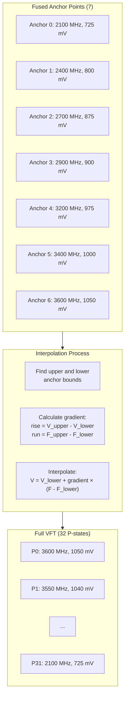

**Interpolation Algorithm**

The interpolation uses linear interpolation between anchor points:

`c
// Find bounds for the target value
upper_bound = find_interpolation_bound(points, count, target, false);
lower_bound = find_interpolation_bound(points, count, target, true);

// Calculate gradient (slope)
gradient = (upper_value - lower_value) / (upper_x - lower_x);

// Interpolate
result = lower_value + gradient × (target_x - lower_x);
`

For voltage values (given a target LDO DAC code):
1. Find the two anchor points that bracket the target
2. Calculate the slope between those points
3. Use linear interpolation to find the voltage

**Multiple VFT Curves (Curvesets)**

Different cores may have different silicon quality, so the system supports multiple VFT curves organized into **curvesets**:

| Structure | Description |
|-----------|-------------|
| power_fuse_core_vf_t | Single VF curve (7 fused anchor points) |
| power_fuse_vf_curveset_t | Array of VF curves for all curvesets |
| power_derived_config_t.vfts[] | Interpolated 32-point VFTs per curveset |
| power_derived_config_t.assigned_vft[] | Per-core VFT assignment |

Each core is assigned to a specific VFT based on its fused characteristics:

`c
// During init, cores are assigned to VFTs
derived.assigned_vft[core] = determine_vft_assignment(core);

// During operation, use assigned VFT for calculations
const power_core_vft_t* vft = &derived.vfts[assigned_vft[core]];
uint16_t voltage = vft->vf[pstate].voltage_mv;
`

**ITD Temperature Columns**

When **ITD (In-Die Temperature)** monitoring is enabled, each VFT curve has 4 temperature-dependent variations:

| Column | Temperature | Voltage Impact |
|--------|-------------|----------------|
| 0 | Cold | Lower voltage needed |
| 1 | Cool | Slightly higher voltage |
| 2 | Warm | Higher voltage needed |
| 3 | Hot | Highest voltage |

The hardware selects the appropriate column based on current die temperature, allowing dynamic voltage adjustment without P-state changes.

**VFT Usage in Power Management**

The VFT is used throughout the power management system:

| Usage | Description |
|-------|-------------|
| **min_plimit** | ft.min_plimit defines the maximum boost (lowest P-state number) achievable |
| **Current Calculation** | power_vcpu_precalculate_vf_currents() pre-calculates dynamic and leakage current per VF point |
| **VR Setpoint** | VFT voltage + headroom + guardband determines CPU VR target |
| **DVFS/VMAT** | VFT is programmed to hardware VMAT tables for P-state transitions |
| **Power Estimation** | P = C × V² × f uses VFT values |

**VFT Precalculation**

At initialization, the firmware pre-calculates current values for each VFT point to speed up runtime power calculations:

```c
typedef struct _power_vft_precalc_current_t
{
    float dynamic;     // Dynamic current at this VF point
    float leakage;     // Leakage current at this VF point
    float dynamic_ldo; // Intermediate for dynamic calculation
    float ref_leakage; // Unscaled leakage reference
    float cdyn_pf;     // Dynamic capacitance in pF
} power_vft_precalc_current_t;
```
These precalculated values are interpolated from fused characterization data (VCPU_LEAKAGE, VCPU_LDO_DYN, CORE_CDYN) and enable fast runtime current estimation without complex recalculation.

The following flowchart shows basic power initialization sequence.

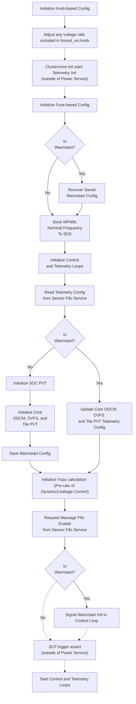

Further detail about some of the above steps is covered below.

#### **Fuse-based Config**

**VMAT**

The voltage frequency table that will be programmed to DVFS VMATs must be calculated at boot.  Fused values will define 7 VF points each for every curve.  During power management init, 32 VF setpoints will be interpolated for use with DVFS initialization as well as for use with calculations within the power control loop.  Additionally, the fused memasst table is used to determine the memory assist values needed for each setpoint in each curve.  

When ITD is enabled (power_itd_cfg.enable), FW will also process curve assignments per-core for each ITD temperature range.

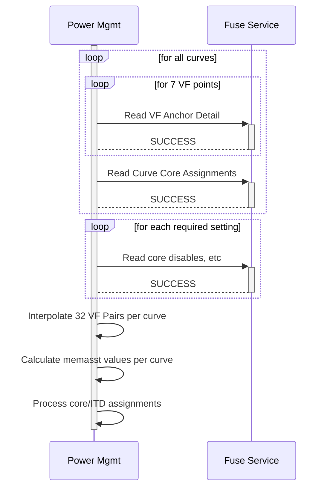

**Current calculation**

Fuses are read which are necessary for the calculation of leakage and dynamic current.  See the control loop detail in "Vcpu Calculation".

**DTS Y/K Coefficients**

The DTS coefficients provide a means of calibration of the calculations to convert RAW DTS and temperature values.  They are used to convert the RAW polled and sensor ram values to temperature telemetry as well as to convert thermal throttling and thermtrip temperatures stored in config knobs to RAW values which can be written to the HW alarm registers.

#### **Initialize SOC PVT**

The power_soc_temp and power_soc_vms knobs are used to generate configuration which is passed into soc_pvt_init.  The result is the enabling of SOC PVT in continuous mode to be able to poll for telemetry as well as the configuration of alarms which will automatically generate SOC_HOT, THERMTRIP, and PD_FAULT signals out of the SOC.

#### **Initialize Core ODCM, DVFS, and Tile PVT**

The power_current_throt, power_tile_temp_throt, and power_adclk_throt_vcpu*x* knobs are used to generate per-core throttling config for dvfs init.  Additionally, power_enable_fgpll_calsm, power_fllcal_pstate_bounds, power_plllock_cfg are used to generate aspects of the DVFS configuration related to the FGPLL.

Telemetry start/write addresses are configured for ODCM, PVT, and DVFS, with the power_c1_telemetry_enable knob being used to configure whether or not C1 entry/exit telemetry is generated.

The power_current_throt is also used to generate configuration for each core ODCM and passed to odcm init.

The power_tile_temp_throt and power_tile_vms knobs are used to generate configuration which is passed per-tile into tile_pvt_init.  The result is the enabling of PVT to be able to stream VM and temperature telemetry as well as the configuration of alarms which will automatically generate SOC_HOT (core throttling), THERMTRIP, and PD_FAULT signals out of the SOC.

#### **Warmstart Save/Restore**

In general, the power service cannot reinitialize most of the power HW, so the cold boot initialization data must be preserved to ensure that the control loop can run after a warm start using detail from the initial cold initialization of the HW.  Any configuration based on calculations which may have changed due to firmware, fuse override, or knob update will need to be saved.

The following are examples of what must be preserved for warm start.
* Disabled cores
* MPMM enabled/gear
* VF curve points and curve assignments
* ITD temperature ranges

The following data is preserved across warm start in the `power_ws_fuse_t` structure:
* Valid/disabled cores bitmap (`valid_cores`)
* VF curve data per curveset (`vfts[7]`):
  * Core assignments per curve
  * LDO DAC input values per pstate and ITD column
  * Frequency and voltage per pstate
  * Minimum plimit per curve
* SOC power cap in watts (`soc_power_cap_watts`)

#### **Warmstart Init Signal to Control Loop**

On a warm restart, there is a window when SCF_TRIGGER (SENSOR_TRIGGER) is deasserted for reconfiguration of telemetry SCF RAM addresses.  In this window, telemetry is halted from DVFS to SCF; however the AP cores will be running as they were not involved in the warmstart.  For this reason, the per-core LAST_PSTATE register detail may become stale.  In an attempt to minimize this, a warm restart state is added to the control loop state machine that will force cores which have been at P31 during the warm start (FORCE_PMIN) to P30.  This will result in cores in C0 cstate switching to P30, and causing an update of LAST_PSTATE detail.  The regular control loop interval will not be affected.

### **Power Control Loop**

The power control loop is responsible for limiting CPU performance to meet the given power requirement (the lesser of max, and an active power cap).  It does this while also attempting to achieve the per-core performance requested by the OS/hypervisor.
At its core, the power control loop implements a PID control to determine the performance which can be distributed to the CPU cores--the proportional, integral and derivative coefficients of which are available to be tuned via configuration variables.
The beginning of loop activity is triggered by a periodic timer event.

```mermaid
stateDiagram-v2
    
    state "Exchange Input with Remote Die" as Remote_Die
    state "Exchange Completion with Remote Die" as Remote_Die2
    [*] --> Idle
    
    state Idle
    {
        state "Clear error-induced force PMIN if previous state not Error" as idle1
    }

    Idle --> Sync_Dies: Timer Interval expired
    
    Sync_Dies --> Collect_Inputs: Both Dies Synchronized
    
    Collect_Inputs --> Remote_Die: VR currents final result event
    
    Remote_Die --> Distribute_Available_Power: Remote State Received
    
    Distribute_Available_Power --> Set_VR_before_PLIMIT: PLIMIT selections changed, VR setpoint increasing
    Distribute_Available_Power --> Set_PLIMIT_before_VR: PLIMIT selections changed, VR setpoint decreasing
    
    Set_PLIMIT_before_VR --> Set_VR_after_PLIMIT: PLIMITs Complete
    
    Set_VR_after_PLIMIT --> Remote_Die2: Vcpu result, VDone set
    
    Set_VR_before_PLIMIT --> Set_PLIMIT_after_VR: Vcpu result, VDone set
    
    Set_PLIMIT_after_VR --> Remote_Die2: PLIMITs Complete
    
    Remote_Die2 --> [*]: Remote State Received

    
    [*] --> Warmstart_Entry: Warmstart Init
    Warmstart_Entry --> Set_VR_before_PLIMIT: PLIMIT selections changed to P30, (previous P31) assume VR setpoint increasing

    state Remote_Die
    {
        state "Send Input / State to Remote" as send_to_remote
        state "Wait for Input / State from Remote" as receive_from_remote
        send_to_remote --> receive_from_remote
    }

    state Remote_Die2
    {
        state "Send Completion / State to Remote" as send_to_remote2
        state "Wait for Completion / State from Remote" as receive_from_remote2
        send_to_remote2 --> receive_from_remote2
    }

    state Set_PLIMIT_before_VR
    {
        state "Set PLIMITs, Current Thresholds" as set_PLIMITS3
        state "Drain SRB Fifo (while plimits)" as Wait_Success
        Wait_Success --> Wait_Success:  Wait - PLIMITs Pending
        set_PLIMITS3 --> Wait_Success
    }
    
    state Set_VR_after_PLIMIT 
    {
        state "Set VR(Vcpu)" as set_VR3
        state "Read VR(Vcpu)" as read_VR3
        set_VR3 --> read_VR3
        read_VR3 --> read_VR3: Result, VDone not set
    }

    state Set_VR_before_PLIMIT 
    {
        state "Set VR(Vcpu)" as set_VR2
        state "Read VR(Vcpu)" as read_VR2
        set_VR2 --> read_VR2
        read_VR2 --> read_VR2: Result, VDone not set
    }

    state Set_PLIMIT_after_VR
    {
        state "Set PLIMITs, Current Thresholds" as set_PLIMITS
        state "Drain SRB Fifo (while plimits)" as _Wait_Success_
        set_PLIMITS --> _Wait_Success_
        _Wait_Success_ --> _Wait_Success_: Wait - PLIMITs Pending
    }

    state Collect_Inputs
    {
        # these are activities within the state
        state "(See Telemetry Loops)" as read_cpu_current
        state "Request VR Currents" as read_cpu_current
        state "Drain Sensor Fifo (Update Msgs)" as Drain
        state "Read core state from last-pstate regs" as Read
    }

    state Sync_Dies
    {
        state "Initiate D2D Sync Barrier" as initiate_sync
        state "Wait for Both Dies to Synchronize" as wait_sync
        initiate_sync --> wait_sync
    }

    state Distribute_Available_Power
    {
        state "Calculate SOC Power" as calc
        state "PID Iteration" as PID
        state "Calculate CPU Power/Cap" as calccpu
        calc --> calccpu
        calccpu --> PID
        PID --> Distribution_Policy
        state Distribution_Policy {
        eval_desired_perf
        eval_throttling_priority
        eval_boost_priority
        select_PLIMITS
        }
        state "Calculate Vcpu" as calc_VR1
        Distribution_Policy --> calc_VR1
    }

    state Warmstart_Entry
    {
        state "Select P30 for all cores" as simple_Dist
        state "Calculate Vcpu" as calc_VR2
        simple_Dist --> calc_VR2
    }

    state Error
    {
        state "Performance Degraded / Force PMIN" as degraded
    }

    note left of Error
        Any unexpected "Timer Interval expired" signal from a 
        state other than idle will, after retry, result in error
        state entry.

        Performance will be degraded this will only be corrected 
        after a complete, successful iteration of the control loop.
    end note

    %% Commenting error transition for individual states, because it's confusing
    %% Collect_Inputs --> Error: Timer Interval expired
    %% Remote_Die --> Error: Timer Interval expired
    %% Set_PLIMIT_before_VR --> Error: Timer Interval expired
    %% Set_VR_after_PLIMIT --> Error: Timer Interval expired
    %% Set_VR_before_PLIMIT --> Error: Timer Interval expired
    %% Set_PLIMIT_after_VR --> Error: Timer Interval expired
    
    Error --> [*]

```

#### **Idle**

This is the default state of the control loop at boot and at the completion of all control loop iterations.  If the power management is in a degraded condition due to a previous error completing the complete control loop iteration, entry into this state from a non-error state will exit that degraded condition.

#### **Sync Dies**

This is a synchronization state that ensures both dies (in a multi-die system) coordinate before proceeding with the power control loop iteration. The state initiates a die-to-die synchronization barrier and waits for both dies to reach this point before proceeding. This ensures that:

- Both dies start their power control loop iterations at the same time
- Input collection and power distribution decisions are made with proper inter-die coordination
- System-wide power management remains coherent across all dies

The state handles synchronization completion signals and will retry if the remote die doesn't respond within the expected timeframe, transitioning to error state if synchronization repeatedly fails.

#### **Collect Inputs**

The purpose of this state is to make any requests for input into the control loop which will be handled asynchronously, while collecting other data synchronously.  Specifically, AVS reads are started, which are necessary for power calculations; at the same time, sensor fifo is flushed for all the latest updates to core CPPC (desired, throttle priority, boost priority), and last-pstate registers are read to determine current core state (pstate, cstate, temperature, etc).

*One diagram below is included to show the basic interaction between involved modules.*

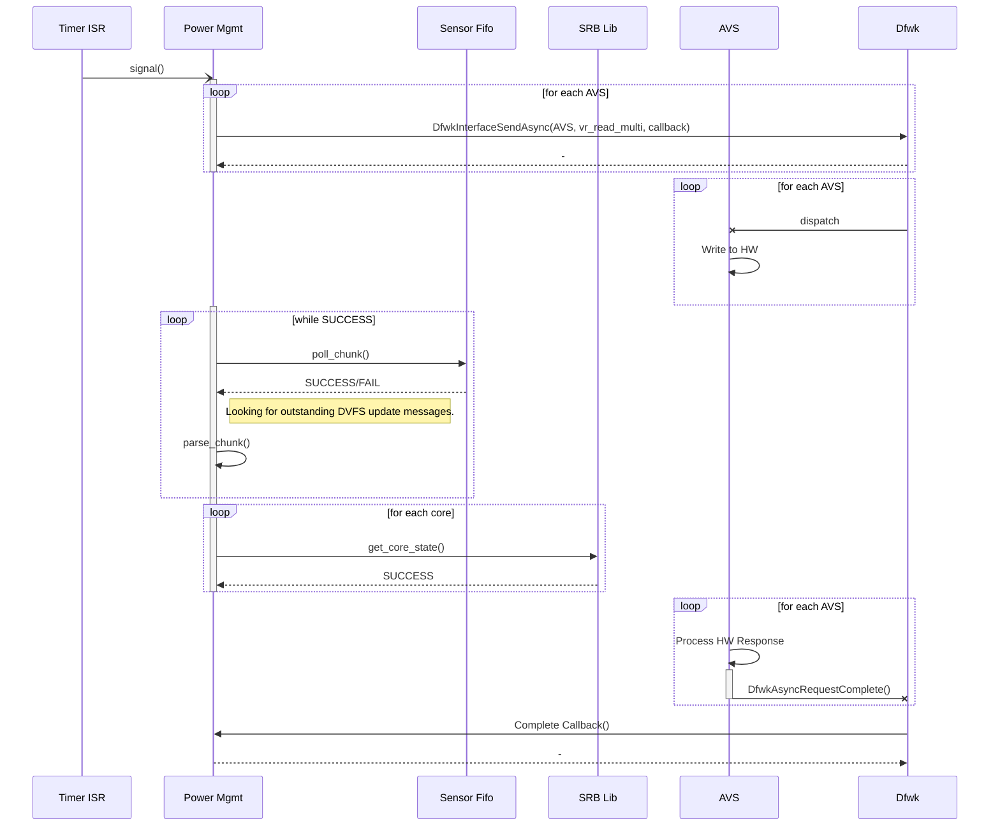

#### **Exchange Input with Remote Die**

The following collected inputs, etc, will be exchanged with the remote SCP: power cap; AVS rail reads; per-core pstate, desired, throttle priority, boost priority, nominal (KNG HW documentation calls this base) performance; and current PID/resource state.

#### **Distribute Available Power/Performance**

At this point, both SCP core control loops have the necessary input to calculate SOC/CPU power and perform distribution of resources.  FW must calculate SOC non-core power to report total SOC power on query; that detail is also used to isolate the CPU portion of the power cap to be used for error calculations within the PID control.

**Calculate SOC Power**

```
For each AVS rail:
  P_soc += V_rail * I_rail
  (optional)  P_soc -= (I_rail * I_rail * R_loadline_rail)

P_cpu0 = I_cpu0 * V_cpu0
P_cpu1 = I_cpu1 * V_cpu1
P_cpu = P_cpu0 + P_cpu1 
P_soc_notcpu = P_soc - P_cpu
```

**Calculate CPU Power/Cap**

The PID will regulate only the power of the CPU cores, so it is necessary to isolate the available CPU power from the SOC power cap provided (or the thermal limit, whichever is lesser).  Additionally, once we have the CPU portion of the power cap, it is necessary to ensure that cap would not exceed the CPU VR electrical limit (which we will convert to watts using the latest V_cpuin).

```
P_cap = MIN(P_MTL, P_power_cap)
P_cpu_cap = P_cap - P_soc_notcpu
P_MEL0 = V_cpu0 * I_MEL + V_cpu1 * I_cpu1
P_MEL1 = V_cpu0 * I_cpu0 + V_cpu1 * I_MEL
P_cpu_cap = MIN(P_cpu_cap, P_MEL0, P_MEL1)

PID_error_input = P_cpu_cap - P_cpu
```

**Distribution Policy**

It is here that the determination will be made of which cores PLIMITs are lowered below nominal and if/how available resources will be alotted to allow cores to achieve turbo frequencies.  The performance distribution policy will take into account the amount of performance resources available to be distributed (output of PID), the desired perf requests from the OS (fail requests, last PLIMIT register), throttling priority (dependent on current policy), and boost priority to determine PLIMITs for each CPU core.  Additionally, reported HW throttling events may impact PLIMIT selection for a CPU core.

**Priority Order Summary**

The table below summarizes how OSPM-provided priorities (0-15) are handled for throttling and boosting:

| Priority | Throttle Behavior | Boost Behavior |
|----------|-------------------|----------------|
| 0 | Protected (throttled last) | Boosted last |
| 15 | Throttled first | Boosted first |

- **Throttle Priority**: When power resources are insufficient, cores at priority 15 are throttled first, while cores at priority 0 are protected and throttled last.
- **Boost Priority**: When excess power resources are available, cores at priority 15 receive boost first, while cores at priority 0 receive boost last.

In the below diagram, consider that the output of the PID is treated as a count of resources.  Each increase of a pstate on a single core will cost some number of resources.  In the existing design there is a 1:1 cost of resource to pstate increase.

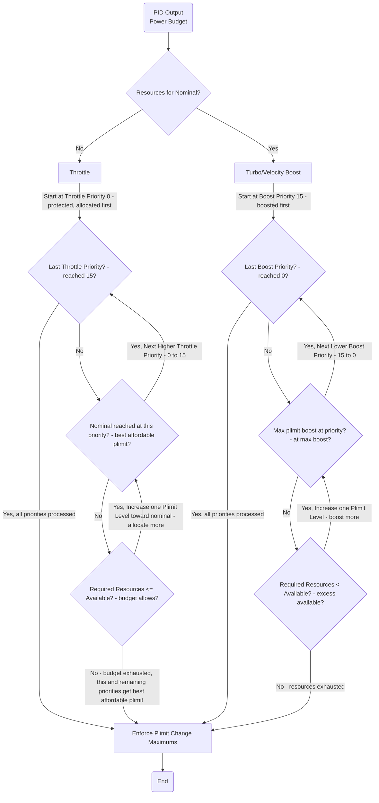

#### Can cores with the same boost/throttle priority have different frequencies?

Yes. While the distribution algorithm assigns the same group-level plimit selection to all cores sharing a priority, the final per-core plimit can differ due to individual adjustments applied in `select_plimit()` and `get_minimum_plimit()`. The factors that can cause differences include:

- **Per-core base_pstate (OSPM Nominal Performance)**: Each core can have a different `base_pstate` set by the hypervisor. If the group selection falls between `pnominal` and a core's `base_pstate`, that core is clamped to its own `base_pstate`.
- **C-state**: Cores in C2/C3/C4 can be limited to nominal via the `power_cX_cores_limit_to_nominal` knobs, while C0 cores at the same priority are not restricted.
- **OS desired performance (CPPC)**: Each core's OS-requested desired pstate affects its `min_plimit` floor. A core whose OS requests lower performance will have a higher (worse) floor than a peer at the same priority.
- **VFT silicon curve assignment**: Different cores may be assigned to different VF curves based on fused silicon quality, resulting in different `min_plimit` capabilities (some cores can boost higher than others).
- **Step size limits**: The `max_plimit_step_size_up` and `max_plimit_step_size_down` knobs limit how much a core's plimit can change per iteration. Two cores at the same priority but starting from different current plimits may converge to the group selection at different rates.
- **allowed_plimit_maximum knob**: A system-wide ceiling that clips the final selection uniformly, but interacts differently depending on each core's other constraints.


Configuration has been added to limit the number of steps a PLIMIT can be changed per iteration; this would dampen fluctuations, but also potentially reduce the responsiveness of the PID loop to both OS requests for performance and requests to reduce power consumption.  Further investigation will need to be done to ensure desired behavior, and the default configuration will leave these step limits disabled.  Aside from dampening the PLIMIT changes to prevent large fluctations, another benefit of this approach could be the fact that adapting to HW throttling may be more easily accomplished, since the step would start from current PSTATE, which may have been affected by a HW throttling event.

> Note: The presence of the VR_HOT_SOC_N signal will override available resources to minimum and discard PID errors to avoid accumulating error in the control loop while the signal is asserted.  This has the effect of producing a slower ramp up to a power cap after the signal is removed.

**Calculate Vcpu**

The setpoint for the CPU VR is determined as follows (V_LDO_headroom, V_guardband are fused values; V_vcpu_offset is config knob for investigative purposes):

```
VR_setpoint = V_in_LDO + V_max_loadline_drop + V_guardband + V_vcpu_offset
V_max_loadline_drop = I_peak * R_loadline
V_in_LDO = MAX_CORES(V_plimit) + V_LDO_headroom
I_peak = SUM_CORES(ActivityFactor * C_dyn * V_plimit * F_plimit + leakage(V_plimit, T))
```

To simplify runtime I_peak calculation, FW pre-calculates dynamic and a reference leakage current for each pstate of each fused VF curve.  This is done using VCPU_LEAKAGE, VCPU_LDO_DYN, and CORE_CDYN fuses; lkg, dyn_ldo, and cdyn columns below show the full interpolation of those fused values (from a previous project) to the LDODAC of each pstate. 

```
SCP-CLI > pwr config vftpre 0

Curve   0
  lkg (A)    reflkg (A) dynamic (A) dyn_ldo (A)  cdyn (pF)  PState MHz
=========== =========== =========== =========== =========== ====== ====
   0.350514    0.378634    3.588927    0.032527  523.000000     12 3400
   0.329726    0.356179    3.302548    0.030938  514.000000     13 3350
   0.308939    0.333723    3.029040    0.029339  505.000000     14 3300
   0.305616    0.330134    2.951281    0.029089  504.000000     15 3250
   0.302285    0.326536    2.868946    0.028830  502.000000     16 3200
   0.298962    0.322946    2.793491    0.028571  501.000000     17 3150
   0.295639    0.319357    2.713740    0.028321  499.000000     18 3100
   0.288151    0.311268    2.557350    0.027750  496.000000     19 3000
   0.280671    0.303188    2.406191    0.027170  493.000000     20 2900
   0.272356    0.294205    2.254664    0.026536  490.000000     21 2800
   0.267363    0.288813    2.134312    0.026152  488.000000     22 2700
   0.262379    0.283429    2.017202    0.025768  486.000000     23 2600
   0.257387    0.278036    1.907184    0.025384  485.000000     24 2500
   0.253229    0.273545    1.800966    0.025071  483.000000     25 2400
   0.249072    0.269054    1.697476    0.024750  481.000000     26 2300
   0.245261    0.264938    1.599981    0.024429  480.000000     27 2200
   0.241980    0.261393    1.507883    0.024107  480.000000     28 2100
   0.241980    0.261393    1.437227    0.024107  480.000000     29 2000
   0.241980    0.261393    1.295915    0.024107  480.000000     30 1800
   0.241980    0.261393    1.154603    0.024107  480.000000     31 1600
```

- Below are the calculations for reflkg and dynamic in the columns above.  Runtime leakage is scaled with temperature using a 3rd order polynomial, *f_T*(T), so here we divide the fused leakage by the output of the polynomial at the fused temperature.  Ideally, the fused temp would produce a 1 with the polynomial coefficients, but above this is not the case.

```
dynamic = AF_scaler_max_power * power_current_throttling_cfg.Iref_to_max_percent * Cdyn_dhrystoneAF * V * F + dyn_ldo
reflkg = lkg / f_T(fused_temp)
```

> In the previous project, we scaled from dhrystone to max power workload with/without MPMM enabled.  For KNG we will scale to max power, but use power_current_throttling_cfg knob to limit current to some percentage of max.  

At runtime, the per-core, per-pstate dynamic current and the reference leakage scaled to temperature are summed to produce I_peak.

```
I_core_dynamic = dynamic_from_table
I_core_leakage = reflkg_from_table * f_T(core_temp)
I_core_max = I_core_dynamic + I_core_leakage
```

#### **VR/PLIMIT Changes / Ordering**

In KNG, PLIMIT updates also contain ODCM current thresholds for current throttling.  These thresholds will be set as percentages of per-core max current calculated for Vcpu.  The percentages used are fields in the power_current_throttling_cfg knob.

```
PLIMIT_T1 = I_core_dynamic * power_current_throttling_cfg.T1_percent + I_core_leakage
PLIMIT_T2 = I_core_dynamic * power_current_throttling_cfg.T2_percent + I_core_leakage
PLIMIT_T3 = I_core_dynamic * power_current_throttling_cfg.T3_percent + I_core_leakage
```

**Set VR After PLIMIT**

If the Vcpu setpoint calculation results in a lower requirement than the current/previous setpoint, then it will only be safe to lower the setpoint after adjusting PLIMITs (writing PLIMIT registers and receiving success messages via sensor ram fifo).

**Set VR Before PLIMIT**

If the Vcpu setpoint calculation results in a higher requirement than the current/previous setpoint, then it will only be safe to adjust PLIMITs after first setting the new VR setpoint (including waiting for AVS Vdone indication that change is complete).

#### **Exchange Completion with Remote Die**

This state exists to sync SCPs at the end of a power loop interval.  It is here that a power cap change would be finalized.

### **Power Loop Timing Metrics**

The firmware tracks per-loop iteration timing and emits averaged metrics via the `PowerAllLoopMetricsInUs` event trace every `POWER_LOOP_TIMING_EMIT_INTERVAL_US` (default 200 seconds). Each emission reports the average iteration duration (IDLE-to-IDLE, excluding error transitions) in microseconds for the control, VR telemetry, and PVT telemetry loops.

Typical steady-state values observed on dual-die hardware (control loop interval = 1 ms):

| Loop | Min (us) | Max (us) | Avg (us) |
|------|----------|----------|----------|
| Control | ~383 | ~1523 | ~550 |
| VR Telemetry | ~49 | ~261 | ~199 |
| PVT Telemetry | ~41 | ~44 | ~41 |

Typical event trace on scp0/1 uart looks as follows

```txt
SocPowerModule::PowerAllLoopMetricsInUs: Ticks (724152) ctrl_loop_avg (535) vr_loop_avg (198) pvt_loop_avg (41)
```

### **Telemetry Loops**

The module generates SCF telemetry packets for each of 8 (for die0, 1 for die1) voltage rails (current & temperature), 18 PVT voltage (VM) sensors and 15 PVT temperature (DTS) sensors.  

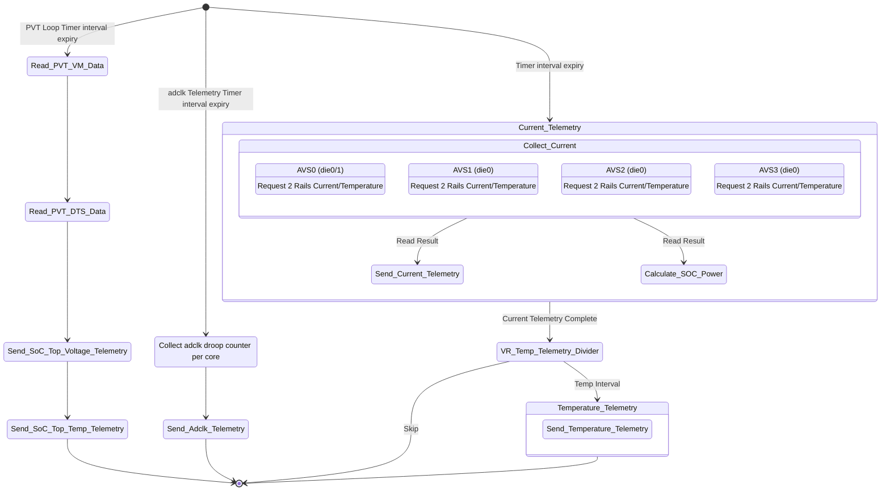

#### VR Telemetry

The voltage rails must be polled across the AVS bus and there is overlap here with reading rail currents for telemetry generation and the need to read VR currents for SOC power calculation for the power control loop.  The two reads are shown separately in the diagrams, but it is expected that these are the same.

#### PVT Telemetry 

The PVT for the SOC TOP voltage and temperature sensors will be initialized in continuous mode; an interval timer (power_pvt_loop_interval) interrupt will signal that data should be read from the PVTs to generate telemetry. 

#### Adaptive Clocking Droop Telemetry

Droop counts will be collected from all cores on the configured interval (power_adclk_throt.telemetry_interval).  These counts will be delivered from SCP to MCP (telemetry service) via ICC.  Droop count telemetry will not be a running count, but rather the number of droop events since the last telemetry was delivered.

> In general, the module will not reinitialize HW on a warm reset.  To avoid having to track droop count deltas for telemetry over a warm start, FW will use the clear_droop_count bit in ADCLK_CR2 to reset the droop count after every read. 

#### Aging Monitor Telemetry

New in Kingsgate, the portion of power service that lives on the MCP(s) will be responsible for sequencing the read of 8 pairs of aging data from the PCM of each core.  Firmware will, on a set interval (power_aging_telemetry.interval -- once per day for example), start the sequence of reading each pair on each core.  Data can be collected automatically by the DVFS engine, when configured, when a core enters C2 and remains for the necessary time to collect the measurement.  As cores complete a measurement, telemetry data will be sent and the next pair scheduled for measurement by firmware.


### **Power FW Implementation Info**

**System Nominal (pnominal) vs Per-Core Base Performance (base_pstate)**

The power distribution algorithm uses two distinct "nominal" concepts that work together:

| Term | Scope | Source | Description |
|------|-------|--------|-------------|
| `pnominal` | System-wide | TDP fuse (BASE_FREQUENCY) or knob override | The SoC's fused nominal pstate - represents the guaranteed performance level for the entire chip |
| `base_pstate` (current_base_pstate) | Per-core | OS via CPPC update message | The "OSPM Nominal Performance" for a specific core - can vary per core/VM |

**Key Constraint**: `base_pstate >= pnominal` (always enforced)

The system nominal (`pnominal`) acts as a **floor** - no core's base performance can request higher performance than the SoC's fused nominal. However, the OS/Hypervisor can set individual cores to have a **lower guaranteed performance** via their `base_pstate`.

**Why Per-Core Base Performance Matters**

This allows the hypervisor to differentiate guaranteed performance levels across VMs:
- High-priority VM cores: `base_pstate = pnominal` (full guaranteed performance)
- Low-priority VM cores: `base_pstate > pnominal` (reduced guaranteed performance)

**How base_pstate Affects Plimit Selection**

During resource distribution, if a core's selected plimit falls between the system nominal and that core's base_pstate, the core is limited to its own `base_pstate` (unless boosting has increased the `max_base` for that priority group):

`c
// From power_distribution.c - select_plimit()
if ((plimit >= pnominal) && (plimit < base_pstate))
{
    plimit = MIN(max_base, core->current_base_pstate);
}
`

**Example Scenario**

Consider a system with `pnominal = P20` (2900 MHz):

| Core | VM | base_pstate | Effect |
|------|----|-------------|--------|
| Core 0-15 | VM1 (high priority) | P20 | Can achieve P0-P20 (full nominal + boost) |
| Core 16-31 | VM2 (standard) | P22 | Can achieve P0-P22 (limited to VM's nominal) |
| Core 32-47 | VM3 (low priority) | P25 | Can achieve P0-P25 (reduced guaranteed perf) |

During throttling:
- If resources only allow P22 for all cores, VM1 cores get P20 (their base), VM2 gets P22, VM3 gets P22
- VM1 is protected at its higher base performance even when other VMs are throttled

During boosting:
- All cores can boost above their `base_pstate` up to their VFT `min_plimit` if resources allow
- Boost priority determines which cores receive excess resources first

**CPPC Desired Performance: OS/HV to SCP Flow**

The Collaborative Processor Performance Control (CPPC) interface allows the OS or Hypervisor to communicate performance requests to the SCP. This section describes how performance requests flow from software to the SCP firmware.

**CPPC Desired Performance Register Fields**

The OS/HV writes to the per-core `DVFS_NONSECURE_CPPC_DESIRED_PERF` register with the following fields:

| Field | Bits | Description |
|-------|------|-------------|
| `cppc_value` | [7:0] | Desired performance level (CPPC abstract value, maps to pstate) |
| `base_perf` | [15:8] | Per-core nominal performance (OSPM Nominal, must be >= system pnominal) |
| `boost_pri` | [19:16] | Boost priority (0-15, higher = boosted first) |
| `mpam_h` | [23:20] | Memory Partitioning and Monitoring ID hint |
| `throttle_pri` | [27:24] | Throttle priority (0-15, higher = throttled first, 0 = protected) |

**End-to-End CPPC Update Flow**

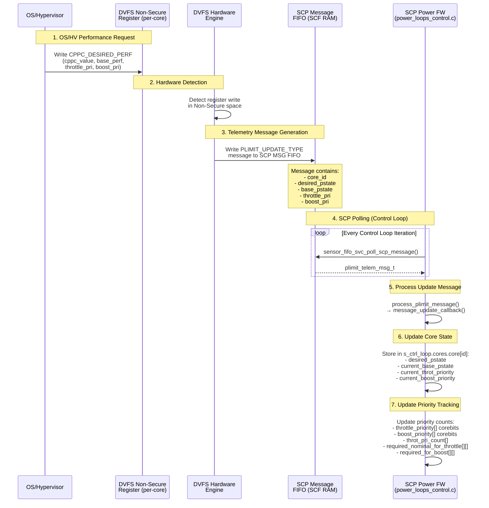

**How SCP Uses CPPC Data in Resource Distribution**

Once the CPPC update is received, the SCP uses this information during the **Distribute Available Power** phase:

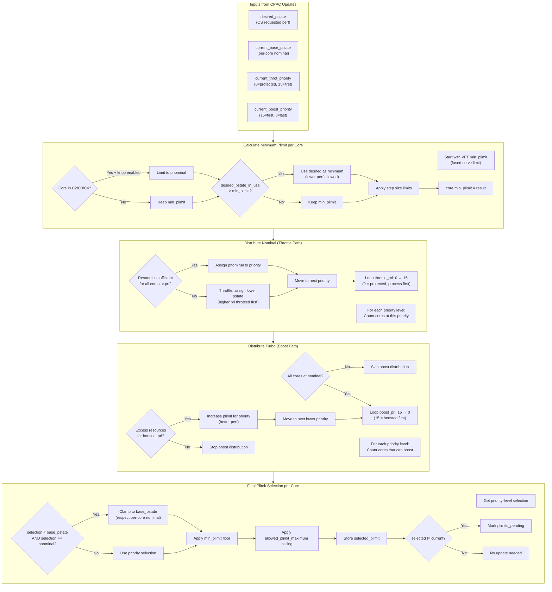

**Priority-Based Resource Distribution Example**

Consider a scenario with 4 cores, `pnominal = P20`, and limited resources allowing only 3 cores at nominal:

| Core | base_pstate | throttle_pri | boost_pri | Result |
|------|-------------|--------------|-----------|--------|
| Core 0 | P20 | 0 (protected) | 5 | P20 (protected, gets nominal) |
| Core 1 | P20 | 5 (mid) | 10 | P20 (resources available) |
| Core 2 | P22 | 10 (high) | 15 | P22 (throttled to its base) |
| Core 3 | P20 | 15 (highest) | 0 | P25 (throttled first, below nominal) |

**Processing order**:
1. Priority 0 (Core 0): Protected → allocated nominal (P20)
2. Priority 5 (Core 1): Resources still available → allocated nominal (P20)
3. Priority 10 (Core 2): Resources available, but base_pstate is P22 → allocated P22
4. Priority 15 (Core 3): Insufficient resources → throttled to P25

**Minimum Plimit (min_plimit) Evaluation**

The minimum plimit represents the **floor** for a core's performance - the worst (highest pstate number) that the distribution algorithm can assign. This is calculated per-core in `power_distribution_get_minimum_plimit()`.

**Evaluation Steps**

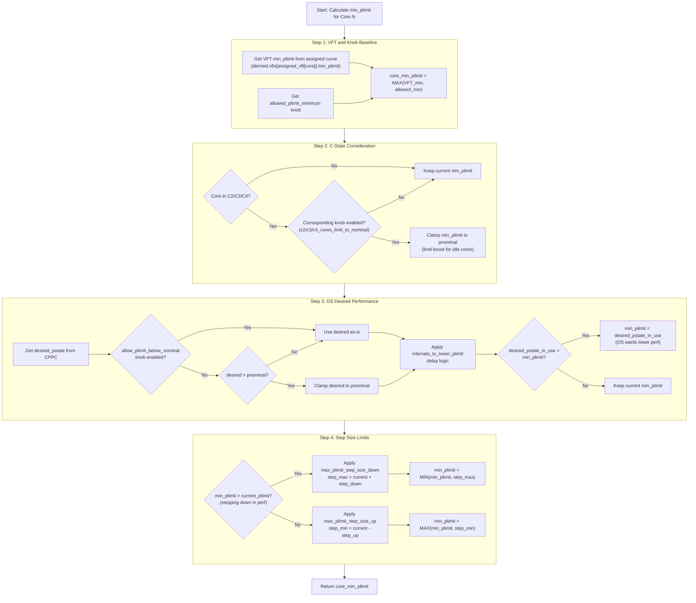

**Example: min_plimit Calculation**

Consider a core with the following state:

| Parameter | Value | Description |
|-----------|-------|-------------|
| VFT min_plimit | P10 | Fused VF curve allows up to 3400 MHz |
| allowed_plimit_minimum (knob) | P5 | Admin allows up to 3550 MHz |
| pnominal | P20 | System nominal is 2900 MHz |
| current_cstate | C0 | Core is active |
| c4_cores_limit_to_nominal | true | (not applicable - core in C0) |
| desired_pstate (from OS) | P25 | OS requests 2400 MHz |
| allow_plimit_below_nominal | false | Don't go below nominal without capping |
| current_plimit | P18 | Currently at 3000 MHz |
| max_plimit_step_size_down | 5 | Max 5 pstates down per iteration |

**Calculation walkthrough:**

1. **Baseline**: `min_plimit = MAX(P10, P5) = P10` (VFT is more restrictive)

2. **C-state**: Core in C0, no change → `min_plimit = P10`

3. **OS Desired**:
   - OS wants P25 (2400 MHz)
   - `allow_plimit_below_nominal = false`, so clamp to pnominal
   - `desired = MIN(P25, P20) = P20`
   - `desired (P20) > min_plimit (P10)`? Yes
   - `min_plimit = P20` (OS limiting perf to nominal)

4. **Step Size**:
   - `min_plimit (P20) > current_plimit (P18)`? Yes (stepping down)
   - `step_max = P18 + 5 = P23`
   - `min_plimit = MIN(P20, P23) = P20` (within step limit)

**Final Result**: `core_min_plimit = P20`

The core cannot be assigned a plimit lower than P20 (cannot go faster than 2900 MHz) because the OS has requested lower performance and the `allow_plimit_below_nominal` knob prevents going below nominal without an active power cap.

**Key Takeaways**

- **Lower plimit number = higher performance** (P0 is fastest, P31 is slowest)
- min_plimit is a **floor** - the distribution can assign equal or better (lower pstate number) performance
- VFT limits enforce **hardware capabilities** (silicon quality)
- C-state limits **save power** for idle cores
- OS desired allows **software-driven power saving**
- Step limits **dampen oscillations** in rapid workload changes


#### **How is PLIMIT Selected?**

The final PLIMIT value written to each core's hardware register is the result of a multi-stage pipeline within the power control loop. The process begins with a global resource budget determined by PID control, flows through priority-based distribution, and ends with per-core adjustments before the hardware write.

##### Stage 1: Resource Budget (PID Controller)

The PID controller determines the total available **resources** for the current interval. Resources are an abstract unit mapped directly to plimit levels (`PLIMIT_TO_RESOURCES(x) = MAX_PLIMIT - x`), so more resources means higher performance (lower plimit numbers).

- **Input**: Measured SoC power (Vcpu power from both dies) vs. the power cap setpoint.
- **Output**: `curr_resources` — the total resource budget available to distribute across all cores on both dies.
- **Special cases**:
  - `loop_failure == true` or `rack_limit` GPIO asserted → `curr_resources = 0` (all cores get P31).
  - New rack power cap received → PID integral is reset.

##### Stage 2: Nominal Distribution (`distribute_nominal`)

The algorithm iterates through **throttling priority levels** (priority 0 is protected/throttled last, priority 15 is throttled first) and attempts to bring all cores to at least nominal performance.

For each priority group, it climbs from `MAX_PLIMIT` (P31) up toward `pnominal`, checking at each level whether the resource budget can afford that level for all remaining cores at that priority. If the budget is exhausted before reaching nominal, the affected priority group is throttled.

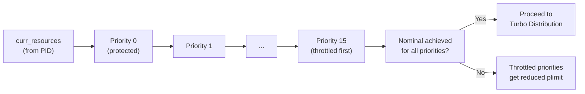

##### Stage 3: Turbo Distribution (`distribute_turbo`)

If all cores achieved nominal and there are **leftover resources**, the algorithm distributes boost performance. It iterates through **boost priority levels** (highest priority first) and attempts to raise cores above nominal into turbo plimit levels.

For each boost priority group:
1. First, cores with `base_pstate` below nominal are raised to nominal (updating `max_base`).
2. Then, cores eligible for boost are raised to increasingly higher performance levels until the budget is exhausted.

##### Stage 4: Push Selections to Cores (`push_selections` and `select_plimit`)

The per-priority plimit decisions are pushed to individual cores. For each core, `select_plimit` applies several **per-core adjustments**:

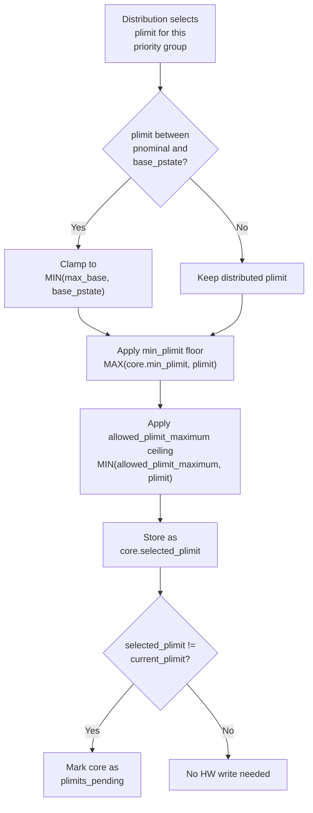

Where `min_plimit` (the floor) is itself determined by `power_distribution_get_minimum_plimit`, which considers:

| Factor | Effect |
|--------|--------|
| **VFT silicon limit** | Core cannot exceed its assigned voltage-frequency table capability |
| **Allowed plimit minimum** (knob) | System-wide minimum plimit floor |
| **C-state** | C2/C3/C4 cores can be limited to nominal (configurable per c-state) |
| **OS desired pstate** | CPPC desired performance from the OS/hypervisor, with hysteresis via `intervals_to_lower_plimit` |
| **Step size limits** | Max plimit change per interval (up and down), prevents oscillation |

##### Stage 5: Hardware Write (`hw_write_plimits`)

For each core with a pending plimit change, the firmware constructs a `dvfs_plimit` structure and writes it to the core's PLIMIT register:

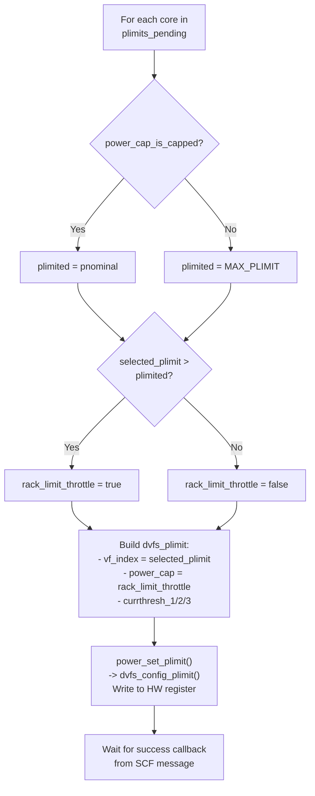

The `power_cap` bit in the PLIMIT register signals to hardware whether the core is being throttled due to a rack-level power cap, enabling hardware-level power cap awareness.

##### End-to-End Summary

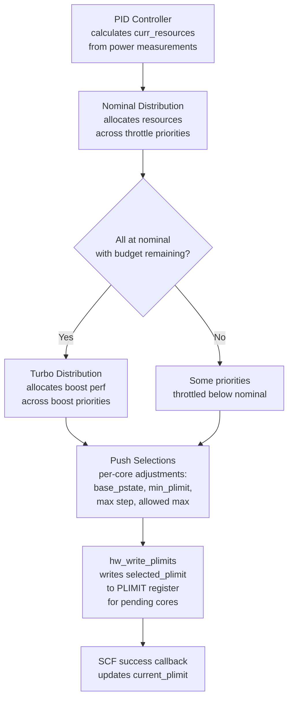

### **Power PLDM Interface**

The Power PLDM module provides the interface between the BMC (via PLDM protocol) and the SCP power management firmware. This enables external power management capabilities including:

- **Power Capping**: BMC can set SoC power limits via PLDM numeric effecter
- **Performance State Monitoring**: BMC can query throttling/degradation state via PLDM state sensor

#### Architecture Overview

The Power PLDM implementation spans two processors:

| Component | Processor | Responsibility |
|-----------|-----------|----------------|
| `power_pldm.c` | MCP0 | PLDM service registration, BMC communication, ICC forwarding to SCP |
| `power_pldm_scp.c` | SCP0 | Power cap validation, control loop integration, response generation |

#### PLDM Effecters and Sensors

| Type | ID | Description |
|------|-----|-------------|
| Numeric Effecter | 100 (PLDM_EFFECTER_ID_POWER_CAP_NUM_EFFECTER) | Power cap value in Watts (UINT16_MAX = disable capping) |
| State Sensor | PLDM_SENSOR_ID_POWER_THROTTLING_STATE_SENSOR | Performance state (Normal/Throttled/Degraded) |

#### Power Cap Request Flow: BMC → SCP

The following diagram shows the complete sequence when BMC requests a power cap change:

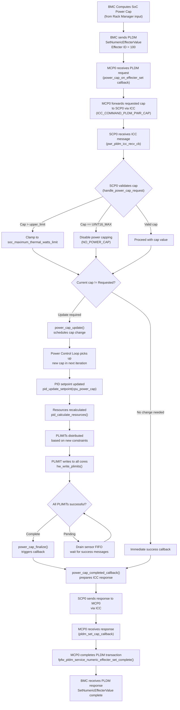

#### Dual-Die Synchronization

For dual-die configurations, the power cap must be synchronized between SCP0 and SCP1:

1. **SCP0** receives the power cap from MCP0 via ICC
2. During the **Exchange Inputs** phase of the control loop, SCP0 includes the new `vrcpu_cap_die0` in the data exchange
3. **SCP1** receives the cap in `exchange_inputs_handler()` and calls `power_cap_update()` locally
4. Both dies apply the same power cap in their respective control loops

#### Performance State Query Flow

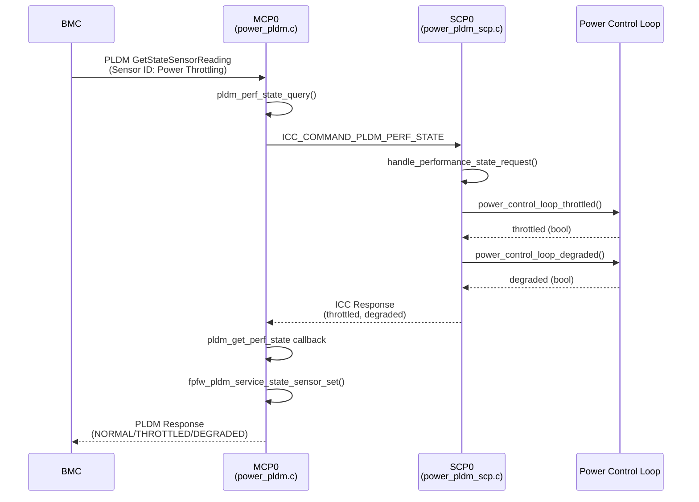

#### Performance States

| State | Condition | Description |
|-------|-----------|-------------|
| `PLDM_PERFORMANCE_NORMAL` | !throttled && !degraded | Operating at or above nominal performance |
| `PLDM_PERFORMANCE_THROTTLED` | throttled && !degraded | Power-limited but control loop functioning |
| `PLDM_PERFORMANCE_DEGRADED` | degraded | Control loop error, forced to PMIN |
| `PLDM_PERFORMANCE_THROTTLED_DEGRADED` | throttled && degraded | Both conditions active |

#### Key Implementation Details

**MCP Side (power_pldm.c)**:
- Registers numeric effecter (ID 100) for power cap with `fpfw_pldm_service_register_numeric_effecter()`
- Registers state sensor for performance state with `fpfw_pldm_service_register_state_sensor()`
- Uses ICC base library for MCP↔SCP communication
- Handles request serialization (drops requests if previous still active)

**SCP Side (power_pldm_scp.c)**:
- Validates power cap against `soc_maximum_thermal_watts_limit`
- Integrates with `power_cap_update()` for control loop coordination
- Response sent only after `power_cap_finalize()` confirms PLIMIT success
- Re-subscribes to ICC after each response to handle next request


### **Power Error Handling Behavior**

#### Overview

When the power control loop encounters an error — such as exhausted retries during PLIMIT setting or VR communication failures — the firmware enters the `ERROR` state. This is observable in logs as:

```
SocPowerModule::PowerErrorParam: Ticks (493362) param (0xa000c) type (12)
```

The `param` field encodes the retry count and the last control loop state before the error occurred (`POWER_ET_ENCODE_RETRIES_STATE`), and the `type` field corresponds to `POWER_ET_TYPE_CTRLLOOP_ERROR_ENTRY` (type 12). This error indicates that the control loop was unable to complete a state transition (e.g., PLIMIT acknowledgement timed out, VR setpoint change failed) within the allowed retry budget.

#### Why This Happens

The power control loop operates as a state machine that progresses through stages each interval: sync with remote die, collect core state, distribute resources, set PLIMITs, adjust VR voltage, and exchange completion status. Each stage has a retry mechanism — if a stage fails to complete after `POWER_LOOP_RETRY_COUNT` attempts, the loop transitions to the `ERROR` state.

Common causes include:

- **PLIMIT acknowledgement timeout**: The firmware wrote a PLIMIT to a core's SCF register, but the success response was not received within the retry window.
- **VR communication failure**: The voltage regulator did not respond to a setpoint change request (AVS Vdone not received).
- **Die-to-die synchronization failure**: The remote die did not complete its sync barrier in time.
- **CLI options/Prints on SCP0/SCP1 taking too much time**: Prints interfering with the pwr control loop timing not allowing enough CPU cycles for power control loop to complete it's stages in time.

#### What Firmware Does on Error Entry

When the control loop enters the `ERROR` state, firmware takes two actions to force the SoC to minimum performance (PMIN):

1. **Immediate HW force**: The `force_pmin_reg.fw_pmin_control` bit is set via `power_hw_force_pmin()`, which immediately forces hardware to minimum performance pstate regardless of the current PLIMIT register values.

2. **Software-consistent P31 selection**: On the next loop iteration, because `loop_failure` remains `true`, the distribute stage sets `curr_resources = 0`. This causes the resource distribution algorithm to select `MAX_PLIMIT` (P31, the lowest performance level) for every core, and writes P31 to the PLIMIT registers. This ensures FW's internal state (selected PLIMITs, Vcpu voltage calculation) is coherent with the HW-forced pmin state.

The firmware does **not** remain agnostic to the HW force pmin — it explicitly drives PLIMIT to P31 so that:

- The **Vcpu voltage calculation** (`hw_calculate_vcpu`) reflects the actual P31 operating point, avoiding unnecessarily high VR setpoints.
- The **VR/PLIMIT ordering logic** correctly determines whether to set PLIMIT before or after VR changes on recovery.
- The **current_plimit tracking** in success callbacks matches the actual hardware state, enabling clean recovery.

#### Force PMIN HW signal to FW setting PLIMIT P31 Flow

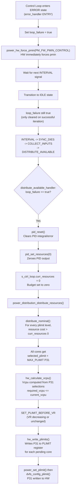

#### Recovery

The force pmin condition is cleared when the control loop completes a **successful** iteration — i.e., the loop progresses from IDLE through all states back to IDLE without entering `ERROR`. In the `idle_handler` entry, if `loop_failure` is `true` and the previous state was not `ERROR`, firmware calls `power_hw_clear_force_pmin(PM_FW_PMIN_CONTROL)` and resets `loop_failure` to `false`. The PID controller then resumes normal resource calculation, and cores are distributed performance levels based on actual power budget.

## API

### Overview 

There is no direct mission-mode API into the power module running on the SCP.  The BMC will send PLDM requests to sensors and an effecter exposed by a proxy power module on the MCP (die0).  The proxy power module will communicate with the power module on the SCP (die0) using ICC (command layer) over MHU/SMT.

```code
        +-------------------------------------------------------------------------------------+
        |                                                                                     |
        |  +--------------------------+                +--------------------------+           |
        |  |                          |                |                          |    SOC    |
        |  |        +-----------+     |                |    +-----------+         |           |
        |  |        |ICC|SMT|MHU+<------------------------->+ICC|SMT|MHU|         |           |
        |  | SCP0   +----+------+     |                |    +-----+-----+     MCP0|           |
        |  |             |            |                |          |               |           |
        |  |      +------+----------+ |                | +--------+--------+      |           |
        |  |      |ICC Command Layer| |                | |ICC Command Layer|      |           |
        |  |      +--------+--------+ |                | +-----+-----------+      |           |
        |  |               |          |                |       |                  |           |
        |  |        +------+------+   |                |   +---+----+   +-------+ |           |
        |  |        |             |   |                |   |        |   |       | |           |
        |  |        |   power     |   |                |   | power  |   | PLDM  | |           |                  +-----------+
        |  |        |   service   |   |                |   | proxy  +---+ svc   | |           | I3C              |           |
        |  |        |             |   |                |   |        |   |       +<------------------------------>+    BMC    |
        |  |        +-------------+   |                |   +--------+   +-------+ |           |                  |           |
        |  |                          |                |                          |           |                  +-----------+
        |  +--------------------------+                +--------------------------+           |
        |                                                                                     |
        +-------------------------------------------------------------------------------------+
```

Additionally, a Dfwk API for CLI usage will be implemented for debug and testing.  The related header file will be linked here when available.

### PLDM Details

The power proxy on the MCP0 will create PDR records and register two sensors and one effecter.  
|Name|Description|Type|Unit/States|
|---------|--------------|-----|----
|SOC Power Sensor|Used by BMC to read current SOC power|numeric sensor|Watts
|Throttling Sensor|Used by BMC to determine current throttling state of SOC|state sensor (performance)|Normal/Throttled/Degraded
|SOC Power Cap Effecter|Used by BMC to set a power cap on the SOC|numeric effecter|Watts

## Early Validation

While the mechanics of the power control loop will be tested pre-silicon, there will be no actual clock scaling or voltage control until we're running on silicon.  For this reason, a SW power model (python) which currently models the power of the CPU VR (loadline loss, core LDO losses, static/dynamic core power, etc) has been developed which will be used to test behavior of the PID loop with varying power caps, core activities, VM throttle/boost priorities, remote die info, etc.

## CLI Interface

### CLI Requirements

- As described earlier, the CLI interface for the power service shall exist outside of the power service itself.
- The CLI interface on any of the dies shall interact with both dies and fetch required values. That way, power service on both dies can be controlled using one CLI.
- The power service CLI shall be able to handle both synchronous (non-posted) and asynchronous (posted) commands.

### CLI Design

The power_cli module piggybacks on the FpFWCLI module from shared services. Since the 1pfw CLI service supports 2 levels of menu/sub-menu, the CLI commands are architected into 2 layers:

- All commands fall under the `pwr` menu.
- There are 4 kinds of commands that are provided:
    1. `cfg` to query (pre-set) configurations.
    1. `set` to set configurable inputs.
    1. `status` to query various power parameters in real time.
    1. `log` to control logging features in the power service.

The `cfg` commands also have a sub-command to query knob settings.

The naming convention for different commands is this: `<menu> <command_category>_<command_subcategory(optional)>_<command>`. For example, to set the power status cap, the command would be `pwr set_cap`.

> Note: The current design implemented supports only Die 0.

- The CLI interacts with the power service via a driver framework interface. It uses the default queue to send async messages to the power service.
- The power service shares the default queue with the SSI service. Hence, care needs to be taken that the RequestTypes for SSI and Power CLI do not overlap.


### CLI Command Reference

The following tables document all available power CLI commands:

#### Configuration Commands (pwr cfg)

| Command | Syntax | Description |
|---------|--------|-------------|
| fuse | `pwr cfg fuse` | Display all power fuse configurations |
| dts | `pwr cfg dts` | Display DTS coefficients |
| memasst | `pwr cfg memasst` | Display memory assist values |
| intervals | `pwr cfg intervals` | Display config loop intervals |
| limits | `pwr cfg limits` | Display config control loop limits |
| pid | `pwr cfg pid` | Display control loop PID configuration |
| pvt | `pwr cfg pvt` | Display PVT thresholds |
| ctrlloop | `pwr cfg ctrlloop` | Display control loop configurations |
| srvmode | `pwr cfg srvmode` | Display survivability mode |
| tel | `pwr cfg tel` | Display telemetry configuration |
| throttle | `pwr cfg throttle` | Display throttle configuration |
| static | `pwr cfg static` | Display static rails |
| allowed_min_plimit | `pwr cfg allowed_min_plimit` | Display allowed minimum plimit |
| allowed_max_plimit | `pwr cfg allowed_max_plimit` | Display allowed maximum plimit |
| fgpll | `pwr cfg fgpll` | Display FGPLL configuration |
| knobs | `pwr cfg knobs` | Display all power config knobs |
| vf | `pwr cfg vf` | Display VF curveset from fuses |
| vft | `pwr cfg vft` | Display derived VFT from fuses and memasst |
| vftpre | `pwr cfg vftpre` | Display pre-calculated current |
| vcpucalc | `pwr cfg vcpucalc` | Display VCPU calculation inputs |
| itd | `pwr cfg itd` | Display ITD configuration |
| avs_ds | `pwr cfg avs_ds` | Display AVS DS configuration |
| lkg_temp_scaler | `pwr cfg lkg_temp_scaler` | Display leakage temperature scaler config |
| force_vrs | `pwr cfg force_vrs` | Display force VRS configuration |
| adclk_offset | `pwr cfg adclk_offset` | Display ADCLK offset configuration |
| tdp | `pwr cfg tdp` | Display TDP fuse configuration |
| ldo2volt | `pwr cfg ldo2volt` | Display LDO to voltage slope fuse config |
| vcpuinterp | `pwr cfg vcpuinterp` | Display VCPU interpolation fuse config |
| vsys_override | `pwr cfg vsys_override` | Display VSYS override config knobs |
| vsys_vid | `pwr cfg vsys_vid` | Display VSYS VID fuse value |
| cppc_lowest_nonlin | `pwr cfg cppc_lowest_nonlin` | Display CPPC lowest non-linear perf config |

#### Set Commands (pwr set)

| Command | Syntax | Description |
|---------|--------|-------------|
| cap | `pwr set cap <value>` | Set rack power cap (W) |
| desired | `pwr set desired <core/all> <desired_0-31> <throttle_pri_0-15>` | Set OS desired pstate register |
| plimit | `pwr set plimit <core/all> <plimit_0-31>` | Set plimit for core(s) |
| loopdis | `pwr set loopdis <disable bits> <single/dual>` | Set loop disable bits (1=ctrl, 2=vrtelem, 4=pvttelem) |
| racklimit | `pwr set racklimit <0/1>` | Set rack limit GPIO for simulated implementations |
| minupdate | `pwr set minupdate <0-8>` | Set min plimit update per loop iteration (0 disables) |
| nominal | `pwr set nominal <1-31>` | Set nominal pstate used in loop (does not affect DVFS/ACPI) |
| forced | `pwr set forced <0-31> <ldodacin>` | Set forced pstate and ldodacin |
| pstate_freq | `pwr set pstate_freq <pstate 0-31> <freq_ctrl> <fb_div> <frac_div>` | Set pstate frequency control |
| alarm | `pwr set alarm <core/all> <pex_group> <alarm type> <alarm_id> <alarm_threshold> <hist_threshold> <dual_die>` | Set alarm and histogram threshold for Temp/VR hot throttle |
| force_pmin | `pwr set force_pmin <0/1/2>` | Set force pmin (0=clear, 1=lockup_ue_rr, 2=fw_pmin_ctrl) |
| soc_hot | `pwr set soc_hot <0/1>` | Assert/deassert SOC_HOT |
| mem_hot | `pwr set mem_hot <0/1>` | Assert/deassert MEM_HOT |
| therm_trip | `pwr set therm_trip <0/1>` | Assert/deassert THERM_TRIP |
| curr_throttle | `pwr set curr_throttle <core/all> <thresh1(hex)> <thresh2(hex)> <thresh3(hex)>` | Set current thresholds for throttling |

#### Status Commands (pwr status)

| Command | Syntax | Description |
|---------|--------|-------------|
| cl | `pwr status cl` | Display control loop info |
| vrtl | `pwr status vrtl` | Display VR telemetry loop info |
| pvttl | `pwr status pvttl` | Display PVT telemetry loop info |
| cap | `pwr status cap` | Display power cap info |
| droopcount | `pwr status droopcount <core>` | Display droop count for a specific core |
| maxtemp | `pwr status maxtemp` | Display max temperature info |
| power | `pwr status power` | Display power info |
| plimit | `pwr status plimit` | Display plimit info |
| primary_core | `pwr status primary_core` | Display primary core info |
| selections | `pwr status selections [clear]` | Dump plimit selection counts (optionally clear) |
| vcpu | `pwr status vcpu` | Display VCPU calculation inputs |
| warmstart | `pwr status warmstart` | Display warmstart info |
| force_pmin | `pwr status force_pmin` | Display force pmin info |
| core | `pwr status core` | Display core info |
| dvfs_fsm | `pwr status dvfs_fsm` | Display DVFS FSM info |
| dvfs_plimit | `pwr status dvfs_plimit` | Display DVFS plimit info |
| dvfs_cppc | `pwr status dvfs_cppc` | Display DVFS CPPC info |
| core_prio | `pwr status core_prio` | Display core priority info |
| prio_cnt | `pwr status prio_cnt` | Display priority count info |
| vr_inst | `pwr status vr_inst` | Display VR instance info |
| pstate2cppc | `pwr status pstate2cppc` | Display pstate to CPPC mapping info |
| dvfs_throt_sr | `pwr status dvfs_throt_sr <core>` | Display DVFS throttle status info for core |

#### Log Commands (pwr log)

| Command | Syntax | Description |
|---------|--------|-------------|
| list | `pwr log list` | Dump the DDR power log entries |
| ddr | `pwr log ddr <1/0>` | Enable/disable power logging in DDR |
| mask | `pwr log mask [<mask>]` | Set or display current power log mask |

#### Accelerator Commands (pwr accel)

| Command | Syntax | Description |
|---------|--------|-------------|
| bw_reduce | `pwr accel bw_reduce <accel_id> <bw_reduction_%> <dual_bus>` | Set bandwidth reduction. accel_id: 0=SDM, 1=CDED; bw_reduction: 0-90%; dual_bus: 1=SDM standalone, 0=SDM+CDED |