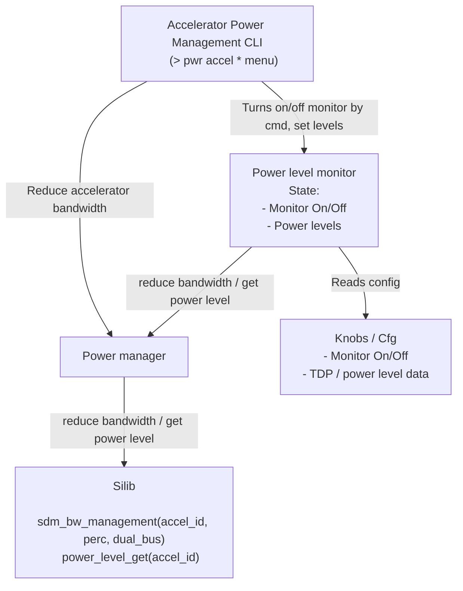

# Power Management Design

## Table of Contents

[[_TOC_]]

## Introduction

### Description

This document is intended to describe the design detail for the module implementing accelerator power management, initialization, control loops, and telemetry/reporting from the SCP.

### Terms

| Term                  | Description                                                            |
| ------                | -------------------------------                                        |
| SCP                   | System Control Processor                                               |

## Requirements 

Accelerators throttling is needed when the highest priority VMs are throttled due to power capping.

## Design

The SCP firmware shall monitor power levels and adjusts the global bandwidth tracker accordingly.
When power exceeds TDP, it shall reduce the bandwidth allocation to SDM and CDED, thereby lowering their activity levels.

### **General FW Architecture**




#### Accelerator power level monitor
As part of the Power Management Service, it assumes the following responsibilities:
- compare the current power level per accelerator to the one set by configuration.
- continously get the current power level per accelerator by using the "Accelerator power manager".
- reduce the accelerator bandwidth per accelerator by using the "Accelerator power manager".

#### Accelerator Power Management CLI
A mechanism to overwrite the specified configuration is needed for debugging and testing purposes. Details of the CLI is described in this document.

#### Accelerator power manager

Part of the Power Management Service.
Gets requests from the "Accelerator power level monitor" and the "Accelerator Power Management CLI".
These requests are translated into silibs calls for bandwidth reduction and request of power level for an accelerator.

### Configuration

#### Config Service

The Power level monitor needs configuration data to check if it should enable the feature.
An alternative to using knobs below might be to use the TDP fuse already provided by the Power Management service, described elsewhere.

These knobs are available for debug and test purposes.  Once the project reaches production phase, the values will be locked down when the system is in mission mode.

| Knob(s)                      | Description                                                                      | Default Value |
| ----------------             | ------------------------------------------------------------------               | ---           |
| accel_power_monitor          | On/Off for power level monitor                                                   | On            |
| accel_power_monitor_interval | Default frequency of power monitor control loop                                  | 1             |
| accel_throttle_power_levels  | Describes the baseline accelerator power levels at which throttling should begin | TBD           |

### Accelerator Power Monitor Control Loop
Part of the "Accelerator power level monitor". It is responsible for continously polling the Accelerator Power Manager in order to retrieve the accelerator power level, compared it to the predetermined throttle power levels and reducing bandwidth.

## CLI Interface

### CLI Requirements

As described before, we need a mechanism to overwrite the specified configuration is needed for debugging and testing purposes.

### CLI Design
Accelerator Power Management CLI is part of the power_cli module and all. The accelerator "accel" menu is introduced.

```
SCP-CLI > pwr accel <subcmd>
```
There are two kinds of commands provided:
1. Monitor and power level commands. The purpose of this command is to override the default on/off and power level state of the Accelerator Power leve monitor. The syntax is as follows:

```
SCP-CLI > pwr accel monitor <accel_id> <on/off> <power_level>
```
2. Bandwidth reduction commands. The purpose of this command is to bypass the power level monitor and issue a direct power reduction command to an accelerator.

```
SCP-CLI > pwr accel bw_reduce <accel_id> <reduction_percent>
```
The Accelerator Power level monitor and the Accelerator Power manager should provide the appropriate interfaces for the CLI to interact with.
