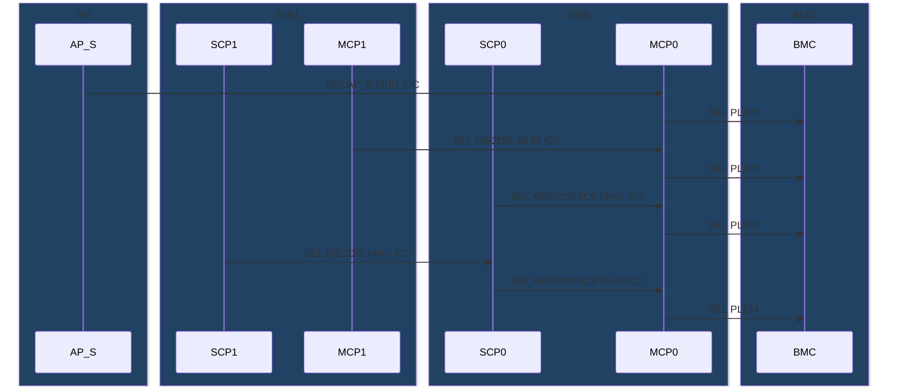
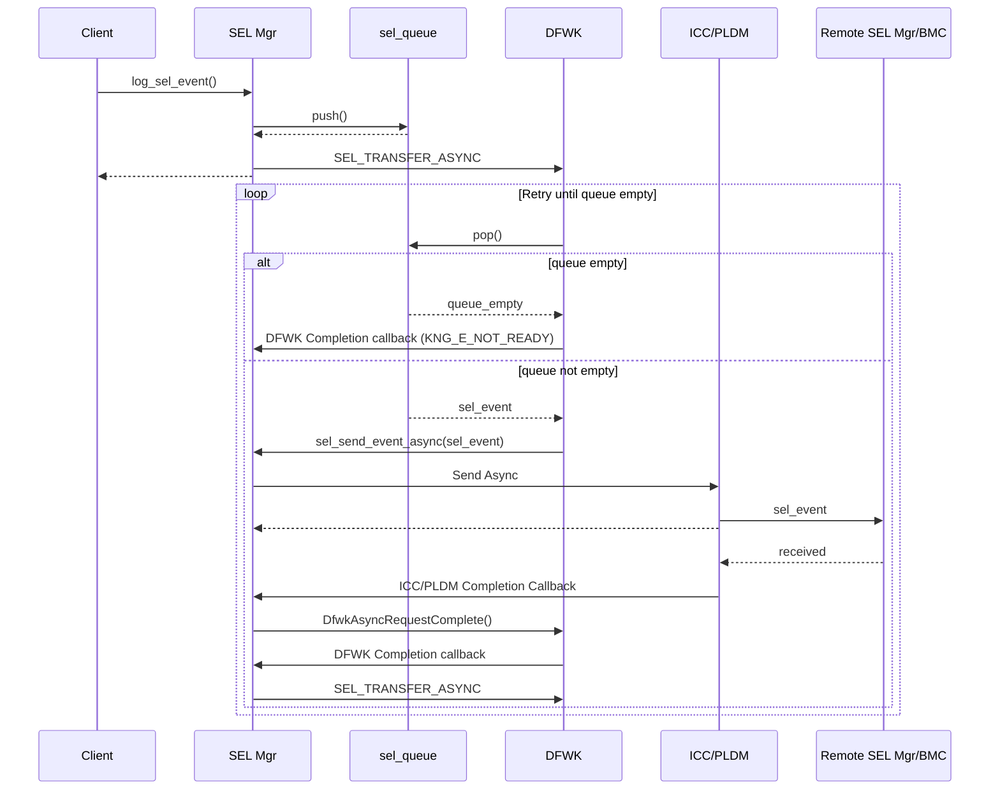

# SEL Manager Design

## Table of Contents

[[_TOC_]]

## Introduction

### Description
This document is intended to describe the design of a SEL manager module, responsible for deliver SEL event data to BMC.

### Terms
| Term                  | Description                                                            |
| ------                | -------------------------------                                        |
| BMC                   | Baseboard Management Controller                                        |
| SCP                   | System Control Processor                                               |
| MCP                   | Management Control Processor                                           |
| MHU                   | Message Handling Unit                                                  |
| SEL                   | System Event Log                                                       |

### Reference Documents
| Document                                  | Link                                |
| ----------------------------------------- | ----------------------------------- |
| System Event Log Spec | [Link](https://microsoft.sharepoint.com/:b:/t/FirmwareDevCenterofExcellenceFWCoE/EU9w5XWPXDpKnhqyRl0Et9YBsFfHBK-0VjVgUXKIqEsdZw?e=l1hnnX)    |

## Requirements 
- Shall provide API to send SEL log to BMC via PLDM
- Shall receive SEL from AP through MHU ICC Secure channel
- Shall send SEL to BMC from MCP0
- Shall send SEL to MCP0 from MCP1 to send to BMC
- Shall send SEL to MCP0 from SCP0 to send to BMC
- Shall send SEL to SCP0 from SCP1 to send to BMC
- Shall send SEL to MCP0 from AP S to send to BMC
- Shall keep at most 10 SEL logs until communication channel (ICC and PLDM)

## Dependencies
SEL Manager will have dependencies on the following:

- MSCP <-> MSCP MHU ICC channel
- DIE0 <-> DIE1 MHU ICC channel
- AP S <-> MCP0 MHU ICC channel
- PLDM (to transfer SEL)
- CLI 
- PLDM (to transfer dump)

## Design
SEL manager can receive SEL event log from control cores (MCP/SCP) and AP_S and keeps in a queue (max length 32).
MCP0 flush this queue to BMC via PLDM channel and the other cores flush to MCP0

SEL data format is defined as below. (size of 16 bytes)
SEL data structure
```C
typedef struct __attribute__((__packed__))
{
    uint16_t record_id;     // 1-2: SEL Record ID
    uint8_t record_type;    // 3: SEL Record Type
    uint32_t timestamp;     // 4-7: Timestamp
    uint16_t generator_id;  // 8-9: Generator ID
    uint8_t evm_rev;        // 10: EVM Revision
    uint8_t sensor_type;    // 11: Sensor Type
    uint8_t sensor_number;  // 12: Sensor Number
    uint8_t event_dir_type; // 13: Event Direction Type
    uint8_t event_data[3];  // 14-16: Event Data 1, 2, 3
} sel_event_record_t;
```

SEL routing sequence


SEL flushing sequence
