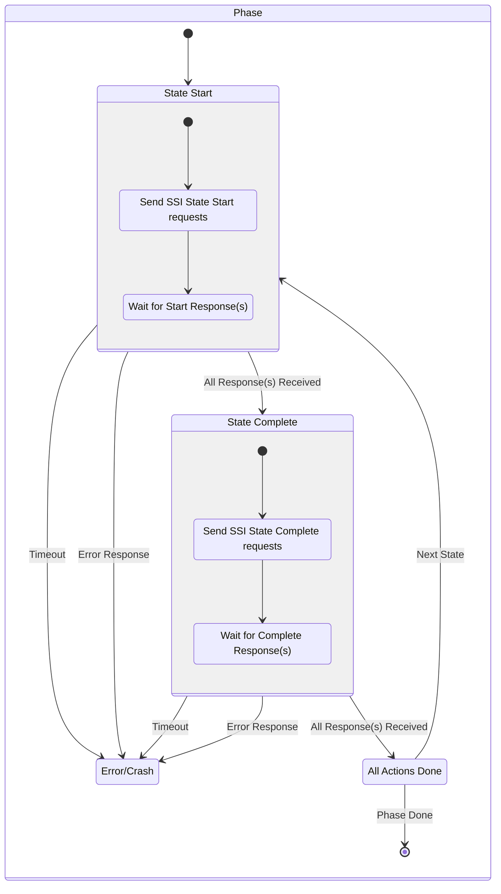
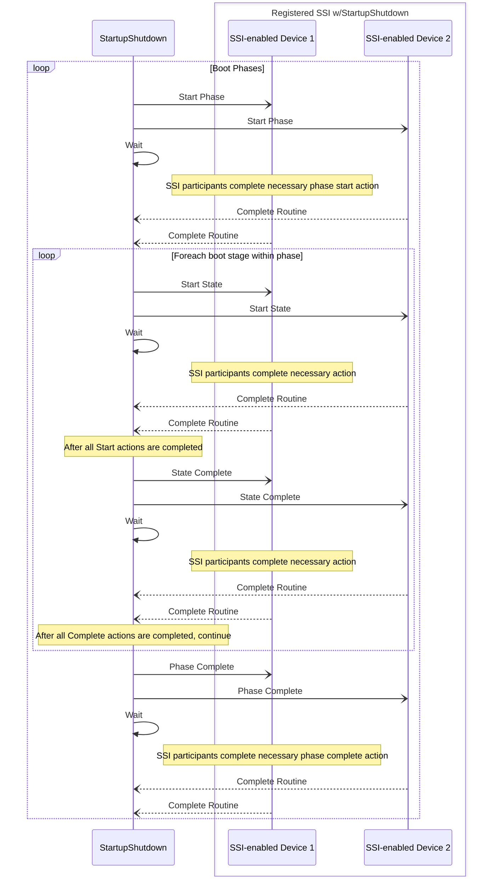
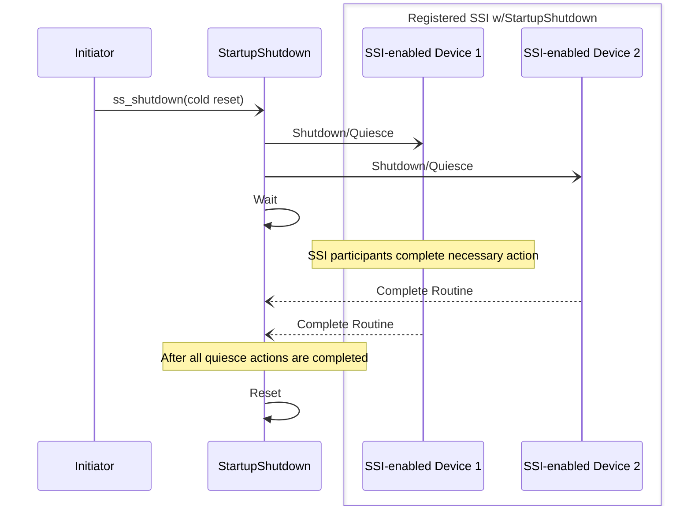

# System Startup or Shutdown (SoS)

## Table of Contents

[[_TOC_]]

## Introduction

### Description

This document is intended to describe the design detail for the service implementing startup and shutdown sequencing.

### Terms

| Term                  | Description                                   |
| ------                | -------------------------------               |
| SSI                   | Startup/shutdown interface - an interface registered by a driver or service to the startup/shutdown service to facilitate participation in startup and shutdown sequencing | 
| DFWK | Driver framework |

### Reference Documents

| Document                                  | Link                                |
| ----------------------------------------- | ----------------------------------- |
| Kingsgate SoC Boot Reset HPG | [Link](https://microsoft.sharepoint.com/:f:/r/teams/EchoFalls/Shared%20Documents/Kingsgate%20SOC/Architecture/Reset%20%26%20Boot/Hardware_Programming_Guide?csf=1&web=1&e=Hvi2Ka)

## Requirements 

 - Startup sequencing
   -  Shall provide means for sequencing synchronous (initialization routines must not block) init (initialization module)
   -  Shall provide means for sequencing asynchronous (intialization may block and rely on driver framework callbacks) init of MSCP-specific HW, drivers, services, etc (cold boot, mscp warm reset)
   -  Shall provide means for sequencing asynchronous init of system (AP, maybe SDM/CDED) HW, etc (cold boot, AP warm reset--RESET2)
 - Shutdown sequencing
   -  Shall provide mechanism for quiescing drivers, services, etc, prior to reset or shutdown
   -  Shall provide means of requesting shutdown, cold reset, mscp subsystem warm reset, and AP warm reset (RESET2)
 - Shall synchronize boots, shutdown, and resets across dies
 - Shall provide error timeout (crash) related to any/all boot or shutdown activity

## Dependencies

- timer (OS provided - for timeouts)
- initialization module
- crash dump
- DFWK

## Design

### Overview

The service will be implemented as a DFWK interface and a separate thread.  A DFWK interface can naturally serialize requests for shutdown, reboot, etc, which was not a guarantee on the previous project.  Boot phases, shutdowns, and reset sequences will be handled on the service's thread.  

The service will also expose a registration mechanism for a driver interface (SSI) defined by the service that other drivers/services can implement and register for startup and shutdown notifications (requests).

During boot, the service will send asynchronous start and complete requests to any registered SSI and all requests must be completed before the service will transition to the next boot stage.

Similarly, during shutdown, the service will send asynchronous shutdown/quiesce requests to any registered interface and all requests must be completed before the shutdown or reset will be allowed to occur.

### Startup

The service will handle the part of boot sequencing that happens after all drivers are initialized and interactions between drivers are required to accomplish boot tasks. Boot is split into phases to accommodate the portions of boot which may happen separately depending on the type of boot (cold, subsys, AP warm); specifically the defined phases are MSCP boot and System/AP boot. 

A simple state machine will handle the sequencing of boot stages within the phases.



 In addition to boot stage start/complete signalling, participating SSI will receive a start/complete signal at the beginning and end of defined boot phases.  Basic flow is shown below, however, the DFWK, which is required for the asynchronous requests has been omitted.



Phase start/complete signalling is available for actions that need to be taken at the beginning or end of a particular phase. For example, consider we have two startup phases. In the first phase, there is a firmware load/boot stage for starting a sequence that needs to be completed before proceeding to the next phase.  There are two options:

1. Define an additional, later stage for *boot complete* to wait/ensure the entire boot process is done
1. Wait for the completion of the boot sequence when the phase complete is signalled to prevent transitioning to the next boot phase.

### Shutdown

Shutdown handling is similar to startup.   Basic flow is shown below.



### Timeout

The default timeout for each stage in the Startup and Shutdown sequence is set to 120000ms. For a detailed review of all stages, please see [this](https://dev.azure.com/AzureCSI/Woodinville/_git/Kingsgate.MSCP?path=/src/services/startup_shutdown/startup_shutdown_scp.c&version=GBmain&line=32&lineEnd=43&lineStartColumn=1&lineEndColumn=94&lineStyle=plain&_a=contents). To modify the timeout value for individual stages, the sos_reset_timeout() API can be utilized. Below sample code shows how to override timeout value of STARTUP_AP_SOC_POWER_INIT stage on Boot phase from DEFAULT value to 60 sec.

```c
    // p_sos_interface is stored fpfw_init_get_handle("ssi_int") from component init
    sos_stage_timeout_t override_stage = { .stage_category = BOOT_STAGE, .operation_stage.boot = STARTUP_AP_SOC_POWER_INIT, .timeout_ms = 60*1000 };
    sos_reset_timeout((void*)p_sos_interface, override_stage);
```

### Synchronization

It is [TBD](https://dev.azure.com/AzureCSI/Dev/_workitems/edit/1821528/) which boot phases or stages need to be synchronized with secondary cores and how this will be done.  It's entirely possible for a registered SSI to force the synchronization before completing a request as well as possible that the service could implement the synchronization with a remote copy of the service.

#### Local MSCP Synchronization

It's possible that a boot stage needs to be synchronized across the MCP and SCP on the local die before notifying registers clients of the stage starting / stopping. To support this stages can be configured to locally sync before proceeding.

Below is a sequence diagram showing how the local core sync stage is performed, if enabled on a stage.

:::mermaid
sequenceDiagram
    autonumber;
    participant SSSCP as Startup & Shutdown Service SCP;
    participant HWS as HW Semaphore;
    participant SRAM as EXP SRAM;
    participant SSMCP as Startup & Shutdown Service MCP;

    note over SSSCP,SRAM: Init Stage - SCP;

    SSSCP->>SSSCP: Queue STARTUP_PHASE_MSCP_ASYNC;
    SSSCP->>SSSCP: Queue STARTUP_PHASE_AP_ASYNC;

    note over SSSCP,SRAM: Threads Running - SCP;
 
    SSSCP->>SSSCP: Dequeue Phase;
    loop STAGES IN PHASE - SCP;
 
      note over SSSCP: Sync with Remote Die SCP if needed.<br/>Only the STARTUP_PRIMARY_AP_CORE_BOOT<br/>stage does this die sync;
 
      note over SSMCP: The MCP processing occurs during one of<br/>the SCP's stages;
      
      note over HWS,SSMCP: Init Stage - MCP;
      SSMCP->>SSMCP: Queue STARTUP_PHASE_MSCP_ASYNC;
      note over HWS,SSMCP: Threads Running - MCP;
      SSMCP->>SSMCP: Dequeue Phase;
      note over SSMCP: No stages on MCP need remote<br/>die MCP syncing (for now);
      
      note over SSSCP,SSMCP: New Local Core Sync;          
      alt Sync Across MSCP;
        SSSCP->>HWS: Lock Semaphore - SCP;
        HWS-->>SSSCP: Ack;
        SSSCP->>SRAM: Update Local Core Stage - SCP;
        SRAM-->>SSSCP: Ack
        SSSCP->>HWS: Release Semaphore - SCP;
        HWS-->>SSSCP: Ack;

        SSMCP->>HWS: Lock Semaphore - MCP;
        HWS-->>SSMCP: Ack;
        SSMCP->>SRAM: Update Local Core Stage - MCP;
        SRAM-->>SSMCP: Ack
        SSMCP->>HWS: Release Semaphore - MCP;
        HWS-->>SSMCP: Ack;
        
        loop Local != Remote;
          SSSCP->>HWS: Lock Semaphore - SCP;
          HWS-->>SSSCP: Ack;
          SSSCP->>SRAM: Read Remote Core Stage - SCP;
          SRAM-->>SSSCP: Ack
          SSSCP->>HWS: Release Semaphore - SCP;
          HWS-->>SSSCP: Ack;

          SSMCP->>HWS: Lock Semaphore - MCP;
          HWS-->>SSMCP: Ack;
          SSMCP->>SRAM: Read Remote Core Stage - MCP;
          SRAM-->>SSMCP: Ack;
          SSMCP->>HWS: Release Semaphore - MCP;
          HWS-->>SSMCP: Ack;                          
        end;                        
      end;
      note over SSSCP,SSMCP: Notify Observers of Stage Start;
      note over SSSCP,SSMCP: Notify Observers of Stage End;
    end;
:::

### Service Core-Specific Config

Tables describing the supported phases and boot stages will be stored in core-specific C files to enable use on primary/secondary scp/mcp.

## API

Two interfaces are defined.  One interface to be used to interact with the service and a second interface (referred to as SSI) defined for drivers which wish to register to the service for participation in startup and shutdown.

| Service DFWK API   | S/A | Description                                           |
| -----------        | -- | ----------------------------------------------------- |
| sos_register_ssi()  | Sync  | Used to register a participating driver's SSI             |
| sos_reset_timeout() | Sync  | Used to reset/override timeout value on requested boot stage |
| sos_start_phase()   | Sync or Async | Used to queue startup boot phases |
| sos_shutdown()      | Async | Request a shutdown or reset                               |

| SSI DFWK API       | S/A | Description                                           |
| -----------   | ------|----------------------------------------------- |
| ssi_startup_stage_start()  | Async  | Used to signal to a participating interface that a boot stage has started - all sent requests must complete before boot will continue |
| ssi_startup_stage_complete()  | Async  | Used to signal to a participating interface that a boot stage has completed - all sent requests must complete before boot will continue |
| ssi_shutdown_quiesce() | Async  | Used to signal to a participating interface that a shutdown has been initiated - all sent requests must complete before shutdown will continue |


### Examples

Drivers and services wishing to participate in startup phases/stages as well as shutdown will need to register an interface that supports the startup/shutdown requests.

In driver or driver config .c file, etc:

```c
FPFW_INIT_COMPONENT(pwr_int, FPFW_INIT_DEPENDENCIES("pwr_svc", "sos_int"))
{
    static power_service_interface_t power_interface;
    power_interface_init(fpfw_init_get_handle("pwr_svc"), &power_interface);

    /*========= Begin code for SSI registration =========*/
    // create an interface specifically for SSI and register it
    static power_service_interface_t power_ssi_interface;
    power_interface_init(fpfw_init_get_handle("pwr_svc"), &power_ssi_interface);
    // static data for SSI registration
    static startup_ssi_registration_t ssi_registration;
    int32_t status = sos_register_ssi(fpfw_init_get_handle("sos_int"), &ssi_registration, &power_ssi_interface.header);
    FPFW_RUNTIME_ASSERT(status == FPFW_INIT_STATUS_SUCCESS);
    /*=========== End code for SSI registration ==========*/

    return (fpfw_init_result_t){FPFW_INIT_STATUS_SUCCESS, &power_interface};
}
```

The driver interface will also need to implement the requests:

```c
    /* boot and shutdown requests */
    case SSI_STARTUP_STAGE_START_ASYNC: {
        pssi_startup_notification_request_t ssi_request = (pssi_startup_notification_request_t)Request;
        printf("[Power] SSI stage %d start, boot type %d\n", ssi_request->stage, ssi_request->boot_type);
        // complete immediately, since nothing to do
        DfwkAsyncRequestComplete(Request);
    }
    break;
    case SSI_STARTUP_STAGE_COMPLETE_ASYNC: {
        pssi_startup_notification_request_t ssi_request = (pssi_startup_notification_request_t)Request;
        printf("[Power] SSI stage %d complete, boot type %d\n", ssi_request->stage, ssi_request->boot_type);
        // complete immediately, since nothing to do
        DfwkAsyncRequestComplete(Request);
    }
    break;
    case SSI_SHUTDOWN_QUIESCE_ASYNC: {
        pssi_shutdown_notification_request_t ssi_request = (pssi_shutdown_notification_request_t)Request;
        printf("[Power] SSI shutdown, shutdown type %d\n", ssi_request->shutdown_type);
        // complete immediately, since nothing to do
        DfwkAsyncRequestComplete(Request);
    }
```

Shutdown request:

```c
    static startup_shutdown_request_t shutdown_request;
    DfwkAsyncRequestInitialize((void*)&shutdown_request.header, sizeof(shutdown_request));
    // p_sos_interface is stored fpfw_init_get_handle("ssi_int") from component init
    sos_shutdown((void*)p_sos_interface, &shutdown_request, SHUTDOWN, completion_callback, NULL);  
```
