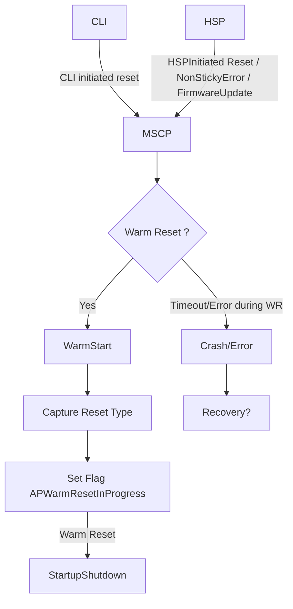
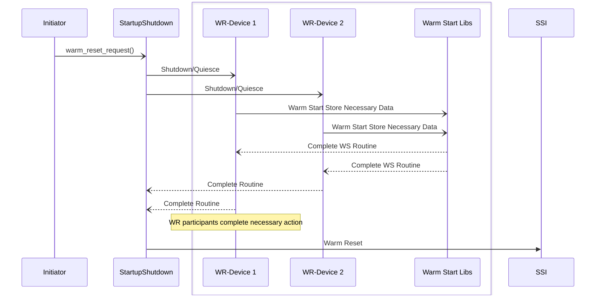

# System Warm Reset Design Document

## Table of Contents

[[_TOC_]]

## Introduction

### Description

This document is intended to describe the design details for the Warm Reset. This also includes interface details between Warm Start Client. 
A warm start is described as a non-disruptive boot process usually associated with doing a FW update.
Warm reset can be executed by either asynchornous reset request by MSCP via cli or by HSP non-sticky fatal error. 

The service will also expose a warm reset notification registration mechanism for a driver interface defined by the service. On receiving a notification about an async warm reset request, all the services resgistered for notification should complete the necessary steps before the shutdown or reset will be allowed to occur by SSI.   

### Revision History

| Revised by   | Date      | Changes           |
| ------------ | --------- | ------------------|
| Rucha Jangam |           | Initial design    |

### Terms

| Term   | Description                     |
| ------ | ------------------------------- |
| WS     | Warm Start                      |
| SCP    |  System Control Processor       |
| MCP    | Management Control Processor    |
| AP     | Application Core                |
| CLI    | Command Line Interface          |
| SSI	 | Startup/shutdown interface      |
| DFWK   | Driver framework |

### Reference Documents

| Document                                              | Link                                |
| ----------------------------------------------------- | ----------------------------------- |
| Kingsgate SoC Bootreset HardwareProgramming Guide WIP | [Link](https://microsoft.sharepoint.com/:w:/r/teams/EchoFalls/_layouts/15/Doc.aspx?sourcedoc=%7BD4EF9AFA-FC37-4A5D-9393-997746F3ED25%7D&file=Kingsgate%20SoC%20Boot%20Reset%20Hardware%20Programming%20Guide%20WIP.docx&action=default&mobileredirect=true)    |
 |SSI Design Doc| [Link](https://azurecsi.visualstudio.com/Woodinville/_git/Kingsgate.MSCP?path=%2Fdocs%2Fdevelopment%2FFirmwareDesign%2FSystem%20Startup%20Shutdown.md&version=GBmain&_a=contents) |

## Requirements
 
- This shall integrate with other componenets to save necessary warm start data
- Restore Reset Reason and Warm Start data on completiong of Warm Reset 
- Bugcheck on Warm Reset Timeout Expiration 

## Dependencies

- Time
- Initialization module
- Crash Dump
- DFWK 
- Power Domain & Startup Shutdown Service 
- Warm Start Module

## Design

Async Warm Start using StartupShutdown

## API

| WR DFWK API       | S/A | Description                                           |
| -----------   | ------|----------------------------------------------- |
| wr_get_reset_type()  | Sync  | Get the reaset reason like Cold, Warm or Subsys |
| ws_data_get() | Sync| Function used to get the location & size of the warm start data entry |
| ws_date_put() | Sync | Function used to set/wr warm start data he reserved memory section |