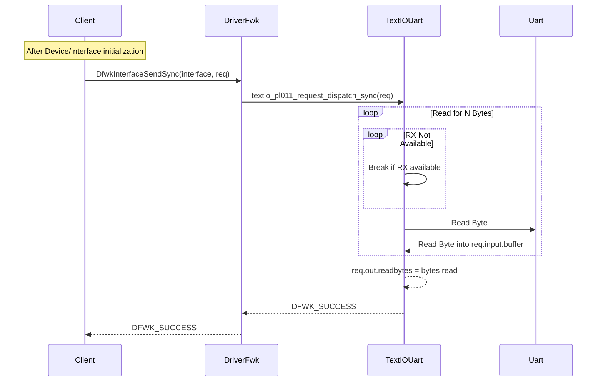
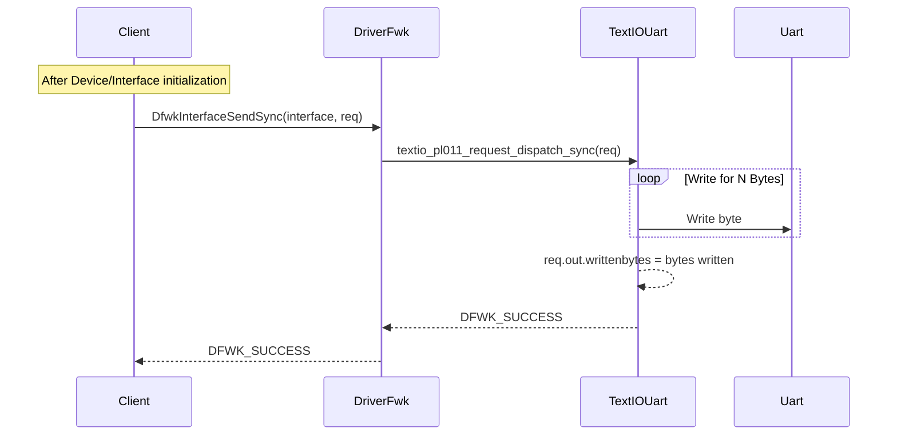
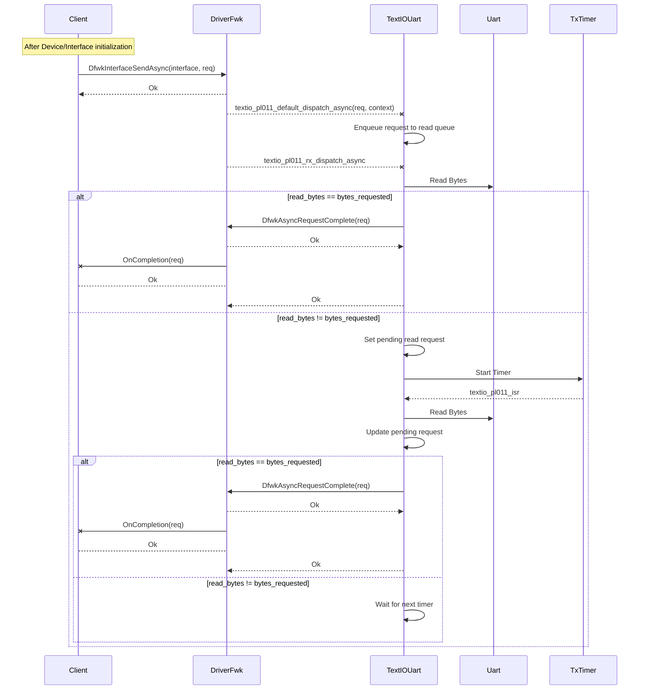

# Uart Pl011 Text IO Driver

## Table of Contents

[[_TOC_]]

## Introduction

### Description

This document describes the design of the pl011 text io driver. This driver implements the text io interface from the 1pfw.fwlibs repo.

### Terms

| Term | Description |
| -    | - |
| DFWK | [Driver Framework](../DriversAndDriverFramework.md) |
| Driver | An entity that uses Driver Framework |
| Text IO Driver | A driver that processes the requests specified in FpFwTextIoInterface.h |
| Asynchronous | An operation that yields execution until it gets completed and doesn't block current execution context |
| Synchronous - non blocking | An operation that will return immediately and doesn't yield to another execution context |
| Synchronous - blocking | An operation that waits for its completion in the same runtime context (but it might yield to other contexts) |

### Dependencies

| Dependency | Description | Link |
| - | - | - |
| FpFwTextIoInterface | Contains data structures and helper functions for sending TextIo requests. This driver implements support for the requests outlined in this interface. | [Link](https://azurecsi.visualstudio.com/DuvallFw/_git/1pfw.fwlibs?path=/doc/Modules/drivers/Interfaces/TextIoInterface.md) |
| UART PL011 Silibs Library | This library serves as a bare metal library for interfacing to the pl011 hardware, and has been updated with APIs needed for interrupt based operation. | [Link](https://dev.azure.com/ms-tsd/SiInfra/_git/silibs_common?path=/uart_pl011) |
| DFWK | Driver framework provides the runtime and queuing mechanisms for drivers to operate. | [Link](https://azurecsi.visualstudio.com/DuvallFw/_git/1pfw.fwlibs?path=/doc/Modules/DriversAndDriverFramework.md) |

## Goals

- Provide a way to read and write characters for applications such as logging, command line interface, etc...
- Provide different modes for read/write operations.
    1. Synchronous non-blocking.
    2. Asynchronous read/writes.
- Provide queueing for async writes and reads.

## Design

### Request handling

The below requests defined by the FpFwTextIoInterface are implemented here. See below diagrams for how each is handled.

#### TEXT_DRIVER_READ_SYNC_REQUEST_ID

The synchronous request will read from the UART until the number of desired bytes has been received.

#### TEXT_DRIVER_WRITE_SYNC_REQUEST_ID

#### TEXT_DRIVER_READ_ASYNC_REQUEST_ID \ TEXT_DRIVER_WRITE_ASYNC_REQUEST_ID

The below diagram is for the read request, however the logic is the same for a write request. Simply substitute read bytes for bytes written / etc.

## API

[Link](../../../../src/drivers/textio_pl011/inc/textio_pl011.h)

## Limitations

Due to the current lack of Interrupt support in the Kingsgate Repo, this lib makes use of a ThreadX Timer to poll the HW and to perform interrupt like operations (filling tx fifos, reading from rx fifos). See the ADO task [here](https://dev.azure.com/AzureCSI/Dev/_workitems/edit/1741558).
