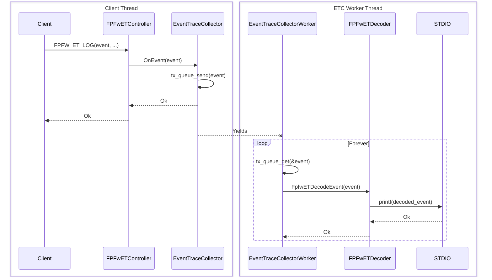
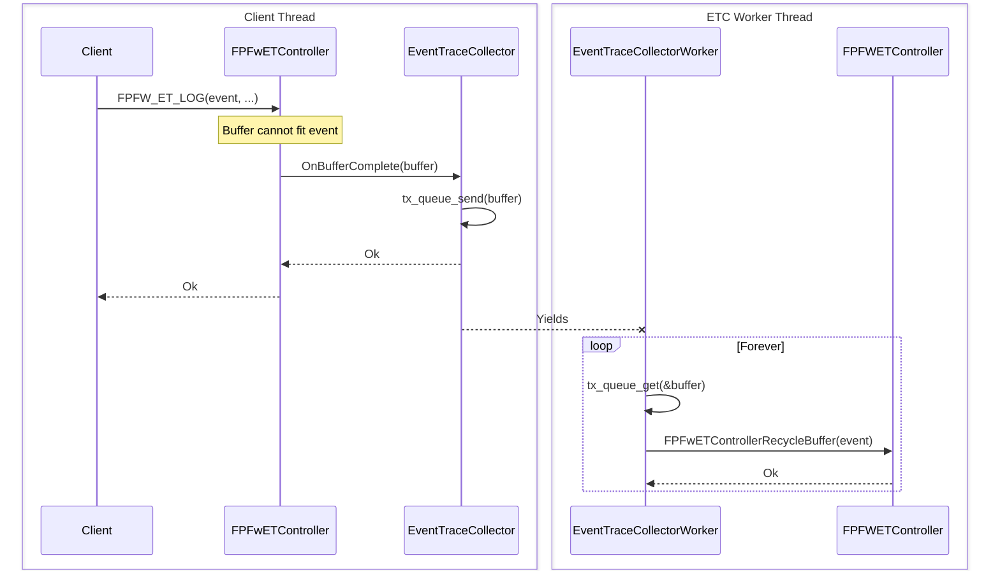

# Event Tracing

## Table of Contents

[[_TOC_]]

## Introduction

### Description

This document details firmware event tracing.

### Terms

| Term | Description |
| - | - |
| ET | Event Trace |
| STDIO | Standard input output |
| ETC | Event Trace Collector |

### Reference Documents

| Document | Link |
| - | - |
| Event Tracing Shared Module | [Link](https://azurecsi.visualstudio.com/DuvallFw/_wiki/wikis/1PFw%20Firmware%20Libs/10100/EventTracing) |

## Firmware Components

### Base Event Trace Collector

The Base Event Trace Collector (ETC) is designed to manage a single core's events. It implements the needed components of the shared trace module and uses thread based processing. It provides a single thread for processing. Users of this library may pass a processing function and context for the thread to call instead of the default one.

#### Requirements

- This module shall provide an interface to configure the Event Tracing system for a core. This includes buffer sizing and operation mode.
- This module shall manage the trace buffers used by the 'Shared Event Tracing Module', in specific the `FPFwETController`.
- This module shall provide a operational mode for outputting the traces through STDIO:
  - This operational mode shall attempt to output the traces in real time through STDIO
  - This operational model will recycle a trace buffer once all pending traces are written to STDIO
- This module shall provide a way for the request processing to be overridden, enabling custom request processing

#### Dependencies

- [1PFw Shared Event Tracing Controller](https://azurecsi.visualstudio.com/DuvallFw/_wiki/wikis/1PFw%20Firmware%20Libs/10100/EventTracing)
- [1PFw Shared Event Tracing Decoder](https://azurecsi.visualstudio.com/DuvallFw/_wiki/wikis/1PFw%20Firmware%20Libs/10100/EventTracing)
- [ThreadX](./../../../externs/threadx/)

#### Design

This module is instantiated in a given core to manage the trace buffers consumption and retrieval. This module will support different operational modes to accommodate and ease up working in different environments and product stages. The Operational mode will dictate the buffer management policies and output channel. Clients of this library may override the default request processing.

##### STDIO Operational mode

This operational mode will take each event and attempt to output it into the STDIO. Buffers will be recycled after all pending events in that buffer have been written into STDIO. The goal of this mode is to provide real time~ output of event trace events for easy visualization without requiring any extra tooling, this does incur in the core's performance cost and events are subject to be dropped if the STDIO is not outputting as fast as the events generated.

| Item                      | Description                                               |
| ------------------------- | --------------------------------------------------------- |
| Mode enum                 | ETC_SERVICE_MODE_STDIO                                    |
| Output target             | STDIO, most likely the UART channel                       |
| Output rate               | Per event to mimic real time (i.e. output is not batched) |
| Buffer recycle            | Real time                                                 |
| Decoding                  | In-Device                                                 |
| Impact in FW performance  | Medium/High                                               |
| Additional considerations | STDIO queue is 30 events deep.                            |

###### OnEvent flow



###### On Trace Buffer completion



#### API

[ETC API](./../../../libs/event_trace/collector/inc/event_trace_collector.h)

### SCP Event Trace Collector

The SCP ETC defines the resources needed by the Base ETC for the SCP Core.

#### API

[SCP ETC](./../../../services/event_trace/scp_collector/inc/scp_event_trace_collector.h)

## Using Event Tracing

Users may create their own providers and events. Depending on the ETC for each core the events may be redirected to STDIO or some other path. All examples are from the SCP ETC Events.

### 1. Create a Provider ID

The first step in using Event Tracing is defining a Provider ID. This is a core unique identifier used to associate events AND event filter levels together. Events will be associated to an Provider ID as will an Event Level Filter, enabling filtering of event levels to the Provider Id level.

Add your core unique ID [here](./../../../libs/event_trace/trace/inc/event_trace_providers.h).

Example: This enum defines two unique Provider Ids for the SCP.

```c
typedef enum {
    EVENT_TRACE_PROVIDER_ID_SCP_MAIN = 0x0100,
    EVENT_TRACE_PROVIDER_ID_SCP_ETC = 0x0101,

    EVENT_TRACE_PROVIDER_ID_MAX
} EVENT_TRACE_PROVIDER_ID_SCP;
```

### 2. Define your Provider

Now that we have a core unique Provider Id we can define your provider, which will generate the needed components to associate to events.

1. Add the following to your target's linked libraries list: `ms::lib::event_trace::trace`
2. Create a header file to define your provider and include the following:

    ```c
    #include <event_trace.h>
    #include <event_trace_providers.h>
    ```

3. Create a c file that defines key Event Trace defines, ensuring code generation, and include your new header. Add this to your targets sources. Ex:

    ```c
    // Only do this once per target
    // Instantiates the actual event trace functions
    #define FPFW_ET_IMPLEMENTATION
    #define FPFW_ET_METADATA

    #include "my_header_from_step_2.h"
    ```

4. Define your provider in your new header. Ex:

    ```c
    FPFW_ET_DEFINE_PROVIDER_EX(
        EVENT_TRACE_PROVIDER_ID_SCP_ETC, // Core Uniquer Provider ID
        SCP_ETC,                         // Provider Name
        ET_MASK                          // Logging Level Mask (from event_trace.h, you can use your own)
    )
    ```

### 3. Define your Events

Now that we have defined a provider we can associate events with it.

1. Add an event to the same header you defined your provider in. Ex:

    ```c
    /**
     * Define Event Trace events for the SCP Main Provider
    */
    typedef enum {
        SCP_ETC_EVENT_ID_COLLECTOR_INIT = 0,
    } SCP_ETC_EVENT_ID;

    // This event has no fields
    FPFW_ET_DEFINE_EVENT(
        EVENT_TRACE_PROVIDER_ID_SCP_ETC, // Provider ID
        SCP_ETC_EVENT_ID_COLLECTOR_INIT, // Event ID (per provider)
        ScpEtcInit,                      // Event Name
        FPFW_ET_LEVEL_INFO               // Event Logging Level
    )
    ```

### 4. Use your Events

Now that you have events you can use them, which will be processed by the core's ETC.

1. Include your header and use the shared macros to use your new event. Ex:

    ```c
    ....
    #include "my_header_from_step_2.h"
    ....
    FPFW_ET_LOG(ScpEtcInit); // The event name from the event definition
    ```
