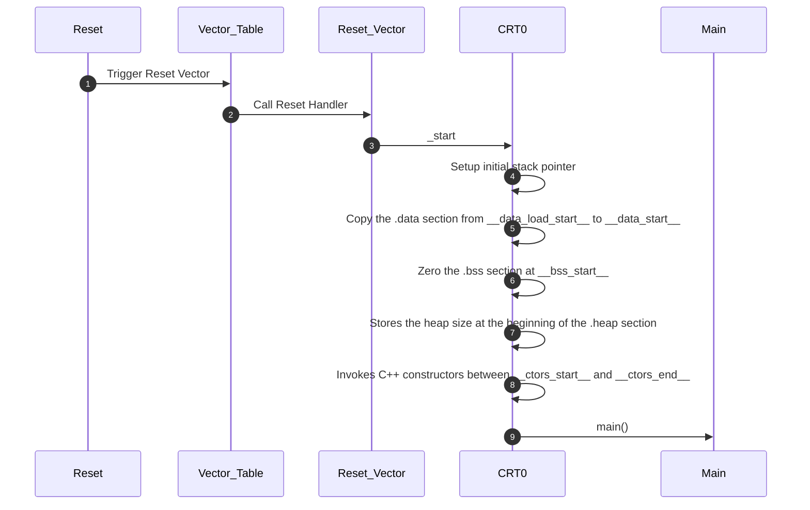
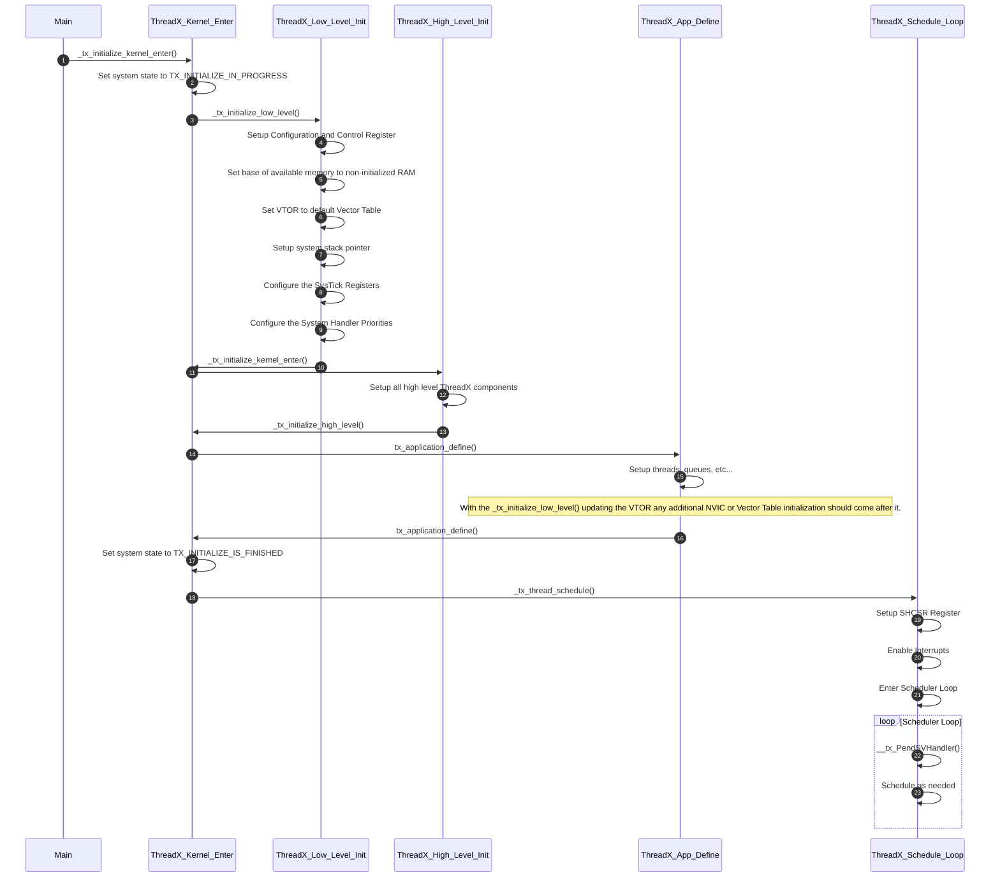

# ThreadX Initialization

## Table of Contents

[[_TOC_]]

## Introduction

### Description

This document is intended to provide more detail into how ThreadX is initialized and ran on Cortex M7 Cores.

    > **_NOTE:_**
    > 1. All material here assumes the use of the ARM Toolchain

### Terms

| Term | Description |
| - | - |
| CM7 | Cortex M7 |
| crt0 | Startup routine(s) linked into a C program that performs any initialization work before calling `main()` |
| RTOS | Real Time Operating System |

### Reference Documents

| Document | Link |
| - | - |
| ThreadX MSDN Documentation | [Link](https://learn.microsoft.com/en-us/azure/rtos/threadx/) |
| ThreadX Repository | [Link](https://expresslogic.visualstudio.com/X-Ware/_git/threadx) |
| ARM - Cortex M7 | [Link](https://microsoft.sharepoint.com/:f:/t/EchoFalls/EqOiUGxwN2tItARlv1NwY9kBtr0WAk2DOD2mBdW-KPeMFg?e=AUjrqY) |
| ARM - General | [Link](https://microsoft.sharepoint.com/:f:/t/EchoFalls/Ejj7dRSEfe9IiNUg7w0sQSQBAZSZmywGU7DmwyEl5FMMbg?e=1iFmZz) |

## Vector Table and CRT0

The first thing the CM7 needs is a Vector Table, with the first entry on REST being the value of main stack pointer, `SP_main`. The second being the reset vector. See Table B1-4 in the technical reference manual, ARM DDI 0403E.e section B1.5.2. CM7 resets the Vector Table Offset Register (VTOR) to 0x00000000 on reset.

To facilitate this a static library containing the Vector Table is built and linked into every executable (ELF), we use linker scripts to place it appropriately in memory. It also contains the crt0 routines needed before we call the `main()` function for the executable.

See ours [here](../../../src/libs/vectors/cortex_m7/).

## Linker Scripts

We utilize two linker scripts, one that defines sections / etc... that every core will need / want to have, and one that defines the core specific sections / etc...

Every core should include the common linker script found [here](../../../tools/cmakes/toolchain/arm-eabi-aarch/ld/kernel.ld). It setups the sections in the necessary locations, as defined per core (which requires this to be included in each cores script after defining necessary setup). One of which is setting the vector table to be at the start of the CODE section.

You can see an example of a core specific linker script (that uses the common one) [here](../../../src/apps/scp/inc/scp_memory.ld).

## ThreadX

The large majority of our ThreadX setup follows the CM7 port provided by ThreadX (find that [here](https://expresslogic.visualstudio.com/X-Ware/_git/threadx?version=GTpromote_threadx_1pfw_1&path=/ports/cortex_m7/gnu)). We do override the low level initialization and thread scheduling (ours are very similar to the port, see files directly for differences). This enables us to do any program specific changes we might want.

Find our overrides [here](../../../src/externs/threadx/threadx_lib/cortex_m7/).

## Coming out of RESET

The below flow describes the general flow, up to `main()` when coming out of reset.

## From main to ThreadX

Once the initial reset sequence is handled `main()` is entered and we can continue with ThreadX setup.

