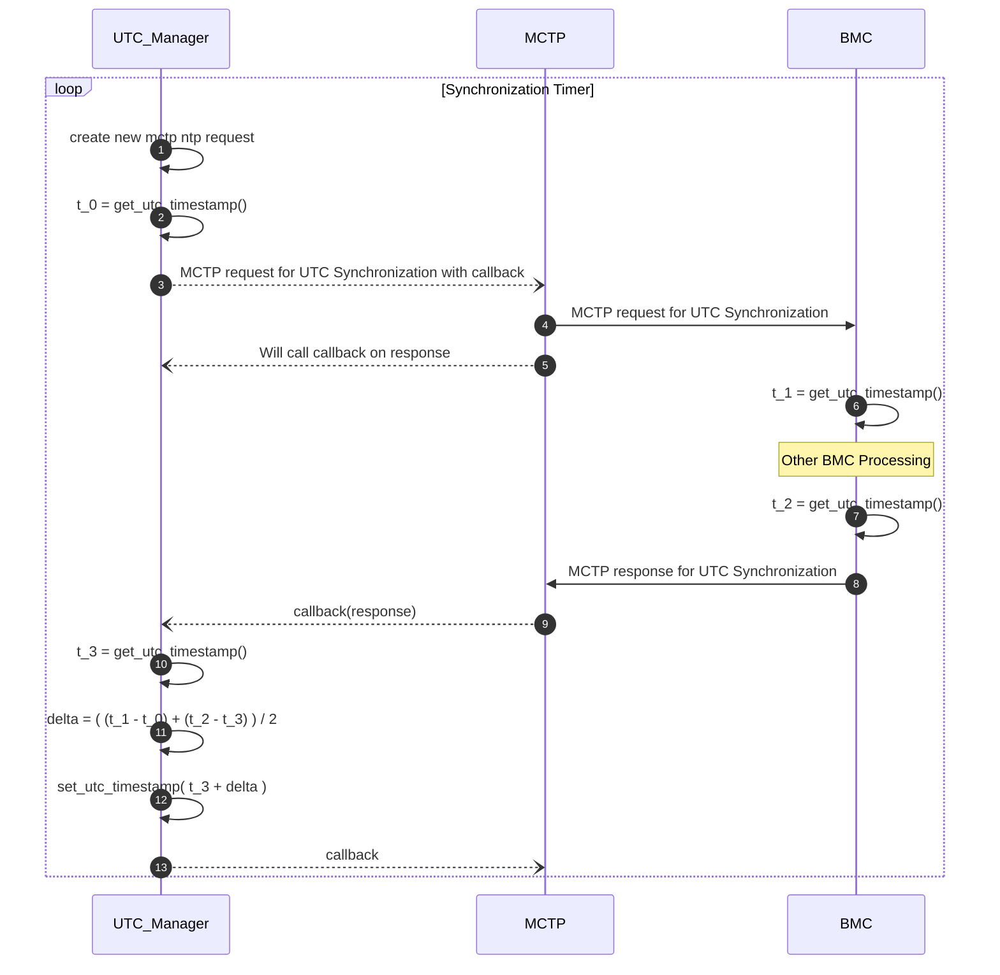

# UTC Management - Calculation, Synchronization, and Distribution

## Table of Contents

[[_TOC_]]

## Introduction

### Description

This document describes how an up to date UTC timestamp is calculated, synchronized, and distributed.

### Terms

| Term | Description |
| - | - |
| BMC | Board Management Controller |
| HSP | Hardware Security Processor |
| I3C | Improved Inter-Integrated Circuit |
| ICC | Inter-Core Communications |
| MCTP | [Management Component Transport Protocol](https://www.dmtf.org/documents/pmci/mctp-base-specification-130) |
| MSFT MCTP VDP | [Microsoft MCTP Vendor Defined Protocol](https://microsoft.sharepoint.com/:w:/t/CSIFirmwareDev/EZ-BDSDNH45PpOH12e24O-QB6CcHOqkFJdWGOqLQm1PSmw?e=Cf8ORR) |
| MCP | Management Control Processor |
| NTP | [Network Time Protocol](https://en.wikipedia.org/wiki/Network_Time_Protocol) |
| RM | Rack Manager |
| SCP | Secure Control Processor |
| UTC | Coordinated Universal Time  - Measured in milliseconds since the [Unix Epoch](https://en.wikipedia.org/wiki/Unix_time) |

## Dependencies

- BMC Availability
  - I3C, MCTP
- ICC Stack
  - MCP <-> HSP
  - MCP <-> SCP
  - MCP <-> SDM
  - MCP <-> CDED
- System Counter

### Calculation

To calculate a UTC timestamp we need a few things:

- The current or an old value of the System Counter
- The previous value of the System Counter last time we set the UTC timestamp
- The frequency of the System Counter
- The last set UTC timestamp
  - If not set yet, via synchronization, we cannot calculate the UTC timestamp.

We can use the above to calculate the delta in milliseconds from the last time the UTC timestamp was set and add that to the last set UTC timestamp. The result being the current or previous time in UTC.

#### Calculating A UTC Timestamp Pre-Synchronization

If a UTC Synchronization hasn't occurred yet there won't be a way to calculate an accurate UTC Timestamp. In this case the firmware will return an error code indicating this.

#### Calculating A Past UTC Timestamp

TODO - [ADO](https://dev.azure.com/AzureCSI/Dev/_workitems/edit/1742423)

#### Calculating A Future UTC Timestamp

TODO - [ADO](https://dev.azure.com/AzureCSI/Dev/_workitems/edit/1742423)

### Synchronization

The MCP can utilize the NTP clock synchronization algorithm to synchronize it's UTC Timestamp with the one from the BMC, who gets its time from the RM. Updating it's UTC timestamp at the end of the synchronization.

Clock Synchronization Algorithm: `delta = ( (t_1 - t_0) + (t_2 - t_3) ) / 2`

- t_0: the time the client sends the request to the server
- t_1: the time the server receives the request from the client
- t_2: the time the server responds to the request from the client
- t_3: the time the client receives the response from the server.

In our use case the MCP is the client and the BMC is the server.

#### Continuous Synchronization

To ensure that our UTC Timestamps stay up to date we'll need to synchronize multiple times over the runtime. The MCP will send the synchronization request starting once the MCTP stack is initialized and again on a defined cadence.

Synchronization Cadence: 5 minutes

#### Applying A UTC Timestamp Update

When a UTC Synchronization is complete the result is a new UTC Timestamp to use. If we update this immediately we run the risk of either going back in time (if the delta shows we're ahead) or jumping ahead. To account for this we'll apply UTC Timestamp updates overtime. Shifting our timestamp overtime to match the new timestamp from the synchronization will ensure that our UTC timestamps always increment, and stay up to date.

#### MCTP - Microsoft MCTP Vendor Defined Protocol

The MCP will send a MSFT MCTP VDP message to the BMC. The MCTP Stack will provide the standard MCTP Header and the MSFT MCTP VDP header of the request. The UTC Manager will fill in the Command Set Specific Payload.

Message Structure: The request and response payload is the same.

```c
typedef enum {
  MSFT_MCTP_VDP_1P_BMC_CMD_NTP = 1,
  MSFT_MCTP_VDP_1P_BMC_CMD_INVALID
} MSFT_MCTP_VDP_1P_BMC_CMD;

typedef struct {
  uint8_t command;          // MSFT_MCTP_VDP_1P_BMC_CMD
  uint8_t completion_code;  // See MSFT MCTP VDP Section 3.1.1 for possible values
  uint64_t t_0;             // Populated by the MCP
  uint64_t t_1;             // Populated by BMC when the request is received
  uint64_t t_2;             // Populated by BMC when the response is sent
} mctp_ntp_msg;
```

The MCP will fill in the `t_0` component and the BMC will fill in `t_1` and `t_2` upon receiving and responding to the message.

#### Example - First Synchronization

In this example the internal UTC Timestamp is behind compared to the one reported by the BMC. For the first synchronization `t_0` and `t_3` will reflect the time in milliseconds since the system counter was initialized.

```text
t_0 = 800ms.
 - This is in 1970.

t_1 = 1716937703705ms.
 - This is in 2024.

t_2 = 1716937703805ms.
 - This example uses a processing time on the BMC of 100ms.

t_3 = 1300ms.

delta = ( (1716937703705 - 800) + (1716937703805 - 1300) ) / 2 = 1716937702705

new_utc_timestamp = 1300 + 1716937702705 = 1716937704005
 - GMT = Tue May 28 2024 23:08:24 GMT+0000
 - PDT = Tue May 28 2024 16:08:24 GMT-0700 (Pacific Daylight Time)
```

### Example - Nth Synchronization

In this example the internal UTC Timestamp is further ahead than the actual reported by the BMC.

```text
t_0 = 2071956255000ms.
 - This is in 2035.

t_1 = 1716937703705ms.
 - This is in 2024.

t_2 = 1716937703805ms.
 - This example uses a processing time on the BMC of 100ms.

t_3 = 2071956256300ms.

delta = ( (1716937703705 - 2071956255000) + (1716937703805 - 2071956256300) ) / 2 = -355018551895

new_utc_timestamp = 2071956256300 + (-355018551895) = 1716937704405
 - GMT = Tue May 28 2024 23:08:24 GMT+0000
 - PDT = Tue May 28 2024 16:08:24 GMT-0700 (Pacific Daylight Time)
```

#### Diagrams

Below is the typical UTC Synchronization and internal update flow for the MCP and the BMC using the clock synchronization algorithm.



### Distribution

TODO - [ADO](https://dev.azure.com/AzureCSI/Dev/_workitems/edit/1742426)
