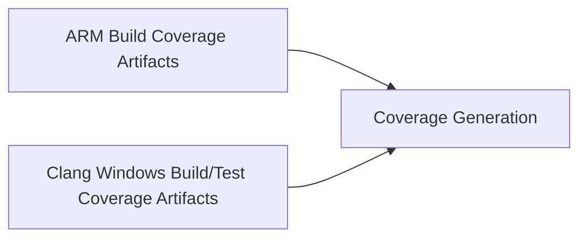

# Firmware Unit Testing

## Table of Contents

[[_TOC_]]

## Terms

| Term   | Description                                             |
| ------ | --------------------------------------------------------|
| CMocka | C based testing framework                               |
| should | Recommended, but there may be cases where not applicable|

## High level goals

- Azure pipeline integration so that tests can be used to verify checkins and nightly builds
- Tests are easily runnable to reproduce errors found during pipeline execution
- Tests are scalable to run across different HW implementations (Emulator, FPGA, HW)

## Requirements

- User can invoke all tests.
- User can invoke a test suite and just test their test file.

## CMocka Framework

Cmocka test framework will be used to execute tests on windows, meaning that the test cases and cmocka will be compiled into an .exe and loaded onto on a target for execution.

CMocka consists of a header and code file (cmocka.h and cmocka.c) and is compiled into a lib for consumption by our test binaries. CMocka provides useful macros for checking parameters, memory allocation checking, mocking functions, and setup/teardown functions.

## Developing Unit Tests

A CMockaWrapper.h header has been created to simplify developing unit tests for braga. The TEST_FUNCTION() macro should be used to declare test cases.

Unit tests are stored in the `/tests/unit` directory.

See [example_lib_test.cpp](../../tests/unit/example_lib/example_lib_test.cpp) for an example test.

1. TEST_FUNCTION(test_func, setup_func, teardown_func)
    - the user can provide NULL for setup_func and teardown_func.

The `testrunner.cmocka` lib was created to enumerate the registered test functions, add them to a list of tests, and execute them using the CMocka test framework. Filtering of testcases via test name and bit flags will be available once a CLI has been created.

Include the following in your test applications CMakeLists.txt file:

```cmake
# Set test binary name here
set(TARGET <TestBinaryName>.test)

# If compiling tests from source, include the test source code files here.
set(SRCS
    <testcode.cpp>
)

# If your test code is compiled as a lib, include all test libs here.
set(TEST_LIBS
    <TestLibs>
)

set(LIBS
# Required libs
    testrunner.cmocka
#Libs being tested go here
    <LibUnderTest>
)

# Compile test
add_executable(${TARGET} ${SOURCES})

target_link_libraries(${TARGET}
    PRIVATE 
        ${LIBS}
)

unit_test_target(${TARGET})
```

## Mock Functions

Mock functions are achieved using the linkers `--wrap=<functionName>` functionality. With this flag, all calls to `functionName(...)` will be redirected to `__wrap_functionName(...)` by the linker. The original function may be called from the mocked version by calling `__real_functionName(...)`.

Example of how to add a mock function to a CMakeLists.txt file:

```cmake

# Mock function names. This is used to create the --wrap=<MockFunctionName> flags for the compiler
set(MOCK_FUNCTIONS
    <MockFunctionName>
)

mock_target(${TARGET} ${MOCK_FUNCTIONS})
```

CMocka provides macros to validate inputs and return values for mocked functions (Ex `check_expected()` is used for input parameter validation, and `will_return()` is used to supply return values for mocked functions)

### Important Notes for Mocked functions

1. Mocking common functions like `printf()` is possible, but can be problematic if other parts of your binary also use `printf()`.
2. Mocking a function defined in the same .c file as the calling code does not work. Trying to mock `A()` in the code below will not work because linker will not get a chance to wrap `A` in the calling function `MyLibDoesSomething()`.

```C
    // Broken Mock Example:
    // File: mylib.c

    // function to be mocked
    void A()
    {
        ...
    }

    // Lib code that is being tested. Makes a call to A().
    void MyLibDoesSomething()
    {
        A();
        ...
    }
```

To resolve this issue the function `A()` should be placed in a separate .c file. This way it produces a .o file that the linker will operate on when building the lib and final binary.

```C
    // Working Mock Example:
    // File: mylib.c
    #include "A.h"

    void MyLibDoesSomething()
    {
        A();
        ...
    }

    // File: a.c
    #include "A.h"
    // function to be mocked
    void A()
    {
        ...
    }
```

## Running Unit Test Apps

Once you have built a test executable  you can execute it in two ways:

1. unittest (Ensure you build for Toolchain - `i386-pc-windows-msvc` and Config - `Debug`)

    ```powershell
    <#
    .SYNOPSIS
    Runs the unit tests for the current configuration

    .EXAMPLE
    Invoke-UnitTests
    #>
    Function Invoke-UnitTests($Suite)
    ```

2. Manually run just your test (ExampleTest for instance)

    ```powershell
    .\.build\Debug\i386-pc-windows-msvc\bin\example_lib.test.exe
    ```

## Inputs and outputs to the core

Inputs may be different for each test suite. Inputs may come from mock functions which may also be used to simulate needed inputs for test purposes.

## Code Coverage

A coverage report will be generated when running with the **unittest** command for all tests:
```unittest```

Note: coverage is determined by first determining what is coverable when building the firmware targets.  
(GCC will output *.gcno files).  
This is combined with what is actually covered by the unit tests when executed.

Because the former comes from the ARM gcc build, and the latter the clang Windows build, for the most accurate coverage, ensure the ARM toolchain build is run prior to running the ```unittest``` comand.



By default Coverage is located in:  
```.testlogs/*/Coverage``` and the report can be viewed at ```.testlogs/*/Coverage/index.html```

## Troubleshooting

Some environments may be missing certain necessary .dll libraries which could manifest by all unit tests failing with similar output when running 'unittest'

```powershell
[11:03:48::787] STDERR : error: E:/kng/.testlogs\TestRun_2024-04-25_11-03-11\12.icc_transport_mscp_hspmbx_init.test.Host/raw.profraw: no such file or directory
[11:03:48::926] STDERR : error: E:/kng/.testlogs\TestRun_2024-04-25_11-03-11\12.icc_transport_mscp_hspmbx_init.test.Host/data.profdata: could not read profile data!no such file or directory
```

Another symptom when running a stand-alone unit test presents with it immediately returning with no ouptut.

From https://visualstudio.microsoft.com/downloads/#remote-tools-for-visual-studio-2022

- Install the Desktop development with C++ workload without a full Visual Studio IDE installation.
- From the Visual Studio Downloads page, scroll down until you see Tools for Visual Studio under the All Downloads section
- Select the download for Build Tools for Visual Studio 2022 (and then run the installer)
- Select "Desktop development with C++
- Keep the default checked items under Installation details and add "MSVCv140 - VS 2015 C++ build tools... to the list
